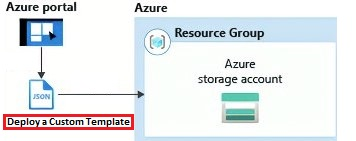
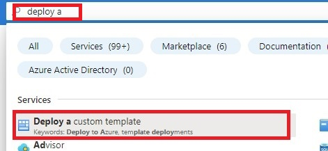
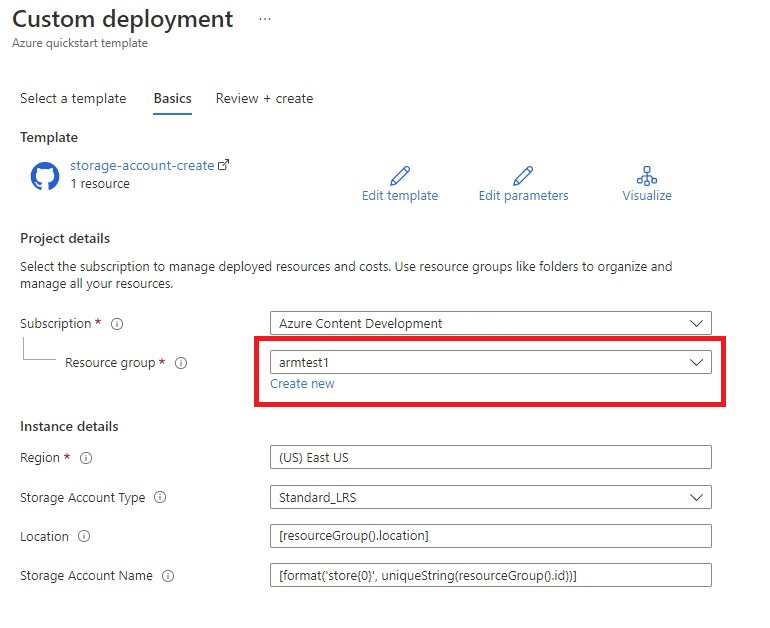
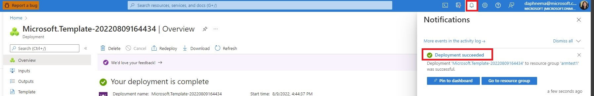
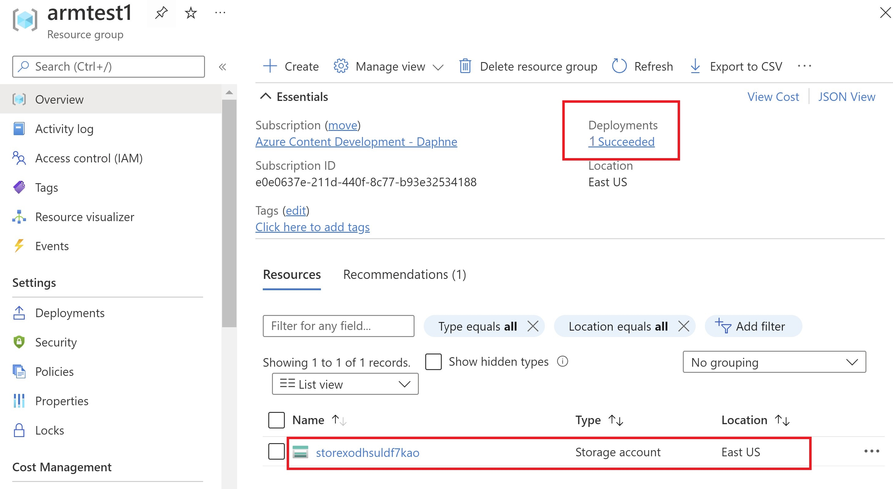
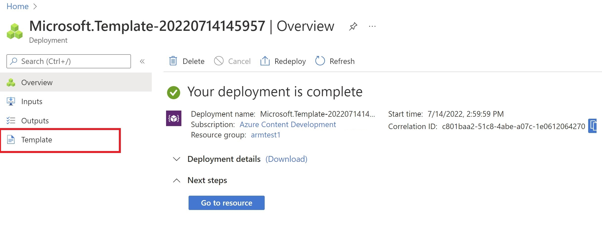
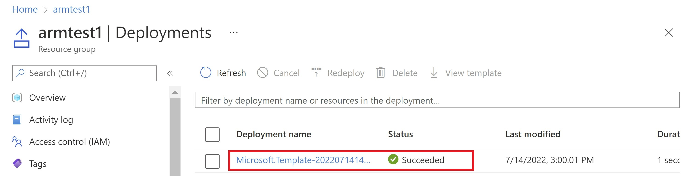
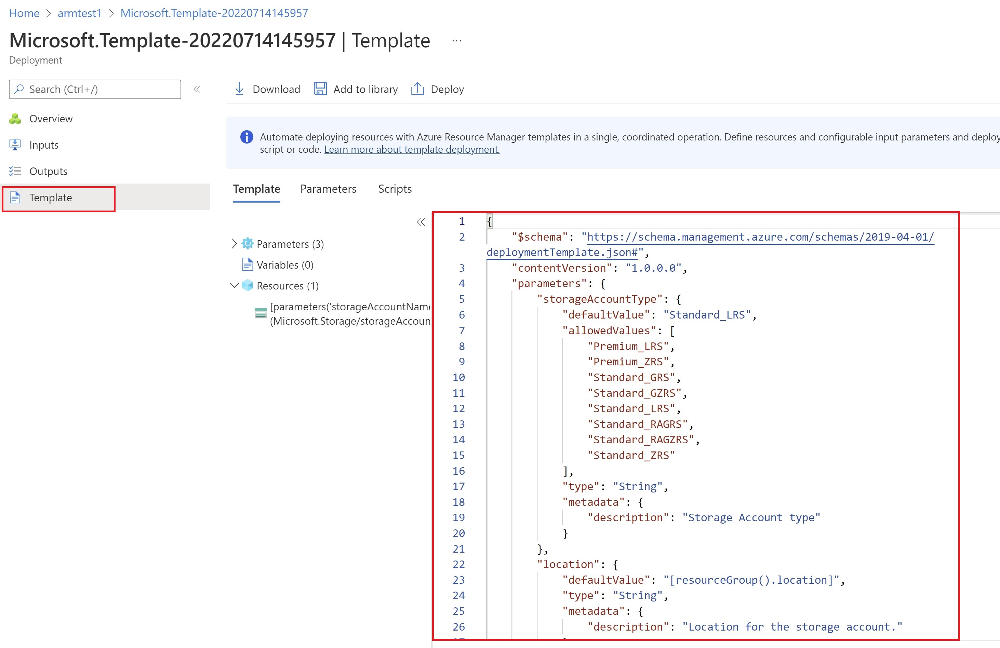
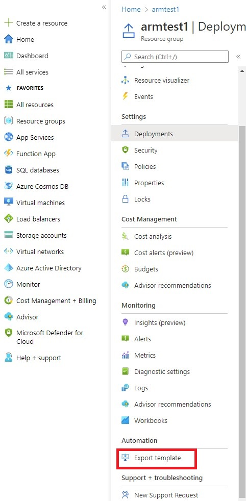

# Quickstart: Create and deploy ARM templates by using the Azure portal 

In this quickstart, you learn how to generate an Azure Resource Manager template (ARM template) in the Azure portal. You edit and deploy the template from the portal. 

ARM templates are JSON files that define the resources you need to deploy for your solution. To understand the concepts associated with deploying and managing your Azure solutions, see [template deployment overview](overview.md).

After completing the tutorial, you deploy an Azure Storage account. The same process can be used to deploy other Azure resources.

  

If you don't have an Azure subscription, [create a free account](https://azure.microsoft.com/free/) before you begin.

## Generate a Custom Template from the Portal

Although using Visual Studio Code is the recommended option, if you're new to Azure deployment, it may be more challenging to create an ARM template (especially in the beginning). To get around this issue, you can start by generating a template using the Azure portal option. You'll be able to configure your deployment in the Azure portal and download the corresponding ARM template. This template can be saved and reused in the future, and will serve as a good starting point.

Many experienced template developers use this method to generate templates when they try to deploy Azure resources that they aren't familiar with. For more information about exporting templates by using the portal, see [Export resource groups to templates](../management/manage-resource-groups-portal.md#export-resource-groups-to-templates). The other way to find a working template is from [Azure Quickstart Templates](https://azure.microsoft.com/resources/templates/).

1. In a web browser, go to the [Azure portal](https://portal.azure.com) and sign in.
2. From the Azure portal search bar, search for **Deploy a Custom Template** and then select it.

3. On the Custom Deployment page, select **Quickstart Template** under the Template Source section. Here, you can search for many kinds of templates, but with this quickstart, we'll be using `quickstarts/microsoft.storage/storage-account-create` in order to create a simple storage account. There are many other [collections of custom templates](https://github.com/Azure/azure-quickstart-templates) that others have created as well. These custom templates also follow best practices guidelines, which make it easier for you to select for specific scenarios. Finally, you can also select to **edit template**, which will allow you to edit the template manually. 

    

4. After moving to the next step, Enter the following information on the following page:

    For the **Resource group** field, select **Create new**, and specify a resource group name of your choice. On the screenshot, the resource group name is *armtest1*, and you're also able to access the **edit template** page here as well.

    

    A Resource group is a container for Azure resources that makes Azure resource management much easier.

5. Select **Review + create** on the bottom of the screen. After validation has passed (which may take a couple minutes), proceed to select **Create** in order to create your storage account.

6. Once your validation has passed, you'll receive a notification that says the deployment succeeded, and the notification will provide a link for the user to view their deployment. In this case, we're viewing the storage account we created. 

    

7. From this screen, you can view all the details for your selected resource group, and your created storage account. Select **the link for the succeeded deployments.**

    

8. Select the **link for the number of deployments** you have that have succeeded. Here you can choose the template you deployed.

    

    Select the **template** you wish to view.

    

9. After selecting the template you wish to view, you'll be brought to the template overview page. From here, select **templates** from the left hand side bar. 

    

    From here, you'll be able to see the custom template you deployed and its details.

  
    

## Export your Custom Template from the Azure portal

1. After the storage account has been created, navigate to the Azure portal to the resource group you deployed to.
2. Once you've selected the resource group, select **Export Template** from the left bottom pane. 
3. Here, you can see what your exported template would look like if it were deployed. You can see the whole template, or by selecting the **Parameters** link, you can view only the parameters section. Here, you'll be able to see and download the template to edit any resources, parameters, or other fields as needed. This is a good way to get a starting template, however it's important to note that the template generated may need other modifications based on the specific scenario. 

## Clean up resources

When the Azure resources are no longer needed, clean up the resources you deployed by deleting the resource group.

1. In the Azure portal, select **Resource group** on the left menu.
2. Enter the resource group name in the **Filter by name** field.
3. Select the resource group name.  You shall see the storage account in the resource group.
4. Select **Delete resource group** in the top menu.

## Next steps

In this tutorial, you learned how to generate a template from the Azure portal, and how to deploy the template using the portal. The template used in this Quickstart is a simple template with one Azure resource. When the template is complex, it's easier to use Visual Studio Code, or Visual Studio to develop the template. To learn more about template development, see our new beginner tutorial series:

> [!div class="nextstepaction"]
> [Beginner tutorials](./template-tutorial-create-first-template.md)
