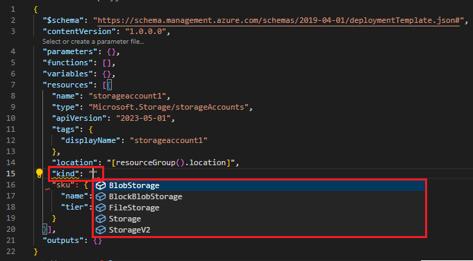
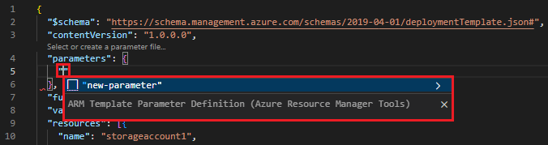

# Quickstart: Create Azure Resource Manager templates with Visual Studio Code

The Azure Resource Manager Tools for Visual Studio Code provide language support, resource snippets, and resource autocompletion. These tools help create and validate Azure Resource Manager templates. In this quickstart, you use the extension to create an Azure Resource Manager template from scratch. While doing so you experience the extensions capabilities such as ARM template snippets, validation, completions, and parameter file support.

To complete this quickstart, you need [Visual Studio Code](https://code.visualstudio.com/), with the [Azure Resource Manager tools extension](https://marketplace.visualstudio.com/items?itemName=msazurermtools.azurerm-vscode-tools) installed. You also need either the [Azure CLI](https://docs.microsoft.com/cli/azure/?view=azure-cli-latest) or the [Azure PowerShell module](https://docs.microsoft.com/powershell/azure/new-azureps-module-az?view=azps-3.7.0) installed and authenticated.

If you don't have an Azure subscription, [create a free account](https://azure.microsoft.com/free/) before you begin.

## Create an ARM template

Create and open with Visual Studio Code a new file named *azuredeploy.json*. Enter `arm` into the code editor, which initiates Azure Resource Manager snippets for scaffolding out an ARM template.

Select `arm!` to create a template scoped for an Azure resource group deployment.


This snippet creates the basic building blocks for an ARM template.


Notice that the Visual Studio Code language mode has changed from *JSON* to *Azure Resource Manager Template*. The extension includes a language server specific to ARM templates which provides ARM template-specific validation, completion, and other language services.


## Add an Azure resource

The extension includes snippets for many Azure resources. These snippets can be used to easily add resources to your template deployment.

Place the cursor in the template **resources** block, type in `storage`, and select the *arm-storage* snippet.


This action adds a storage resource to the template.


The **tab** key can be used to tab through configurable properties on the storage account.


## Completion and validation

One of the most powerful capabilities of the extension is its integration with Azure schemas. Azure schemas provide the extension with validation and resource-aware completion capabilities. Let's modify the storage account to see validation and completion in action. 

First, update the storage account kind to an invalid value such as `megaStorage`. Notice that this action produces a warning indicating that `megaStorage` is not a valid value.


To use the completion capabilities, remove `megaStorage`, place the cursor inside of the double quotes, and press `ctrl` + `space`. This action presents a completion list of valid values.



## Add template parameters

Now create and use a parameter to specify the storage account name.

Place your cursor in the parameters block, add a carriage return, type `par`, and then select the `arm-param-value` snippet. This action adds a generic parameter to the template.



Update the name of the parameter to `storageAccountName` and the description to `Storage Account Name`.


Azure storage account names have a minimum length of 3 characters and a maximum of 24. Add both `minLength` and `maxLength` to the parameter and provide appropriate values.


Now, on the storage resource, update the name property to use the parameter. To do so, remove the current name. Enter a double quote and an opening square bracket `[`, which produces a list of ARM template functions. Select *parameters* from the list. 


Entering a single quote `'` inside of the round brackets produces a list of all parameters defined in the template, in this case, *storageAccountName*. Select the parameter.


## Create a parameter file

An ARM template parameter file allows you to store environment-specific parameter values and pass these values in as a group at deployment time. For example, you may have a parameter file with values specific to a test environment and another for a production environment.

The extension makes it easy to create a parameter file from your existing templates. To do so, right-click on the template in the code editor and select `Select/Create Parameter File`.


Select `New` > `All Parameters` > Select a name and location for the parameter file.


This action creates a new parameter file and maps it with the template from which it was created. You can see and modify the current template/parameter file mapping in the Visual Studio Code status bar while the template is selected.


Now that the parameter file has been mapped to the template, the extension validates both the template and parameter file together. To see this validation in practice, add a two-character value to the `storageAccountName` parameter in the parameter file and save the file.


Navigate back to the ARM template and notice that an error has been raised indicating that the value does not meet the parameter criteria.


Update the value to something appropriate, save the file, and navigate back to the template. Notice that the error on the parameter has been resolved.

## Deploy the template

Open the integrated Visual Studio Code terminal using the `ctrl` + ```` ` ```` key combination and use either the Azure CLI or Azure PowerShell module to deploy the template.

# [CLI](#tab/CLI)

```azurecli
az group create --name arm-vscode --location eastus

az deployment group create --resource-group arm-vscode --template-file azuredeploy.json --parameters azuredeploy.parameters.json
```

# [PowerShell](#tab/PowerShell)

```azurepowershell
New-AzResourceGroup -Name arm-vscode -Location eastus

New-AzResourceGroupDeployment -ResourceGroupName arm-vscode -TemplateFile ./azuredeploy.json -TemplateParameterFile ./azuredeploy.parameters.json
```
---

## Clean up resources

When the Azure resources are no longer needed, use the Azure CLI or Azure PowerShell module to delete the quickstart resource group.

# [CLI](#tab/CLI)

```azurecli
az group delete --name arm-vscode
```

# [PowerShell](#tab/PowerShell)

```azurepowershell
Remove-AzResourceGroup -Name arm-vscode
```
---

## Next steps

> [!div class="nextstepaction"]
> [Beginner tutorials](./template-tutorial-create-first-template.md)
