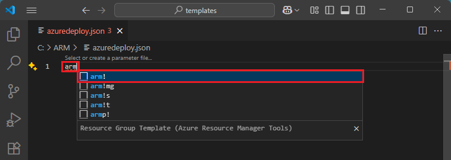
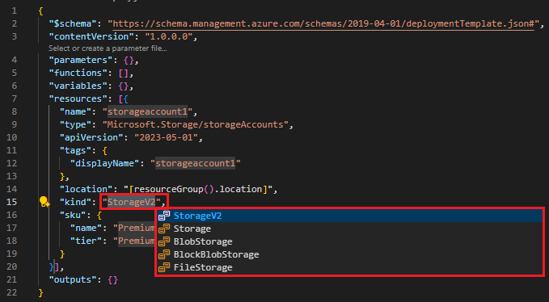

# Quickstart: Create Azure Resource Manager templates by using Visual Studio Code

Learn how to use Visual Studio Code and the Azure Resource Manager Tools extension to create and edit Azure Resource Manager templates. You can create Resource Manager templates in Visual Studio Code without the extension, but the extension provides autocomplete options that simplify template development. To understand the concepts associated with deploying and managing your Azure solutions, see [template deployment overview](overview.md).

If you don't have an Azure subscription, [create a free account](https://azure.microsoft.com/free/) before you begin.

## Create an empty ARM template

Create and open with Visual Studio Code a new file named *azuredeploy.json*. Enter `arm!` into the code editor which initiates ARM Tools snippets for scaffolding out an ARM template.

Select `arm!` to create a template scoped for an Azure resource group deployment.

Notice that the VS Code language mode has changed from *JSON* to *Azure Resource Manager Template*. The ARM Tools extension includes a language server specific to ARM templates which provides ARM template specific auto-completion, validation, and other language services.

## Add storage account to template

Place the cursor in the template *resource* block, type in `storage`, and select the *arm-storage* snippet.

This adds a storage resource to the template.

The *tab* key can be used to tab through configurable properties on the storage account.

## Add parameters and variables

You should now have a valid ARM template for deploying an Azure Storage account. Now create and use a parameter to specify the storage account name and a variable to hold the storage account type.

Place your cursor in the parameters block, add a carriage return, type `par`, and then select `arm-param-value`. This adds a generic parameter to the template.

## Clean up resources

When the Azure resources are no longer needed, clean up the resources you deployed by deleting the resource group.

1. From the Azure portal, select **Resource group** from the left menu.
2. Enter the resource group name in the **Filter by name** field.
3. Select the resource group name.  You shall see a total of six resources in the resource group.
4. Select **Delete resource group** from the top menu.

## Next steps

> [!div class="nextstepaction"]
> [Beginner tutorials](./template-tutorial-create-first-template.md)