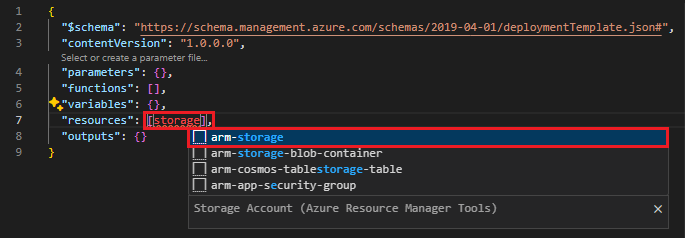
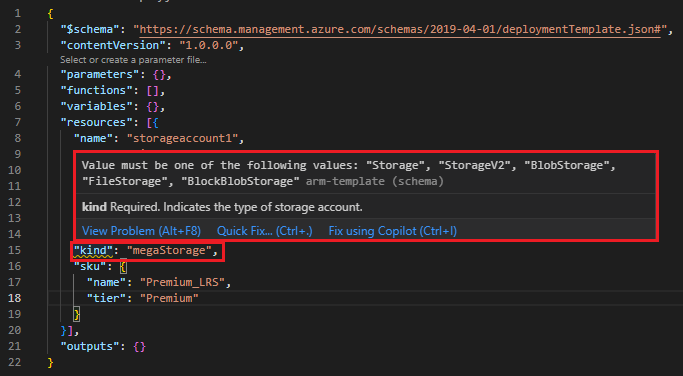
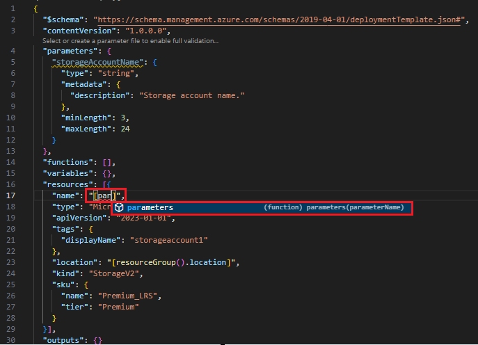
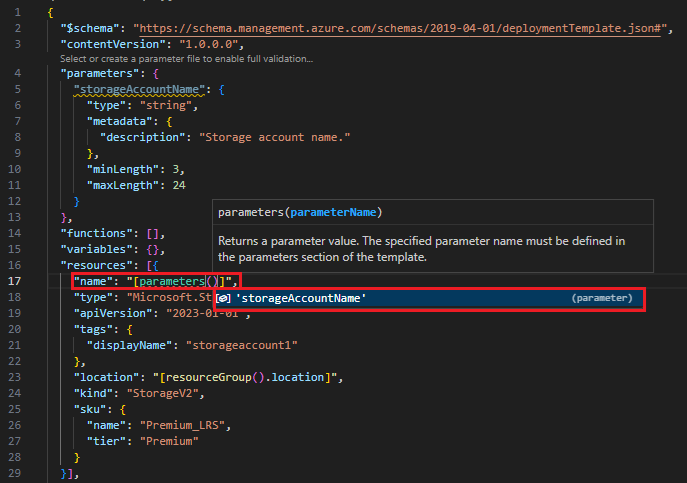

# Quickstart: Create Azure Resource Manager templates by using Visual Studio Code

Learn how to use Visual Studio Code and the Azure Resource Manager Tools extension to create and edit Azure Resource Manager templates. You can create Resource Manager templates in Visual Studio Code without the extension, but the extension provides autocomplete options that simplify template development. To understand the concepts associated with deploying and managing your Azure solutions, see [template deployment overview](overview.md).

If you don't have an Azure subscription, [create a free account](https://azure.microsoft.com/free/) before you begin.

## Create an ARM template

Create and open with Visual Studio Code a new file named *azuredeploy.json*. Enter `arm!` into the code editor which initiates ARM Tools snippets for scaffolding out an ARM template.

Select `arm!` to create a template scoped for an Azure resource group deployment.


This snippet creates the basic building blocks for an ARM template.


Notice that the VS Code language mode has changed from *JSON* to *Azure Resource Manager Template*. The ARM Tools extension includes a language server specific to ARM templates which provides ARM template specific completion, validation, and other language services.


## Add an Azure resource

The ARM Tools extension includes snippets for many Azure resources. These snippets can be used to easily add Azure resources to your template deployment.

Place the cursor in the template **resources** block, type in `storage`, and select the *arm-storage* snippet.



This adds a storage resource to the template.


The **tab** key can be used to tab through configurable properties on the storage account.


## Completion and validation

One of the most powerful capabilities of the ARM Tools extension for VS Code is its integration with Azure schemas. Azure schemas provide the extension with completion and validation capabilities. Let's modify the storage account to see validation and completion in action. 

First, update the storage account kind to an invalid value such as `megaStorage`. Notice that this produces a warning indicating that `megaStorage` is not a valid value.


To use the completion capabilities, remove `megaStorage`, place the cursor inside of the double quotes, and press `ctrl` + `space`. This action presents a list of valid values.


## Add template parameters

Now create and use a parameter to specify the storage account name.

Place your cursor in the parameters block, add a carriage return, type `par`, and then select the`arm-param-value` snippet. This adds a generic parameter to the template.



Update the name of the parameter to `storageAccountName` and the description to `Storage Account Name`.


Azure storage accounts names have a minimum length of 3 characters and a maximum of 24. Add both `minLength` and `maxLength` to the parameter and provide appropriate values.


Now, on the storage resource, update the name property to use the parameter. To do so, remove the current name. Enter a double quote and an opening square bracket `[`, which produces a list of ARM functions. Type in `par` and select *parameters* from the list. 



Entering a single quote `'` inside of the round brackets produces a list of all parameters defined in the template, in this case, *storageAccountName*. Select the parameter.



## Create a parameter file

An ARM template parameter file allows you to store environment-specific values and pass these in as a group at deployment time. For example, you may have a parameter file with values specific to a test environment and another for a production environment.

The ARM Tools extension for VS Code makes it easy to create a parameter file from your existing templates. To do so, right-click on the template in the code editor and select `Select/Create Parameter File`.


Select `New` > `All Parameters` > Select a name and location for the parameter file.


This will create a new parameters file and associate it with the template from which it was created. You can see which parameter file a template has been associated with, and update this mapping in the VS Code status bar.


Now that the parameter file has been mapped to the template, the ARM Tools extension validates both the template and parameter file. To see this in practice, add a two-character value to the `storageAccountName` parameter in the parameter file.


Navigate back to the ARM template and notice that an error has been raised indicating that the value does not meet the parameter criteria.


Update the value to something appropriate, save the file, and navigate back to the template. Notice that the error on the parameter has been resolved.

## Template deployment

Open the integrated VS Code terminal using the `ctrl` + ``` key combination and use either the Azure CLI or Azure PowerShell module to deploy the template.

# [CLI](#tab/CLI)

```azurecli
az group create --name arm-vscode --location eastus

az deployment group create --resource-group arm-vscode --template-file azuredeploy.json --parameters azuredeploy.parameters.json
```

# [PowerShell](#tab/PowerShell)

```azurepowershell
New-AzResourceGroup -Name arm-vscode -Location eastus

New-AzResourceGroupDeployment -ResourceGroupName arm-vscode -TemplateFile ./azuredeploy.json -TemplateParameterFile ./azuredeploy.parameters.json
```
---

## Clean up resources

When the Azure resources are no longer needed, clean up the resources you deployed by deleting the resource group.

1. From the Azure portal, select **Resource group** from the left menu.
2. Enter the resource group name in the **Filter by name** field.
3. Select the resource group name.  You shall see a total of six resources in the resource group.
4. Select **Delete resource group** from the top menu.

## Next steps

> [!div class="nextstepaction"]
> [Beginner tutorials](./template-tutorial-create-first-template.md)