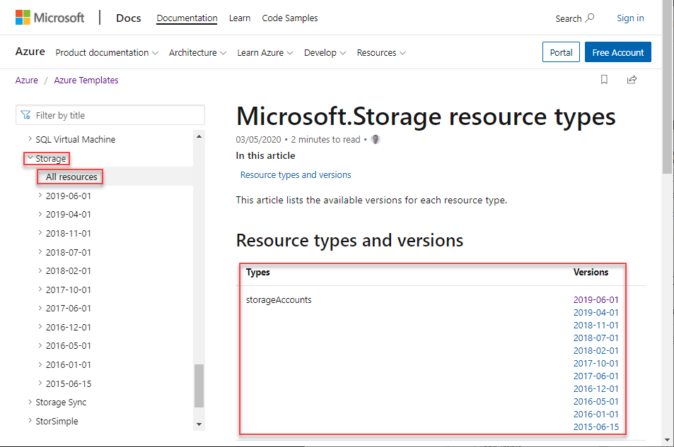
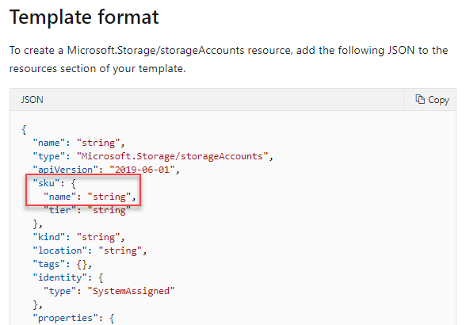

# Search for resource schemas

When creating Resource Manager templates, you need to understand what resource types are available, and what values to use in your template. You can use the following resource to find the information. The procedures in this article demonstrate how to find the property name of Azure storage account SKU type, and the allowed values of the SKU type.

- Template reference
- REST API
- Resource Explorer
- Resource.azure.com
- Export
- portal

## Use template reference

The Azure Resource Manager template reference is located at [https://docs.microsoft.com/azure/templates/](https://docs.microsoft.com/azure/templates/).

To find  ...

1. From the left navigation, select **Storage**, and then select **All resources**. This page lists the reosurce types and the versions. The **storageAccounts** resource type has these version when the article is written.

    

2. Select the latest version **2019-06-01**.  It is recommended to use the latest template schema.

    In the **Template format** section, it shows the sku property name:

    

## REST API

## Next steps

For a step-by-step tutorial that guides you through the process of creating a template, see [Tutorial: Create and deploy your first ARM template](template-tutorial-create-first-template.md).
