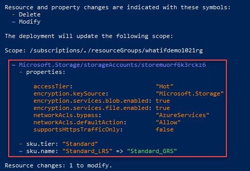
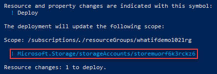
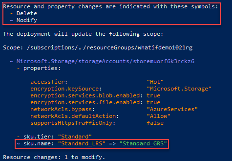

# Resource Manager template deployment what-if operation (Preview)

Before deploying a template, you might want to preview the changes that will happen. Azure Resource Manager provides the what-if operation to let you see how resources will change if you deploy the template. The what-if operation doesn't make any changes to existing resources. Instead, it predicts the changes if the specified template is deployed.

> [!NOTE]
> The what-if operation is currently in preview. To use it, you must [sign up for the preview](https://aka.ms/armtemplatepreviews). As a preview release, the results may sometimes show that a resource will change when actually no change will happen. We're working to reduce these issues, but we need your help. Please report these issues at [https://aka.ms/whatifissues](https://aka.ms/whatifissues).

You can use the what-if operation with the `New-AzDeploymentWhatIf` PowerShell command or the [Deployments - What If](/rest/api/resources/deployments/whatif) REST operation.

In PowerShell, the output looks like:


## Change types

The what-if operation lists six different types of changes:

- **Create**: The resource doesn't currently exist but is defined in the template. The resource will be created.

- **Delete**: This change type only applies when using [complete mode](deployment-modes.md) for deployment. The resource exists, but isn't defined in the template. With complete mode, the resource will be deleted. Only resources that [support complete mode deletion](complete-mode-deletion.md) are included in this change type.

- **Ignore**: The resource exists, but isn't defined in the template. The resource won't be deployed or modified.

- **NoChange**: The resource exists, and is defined in the template. The resource will be redeployed, but the properties of the resource won't change. This change type is returned when [ResultFormat](#result-format) is set to `FullResourcePayloads`, which is the default value.

- **Modify**: The resource exists, and is defined in the template. The resource will be redeployed, and the properties of the resource will change. This change type is returned when [ResultFormat](#result-format) is set to `FullResourcePayloads`, which is the default value.

- **Deploy**: The resource exists, and is defined in the template. The resource will be redeployed. The properties of the resource may or may not change. The operation returns this change type when it doesn't have enough information to determine if any properties will change. You only see this condition when [ResultFormat](#result-format) is set to `ResourceIdOnly`.

## Deployment scope

You can use the what-if operation for deployments at either the subscription or resource group level. You set the deployment scope with the `-ScopeType` parameter. The accepted values are `Subscription` and `ResourceGroup`. This article demonstrates resource group deployments.

To learn about subscription level deployments, see [Create resource groups and resources at the subscription level](deploy-to-subscription.md#).

## Result format

You can control the level of detail that is returned about the predicted changes. Set the `ResultFormat` parameter to `FullResourcePayloads` to get a list of resources what will change and details about the properties that will change. Set the `ResultFormat` parameter to `ResourceIdOnly` to get a list of resources that will change. The default value is `FullResourcePayloads`.  

The following screenshots show the two different output formats:

- Full resource payloads

    

- Resource ID only

    

## Run what-if operation

### Set up environment

To see how what-if works, let's runs some tests. First, deploy a template from [Azure Quickstart templates that creates a storage account](https://github.com/Azure/azure-quickstart-templates/blob/master/101-storage-account-create/azuredeploy.json). The default storage account type is `Standard_LRS`. You'll use this storage account to test how changes are reported by what-if.

```azurepowershell-interactive
New-AzResourceGroup `
  -Name ExampleGroup `
  -Location centralus
New-AzResourceGroupDeployment `
  -ResourceGroupName ExampleGroup `
  -TemplateUri "https://raw.githubusercontent.com/Azure/azure-quickstart-templates/master/101-storage-account-create/azuredeploy.json"
```

### Test modification

After the deployment completes, you're ready to test the what-if operation. Run the what-if command but change the storage account type to `Standard_GRS`.

```azurepowershell-interactive
New-AzDeploymentWhatIf `
  -ScopeType ResourceGroup `
  -ResourceGroupName ExampleGroup `
  -TemplateUri "https://raw.githubusercontent.com/Azure/azure-quickstart-templates/master/101-storage-account-create/azuredeploy.json" `
  -storageAccountType Standard_GRS
```

The what-if output is similar to:



Notice at the top of the output that colors are defined to indicate the type of changes.

At the bottom of the output, it shows the sku name (storage account type) will be changed from **Standard_LRS** to **Standard_GRS**.

Some of the properties that are listed as deleted won't actually change. In the preceding image, these properties are accessTier, encryption.keySource and others in that section. Properties can be incorrectly reported as deleted when they aren't in the template, but are automatically set during deployment as default values. This result is considered "noise" in the what-if response. The final deployed resource will have the values set for the properties. As the what-if operation matures, these properties will be filtered out of the result.

### Test deletion

The what-if operation supports using [deployment mode](deployment-modes.md). When set to complete mode, resources not in the template are deleted. The following example deploys a [template that has no resources defined](https://github.com/Azure/azure-docs-json-samples/blob/master/empty-template/azuredeploy.json) in complete mode.

```azurepowershell-interactive
New-AzDeploymentWhatIf `
  -ScopeType ResourceGroup `
  -ResourceGroupName ExampleGroup `
  -TemplateUri "https://raw.githubusercontent.com/Azure/azure-docs-json-samples/master/empty-template/azuredeploy.json" `
  -Mode Complete
```

Because no resources are defined in the template and the deployment mode is set to complete, the storage account will be deleted.


It's important to remember what-if makes no actual changes. The storage account still exists in your resource group.

## Next steps

- If you notice incorrect results from the preview release of what-if, please report the issues at [https://aka.ms/whatifissues](https://aka.ms/whatifissues).
- To deploy templates with Azure PowerShell, see [Deploy resources with Resource Manager templates and Azure PowerShell](deploy-powershell.md).
- To deploy templates with REST, see [Deploy resources with Resource Manager templates and Resource Manager REST API](deploy-rest.md).
- To roll back to a successful deployment when you get an error, see [Rollback on error to successful deployment](rollback-on-error.md).
