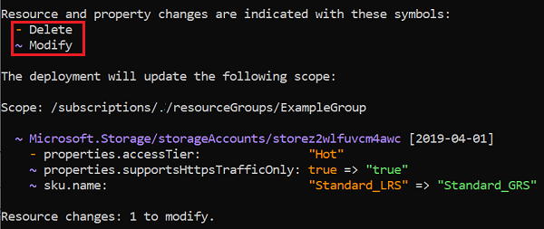
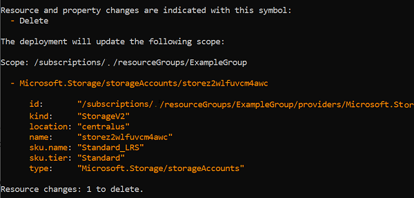

# ARM template deployment what-if operation (Preview)

Before deploying an Azure Resource Manager (ARM) template, you can preview the changes that will happen. Azure Resource Manager provides the what-if operation to let you see how resources will change if you deploy the template. The what-if operation doesn't make any changes to existing resources. Instead, it predicts the changes if the specified template is deployed.

> [!NOTE]
> The what-if operation is currently in preview. As a preview release, the results may sometimes show that a resource will change when actually no change will happen. We're working to reduce these issues, but we need your help. Please report these issues at [https://aka.ms/whatifissues](https://aka.ms/whatifissues).

You can use the what-if operation with Azure PowerShell, Azure CLI, or REST API operations. What-if is supported for resource group and subscription level deployments.

## Install Azure PowerShell module

To use what-if in PowerShell, you must have version **4.2 or later of the Az module**.

But, before installing the required module, make sure you have PowerShell Core (6.x or 7.x). If you have PowerShell 5.x or earlier, [update your version of PowerShell](/powershell/scripting/install/installing-powershell). You can't install the required module on PowerShell 5.x or earlier.

### Install latest version

To install the module, use:

```powershell
Install-Module -Name Az -Force
```

For more information about installing modules, see [Install Azure PowerShell](/powershell/azure/install-az-ps).

### Uninstall alpha version

If you previously installed an alpha version of the what-if module, uninstall that module. The alpha version was only available to users who signed up for an early preview. If you didn't install that preview, you can skip this section.

1. Run PowerShell as administrator
1. Check your installed versions of the Az.Resources module.

   ```powershell
   Get-InstalledModule -Name Az.Resources -AllVersions | select Name,Version
   ```

1. If you have an installed version with a version number in the format **2.x.x-alpha**, uninstall that version.

   ```powershell
   Uninstall-Module Az.Resources -RequiredVersion 2.0.1-alpha5 -AllowPrerelease
   ```

1. Unregister the what-if repository that you used to install the preview.

   ```powershell
   Unregister-PSRepository -Name WhatIfRepository
   ```

You're ready to use what-if.

## Install Azure CLI module

To use what-if in Azure CLI, you must have Azure CLI 2.5.0 or later. If needed, [install the latest version of Azure CLI](/cli/azure/install-azure-cli).

## See results

When you use what-if in PowerShell or Azure CLI, the output includes color-coded results that help you see the different types of changes.



The text output is:

```powershell
Resource and property changes are indicated with these symbols:
  - Delete
  + Create
  ~ Modify

The deployment will update the following scope:

Scope: /subscriptions/./resourceGroups/ExampleGroup

  ~ Microsoft.Network/virtualNetworks/vnet-001 [2018-10-01]
    - tags.Owner: "Team A"
    ~ properties.addressSpace.addressPrefixes: [
      - 0: "10.0.0.0/16"
      + 0: "10.0.0.0/15"
      ]
    ~ properties.subnets: [
      - 0:

          name:                     "subnet001"
          properties.addressPrefix: "10.0.0.0/24"

      ]

Resource changes: 1 to modify.
```

## What-if commands

### Azure PowerShell

To preview changes before deploying a template, use [New-AzResourceGroupDeployment](/powershell/module/az.resources/new-azresourcegroupdeployment) or [New-AzSubscriptionDeployment](/powershell/module/az.resources/new-azdeployment). Add the `-Whatif` switch parameter to the deployment command.

* `New-AzResourceGroupDeployment -Whatif` for resource group deployments
* `New-AzSubscriptionDeployment -Whatif` and `New-AzDeployment -Whatif` for subscription level deployments

You can use the `-Confirm` switch parameter to preview the changes and get prompted to continue with the deployment.

* `New-AzResourceGroupDeployment -Confirm` for resource group deployments
* `New-AzSubscriptionDeployment -Confirm` and `New-AzDeployment -Confirm` for subscription level deployments

The preceding commands return a text summary that you can manually inspect. To get an object that you can programmatically inspect for changes, use [Get-AzResourceGroupDeploymentWhatIfResult](/powershell/module/az.resources/get-azresourcegroupdeploymentwhatifresult) or [Get-AzSubscriptionDeploymentWhatIfResult](/powershell/module/az.resources/get-azdeploymentwhatifresult).

* `$results = Get-AzResourceGroupDeploymentWhatIfResult` for resource group deployments
* `$results = Get-AzSubscriptionDeploymentWhatIfResult` or `$results = Get-AzDeploymentWhatIfResult` for subscription level deployments

### Azure CLI

To preview changes before deploying a template, use [az deployment group what-if](/cli/azure/deployment/group#az-deployment-group-what-if) or [az deployment sub what-if](/cli/azure/deployment/sub#az-deployment-sub-what-if).

* `az deployment group what-if` for resource group deployments
* `az deployment sub what-if` for subscription level deployments

You can use the `--confirm-with-what-if` switch (or its short form `-c`) to preview the changes and get prompted to continue with the deployment. Add this switch to [az deployment group create](/cli/azure/deployment/group#az-deployment-group-create) or [az deployment sub create](/cli/azure/deployment/sub#az-deployment-sub-create).

* `az deployment group create --confirm-with-what-if` or `-c` for resource group deployments
* `az deployment sub create --confirm-with-what-if` or `-c` for subscription level deployments

The preceding commands return a text summary that you can manually inspect. To get a JSON object that you can programmatically inspect for changes, use:

* `az deployment group what-if --no-pretty-print` for resource group deployments
* `az deployment sub what-if --no-pretty-print` for subscription level deployments

If you want to return the results without colors, open your [Azure CLI configuration](/cli/azure/azure-cli-configuration) file. Set **no_color** to **yes**.

### Azure REST API

For REST API, use:

* [Deployments - What If](/rest/api/resources/deployments/whatif) for resource group deployments
* [Deployments - What If At Subscription Scope](/rest/api/resources/deployments/whatifatsubscriptionscope) for subscription level deployments

## Change types

The what-if operation lists six different types of changes:

- **Create**: The resource doesn't currently exist but is defined in the template. The resource will be created.

- **Delete**: This change type only applies when using [complete mode](deployment-modes.md) for deployment. The resource exists, but isn't defined in the template. With complete mode, the resource will be deleted. Only resources that [support complete mode deletion](complete-mode-deletion.md) are included in this change type.

- **Ignore**: The resource exists, but isn't defined in the template. The resource won't be deployed or modified.

- **NoChange**: The resource exists, and is defined in the template. The resource will be redeployed, but the properties of the resource won't change. This change type is returned when [ResultFormat](#result-format) is set to `FullResourcePayloads`, which is the default value.

- **Modify**: The resource exists, and is defined in the template. The resource will be redeployed, and the properties of the resource will change. This change type is returned when [ResultFormat](#result-format) is set to `FullResourcePayloads`, which is the default value.

- **Deploy**: The resource exists, and is defined in the template. The resource will be redeployed. The properties of the resource may or may not change. The operation returns this change type when it doesn't have enough information to determine if any properties will change. You only see this condition when [ResultFormat](#result-format) is set to `ResourceIdOnly`.

## Result format

You control the level of detail that is returned about the predicted changes. You have two options:

* **FullResourcePayloads** - returns a list of resources that will change and details about the properties that will change
* **ResourceIdOnly** - returns a list of resources that will change

The default value is **FullResourcePayloads**.

For PowerShell deployment commands, use the `-WhatIfResultFormat` parameter. In the programmatic object commands, use the `ResultFormat` parameter.

For Azure CLI, use the `--result-format` parameter.
 
The following results show the two different output formats:

- Full resource payloads

  ```powershell
  Resource and property changes are indicated with these symbols:
    - Delete
    + Create
    ~ Modify

  The deployment will update the following scope:

  Scope: /subscriptions/./resourceGroups/ExampleGroup

    ~ Microsoft.Network/virtualNetworks/vnet-001 [2018-10-01]
      - tags.Owner: "Team A"
      ~ properties.addressSpace.addressPrefixes: [
        - 0: "10.0.0.0/16"
        + 0: "10.0.0.0/15"
        ]
      ~ properties.subnets: [
        - 0:

          name:                     "subnet001"
          properties.addressPrefix: "10.0.0.0/24"

        ]

  Resource changes: 1 to modify.
  ```

- Resource ID only

  ```powershell
  Resource and property changes are indicated with this symbol:
    ! Deploy

  The deployment will update the following scope:

  Scope: /subscriptions/./resourceGroups/ExampleGroup

    ! Microsoft.Network/virtualNetworks/vnet-001

  Resource changes: 1 to deploy.
  ```

## Run what-if operation

### Set up environment

To see how what-if works, let's runs some tests. First, deploy a [template that creates a virtual network](https://github.com/Azure/azure-docs-json-samples/blob/master/azure-resource-manager/what-if/what-if-before.json). You'll use this virtual network to test how changes are reported by what-if.

# [PowerShell](#tab/azure-powershell)

```azurepowershell
New-AzResourceGroup `
  -Name ExampleGroup `
  -Location centralus
New-AzResourceGroupDeployment `
  -ResourceGroupName ExampleGroup `
  -TemplateUri "https://raw.githubusercontent.com/Azure/azure-docs-json-samples/master/azure-resource-manager/what-if/what-if-before.json"
```

# [Azure CLI](#tab/azure-cli)

```azurecli
az group create \
  --name ExampleGroup \
  --location "Central US"
az deployment group create \
  --resource-group ExampleGroup \
  --template-uri "https://raw.githubusercontent.com/Azure/azure-docs-json-samples/master/azure-resource-manager/what-if/what-if-before.json"
```

---

### Test modification

After the deployment completes, you're ready to test the what-if operation. This time you deploy a [template that changes the virtual network](https://github.com/Azure/azure-docs-json-samples/blob/master/azure-resource-manager/what-if/what-if-after.json). It's missing one the original tags, a subnet has been removed, and the address prefix has changed.

# [PowerShell](#tab/azure-powershell)

```azurepowershell
New-AzResourceGroupDeployment `
  -Whatif `
  -ResourceGroupName ExampleGroup `
  -TemplateUri "https://raw.githubusercontent.com/Azure/azure-docs-json-samples/master/azure-resource-manager/what-if/what-if-after.json"
```

# [Azure CLI](#tab/azure-cli)

```azurecli
az deployment group what-if \
  --resource-group ExampleGroup \
  --template-uri "https://raw.githubusercontent.com/Azure/azure-docs-json-samples/master/azure-resource-manager/what-if/what-if-after.json"
```

---

The what-if output appears similar to:


The text output is:

```powershell
Resource and property changes are indicated with these symbols:
  - Delete
  + Create
  ~ Modify

The deployment will update the following scope:

Scope: /subscriptions/./resourceGroups/ExampleGroup

  ~ Microsoft.Network/virtualNetworks/vnet-001 [2018-10-01]
    - tags.Owner: "Team A"
    ~ properties.addressSpace.addressPrefixes: [
      - 0: "10.0.0.0/16"
      + 0: "10.0.0.0/15"
      ]
    ~ properties.subnets: [
      - 0:

        name:                     "subnet001"
        properties.addressPrefix: "10.0.0.0/24"

      ]

Resource changes: 1 to modify.
```

Notice at the top of the output that colors are defined to indicate the type of changes.

At the bottom of the output, it shows the tag Owner was deleted. The address prefix changed from 10.0.0.0/16 to 10.0.0.0/15. The subnet named subnet001 was deleted. Remember these changes weren't actually deployed. You see a preview of the changes that will happen if you deploy the template.

Some of the properties that are listed as deleted won't actually change. Properties can be incorrectly reported as deleted when they aren't in the template, but are automatically set during deployment as default values. This result is considered "noise" in the what-if response. The final deployed resource will have the values set for the properties. As the what-if operation matures, these properties will be filtered out of the result.

## Programmatically evaluate what-if results

Now, let's programmatically evaluate the what-if results by setting the command to a variable.

# [PowerShell](#tab/azure-powershell)

```azurepowershell
$results = Get-AzResourceGroupDeploymentWhatIfResult `
  -ResourceGroupName ExampleGroup `
  -TemplateUri "https://raw.githubusercontent.com/Azure/azure-docs-json-samples/master/azure-resource-manager/what-if/what-if-after.json"
```

You can see a summary of each change.

```azurepowershell
foreach ($change in $results.Changes)
{
  $change.Delta
}
```

# [Azure CLI](#tab/azure-cli)

```azurecli
results=$(az deployment group what-if --resource-group ExampleGroup --template-uri "https://raw.githubusercontent.com/Azure/azure-docs-json-samples/master/azure-resource-manager/what-if/what-if-after.json" --no-pretty-print)
```

---

## Confirm deletion

The what-if operation supports using [deployment mode](deployment-modes.md). When set to complete mode, resources not in the template are deleted. The following example deploys a [template that has no resources defined](https://github.com/Azure/azure-docs-json-samples/blob/master/empty-template/azuredeploy.json) in complete mode.

To preview changes before deploying a template, use the confirm switch parameter with the deployment command. If the changes are as you expected, acknowledge that you want the deployment to complete.

# [PowerShell](#tab/azure-powershell)

```azurepowershell
New-AzResourceGroupDeployment `
  -ResourceGroupName ExampleGroup `
  -Mode Complete `
  -Confirm `
  -TemplateUri "https://raw.githubusercontent.com/Azure/azure-docs-json-samples/master/empty-template/azuredeploy.json"
```

# [Azure CLI](#tab/azure-cli)

```azurecli
az deployment group create \
  --resource-group ExampleGroup \
  --mode Complete \
  --confirm-with-what-if \
  --template-uri "https://raw.githubusercontent.com/Azure/azure-docs-json-samples/master/empty-template/azuredeploy.json"
```

---

Because no resources are defined in the template and the deployment mode is set to complete, the virtual network will be deleted.



The text output is:

```powershell
Resource and property changes are indicated with this symbol:
  - Delete

The deployment will update the following scope:

Scope: /subscriptions/./resourceGroups/ExampleGroup

  - Microsoft.Network/virtualNetworks/vnet-001

      id:
"/subscriptions/./resourceGroups/ExampleGroup/providers/Microsoft.Network/virtualNet
works/vnet-001"
      location:        "centralus"
      name:            "vnet-001"
      tags.CostCenter: "12345"
      tags.Owner:      "Team A"
      type:            "Microsoft.Network/virtualNetworks"

Resource changes: 1 to delete.

Are you sure you want to execute the deployment?
[Y] Yes  [A] Yes to All  [N] No  [L] No to All  [S] Suspend  [?] Help (default is "Y"):
```

You see the expected changes and can confirm that you want the deployment to run.

## SDKs

You can use the what-if operation through the Azure SDKs.

* For Python, use [what-if](/python/api/azure-mgmt-resource/azure.mgmt.resource.resources.v2019_10_01.operations.deploymentsoperations?view=azure-python#what-if-resource-group-name--deployment-name--properties--location-none--custom-headers-none--raw-false--polling-true----operation-config-).

* For Java, use [DeploymentWhatIf Class](/java/api/com.microsoft.azure.management.resources.deploymentwhatif?view=azure-java-stable).

* For .NET, use [DeploymentWhatIf Class](/dotnet/api/microsoft.azure.management.resourcemanager.models.deploymentwhatif?view=azure-dotnet).

## Next steps

- If you notice incorrect results from the preview release of what-if, please report the issues at [https://aka.ms/whatifissues](https://aka.ms/whatifissues).
- To deploy templates with Azure PowerShell, see [Deploy resources with ARM templates and Azure PowerShell](deploy-powershell.md).
- To deploy templates with Azure CLI, see [Deploy resources with ARM templates and Azure CLI](deploy-cli.md).
- To deploy templates with REST, see [Deploy resources with ARM templates and Resource Manager REST API](deploy-rest.md).
