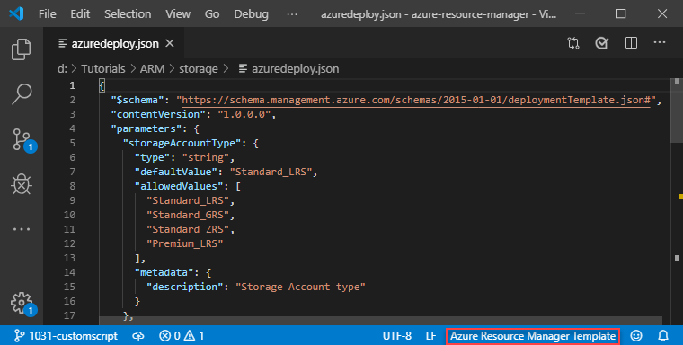

# Understand the structure and syntax of Azure Resource Manager templates

This article describes the structure of an Azure Resource Manager template. It presents the different sections of a template and the properties that are available in those sections.

This article is intended for users who have some familiarity with Resource Manager templates. It provides detailed information about the structure of the template. For a step-by-step tutorial that guides you through the process of creating a template, see [Tutorial: Create and deploy your first Azure Resource Manager template](template-tutorial-create-first-template.md).

## Template format

In its simplest structure, a template has the following elements:

```json
{
  "$schema": "https://schema.management.azure.com/schemas/2015-01-01/deploymentTemplate.json#",
  "contentVersion": "",
  "apiProfile": "",
  "parameters": {  },
  "variables": {  },
  "functions": [  ],
  "resources": [  ],
  "outputs": {  }
}
```

| Element name | Required | Description |
|:--- |:--- |:--- |
| $schema |Yes |Location of the JSON schema file that describes the version of the template language.<br><br> For resource group deployments, use: `https://schema.management.azure.com/schemas/2015-01-01/deploymentTemplate.json#`<br><br>For subscription deployments, use: `https://schema.management.azure.com/schemas/2018-05-01/subscriptionDeploymentTemplate.json#` |
| contentVersion |Yes |Version of the template (such as 1.0.0.0). You can provide any value for this element. Use this value to document significant changes in your template. When deploying resources using the template, this value can be used to make sure that the right template is being used. |
| apiProfile |No | An API version that serves as a collection of API versions for resource types. Use this value to avoid having to specify API versions for each resource in the template. When you specify an API profile version and don't specify an API version for the resource type, Resource Manager uses the API version for that resource type that is defined in the profile.<br><br>The API profile property is especially helpful when deploying a template to different environments, such as Azure Stack and global Azure. Use the API profile version to make sure your template automatically uses versions that are supported in both environments. For a list of the current API profile versions and the resources API versions defined in the profile, see [API Profile](https://github.com/Azure/azure-rest-api-specs/tree/master/profile).<br><br>For more information, see [Track versions using API profiles](templates-cloud-consistency.md#track-versions-using-api-profiles). |
| [parameters](#parameters) |No |Values that are provided when deployment is executed to customize resource deployment. |
| [variables](#variables) |No |Values that are used as JSON fragments in the template to simplify template language expressions. |
| [functions](#functions) |No |User-defined functions that are available within the template. |
| [resources](#resources) |Yes |Resource types that are deployed or updated in a resource group or subscription. |
| [outputs](#outputs) |No |Values that are returned after deployment. |

Each element has properties you can set. This article describes the sections of the template in greater detail.

## Parameters

In the parameters section of the template, you specify which values you can input when deploying the resources. You're limited to 256 parameters in a template. You can reduce the number of parameters by using objects that contain multiple properties.

The available properties for a parameter are:

```json
"parameters": {
  "<parameter-name>" : {
    "type" : "<type-of-parameter-value>",
    "defaultValue": "<default-value-of-parameter>",
    "allowedValues": [ "<array-of-allowed-values>" ],
    "minValue": <minimum-value-for-int>,
    "maxValue": <maximum-value-for-int>,
    "minLength": <minimum-length-for-string-or-array>,
    "maxLength": <maximum-length-for-string-or-array-parameters>,
    "metadata": {
      "description": "<description-of-the parameter>"
    }
  }
}
```

| Element name | Required | Description |
|:--- |:--- |:--- |
| parameter-name |Yes |Name of the parameter. Must be a valid JavaScript identifier. |
| type |Yes |Type of the parameter value. The allowed types and values are **string**, **securestring**, **int**, **bool**, **object**, **secureObject**, and **array**. See [Data types](#data-types). |
| defaultValue |No |Default value for the parameter, if no value is provided for the parameter. |
| allowedValues |No |Array of allowed values for the parameter to make sure that the right value is provided. |
| minValue |No |The minimum value for int type parameters, this value is inclusive. |
| maxValue |No |The maximum value for int type parameters, this value is inclusive. |
| minLength |No |The minimum length for string, secure string, and array type parameters, this value is inclusive. |
| maxLength |No |The maximum length for string, secure string, and array type parameters, this value is inclusive. |
| description |No |Description of the parameter that is displayed to users through the portal. For more information, see [Comments in templates](#comments). |

For examples of how to use parameters, see [Parameters in Azure Resource Manager templates](template-parameters.md).

### Data types

For integers passed as inline parameters, the range of values may be limited by the SDK or command-line tool you use for deployment. For example, when using PowerShell to deploy a template, integer types can range from -2147483648 to 2147483647. To avoid this limitation, specify large integer values in a [parameter file](parameter-files.md). Resource types apply their own limits for integer properties.

When specifying boolean and integer values in your template, don't surround the value with quotation marks. Start and end string values with double quotation marks.

Objects start with a left brace and end with a right brace. Arrays start with a left bracket and end with a right bracket.

Secure strings and secure objects can't be read after resource deployment.

For samples of formatting data types, see [Parameter type formats](parameter-files.md#parameter-type-formats).

## Variables

In the variables section, you construct values that can be used throughout your template. You don't need to define variables, but they often simplify your template by reducing complex expressions.

The following example shows the available options for defining a variable:

```json
"variables": {
  "<variable-name>": "<variable-value>",
  "<variable-name>": {
    <variable-complex-type-value>
  },
  "<variable-object-name>": {
    "copy": [
      {
        "name": "<name-of-array-property>",
        "count": <number-of-iterations>,
        "input": <object-or-value-to-repeat>
      }
    ]
  },
  "copy": [
    {
      "name": "<variable-array-name>",
      "count": <number-of-iterations>,
      "input": <object-or-value-to-repeat>
    }
  ]
}
```

For information about using `copy` to create several values for a variable, see [Variable iteration](create-multiple-instances.md#variable-iteration).

For examples of how to use variables, see [Variables in Azure Resource Manager template](template-variables.md).

## Functions

Within your template, you can create your own functions. These functions are available for use in your template. Typically, you define complicated expressions that you don't want to repeat throughout your template. You create the user-defined functions from expressions and [functions](template-functions.md) that are supported in templates.

When defining a user function, there are some restrictions:

* The function can't access variables.
* The function can only use parameters that are defined in the function. When you use the [parameters function](template-functions-deployment.md#parameters) within a user-defined function, you're restricted to the parameters for that function.
* The function can't call other user-defined functions.
* The function can't use the [reference function](template-functions-resource.md#reference).
* Parameters for the function can't have default values.

```json
"functions": [
  {
    "namespace": "<namespace-for-functions>",
    "members": {
      "<function-name>": {
        "parameters": [
          {
            "name": "<parameter-name>",
            "type": "<type-of-parameter-value>"
          }
        ],
        "output": {
          "type": "<type-of-output-value>",
          "value": "<function-return-value>"
        }
      }
    }
  }
],
```

| Element name | Required | Description |
|:--- |:--- |:--- |
| namespace |Yes |Namespace for the custom functions. Use to avoid naming conflicts with template functions. |
| function-name |Yes |Name of the custom function. When calling the function, combine the function name with the namespace. For example, to call a function named uniqueName in the namespace contoso, use `"[contoso.uniqueName()]"`. |
| parameter-name |No |Name of the parameter to be used within the custom function. |
| parameter-value |No |Type of the parameter value. The allowed types and values are **string**, **securestring**, **int**, **bool**, **object**, **secureObject**, and **array**. |
| output-type |Yes |Type of the output value. Output values support the same types as function input parameters. |
| output-value |Yes |Template language expression that is evaluated and returned from the function. |

For examples of how to use custom functions, see [User-defined functions in Azure Resource Manager template](template-user-defined-functions.md).

## Resources

In the resources section, you define the resources that are deployed or updated.

You define resources with the following structure:

```json
"resources": [
  {
      "condition": "<true-to-deploy-this-resource>",
      "type": "<resource-provider-namespace/resource-type-name>",
      "apiVersion": "<api-version-of-resource>",
      "name": "<name-of-the-resource>",
      "comments": "<your-reference-notes>",
      "location": "<location-of-resource>",
      "dependsOn": [
          "<array-of-related-resource-names>"
      ],
      "tags": {
          "<tag-name1>": "<tag-value1>",
          "<tag-name2>": "<tag-value2>"
      },
      "sku": {
          "name": "<sku-name>",
          "tier": "<sku-tier>",
          "size": "<sku-size>",
          "family": "<sku-family>",
          "capacity": <sku-capacity>
      },
      "kind": "<type-of-resource>",
      "copy": {
          "name": "<name-of-copy-loop>",
          "count": <number-of-iterations>,
          "mode": "<serial-or-parallel>",
          "batchSize": <number-to-deploy-serially>
      },
      "plan": {
          "name": "<plan-name>",
          "promotionCode": "<plan-promotion-code>",
          "publisher": "<plan-publisher>",
          "product": "<plan-product>",
          "version": "<plan-version>"
      },
      "properties": {
          "<settings-for-the-resource>",
          "copy": [
              {
                  "name": ,
                  "count": ,
                  "input": {}
              }
          ]
      },
      "resources": [
          "<array-of-child-resources>"
      ]
  }
]
```

| Element name | Required | Description |
|:--- |:--- |:--- |
| condition | No | Boolean value that indicates whether the resource will be provisioned during this deployment. When `true`, the resource is created during deployment. When `false`, the resource is skipped for this deployment. See [condition](conditional-resource-deployment.md). |
| type |Yes |Type of the resource. This value is a combination of the namespace of the resource provider and the resource type (such as **Microsoft.Storage/storageAccounts**). To determine available values, see [template reference](/azure/templates/). For a child resource, the format of the type depends on whether it's nested within the parent resource or defined outside of the parent resource. See [Set name and type for child resources](child-resource-name-type.md). |
| apiVersion |Yes |Version of the REST API to use for creating the resource. To determine available values, see [template reference](/azure/templates/). |
| name |Yes |Name of the resource. The name must follow URI component restrictions defined in RFC3986. Azure services that expose the resource name to outside parties validate the name to make sure it isn't an attempt to spoof another identity. For a child resource, the format of the name depends on whether it's nested within the parent resource or defined outside of the parent resource. See [Set name and type for child resources](child-resource-name-type.md). |
| comments |No |Your notes for documenting the resources in your template. For more information, see [Comments in templates](template-syntax.md#comments). |
| location |Varies |Supported geo-locations of the provided resource. You can select any of the available locations, but typically it makes sense to pick one that is close to your users. Usually, it also makes sense to place resources that interact with each other in the same region. Most resource types require a location, but some types (such as a role assignment) don't require a location. See [Set resource location](resource-location.md). |
| dependsOn |No |Resources that must be deployed before this resource is deployed. Resource Manager evaluates the dependencies between resources and deploys them in the correct order. When resources aren't dependent on each other, they're deployed in parallel. The value can be a comma-separated list of a resource names or resource unique identifiers. Only list resources that are deployed in this template. Resources that aren't defined in this template must already exist. Avoid adding unnecessary dependencies as they can slow your deployment and create circular dependencies. For guidance on setting dependencies, see [Defining dependencies in Azure Resource Manager templates](define-resource-dependency.md). |
| tags |No |Tags that are associated with the resource. Apply tags to logically organize resources across your subscription. |
| sku | No | Some resources allow values that define the SKU to deploy. For example, you can specify the type of redundancy for a storage account. |
| kind | No | Some resources allow a value that defines the type of resource you deploy. For example, you can specify the type of Cosmos DB to create. |
| copy |No |If more than one instance is needed, the number of resources to create. The default mode is parallel. Specify serial mode when you don't want all or the resources to deploy at the same time. For more information, see [Create several instances of resources in Azure Resource Manager](create-multiple-instances.md). |
| plan | No | Some resources allow values that define the plan to deploy. For example, you can specify the marketplace image for a virtual machine. |
| properties |No |Resource-specific configuration settings. The values for the properties are the same as the values you provide in the request body for the REST API operation (PUT method) to create the resource. You can also specify a copy array to create several instances of a property. To determine available values, see [template reference](/azure/templates/). |
| resources |No |Child resources that depend on the resource being defined. Only provide resource types that are permitted by the schema of the parent resource. Dependency on the parent resource isn't implied. You must explicitly define that dependency. See [Set name and type for child resources](child-resource-name-type.md). |

## Outputs

In the Outputs section, you specify values that are returned from deployment. Typically, you return values from resources that were deployed.

The following example shows the structure of an output definition:

```json
"outputs": {
  "<output-name>" : {
    "condition": "<boolean-value-whether-to-output-value>",
    "type" : "<type-of-output-value>",
    "value": "<output-value-expression>"
  }
}
```

| Element name | Required | Description |
|:--- |:--- |:--- |
| output-name |Yes |Name of the output value. Must be a valid JavaScript identifier. |
| condition |No | Boolean value that indicates whether this output value is returned. When `true`, the value is included in the output for the deployment. When `false`, the output value is skipped for this deployment. When not specified, the default value is `true`. |
| type |Yes |Type of the output value. Output values support the same types as template input parameters. If you specify **securestring** for the output type, the value isn't displayed in the deployment history and can't be retrieved from another template. To use a secret value in more than one template, store the secret in a Key Vault and reference the secret in the parameter file. For more information, see [Use Azure Key Vault to pass secure parameter value during deployment](key-vault-parameter.md). |
| value |Yes |Template language expression that is evaluated and returned as output value. |

For examples of how to use outputs, see [Outputs in Azure Resource Manager template](template-outputs.md).

<a id="comments" />

## Comments and metadata

You have a few options for adding comments and metadata to your template.

### Comments

For inline comments, you can use either `//` or `/* ... */` but this syntax doesn't work with all tools. You can't use the portal template editor to work on templates with inline comments. If you add this style of comment, be sure the tools you use support inline JSON comments.

> [!NOTE]
> To deploy templates with comments by using Azure CLI, you must use the `--handle-extended-json-format` switch.

```json
{
  "type": "Microsoft.Compute/virtualMachines",
  "apiVersion": "2018-10-01",
  "name": "[variables('vmName')]", // to customize name, change it in variables
  "location": "[parameters('location')]", //defaults to resource group location
  "dependsOn": [ /* storage account and network interface must be deployed first */
    "[resourceId('Microsoft.Storage/storageAccounts/', variables('storageAccountName'))]",
    "[resourceId('Microsoft.Network/networkInterfaces/', variables('nicName'))]"
  ],
```

In Visual Studio Code, the [Azure Resource Manager Tools extension](use-vs-code-to-create-template.md#install-resource-manager-tools-extension) can automatically detect Resource Manager template and change the language mode accordingly. If you see **Azure Resource Manager Template** at the bottom right corner of VS Code, you can use the inline comments. The inline comments are no longer marked as invalid.



### Metadata

You can add a `metadata` object almost anywhere in your template. Resource Manager ignores the object, but your JSON editor may warn you that the property isn't valid. In the object, define the properties you need.

```json
{
  "$schema": "https://schema.management.azure.com/schemas/2015-01-01/deploymentTemplate.json#",
  "contentVersion": "1.0.0.0",
  "metadata": {
    "comments": "This template was developed for demonstration purposes.",
    "author": "Example Name"
  },
```

For **parameters**, add a `metadata` object with a `description` property.

```json
"parameters": {
  "adminUsername": {
    "type": "string",
    "metadata": {
      "description": "User name for the Virtual Machine."
    }
  },
```

When deploying the template through the portal, the text you provide in the description is automatically used as a tip for that parameter.


For **resources**, add a `comments` element or a metadata object. The following example shows both a comments element and a metadata object.

```json
"resources": [
  {
    "type": "Microsoft.Storage/storageAccounts",
    "apiVersion": "2018-07-01",
    "name": "[concat('storage', uniqueString(resourceGroup().id))]",
    "comments": "Storage account used to store VM disks",
    "location": "[parameters('location')]",
    "metadata": {
      "comments": "These tags are needed for policy compliance."
    },
    "tags": {
      "Dept": "[parameters('deptName')]",
      "Environment": "[parameters('environment')]"
    },
    "sku": {
      "name": "Standard_LRS"
    },
    "kind": "Storage",
    "properties": {}
  }
]
```

For **outputs**, add a metadata object to the output value.

```json
"outputs": {
  "hostname": {
    "type": "string",
    "value": "[reference(variables('publicIPAddressName')).dnsSettings.fqdn]",
    "metadata": {
      "comments": "Return the fully qualified domain name"
    }
  },
```

You can't add a metadata object to user-defined functions.

## Multi-line strings

You can break a string into multiple lines. For example the location property and one of the comments in the following JSON example.

```json
{
  "type": "Microsoft.Compute/virtualMachines",
  "apiVersion": "2018-10-01",
  "name": "[variables('vmName')]", // to customize name, change it in variables
  "location": "[
    parameters('location')
    ]", //defaults to resource group location
  /*
    storage account and network interface
    must be deployed first
  */
  "dependsOn": [
    "[resourceId('Microsoft.Storage/storageAccounts/', variables('storageAccountName'))]",
    "[resourceId('Microsoft.Network/networkInterfaces/', variables('nicName'))]"
  ],
```

To deploy templates with multi-line strings by using Azure CLI, you must use the `--handle-extended-json-format` switch.

## Next steps

* To view complete templates for many different types of solutions, see the [Azure Quickstart Templates](https://azure.microsoft.com/documentation/templates/).
* For details about the functions you can use from within a template, see [Azure Resource Manager Template Functions](template-functions.md).
* To combine several templates during deployment, see [Using linked templates with Azure Resource Manager](linked-templates.md).
* For recommendations about creating templates, see [Azure Resource Manager template best practices](template-best-practices.md).
* For recommendations on creating Resource Manager templates that you can use across all Azure environments and Azure Stack, see [Develop Azure Resource Manager templates for cloud consistency](templates-cloud-consistency.md).
