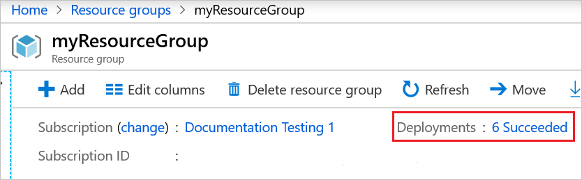
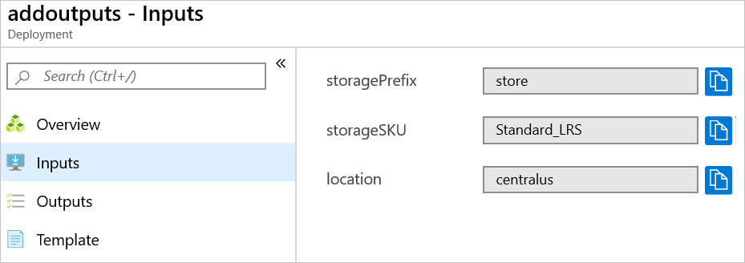
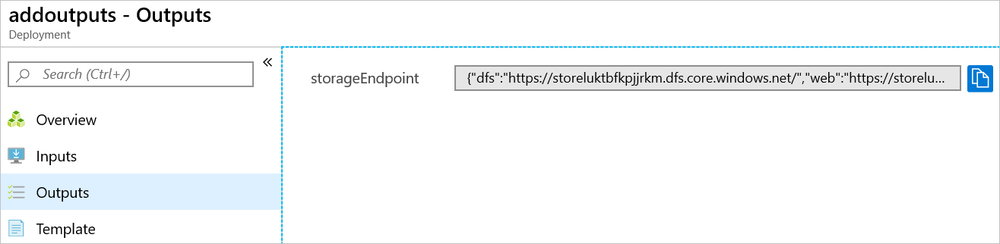
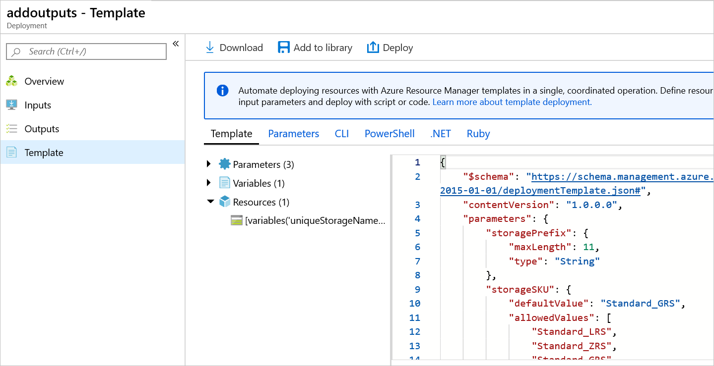

# Tutorial: Add outputs to your ARM template

In this tutorial, you learn how to return a value from your Azure Resource Manager (ARM) template. You use outputs when you need a value from a deployed resource. This tutorial takes **7 minutes** to complete.

## Prerequisites

We recommend that you complete the [tutorial about variables](template-tutorial-add-variables.md), but it's not required.

You must have Visual Studio Code with the Resource Manager Tools extension, and either Azure PowerShell or Azure CLI. For more information, see [template tools](template-tutorial-create-first-template.md#get-tools).

## Review template

At the end of the previous tutorial, your template had the following JSON:

:::code language="json" source="~/resourcemanager-templates/get-started-with-templates/add-variable/azuredeploy.json":::

It deploys a storage account, but it doesn't return any information about the storage account. You might need to capture properties from a new resource so they're available later for reference.

## Add outputs

You can use outputs to return values from the template. For example, it might be helpful to get the endpoints for your new storage account.

The following example highlights the change to your template to add an output value. Copy the whole file and replace your template with its contents.

:::code language="json" source="~/resourcemanager-templates/get-started-with-templates/add-outputs/azuredeploy.json" range="1-53" highlight="47-52":::

There are some important items to note about the output value you added.

The type of returned value is set to **object**, which means it returns a JSON object.

It uses the [reference](template-functions-resource.md#reference) function to get the runtime state of the storage account. To get the runtime state of a resource, you pass in the name or ID of a resource. In this case, you use the same variable you used to create the name of the storage account.

Finally, it returns the **primaryEndpoints** property from the storage account

## Deploy template

You're ready to deploy the template and look at the returned value.

If you haven't created the resource group, see [Create resource group](template-tutorial-create-first-template.md#create-resource-group). The example assumes you've set the **templateFile** variable to the path to the template file, as shown in the [first tutorial](template-tutorial-create-first-template.md#deploy-template).

# [PowerShell](#tab/azure-powershell)

```azurepowershell
New-AzResourceGroupDeployment `
  -Name addoutputs `
  -ResourceGroupName myResourceGroup `
  -TemplateFile $templateFile `
  -storagePrefix "store" `
  -storageSKU Standard_LRS
```

# [Azure CLI](#tab/azure-cli)

To run this deployment command, you must have the [latest version](/cli/azure/install-azure-cli) of Azure CLI.

```azurecli
az deployment group create \
  --name addoutputs \
  --resource-group myResourceGroup \
  --template-file $templateFile \
  --parameters storagePrefix=store storageSKU=Standard_LRS
```

---

In the output for the deployment command, you'll see an object similar to the following example only if the output is in JSON format:

```json
{
    "dfs": "https://storeluktbfkpjjrkm.dfs.core.windows.net/",
    "web": "https://storeluktbfkpjjrkm.z19.web.core.windows.net/",
    "blob": "https://storeluktbfkpjjrkm.blob.core.windows.net/",
    "queue": "https://storeluktbfkpjjrkm.queue.core.windows.net/",
    "table": "https://storeluktbfkpjjrkm.table.core.windows.net/",
    "file": "https://storeluktbfkpjjrkm.file.core.windows.net/"
}
```

> [!NOTE]
> If the deployment failed, use the **debug** switch with the deployment command to show the debug logs.  You can also use the **verbose** switch to show the full debug logs.

## Review your work

You've done a lot in the last six tutorials. Let's take a moment to review what you have done. You created a template with parameters that are easy to provide. The template is reusable in different environments because it allows for customization and dynamically creates needed values. It also returns information about the storage account that you could use in your script.

Now, let's look at the resource group and deployment history.

1. Sign in to the [Azure portal](https://portal.azure.com).
1. From the left menu, select **Resource groups**.
1. Select the resource group you deployed to.
1. Depending on the steps you did, you should have at least one and perhaps several storage accounts in the resource group.
1. You should also have several successful deployments listed in the history. Select that link.

   

1. You see all of your deployments in the history. Select the deployment called **addoutputs**.

   

1. You can review the inputs.

   

1. You can review the outputs.

   

1. You can review the template.

   

## Clean up resources

If you're moving on to the next tutorial, you don't need to delete the resource group.

If you're stopping now, you might want to clean up the resources you deployed by deleting the resource group.

1. From the Azure portal, select **Resource group** from the left menu.
2. Enter the resource group name in the **Filter by name** field.
3. Select the resource group name.
4. Select **Delete resource group** from the top menu.

## Next steps

In this tutorial, you added a return value to the template. In the next tutorial, you'll learn how to export a template and use parts of that exported template in your template.

> [!div class="nextstepaction"]
> [Use exported template](template-tutorial-export-template.md)
