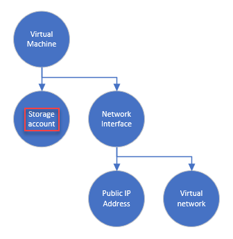
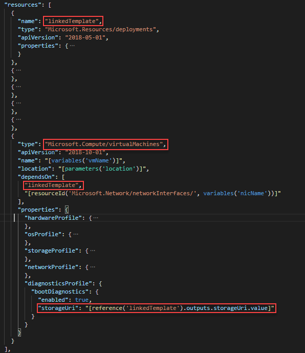

---
title: Create linked templates
description: Learn how to create linked Azure Resource Manager templates for creating virtual machine
author: mumian
ms.date: 12/03/2019
ms.topic: tutorial
ms.author: jgao
---

# Tutorial: Create linked Azure Resource Manager templates

Learn how to create linked Azure Resource Manager templates. Using linked templates, you can have one template call another template. It is great for modularizing templates. In this tutorial, you use the same template used in [Tutorial: Create Azure Resource Manager templates with dependent resources](./template-tutorial-create-templates-with-dependent-resources.md), which creates a virtual machine, a virtual network, and other dependent resource including a storage account. You separate the storage account resource creation to a linked template.

Calling a linked template is like making a function call.  You also learn how to pass parameter values to the linked template, and how to get "return values" from the linked template.

This tutorial covers the following tasks:

> [!div class="checklist"]
> * Open a QuickStart template
> * Create the linked template
> * Upload the linked template
> * Link to the linked template
> * Configure dependency
> * Deploy the template
> * Additional practices

For more information, see [Use linked and nested templates when deploying Azure resources](./linked-templates.md).

If you don't have an Azure subscription, [create a free account](https://azure.microsoft.com/free/) before you begin.

[!INCLUDE [updated-for-az](../../../includes/updated-for-az.md)]

## Prerequisites

To complete this article, you need:

* Visual Studio Code with Resource Manager Tools extension. See [Use Visual Studio Code to create Azure Resource Manager templates](use-vs-code-to-create-template.md).
* To increase security, use a generated password for the virtual machine administrator account. Here is a sample for generating a password:

    ```azurecli-interactive
    openssl rand -base64 32
    ```

    Azure Key Vault is designed to safeguard cryptographic keys and other secrets. For more information, see [Tutorial: Integrate Azure Key Vault in Resource Manager Template deployment](./template-tutorial-use-key-vault.md). We also recommend you to update your password every three months.

## Open a Quickstart template

Azure QuickStart Templates is a repository for Resource Manager templates. Instead of creating a template from scratch, you can find a sample template and customize it. The template used in this tutorial is called [Deploy a simple Windows VM](https://azure.microsoft.com/resources/templates/101-vm-simple-windows/). This is the same template used in [Tutorial: Create Azure Resource Manager templates with dependent resources](./template-tutorial-create-templates-with-dependent-resources.md). You save two copies of the same template to be used as:

* **The main template**: create all the resources except the storage account.
* **The linked template**: create the storage account.

1. From Visual Studio Code, select **File**>**Open File**.
1. In **File name**, paste the following URL:

    ```url
    https://raw.githubusercontent.com/Azure/azure-quickstart-templates/master/101-vm-simple-windows/azuredeploy.json
    ```

1. Select **Open** to open the file.
1. There are six resources defined by the template:

   * [`Microsoft.Storage/storageAccounts`](https://docs.microsoft.com/azure/templates/Microsoft.Storage/storageAccounts)
   * [`Microsoft.Network/publicIPAddresses`](https://docs.microsoft.com/azure/templates/microsoft.network/publicipaddresses)
   * [`Microsoft.Network/networkSecurityGroups`](https://docs.microsoft.com/azure/templates/microsoft.network/networksecuritygroups)
   * [`Microsoft.Network/virtualNetworks`](https://docs.microsoft.com/azure/templates/microsoft.network/virtualnetworks)
   * [`Microsoft.Network/networkInterfaces`](https://docs.microsoft.com/azure/templates/microsoft.network/networkinterfaces)
   * [`Microsoft.Compute/virtualMachines`](https://docs.microsoft.com/azure/templates/microsoft.compute/virtualmachines)

     It is helpful to get some basic understanding of the template schema before customizing the template.
1. Select **File**>**Save As** to save a copy of the file to your local computer with the name **azuredeploy.json**.
1. Select **File**>**Save As** to create another copy of the file with the name **linkedTemplate.json**.

## Create the linked template

The linked template creates a storage account. The linked template can be used as a standalone template to create a storage account. In this tutorial, the linked template takes two parameters, and passes a value back to the main template. This "return" value is defined in the `outputs` element.

1. Open **linkedTemplate.json** in Visual Studio Code if the file is not opened.
1. Make the following changes:

    * Remove all the parameters other than **location**.
    * Add a parameter called **storageAccountName**.

      ```json
      "storageAccountName":{
        "type": "string",
        "metadata": {
            "description": "Azure Storage account name."
        }
      },
      ```

      The storage account name and location are passed from the main template to the linked template as parameters.

    * Remove the **variables** element, and all the variable definitions.
    * Remove all the resources other than the storage account. You remove a total of four resources.
    * Update the value of the **name** element of the storage account resource to:

        ```json
          "name": "[parameters('storageAccountName')]",
        ```

    * Update the **outputs** element, so it looks like:

        ```json
        "outputs": {
          "storageUri": {
              "type": "string",
              "value": "[reference(parameters('storageAccountName')).primaryEndpoints.blob]"
            }
        }
        ```

       **storageUri** is required by the virtual machine resource definition in the main template.  You pass the value back to the main template as an output value.

        When you are done, the template shall look like:

        ```json
        {
          "$schema": "https://schema.management.azure.com/schemas/2015-01-01/deploymentTemplate.json#",
          "contentVersion": "1.0.0.0",
          "parameters": {
            "storageAccountName": {
              "type": "string",
              "metadata": {
                "description": "Azure Storage account name."
              }
            },
            "location": {
              "type": "string",
              "defaultValue": "[resourceGroup().location]",
              "metadata": {
                "description": "Location for all resources."
              }
            }
          },
          "resources": [
            {
              "type": "Microsoft.Storage/storageAccounts",
              "apiVersion": "2018-11-01",
              "name": "[parameters('storageAccountName')]",
              "location": "[parameters('location')]",
              "sku": {
                "name": "Standard_LRS"
              },
              "kind": "Storage",
              "properties": {}
            }
          ],
          "outputs": {
            "storageUri": {
              "type": "string",
              "value": "[reference(parameters('storageAccountName')).primaryEndpoints.blob]"
            }
          }
        }
        ```

1. Save the changes.

## Upload the linked template

The main template and the linked template need to be accessible from where you run the deployment. In this tutorial, you use the Cloud shell deployment method as you used in [Tutorial: Create Azure Resource Manager templates with dependent resources](./template-tutorial-create-templates-with-dependent-resources.md). The main template (azuredeploy.json) is uploaded to the shell. The linked template (linkedTemplate.json) must be shared somewhere securely. The following PowerShell script creates an Azure Storage account, uploads the template to the Storage account, and then generates a SAS token to grant limited access to the template file. To simplify the tutorial, the script downloads a completed linked template from a Github repository. If you want to use the linked template you created, you can use the [Cloud shell](https://shell.azure.com) to upload your linked template, and then modify the script to use your own linked template.

> [!NOTE]
> The script limits the SAS token to be used within eight hours. If you need more time to complete this tutorial, increase the expiry time.

```azurepowershell-interactive
$projectNamePrefix = Read-Host -Prompt "Enter a project name:"   # This name is used to generate names for Azure resources, such as storage account name.
$location = Read-Host -Prompt "Enter a location (i.e. centralus)"

$resourceGroupName = $projectNamePrefix + "rg"
$storageAccountName = $projectNamePrefix + "store"
$containerName = "linkedtemplates" # The name of the Blob container to be created.

$linkedTemplateURL = "https://raw.githubusercontent.com/Azure/azure-docs-json-samples/master/tutorial-linked-templates/linkedStorageAccount.json" # A completed linked template used in this tutorial.
$fileName = "linkedStorageAccount.json" # A file name used for downloading and uploading the linked template.

# Download the tutorial linked template
Invoke-WebRequest -Uri $linkedTemplateURL -OutFile "$home/$fileName"

# Create a resource group
New-AzResourceGroup -Name $resourceGroupName -Location $location

# Create a storage account
$storageAccount = New-AzStorageAccount `
    -ResourceGroupName $resourceGroupName `
    -Name $storageAccountName `
    -Location $location `
    -SkuName "Standard_LRS"

$context = $storageAccount.Context

# Create a container
New-AzStorageContainer -Name $containerName -Context $context

# Upload the linked template
Set-AzStorageBlobContent `
    -Container $containerName `
    -File "$home/$fileName" `
    -Blob $fileName `
    -Context $context

# Generate a SAS token
$templateURI = New-AzStorageBlobSASToken `
    -Context $context `
    -Container $containerName `
    -Blob $fileName `
    -Permission r `
    -ExpiryTime (Get-Date).AddHours(8.0) `
    -FullUri

Write-Host "You need the following values later in the tutorial:"
Write-Host "Resource Group Name: $resourceGroupName"
Write-Host "Linked template URI with SAS token: $templateURI"
Write-Host "Press [ENTER] to continue ..."
```

1. Select the **Try It** green button to open the Azure cloud shell pane.
2. Select **Copy** to copy the PowerShell script.
3. Right-click anywhere inside the shell pane (the navy blue part), and then select **Paste**.
4. Make a note of the two values (Resource Group Name and Linked template URI) at the end of the shell pane. You need the values later in the tutorial.
5. Select **Exit focus mode** to close the shell pane.

In practice, you generate a SAS token when you deploy the main template, and give the SAS token expiry a smaller window to make it more secure. For more information, see [Provide SAS token during deployment](./secure-template-with-sas-token.md#provide-sas-token-during-deployment).

## Call the linked template

The main template is called azuredeploy.json.

1. Open **azuredeploy.json** in Visual Studio Code if it is not opened.
1. Replace the storage account resource definition with the following json snippet:

    ```json
    {
      "name": "linkedTemplate",
      "type": "Microsoft.Resources/deployments",
      "apiVersion": "2018-05-01",
      "properties": {
          "mode": "Incremental",
          "templateLink": {
              "uri":""
          },
          "parameters": {
              "storageAccountName":{"value": "[variables('storageAccountName')]"},
              "location":{"value": "[parameters('location')]"}
          }
      }
    },
    ```

    Pay attention to these details:

    * A `Microsoft.Resources/deployments` resource in the main template is used to link to another template.
    * The `deployments` resource has a name called `linkedTemplate`. This name is used for [configuring dependency](#configure-dependency).
    * You can only use [Incremental](./deployment-modes.md) deployment mode when calling linked templates.
    * `templateLink/uri` contains the linked template URI. Update the value to the URI you get when you upload the linked template (the one with a SAS token).
    * Use `parameters` to pass values from the main template to the linked template.
1. Make sure you have updated the value of the `uri` element to the value you got when you upload the linked template (the one with a SAS token). In practice, you want to supply the URI with a parameter.
1. Save the revised template

## Configure dependency

Recall from [Tutorial: Create Azure Resource Manager templates with dependent resources](./template-tutorial-create-templates-with-dependent-resources.md), the virtual machine resource depends on the storage account:



Because the storage account is defined in the linked template now, you must update the following two elements of the `Microsoft.Compute/virtualMachines` resource.

* Reconfigure the `dependsOn` element. The storage account definition is moved to the linked template.
* Reconfigure the `properties/diagnosticsProfile/bootDiagnostics/storageUri` element. In [Create the linked template](#create-the-linked-template), you added an output value:

    ```json
    "outputs": {
        "storageUri": {
            "type": "string",
            "value": "[reference(parameters('storageAccountName')).primaryEndpoints.blob]"
            }
    }
    ```

    This value is required by the main template.

1. Open azuredeploy.json in Visual Studio Code if it is not opened.
2. Expand the virtual machine resource definition, update **dependsOn** as shown in the following screenshot:

    

    *linkedTemplate* is the name of the deployments resource.
3. Update **properties/diagnosticsProfile/bootDiagnostics/storageUri** as shown in the previous screenshot.
4. Save the revised template.

## Deploy the template

Refer to the [Deploy the template](./template-tutorial-create-templates-with-dependent-resources.md#deploy-the-template) section for the deployment procedure. Use the same resource group name as the storage account for storing the linked template. It makes it easier to clean up resources in the next section. To increase security, use a generated password for the virtual machine administrator account. See [Prerequisites](#prerequisites).

## Clean up resources

When the Azure resources are no longer needed, clean up the resources you deployed by deleting the resource group.

1. From the Azure portal, select **Resource group** from the left menu.
2. Enter the resource group name in the **Filter by name** field.
3. Select the resource group name.  You shall see a total of six resources in the resource group.
4. Select **Delete resource group** from the top menu.

## Additional practice

To improve the project, make the following additional changes to the completed project:

1. Modify the main template (azuredeploy.json) so that it takes the linked template URI value via a parameter.
2. Instead of generating a SAS token when you upload the linked template, generate the token when you deploy the main template. For more information, see [Provide SAS token during deployment](./secure-template-with-sas-token.md#provide-sas-token-during-deployment).

## Next steps

In this tutorial, you modularized a template into a main template and a linked template. To learn how to use virtual machine extensions to perform post deployment tasks, see:

> [!div class="nextstepaction"]
> [Deploy virtual machine extensions](./template-tutorial-deploy-vm-extensions.md)
