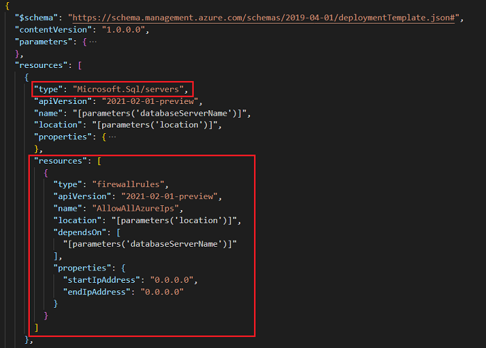
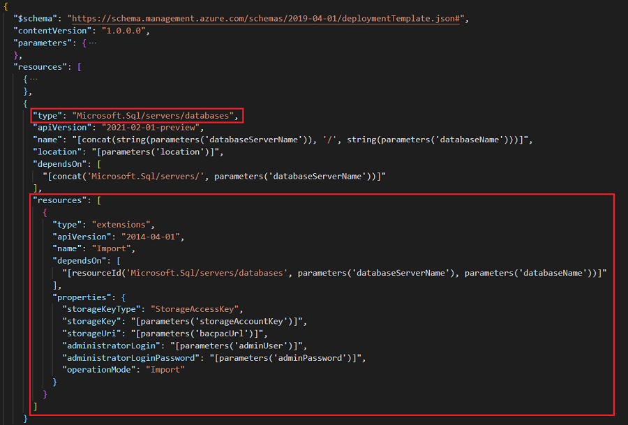
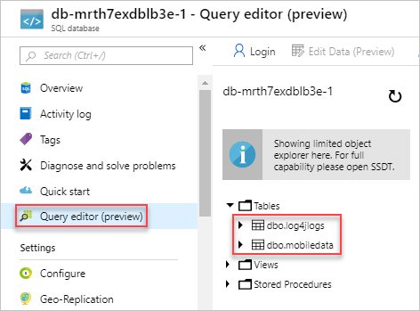

# Tutorial: Import SQL BACPAC files with ARM templates

Learn how to use Azure SQL Database extensions to import a BACPAC file with Azure Resource Manager (ARM) templates. Deployment artifacts are any files, in addition to the main template files, that are needed to complete a deployment. The BACPAC file is an artifact.

In this tutorial, you create a template to deploy a [logical SQL server](../../azure-sql/database/logical-servers.md) and a single database and import a BACPAC file. For information about how to deploy Azure virtual machine extensions by using ARM templates, see [Tutorial: Deploy virtual machine extensions with ARM templates](./template-tutorial-deploy-vm-extensions.md).

This tutorial covers the following tasks:

> [!div class="checklist"]
>
> * Prepare a BACPAC file.
> * Open a quickstart template.
> * Edit the template.
> * Deploy the template.
> * Verify the deployment.

If you don't have an Azure subscription, [create a free account](https://azure.microsoft.com/free/) before you begin.

## Prerequisites

To complete this article, you need:

* Visual Studio Code with the Resource Manager Tools extension. See [Use Visual Studio Code to create ARM templates](./use-vs-code-to-create-template.md).
* To increase security, use a generated password for the server administrator account. Here's a sample you can use to generate a password:

    ```console
    openssl rand -base64 32
    ```

    Azure Key Vault is designed to safeguard cryptographic keys and other secrets. For more information, see [Tutorial: Integrate Azure Key Vault in ARM template deployment](./template-tutorial-use-key-vault.md). We also recommend you to update your password every three months.

## Prepare a BACPAC file

A BACPAC file is shared in [GitHub](https://github.com/Azure/azure-docs-json-samples/raw/master/tutorial-sql-extension/SQLDatabaseExtension.bacpac). To create your own, see [Export an Azure SQL database to a BACPAC file](../../azure-sql/database/database-export.md). If you choose to publish the file to your own location, you must update the template later in the tutorial.

The BACPAC file must be stored in an Azure Storage account before it can be imported by using an ARM template. The following PowerShell script prepares the BACPAC file with these steps:

* Download the BACPAC file.
* Create an Azure Storage account.
* Create a storage account blob container.
* Upload the BACPAC file to the container.
* Display the storage account key and the blob URL.

1. Select **Try it** to open the cloud shell. Then paste the following PowerShell script into the shell window.

    ```azurepowershell-interactive
    $projectName = Read-Host -Prompt "Enter a project name that is used to generate Azure resource names"
    $location = Read-Host -Prompt "Enter the location (i.e. centralus)"

    $resourceGroupName = "${projectName}rg"
    $storageAccountName = "${projectName}store"
    $containerName = "bacpacfiles"
    $bacpacFileName = "SQLDatabaseExtension.bacpac"
    $bacpacUrl = "https://github.com/Azure/azure-docs-json-samples/raw/master/tutorial-sql-extension/SQLDatabaseExtension.bacpac"

    # Download the bacpac file
    Invoke-WebRequest -Uri $bacpacUrl -OutFile "$HOME/$bacpacFileName"

    # Create a resource group
    New-AzResourceGroup -Name $resourceGroupName -Location $location

    # Create a storage account
    $storageAccount = New-AzStorageAccount -ResourceGroupName $resourceGroupName `
                                           -Name $storageAccountName `
                                           -SkuName Standard_LRS `
                                           -Location $location
    $storageAccountKey = (Get-AzStorageAccountKey -ResourceGroupName $resourceGroupName `
                                                  -Name $storageAccountName).Value[0]

    # Create a container
    New-AzStorageContainer -Name $containerName -Context $storageAccount.Context

    # Upload the BACPAC file to the container
    Set-AzStorageBlobContent -File $HOME/$bacpacFileName `
                             -Container $containerName `
                             -Blob $bacpacFileName `
                             -Context $storageAccount.Context

    Write-Host "The storage account key is $storageAccountKey"
    Write-Host "The BACPAC file URL is https://$storageAccountName.blob.core.windows.net/$containerName/$bacpacFileName"
    Write-Host "Press [ENTER] to continue ..."
    ```

1. Write down the storage account key and the BACPAC file URL. You need these values when you deploy the template.

## Open a quickstart template

The template used in this tutorial is stored in [GitHub](https://raw.githubusercontent.com/Azure/azure-docs-json-samples/master/tutorial-sql-extension/azuredeploy.json).

1. From Visual Studio Code, select **File** > **Open File**.
1. In **File name**, paste the following URL:

    ```url
    https://raw.githubusercontent.com/Azure/azure-docs-json-samples/master/tutorial-sql-extension/azuredeploy.json
    ```

1. Select **Open** to open the file.

    There are two resources defined in the template:

   * `Microsoft.Sql/servers`. See the [template reference](https://docs.microsoft.com/azure/templates/microsoft.sql/servers).
   * `Microsoft.SQL.servers/databases`. See the [template reference](https://docs.microsoft.com/azure/templates/microsoft.sql/servers/databases).

        It's helpful to get some basic understanding of the template before you customize it.
1. Select **File** > **Save As** to save a copy of the file to your local computer with the name *azuredeploy.json*.

## Edit the template

1. Add two more parameters at the end of the **parameters** section to set the storage account key and the BACPAC URL.

    ```json
        "storageAccountKey": {
          "type":"string",
          "metadata":{
            "description": "Specifies the key of the storage account where the BACPAC file is stored."
          }
        },
        "bacpacUrl": {
          "type":"string",
          "metadata":{
            "description": "Specifies the URL of the BACPAC file."
          }
        }
    ```

    Add a comma after **adminPassword**. To format the JSON file from Visual Studio Code, select Shift+Alt+F.

    To get these two values, see [Prepare a BACPAC file](#prepare-a-bacpac-file).

1. Add two additional resources to the template.

    * To allow the SQL Database extension to import BACPAC files, you need to allow traffic from Azure services. Add the following firewall rule definition under the server definition:

        ```json
        "resources": [
          {
            "type": "firewallrules",
            "apiVersion": "2015-05-01-preview",
            "name": "AllowAllAzureIps",
            "location": "[parameters('location')]",
            "dependsOn": [
              "[parameters('databaseServerName')]"
            ],
            "properties": {
              "startIpAddress": "0.0.0.0",
              "endIpAddress": "0.0.0.0"
            }
          }
        ]
        ```

        The template looks like:

        

    * Add a SQL Database extension resource to the database definition with the following JSON:

        ```json
        "resources": [
          {
            "type": "extensions",
            "apiVersion": "2014-04-01",
            "name": "Import",
            "dependsOn": [
              "[resourceId('Microsoft.Sql/servers/databases', parameters('databaseServerName'), parameters('databaseName'))]"
            ],
            "properties": {
              "storageKeyType": "StorageAccessKey",
              "storageKey": "[parameters('storageAccountKey')]",
              "storageUri": "[parameters('bacpacUrl')]",
              "administratorLogin": "[parameters('adminUser')]",
              "administratorLoginPassword": "[parameters('adminPassword')]",
              "operationMode": "Import"
            }
          }
        ]
        ```

        The template looks like:

        

        To understand the resource definition, see the [SQL Database extension reference](https://docs.microsoft.com/azure/templates/microsoft.sql/servers/databases/extensions). The following are some important elements:

        * **dependsOn**: The extension resource must be created after the SQL database has been created.
        * **storageKeyType**: Specify the type of the storage key to use. The value can be either `StorageAccessKey` or `SharedAccessKey`. Use `StorageAccessKey` in this tutorial.
        * **storageKey**: Specify the key for the storage account where the BACPAC file is stored. If the storage key type is `SharedAccessKey`, it must be preceded with a "?".
        * **storageUri**: Specify the URL of the BACPAC file stored in a storage account.
        * **administratorLoginPassword**: The password of the SQL administrator. Use a generated password. See [Prerequisites](#prerequisites).

The completed template looks like:

[!code-json[](~/resourcemanager-templates/tutorial-sql-extension/azuredeploy2.json?range=1-106&highlight=38-49,62-76,86-103)]

## Deploy the template

[!INCLUDE [updated-for-az](../../../includes/updated-for-az.md)]

Refer to the [Deploy the template](./template-tutorial-create-templates-with-dependent-resources.md#deploy-the-template) section for the deployment procedure. Use the following PowerShell deployment script instead:

```azurepowershell-interactive
$projectName = Read-Host -Prompt "Enter the same project name that is used earlier"
$location = Read-Host -Prompt "Enter the location (i.e. centralus)"
$adminUsername = Read-Host -Prompt "Enter the SQL admin username"
$adminPassword = Read-Host -Prompt "Enter the admin password" -AsSecureString
$storageAccountKey = Read-Host -Prompt "Enter the storage account key"
$bacpacUrl = Read-Host -Prompt "Enter the URL of the BACPAC file"
$resourceGroupName = "${projectName}rg"

#New-AzResourceGroup -Name $resourceGroupName -Location $location
New-AzResourceGroupDeployment `
    -ResourceGroupName $resourceGroupName `
    -adminUser $adminUsername `
    -adminPassword $adminPassword `
    -TemplateFile "$HOME/azuredeploy.json" `
    -storageAccountKey $storageAccountKey `
    -bacpacUrl $bacpacUrl

Write-Host "Press [ENTER] to continue ..."
```

Consider using the same project name that you used when you prepared the BACPAC file so that all the resources are stored within the same resource group. In this way, it's easier to manage resource tasks, such as cleaning up the resources. If you use the same project name, you can either remove the `New-AzResourceGroup` command from the script or answer yes (y) or no (n) when you're asked whether you want to update the existing resource group.

Use a generated password. See [Prerequisites](#prerequisites).

## Verify the deployment

To access the server from your client computer, you need to add an additional firewall rule. For more information, see [Create and manage IP firewall rules](../../azure-sql/database/firewall-configure.md#create-and-manage-ip-firewall-rules).

In the Azure portal, select the SQL database from the newly deployed resource group. Select **Query editor (preview)**, and then enter the administrator credentials. You'll see two tables imported into the database.



## Clean up resources

When the Azure resources are no longer needed, clean up the resources you deployed by deleting the resource group.

1. In the Azure portal, select **Resource group** from the left menu.
1. Enter the resource group name in the **Filter by name** field.
1. Select the resource group name. You'll see a total of six resources in the resource group.
1. Select **Delete resource group** from the top menu.

## Next steps

In this tutorial, you deployed a server and a database and imported a BACPAC file. To learn how to troubleshoot template deployment, see:

> [!div class="nextstepaction"]
> [Troubleshoot ARM template deployments](./template-tutorial-troubleshoot.md)
