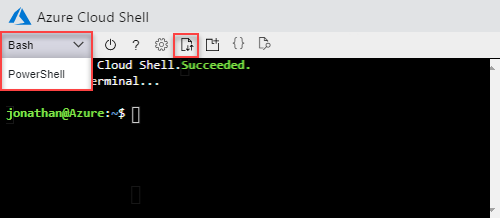
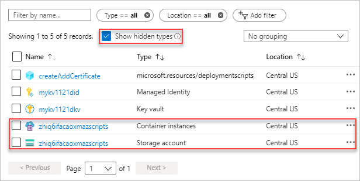

# Tutorial: Use deployment scripts to create a self-signed certificate (Preview)

Learn how to use deployment scripts in Azure Resource Manage (ARM) templates. Deployment scripts can be used to perform custom steps that can't be done by ARM templates. For example, creating a self-signed certificate.  In this tutorial, you create a template to deploy an Azure key vault, and then use a `Microsoft.Resources/deploymentScripts` resource in the same template to create a certificate and then add the certificate to the key vault. To learn more about deployment script, see [Use deployment scripts in ARM templates](./deployment-script-template.md).

> [!IMPORTANT]
> Two deployment script resources, a storage account and a container instance, are created in the same resource group for script execution and troubleshooting. These resources are usually deleted by the script service when the script execution gets in a terminal state. You are billed for the resources until the resources are deleted. To learn more, see [Clean up deployment script resources](./deployment-script-template.md#clean-up-deployment-script-resources).

This tutorial covers the following tasks:

> [!div class="checklist"]
> * Open a Quickstart template
> * Edit the template
> * Deploy the template
> * Debug the failed script
> * Clean up resources

## Prerequisites

To complete this article, you need:

* **[Visual Studio Code](https://code.visualstudio.com/) with the Resource Manager Tools extension**. See [Use Visual Studio Code to create ARM templates](./use-vs-code-to-create-template.md).

* **A user-assigned managed identity with the contributor's role at the subscription level**. This identity is used to execute deployment scripts. To create one, see [User-assigned managed identity](../../active-directory/managed-identities-azure-resources/qs-configure-portal-windows-vm.md#user-assigned-managed-identity). You need the identity ID when you deploy the template. The format of the identity is:

  ```json
  /subscriptions/<SubscriptionID>/resourcegroups/<ResourceGroupName>/providers/Microsoft.ManagedIdentity/userAssignedIdentities/<IdentityID>
  ```

  Use the following CLI script to get the ID by providing the resource group name and the identity name.

  ```azurecli-interactive
  echo "Enter the Resource Group name:" &&
  read resourceGroupName &&
  az identity list -g $resourceGroupName
  ```

## Open a Quickstart template

Instead of creating a template from scratch, you open a template from [Azure Quickstart Templates](https://azure.microsoft.com/resources/templates/). Azure Quickstart Templates is a repository for ARM templates.

The template used in this quickstart is called [Create an Azure Key Vault and a secret](https://azure.microsoft.com/resources/templates/101-key-vault-create/). The template creates a key vault, and then adds a secret to the key vault.

1. From Visual Studio Code, select **File**>**Open File**.
2. In **File name**, paste the following URL:

    ```url
    https://raw.githubusercontent.com/Azure/azure-quickstart-templates/master/101-key-vault-create/azuredeploy.json
    ```

3. Select **Open** to open the file.
4. Select **File**>**Save As** to save the file as **azuredeploy.json** to your local computer.

## Edit the template

Make the following changes to the template:

### Clean up the template (optional)

The original template adds a secret to the key vault.  To simplify the tutorial, remove the following resource:

* **Microsoft.KeyVault/vaults/secrets**

Remove the following two parameter definitions:

* **secretName**
* **secretValue**

If you choose not to remove these definitions, you need to specify the parameter values during the deployment.

### Configure the key vault access policies

The deployment script adds a certificate to the key vault. Configure the key vault access policies to give the permission to the managed identity:

1. Add a parameter to get the managed identity ID:

    ```json
    "identityId": {
      "type": "string",
      "metadata": {
        "description": "Specifies the ID of the user-assigned managed identity."
      }
    },
    ```

    > [!NOTE]
    > The Resource Manager template extension of Visual Studio Code is not capable to format deployment scripts yet. Don't use [SHIFT]+[ALT]+F to format the deploymentScripts resources, like the following one.

1. Add a parameter for configuring the key vault access policies so that the managed identity can add certificates to the key vault.

    ```json
    "certificatesPermissions": {
      "type": "array",
      "defaultValue": [
        "get",
        "list",
        "update",
        "create"
      ],
      "metadata": {
      "description": "Specifies the permissions to certificates in the vault. Valid values are: all, get, list, update, create, import, delete, recover, backup, restore, manage contacts, manage certificate authorities, get certificate authorities, list certificate authorities, set certificate authorities, delete certificate authorities."
      }
    }
    ```

1. Update the existing key vault access policies to:

    ```json
    "accessPolicies": [
      {
        "objectId": "[parameters('objectId')]",
        "tenantId": "[parameters('tenantId')]",
        "permissions": {
          "keys": "[parameters('keysPermissions')]",
          "secrets": "[parameters('secretsPermissions')]",
          "certificates": "[parameters('certificatesPermissions')]"
        }
      },
      {
        "objectId": "[reference(parameters('identityId'), '2018-11-30').principalId]",
        "tenantId": "[parameters('tenantId')]",
        "permissions": {
          "keys": "[parameters('keysPermissions')]",
          "secrets": "[parameters('secretsPermissions')]",
          "certificates": "[parameters('certificatesPermissions')]"
        }
      }
    ],
    ```

    There are two policies defined, one for the signed-in user, and the other is for the managed identity.  The signed-in user only needs the *list* permission to verify the deployment.  To simplify the tutorial, the same certificate is assigned to both the managed identity and the signed-in users.

### Add the deployment script

1. Add three parameters that are used by the deployment script.

    ```json
    "certificateName": {
      "type": "string",
      "defaultValue": "DeploymentScripts2019"
    },
    "subjectName": {
      "type": "string",
      "defaultValue": "CN=contoso.com"
    },
    "utcValue": {
      "type": "string",
      "defaultValue": "[utcNow()]"
    }
    ```

1. Add a deploymentScripts resource:

    > [!NOTE]
    > Because the inline deployment scripts are enclosed in double quotes, the strings inside the deployment scripts need to be enclosed in single quotes instead. The escape character for PowerShell is **&#92;**.

    ```json
    {
      "type": "Microsoft.Resources/deploymentScripts",
      "apiVersion": "2019-10-01-preview",
      "name": "createAddCertificate",
      "location": "[resourceGroup().location]",
      "dependsOn": [
        "[resourceId('Microsoft.KeyVault/vaults', parameters('keyVaultName'))]"
      ],
      "identity": {
        "type": "UserAssigned",
        "userAssignedIdentities": {
          "[parameters('identityId')]": {
          }
        }
      },
      "kind": "AzurePowerShell",
      "properties": {
        "forceUpdateTag": "[parameters('utcValue')]",
        "azPowerShellVersion": "3.0",
        "timeout": "PT30M",
        "arguments": "[format(' -vaultName {0} -certificateName {1} -subjectName {2}', parameters('keyVaultName'), parameters('certificateName'), parameters('subjectName'))]", // can pass an argument string, double quotes must be escaped
        "scriptContent": "
          param(
            [string] [Parameter(Mandatory=$true)] $vaultName,
            [string] [Parameter(Mandatory=$true)] $certificateName,
            [string] [Parameter(Mandatory=$true)] $subjectName
          )

          $ErrorActionPreference = 'Stop'
          $DeploymentScriptOutputs = @{}

          $existingCert = Get-AzKeyVaultCertificate -VaultName $vaultName -Name $certificateName

          if ($existingCert -and $existingCert.Certificate.Subject -eq $subjectName) {

            Write-Host 'Certificate $certificateName in vault $vaultName is already present.'

            $DeploymentScriptOutputs['certThumbprint'] = $existingCert.Thumbprint
            $existingCert | Out-String
          }
          else {
            $policy = New-AzKeyVaultCertificatePolicy -SubjectName $subjectName -IssuerName Self -ValidityInMonths 12 -Verbose

            # private key is added as a secret that can be retrieved in the Resource Manager template
            Add-AzKeyVaultCertificate -VaultName $vaultName -Name $certificateName -CertificatePolicy $policy -Verbose

            $newCert = Get-AzKeyVaultCertificate -VaultName $vaultName -Name $certificateName

            # it takes a few seconds for KeyVault to finish
            $tries = 0
            do {
              Write-Host 'Waiting for certificate creation completion...'
              Start-Sleep -Seconds 10
              $operation = Get-AzKeyVaultCertificateOperation -VaultName $vaultName -Name $certificateName
              $tries++

              if ($operation.Status -eq 'failed')
              {
                throw 'Creating certificate $certificateName in vault $vaultName failed with error $($operation.ErrorMessage)'
              }

              if ($tries -gt 120)
              {
                throw 'Timed out waiting for creation of certificate $certificateName in vault $vaultName'
              }
            } while ($operation.Status -ne 'completed')

            $DeploymentScriptOutputs['certThumbprint'] = $newCert.Thumbprint
            $newCert | Out-String
          }
        ",
        "cleanupPreference": "OnSuccess",
        "retentionInterval": "P1D"
      }
    }
    ```

    The `deploymentScripts` resource depends on the key vault resource and the role assignment resource.  It has these properties:

    * **identity**: Deployment script uses a user-assigned managed identity to execute the scripts.
    * **kind**: Specify the type of script. Currently, only PowerShell script is support.
    * **forceUpdateTag**: Determine whether the deployment script should be executed even if the script source has not changed. Can be current time stamp or a GUID. To learn more, see [Run script more than once](./deployment-script-template.md#run-script-more-than-once).
    * **azPowerShellVersion**: Specifies the Azure PowerShell module version to be used. Currently, deployment script supports version 2.7.0, 2.8.0, and 3.0.0.
    * **timeout**: Specify the maximum allowed script execution time specified in the [ISO 8601 format](https://en.wikipedia.org/wiki/ISO_8601). Default value is **P1D**.
    * **arguments**: Specify the parameter values. The values are separated by spaces.
    * **scriptContent**: Specify the script content. To run an external script, use **primaryScriptURI** instead. For more information, see [Use external script](./deployment-script-template.md#use-external-scripts).
        Declaring **$DeploymentScriptOutputs** is only required when testing the script on a local machine. Declaring the variable allows the script to be run on a local machine and in a deploymentScript resource without having to make changes. The value assigned to $DeploymentScriptOutputs is available as outputs in the deployments. For more information, see [Work with outputs from PowerShell deployment scripts](./deployment-script-template.md#work-with-outputs-from-powershell-script) or [Work with outputs from CLI deployment scripts](./deployment-script-template.md#work-with-outputs-from-cli-script).
    * **cleanupPreference**: Specify the preference on when to delete the deployment script resources.  The default value is **Always**, which means the deployment script resources are deleted despite the terminal state (Succeeded, Failed, canceled). In this tutorial, **OnSuccess** is used so that you get a chance to view the script execution results.
    * **retentionInterval**: Specify the interval for which the service retains the script resources after it reaches a terminal state. Resources will be deleted when this duration expires. Duration is based on ISO 8601 pattern. This tutorial uses P1D, which means one day.  This property is used when **cleanupPreference** is set to **OnExpiration**. This property is not enabled currently.

    The deployment script takes three parameters: key vault name, certificate name, and subject name.  It creates a certificate, and then adds the certificate to the key vault.

    **$DeploymentScriptOutputs** is used to store output value.  To learn more, see [Work with outputs from PowerShell deployment scripts](./deployment-script-template.md#work-with-outputs-from-powershell-script) or [Work with outputs from CLI deployment scripts](./deployment-script-template.md#work-with-outputs-from-cli-script).

    The completed template can be found [here](https://raw.githubusercontent.com/Azure/azure-docs-json-samples/master/deployment-script/deploymentscript-keyvault.json).

1. To see the debugging process, place an error in the code by adding the following line to the deployment script:

    ```powershell
    Write-Output1 $keyVaultName
    ```

    The correct command is **Write-Output** instead of **Write-Output1**.

1. Select **File**>**Save** to save the file.

## Deploy the template

1. Sign in to the [Azure Cloud Shell](https://shell.azure.com)

1. Choose your preferred environment by selecting either **PowerShell** or **Bash** (for CLI) on the upper left corner.  Restarting the shell is required when you switch.

    

1. Select **Upload/download files**, and then select **Upload**. See the previous screenshot.  Select the file you saved in the previous section. After uploading the file, you can use the **ls** command and the **cat** command to verify the file is uploaded successfully.

1. Run the following PowerShell script to deploy the template.

    ```azurepowershell-interactive
    $projectName = Read-Host -Prompt "Enter a project name that is used to generate resource names"
    $location = Read-Host -Prompt "Enter the location (i.e. centralus)"
    $upn = Read-Host -Prompt "Enter your email address used to sign in to Azure"
    $identityId = Read-Host -Prompt "Enter the user-assigned managed identity ID"

    $adUserId = (Get-AzADUser -UserPrincipalName $upn).Id
    $resourceGroupName = "${projectName}rg"
    $keyVaultName = "${projectName}kv"

    New-AzResourceGroup -Name $resourceGroupName -Location $location

    New-AzResourceGroupDeployment -ResourceGroupName $resourceGroupName -TemplateFile "$HOME/azuredeploy.json" -identityId $identityId -keyVaultName $keyVaultName -objectId $adUserId

    Write-Host "Press [ENTER] to continue ..."
    ```

    The deployment script service needs to create additional deployment script resources for script execution. The preparation and the cleanup process can take up to one minute to complete in addition to the actual script execution time.

    The deployment is failed because of the invalid command, **Write-Output1** is used in the script. You shall get an error saying:

    ```error
    The term 'Write-Output1' is not recognized as the name of a cmdlet, function, script file, or operable
    program.\nCheck the spelling of the name, or if a path was included, verify that the path is correct and try again.\n
    ```

    The deployment script execution result is stored in the deployment script resources for the troubleshooting purpose.

## Debug the failed script

1. Sign in to the [Azure portal](https://portal.azure.com).
1. Open the resource group. It is the project name with **rg** appended. You shall see two additional resources in the resource group. These resources are referred as *deployment script resources*.

    

    Both files have the **azscripts** suffix. One is a storage account and the other is a container instance.

    Select **Show hidden types** to list the deploymentScripts resource.

1. Select the storage account with the **azscripts** suffix.
1. Select the **File shares** tile. You shall see an **azscripts** folder.  The folder contains the deployment script execution files.
1. Select **azscripts**. You shall see two foldersL **azscriptinput** and **azscriptoutput**.  The input folder contains a system PowerShell script file and the user deployment script files. The output folder contains a **executionresult.json** and the script output file. You can see the error message in **executionresult.json**. The output file is not there because the execution failed.

Remove the **Write-Output1** line and redeploy the template.

When the second deployment run successfully, the deployment script resources shall be removed by the script service, because the **cleanupPreference** property is set to **OnSuccess**.

## Clean up resources

When the Azure resources are no longer needed, clean up the resources you deployed by deleting the resource group.

1. From the Azure portal, select **Resource group** from the left menu.
2. Enter the resource group name in the **Filter by name** field.
3. Select the resource group name.  You shall see a total of six resources in the resource group.
4. Select **Delete resource group** from the top menu.

## Next steps

In this tutorial, you learned how to use deployment script in ARM templates. To learn how to deploy Azure resources based on conditions, see:

> [!div class="nextstepaction"]
> [Use conditions](./template-tutorial-use-conditions.md)
