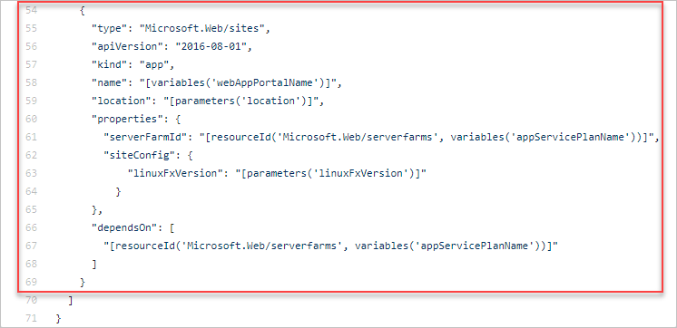

# Tutorial: Use Azure Quickstart templates

[Azure Quickstart templates](https://azure.microsoft.com/resources/templates/) is a repository of community contributed templates. You can use the sample templates in your template development. In this tutorial, you find a website resource definition, and add it to your own template. It takes about **12 minutes** to complete.

## Prerequisites

We recommend that you complete the [tutorial about exported templates](template-tutorial-export-template.md), but it's not required.

You must have Visual Studio Code with the Resource Manager Tools extension, and either Azure PowerShell or Azure CLI. For more information, see [template tools](template-tutorial-create-first-template.md#get-tools).

## Review template

At the end of the previous tutorial, your template had the following JSON:

:::code language="json" source="~/resourcemanager-templates/get-started-with-templates/export-template/azuredeploy.json":::

This template works for deploying storage accounts and app service plans, but you might want to add a website to it. You can use pre-built templates to quickly discover the JSON required for deploying a resource.

## Find template

1. Open [Azure Quickstart templates](https://azure.microsoft.com/resources/templates/)
1. In **Search**, enter **deploy linux web app**.
1. Select the one with the title **Deploy a basic Linux web app**. If you have trouble finding it, here's the [direct link](https://azure.microsoft.com/resources/templates/101-webapp-basic-linux/).
1. Select **Browse on GitHub**.
1. Select **azuredeploy.json**.
1. Review the template. In particular, look for the `Microsoft.Web/sites` resource.

    

## Revise existing template

Merge the quickstart template with the existing template:

:::code language="json" source="~/resourcemanager-templates/get-started-with-templates/quickstart-template/azuredeploy.json" range="1-108" highlight="32-45,49,85-100":::

The web app name needs to be unique across Azure. To prevent having duplicate names, the **webAppPortalName** variable has been updated from **"webAppPortalName": "[concat(parameters('webAppName'), '-webapp')]"** to **"webAppPortalName": "[concat(parameters('webAppName'), uniqueString(resourceGroup().id))]"**.

Add a comma at the end of the `Microsoft.Web/serverfarms` definition to separate the resource definition from the `Microsoft.Web/sites` definition.

There are a couple of important features to note in this new resource.

You'll notice it has an element named **dependsOn** that is set to the app service plan. This setting is required because the app service plan must exist before the web app is created. The **dependsOn** element tells Resource Manager how to order the resources for deployment.

The **serverFarmId** property uses the [resourceId](template-functions-resource.md#resourceid) function. This function gets the unique identifier for a resource. In this case, it gets the unique identifier for the app service plan. The web app is associated with one specific app service plan.

## Deploy template

Use either Azure CLI or Azure PowerShell to deploy a template.

If you haven't created the resource group, see [Create resource group](template-tutorial-create-first-template.md#create-resource-group). The example assumes you've set the **templateFile** variable to the path to the template file, as shown in the [first tutorial](template-tutorial-create-first-template.md#deploy-template).

# [PowerShell](#tab/azure-powershell)

```azurepowershell
New-AzResourceGroupDeployment `
  -Name addwebapp `
  -ResourceGroupName myResourceGroup `
  -TemplateFile $templateFile `
  -storagePrefix "store" `
  -storageSKU Standard_LRS `
  -webAppName demoapp
```

# [Azure CLI](#tab/azure-cli)

To run this deployment command, you must have the [latest version](/cli/azure/install-azure-cli) of Azure CLI.

```azurecli
az deployment group create \
  --name addwebapp \
  --resource-group myResourceGroup \
  --template-file $templateFile \
  --parameters storagePrefix=store storageSKU=Standard_LRS webAppName=demoapp
```

---

> [!NOTE]
> If the deployment failed, use the **debug** switch with the deployment command to show the debug logs.  You can also use the **verbose** switch to show the full debug logs.

## Clean up resources

If you're moving on to the next tutorial, you don't need to delete the resource group.

If you're stopping now, you might want to clean up the resources you deployed by deleting the resource group.

1. From the Azure portal, select **Resource group** from the left menu.
2. Enter the resource group name in the **Filter by name** field.
3. Select the resource group name.
4. Select **Delete resource group** from the top menu.

## Next steps

You learned how to use a quickstart template for your template development. In the next tutorial, you add tags to the resources.

> [!div class="nextstepaction"]
> [Add tags](template-tutorial-add-tags.md)
