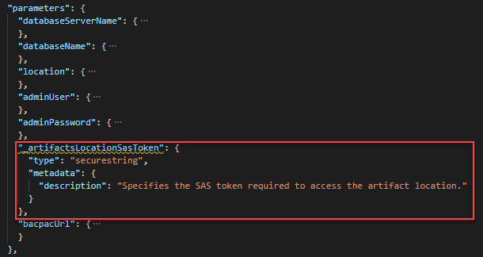

---
title: Secure artifacts in templates
description: Learn how to secure the artifacts used in your Azure Resource Manager templates.
author: mumian
ms.date: 12/09/2019
ms.topic: tutorial
ms.author: jgao
---

# Tutorial: Secure artifacts in ARM template deployments

Learn how to secure the artifacts used in your Azure Resource Manager (ARM) templates by using an Azure Storage account with shared access signatures (SAS). Deployment artifacts are any files, in addition to the main template file, that are needed to complete a deployment. For example, in [Tutorial: Import SQL BACPAC files with ARM templates](./template-tutorial-deploy-sql-extensions-bacpac.md), the main template creates an Azure SQL Database instance. It also calls a BACPAC file to create tables and insert data. The BACPAC file is an artifact and is stored in an Azure Storage account. A storage account key was used to access the artifact.

In this tutorial, you use SAS to grant limited access to the BACPAC file in your own Azure Storage account. For more information about SAS, see [Using shared access signatures (SAS)](../../storage/common/storage-dotnet-shared-access-signature-part-1.md).

To learn how to secure a linked template, see [Tutorial: Create linked ARM templates](./template-tutorial-create-linked-templates.md).

This tutorial covers the following tasks:

> [!div class="checklist"]
> * Prepare a BACPAC file.
> * Open an existing template.
> * Edit the template.
> * Deploy the template.
> * Verify the deployment.

If you don't have an Azure subscription, [create a free account](https://azure.microsoft.com/free/) before you begin.

## Prerequisites

To complete this article, you need:

* Visual Studio Code with a Resource Manager Tools extension. See [Use Visual Studio Code to create ARM templates](./use-vs-code-to-create-template.md).
* Review [Tutorial: Import SQL BACPAC files with ARM templates](./template-tutorial-deploy-sql-extensions-bacpac.md). The template used in this tutorial is the one developed in that tutorial. A download link of the completed template is provided in this article.
* To increase security, use a generated password for the SQL Server administrator account. Here's a sample you can use to generate a password:

    ```console
    openssl rand -base64 32
    ```

    Azure Key Vault is designed to safeguard cryptographic keys and other secrets. For more information, see [Tutorial: Integrate Azure Key Vault in ARM template deployment](./template-tutorial-use-key-vault.md). We also recommend you to update your password every three months.

## Prepare a BACPAC file

In this section, you prepare the BACPAC file so that the file is accessible securely when you deploy the ARM template. There are five procedures in this section:

* Download the BACPAC file.
* Create an Azure Storage account.
* Create a storage account blob container.
* Upload the BACPAC file to the container.
* Retrieve the SAS token of the BACPAC file.

1. Select **Try it** to open the cloud shell. Then paste the following PowerShell script into the shell window.

    ```azurepowershell-interactive
    $projectName = Read-Host -Prompt "Enter a project name"   # This name is used to generate names for Azure resources, such as storage account name.
    $location = Read-Host -Prompt "Enter a location (i.e. centralus)"

    $resourceGroupName = $projectName + "rg"
    $storageAccountName = $projectName + "store"
    $containerName = "bacpacfile" # The name of the Blob container to be created.

    $bacpacURL = "https://github.com/Azure/azure-docs-json-samples/raw/master/tutorial-sql-extension/SQLDatabaseExtension.bacpac"
    $bacpacFileName = "SQLDatabaseExtension.bacpac" # A file name used for downloading and uploading the BACPAC file.

    # Download the bacpac file
    Invoke-WebRequest -Uri $bacpacURL -OutFile "$home/$bacpacFileName"

    # Create a resource group
    New-AzResourceGroup -Name $resourceGroupName -Location $location

    # Create a storage account
    $storageAccount = New-AzStorageAccount `
        -ResourceGroupName $resourceGroupName `
        -Name $storageAccountName `
        -Location $location `
        -SkuName "Standard_LRS"

    $context = $storageAccount.Context

    # Create a container
    New-AzStorageContainer -Name $containerName -Context $context

    # Upload the bacpac file
    Set-AzStorageBlobContent `
        -Container $containerName `
        -File "$home/$bacpacFileName" `
        -Blob $bacpacFileName `
        -Context $context

    # Generate a SAS token
    $bacpacURI = New-AzStorageBlobSASToken `
        -Context $context `
        -Container $containerName `
        -Blob $bacpacFileName `
        -Permission r `
        -ExpiryTime (Get-Date).AddHours(8.0) `
        -FullUri

    $str = $bacpacURI.split("?")

    Write-Host "You need the blob url and the SAS token later in the tutorial:"
    Write-Host $str[0]
    Write-Host (-join ("?", $str[1]))

    Write-Host "Press [ENTER] to continue ..."
    ```

1. Write down the BACPAC file URL and the SAS token. You need these values when you deploy the template.

## Open an existing template

In this session, you modify the template you created in [Tutorial: Import SQL BACPAC files with ARM templates](./template-tutorial-deploy-sql-extensions-bacpac.md) to call the BACPAC file with an SAS token. The template developed in the SQL extension tutorial is shared in [GitHub](https://raw.githubusercontent.com/Azure/azure-docs-json-samples/master/tutorial-sql-extension/azuredeploy.json).

1. From Visual Studio Code, select **File** > **Open File**.
1. In **File name**, paste the following URL:

    ```url
    https://raw.githubusercontent.com/Azure/azure-docs-json-samples/master/tutorial-sql-extension/azuredeploy2.json
    ```

1. Select **Open** to open the file.

    There are four resources defined in the template:

   * `Microsoft.Sql/servers`. See the [template reference](https://docs.microsoft.com/azure/templates/microsoft.sql/2015-05-01-preview/servers).
   * `Microsoft.SQL/servers/firewallRules`. See the [template reference](https://docs.microsoft.com/azure/templates/microsoft.sql/2015-05-01-preview/servers/firewallrules).
   * `Microsoft.SQL/servers/databases`. See the [template reference](https://docs.microsoft.com/azure/templates/microsoft.sql/servers/databases).
   * `Microsoft.SQL/server/databases/extensions`. See the [template reference](https://docs.microsoft.com/azure/templates/microsoft.sql/2014-04-01/servers/databases/extensions).

        It's helpful to get some basic understanding of the template before you customize it.
1. Select **File** > **Save As** to save a copy of the file to your local computer with the name *azuredeploy.json*.

## Edit the template

1. Replace the storageAccountKey parameter definition with the following parameter definition:

    ```json
        "_artifactsLocationSasToken": {
          "type": "securestring",
          "metadata": {
            "description": "Specifies the SAS token required to access the artifact location."
          }
        },
    ```

    

1. Update the value of the following three elements of the SQL extension resource:

    ```json
    "storageKeyType": "SharedAccessKey",
    "storageKey": "[parameters('_artifactsLocationSasToken')]",
    "storageUri": "[parameters('bacpacUrl')]",
    ```

The completed template looks like:

[!code-json[](~/resourcemanager-templates/tutorial-sql-extension/azuredeploy3.json?range=1-106&highlight=38-43,95-97)]

## Deploy the template

[!INCLUDE [updated-for-az](../../../includes/updated-for-az.md)]

See the [Deploy the template](./template-tutorial-create-multiple-instances.md#deploy-the-template) section for the deployment procedure. Use the following PowerShell deployment script instead.

```azurepowershell
$projectName = Read-Host -Prompt "Enter the project name that is used earlier"   # This name is used to generate names for Azure resources, such as storage account name.
$location = Read-Host -Prompt "Enter a location (i.e. centralus)"
$adminUsername = Read-Host -Prompt "Enter the sql database admin username"
$adminPassword = Read-Host -Prompt "Enter the admin password" -AsSecureString
$bacpacUrl = Read-Host -Prompt "Enter the BACPAC url"
$artifactsLocationSasToken = Read-Host -Prompt "Enter the artifacts location SAS token" -AsSecureString

$resourceGroupName = $projectName + "rg"

#New-AzResourceGroup -Name $resourceGroupName -Location $location
New-AzResourceGroupDeployment `
    -ResourceGroupName $resourceGroupName `
    -adminUser $adminUsername `
    -adminPassword $adminPassword `
    -_artifactsLocationSasToken $artifactsLocationSasToken `
    -bacpacUrl $bacpacUrl `
    -TemplateFile "$HOME/azuredeploy.json"

Write-Host "Press [ENTER] to continue ..."
```

Use a generated password. See [Prerequisites](#prerequisites).
For the values of _artifactsLocation, _artifactsLocationSasToken, and bacpacFileName, see [Prepare a BACPAC file](#prepare-a-bacpac-file).

## Verify the deployment

In the portal, select the SQL database from the newly deployed resource group. Select **Query editor (preview)**, and then enter the administrator credentials. You'll see two tables imported into the database.


## Clean up resources

When the Azure resources are no longer needed, clean up the resources you deployed by deleting the resource group.

1. In the Azure portal, select **Resource group** from the left menu.
2. Enter the resource group name in the **Filter by name** field.
3. Select the resource group name. You'll see a total of six resources in the resource group.
4. Select **Delete resource group** from the top menu.

## Next steps

In this tutorial, you deployed a SQL server and a SQL database and imported a BACPAC file by using an SAS token. To learn how to deploy Azure resources across multiple regions, and how to use safe deployment practices, see

> [!div class="nextstepaction"]
> [Use safe deployment practices](./deployment-manager-tutorial.md)
