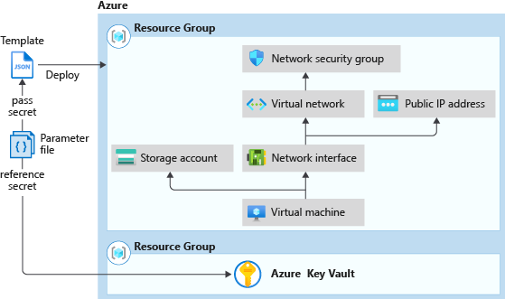
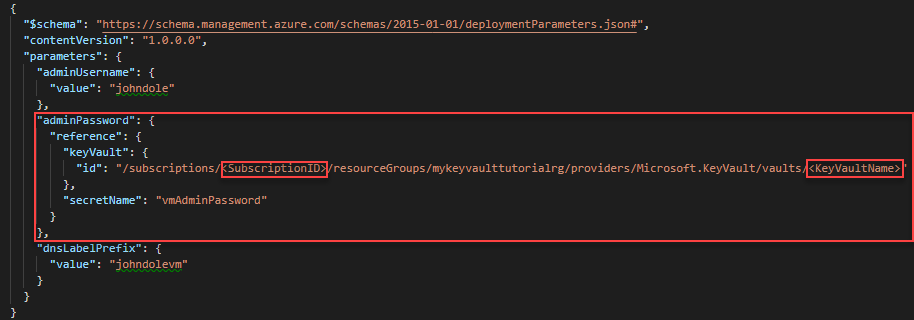

# Tutorial: Integrate Azure Key Vault in your ARM template deployment

Learn how to retrieve secrets from an Azure key vault and pass the secrets as parameters when you deploy an Azure Resource Manager template (ARM template). The parameter value is never exposed, because you reference only its key vault ID. You can reference the key vault secret by using a static ID or a dynamic ID. This tutorial uses a static ID. With the static ID approach, you reference the key vault in the template parameter file, not the template file. For more information about both approaches, see [Use Azure Key Vault to pass secure parameter value during deployment](./key-vault-parameter.md).

In the [Set resource deployment order](./template-tutorial-create-templates-with-dependent-resources.md) tutorial, you create a virtual machine (VM). You need to provide the VM administrator username and password. Instead of providing the password, you can pre-store the password in an Azure key vault and then customize the template to retrieve the password from the key vault during the deployment.



This tutorial covers the following tasks:

> [!div class="checklist"]
> * Prepare a key vault
> * Open a quickstart template
> * Edit the parameters file
> * Deploy the template
> * Validate the deployment
> * Clean up resources

If you don't have an Azure subscription, [create a free account](https://azure.microsoft.com/free/) before you begin.

For a Learn module that uses a secure value from a key vault, see [Manage complex cloud deployments by using advanced ARM template features](/training/modules/manage-deployments-advanced-arm-template-features/).

## Prerequisites

To complete this article, you need:

* Visual Studio Code with Resource Manager Tools extension. See [Quickstart: Create ARM templates with Visual Studio Code](quickstart-create-templates-use-visual-studio-code.md).
* To increase security, use a generated password for the VM administrator account. You can use [Azure Cloud Shell](../../cloud-shell/overview.md) to run the following command in PowerShell or Bash:

    ```shell
    openssl rand -base64 32
    ```

    To learn more, run `man openssl rand` to open the manual page.

    Verify that the generated password meets the VM password requirements. Each Azure service has specific password requirements. For the VM password requirements, see [What are the password requirements when you create a VM?](../../virtual-machines/windows/faq.yml#what-are-the-password-requirements-when-creating-a-vm-).

## Prepare a key vault

In this section, you create a key vault and add a secret to it, so that you can retrieve the secret when you deploy your template. There are many ways to create a key vault. In this tutorial, you use Azure PowerShell to deploy an [ARM template](https://raw.githubusercontent.com/Azure/azure-docs-json-samples/master/tutorials-use-key-vault/CreateKeyVault.json). This template does two things:

* Creates a key vault with the `enabledForTemplateDeployment` property enabled. This property must be *true* before the template deployment process can access the secrets that are defined in the key vault.
* Adds a secret to the key vault. The secret stores the VM administrator password.

> [!NOTE]
> As the user who's deploying the virtual machine template, if you're not the Owner of or a Contributor to the key vault, the Owner or a Contributor must grant you access to the `Microsoft.KeyVault/vaults/deploy/action` permission for the key vault. For more information, see [Use Azure Key Vault to pass a secure parameter value during deployment](./key-vault-parameter.md).

To run the following Azure PowerShell script, select **Try it** to open Cloud Shell. To paste the script, right-click the shell pane, and then select **Paste**.

```azurepowershell-interactive
$projectName = Read-Host -Prompt "Enter a project name that is used for generating resource names"
$location = Read-Host -Prompt "Enter the location (i.e. centralus)"
$upn = Read-Host -Prompt "Enter your user principal name (email address) used to sign in to Azure"
$secretValue = Read-Host -Prompt "Enter the virtual machine administrator password" -AsSecureString

$resourceGroupName = "${projectName}rg"
$keyVaultName = $projectName
$adUserId = (Get-AzADUser -UserPrincipalName $upn).Id
$templateUri = "https://raw.githubusercontent.com/Azure/azure-docs-json-samples/master/tutorials-use-key-vault/CreateKeyVault.json"

New-AzResourceGroup -Name $resourceGroupName -Location $location
New-AzResourceGroupDeployment -ResourceGroupName $resourceGroupName -TemplateUri $templateUri -keyVaultName $keyVaultName -adUserId $adUserId -secretValue $secretValue

Write-Host "Press [ENTER] to continue ..."
```

> [!IMPORTANT]
> * The resource group name is the project name, but with **rg** appended to it. To make it easier to [clean up the resources that you created in this tutorial](#clean-up-resources), use the same project name and resource group name when you [deploy the next template](#deploy-the-template).
> * The default name for the secret is **vmAdminPassword**. It's hardcoded in the template.
> * To enable the template to retrieve the secret, you must enable an access policy called **Enable access to Azure Resource Manager for template deployment** for the key vault. This policy is enabled in the template. For more information about the access policy, see [Deploy key vaults and secrets](./key-vault-parameter.md#deploy-key-vaults-and-secrets).

The template has one output value, called `keyVaultId`. You will use this ID along with the secret name to retrieve the secret value later in the tutorial. The resource ID format is:

```json
/subscriptions/<SubscriptionID>/resourceGroups/mykeyvaultdeploymentrg/providers/Microsoft.KeyVault/vaults/<KeyVaultName>
```

When you copy and paste the ID, it might be broken into multiple lines. Merge the lines and trim the extra spaces.

To validate the deployment, run the following PowerShell command in the same shell pane to retrieve the secret in clear text. The command works only in the same shell session, because it uses the variable `$keyVaultName`, which is defined in the preceding PowerShell script.

```azurepowershell
$secret = Get-AzKeyVaultSecret -VaultName $keyVaultName -Name "vmAdminPassword"
$ssPtr = [System.Runtime.InteropServices.Marshal]::SecureStringToBSTR($secret.SecretValue)
try {
   $secretValueText = [System.Runtime.InteropServices.Marshal]::PtrToStringBSTR($ssPtr)
} finally {
   [System.Runtime.InteropServices.Marshal]::ZeroFreeBSTR($ssPtr)
}
Write-Output $secretValueText
```

Now you've prepared a key vault and a secret. The following sections show you how to customize an existing template to retrieve the secret during the deployment.

## Open a quickstart template

Azure Quickstart Templates is a repository for ARM templates. Instead of creating a template from scratch, you can find a sample template and customize it. The template that's used in this tutorial is called [Deploy a simple Windows VM](https://azure.microsoft.com/resources/templates/vm-simple-windows/).

1. In Visual Studio Code, select **File** > **Open File**.

1. In the **File name** box, paste the following URL:

    ```url
    https://raw.githubusercontent.com/Azure/azure-quickstart-templates/master/quickstarts/microsoft.compute/vm-simple-windows/azuredeploy.json
    ```

1. Select **Open** to open the file. The scenario is the same as the one that's used in [Tutorial: Create ARM templates with dependent resources](./template-tutorial-create-templates-with-dependent-resources.md).
   The template defines six resources:

   * [**Microsoft.Storage/storageAccounts**](/azure/templates/Microsoft.Storage/storageAccounts).
   * [**Microsoft.Network/publicIPAddresses**](/azure/templates/microsoft.network/publicipaddresses).
   * [**Microsoft.Network/networkSecurityGroups**](/azure/templates/microsoft.network/networksecuritygroups).
   * [**Microsoft.Network/virtualNetworks**](/azure/templates/microsoft.network/virtualnetworks).
   * [**Microsoft.Network/networkInterfaces**](/azure/templates/microsoft.network/networkinterfaces).
   * [**Microsoft.Compute/virtualMachines**](/azure/templates/microsoft.compute/virtualmachines).

   It's helpful to have some basic understanding of the template before you customize it.

1. Select **File** > **Save As**, and then save a copy of the file to your local computer with the name *azuredeploy.json*.

1. Repeat steps 1-3 to open the following URL, and then save the file as *azuredeploy.parameters.json*.

    ```url
    https://raw.githubusercontent.com/Azure/azure-quickstart-templates/master/quickstarts/microsoft.compute/vm-simple-windows/azuredeploy.parameters.json
    ```

## Edit the parameters file

By using the static ID method, you don't need to make any changes to the template file. Retrieving the secret value is done by configuring the template parameter file.

1. In Visual Studio Code, open *azuredeploy.parameters.json* if it's not already open.
1. Update the `adminPassword` parameter to:

    ```json
    "adminPassword": {
      "reference": {
        "keyVault": {
          "id": "/subscriptions/<SubscriptionID>/resourceGroups/mykeyvaultdeploymentrg/providers/Microsoft.KeyVault/vaults/<KeyVaultName>"
        },
        "secretName": "vmAdminPassword"
      }
    },
    ```

    > [!IMPORTANT]
    > Replace the value for `id` with the resource ID of the key vault that you created in the previous procedure. The `secretName` is hardcoded as **vmAdminPassword**.  See [Prepare a key vault](#prepare-a-key-vault).

    

1. Update the following values:

    * `adminUsername`: The name of the virtual machine administrator account.
    * `dnsLabelPrefix`: Name the `dnsLabelPrefix` value.

    For examples of names, see the preceding image.

1. Save the changes.

## Deploy the template

1. Sign in to [Cloud Shell](https://shell.azure.com).

1. Choose your preferred environment by selecting either **PowerShell** or **Bash** (for CLI) on the upper left corner.  Restarting the shell is required when you switch.

    

1. Select **Upload/download files**, and then select **Upload**. Upload both *azuredeploy.json* and *azuredeploy.parameters.json* to Cloud Shell. After uploading the file, you can use the `ls` command and the `cat` command to verify the file is uploaded successfully.

1. Run the following PowerShell script to deploy the template.

    ```azurepowershell
    $projectName = Read-Host -Prompt "Enter the same project name that is used for creating the key vault"
    $location = Read-Host -Prompt "Enter the same location that is used for creating the key vault (i.e. centralus)"
    $resourceGroupName = "${projectName}rg"

    New-AzResourceGroupDeployment `
        -ResourceGroupName $resourceGroupName `
        -TemplateFile "$HOME/azuredeploy.json" `
        -TemplateParameterFile "$HOME/azuredeploy.parameters.json"

    Write-Host "Press [ENTER] to continue ..."
    ```

    When you deploy the template, use the same resource group that you used in the key vault. This approach makes it easier for you to clean up the resources, because you need to delete only one resource group instead of two.

## Validate the deployment

After you've successfully deployed the virtual machine, test the sign-in credentials by using the password that's stored in the key vault.

1. Open the [Azure portal](https://portal.azure.com).

1. Select **Resource groups** > **\<*YourResourceGroupName*>** > **simpleWinVM**.
1. Select **Connect** at the top.
1. Select **Download RDP File**, and then follow the instructions to sign in to the virtual machine by using the password that's stored in the key vault.

## Clean up resources

When you no longer need your Azure resources, clean up the resources that you deployed by deleting the resource group.

```azurepowershell-interactive
$projectName = Read-Host -Prompt "Enter the same project name that is used for creating the key vault"
$resourceGroupName = "${projectName}rg"

Remove-AzResourceGroup -Name $resourceGroupName

Write-Host "Press [ENTER] to continue ..."
```

## Next steps

In this tutorial, you retrieved a secret from your Azure key vault. You then used the secret in your template deployment. To learn how to use virtual machine extensions to perform post deployment tasks, see:

> [!div class="nextstepaction"]
> [Deploy virtual machine extensions](./template-tutorial-deploy-vm-extensions.md)
