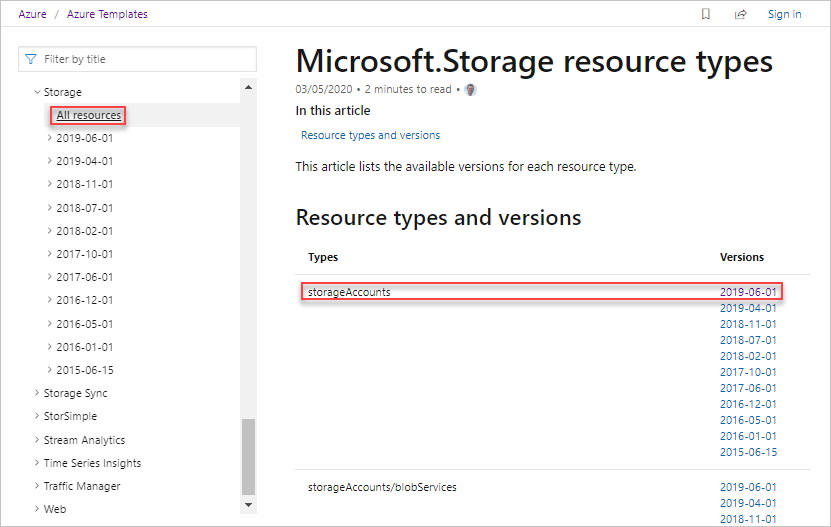

---
title: Use template reference
description: Use the Azure Resource Manager template reference to create a template.
author: mumian
ms.date: 04/23/2020
ms.topic: tutorial
ms.author: jgao
ms.custom: seodec18
---

# Tutorial: Utilize the Resource Manager template reference

Learn how to find the template schema information, and use the information to create Azure Resource Manager (ARM) templates.

In this tutorial, you use a base template from Azure Quickstart templates. Using template reference documentation, you customize the template.


This tutorial covers the following tasks:

> [!div class="checklist"]
> * Open a Quickstart template
> * Understand the template
> * Find the template reference
> * Edit the template
> * Deploy the template

If you don't have an Azure subscription, [create a free account](https://azure.microsoft.com/free/) before you begin.

## Prerequisites

To complete this article, you need:

* Visual Studio Code with Resource Manager Tools extension. See [Use Visual Studio Code to create ARM templates](use-vs-code-to-create-template.md).

## Open a Quickstart template

[Azure Quickstart Templates](https://azure.microsoft.com/resources/templates/) is a repository for ARM templates. Instead of creating a template from scratch, you can find a sample template and customize it. The template used in this quickstart is called [Create a standard storage account](https://azure.microsoft.com/resources/templates/101-storage-account-create/). The template defines an Azure Storage account resource.

1. From Visual Studio Code, select **File**>**Open File**.
1. In **File name**, paste the following URL:

    ```url
    https://raw.githubusercontent.com/Azure/azure-quickstart-templates/master/101-storage-account-create/azuredeploy.json
    ```

1. Select **Open** to open the file.
1. Select **File**>**Save As** to save the file as **azuredeploy.json** to your local computer.

## Understand the schema

1. From VS Code, collapse the template to the root level. You have the simplest structure with the following elements:

    

    * **$schema**: specify the location of the JSON schema file that describes the version of the template language.
    * **contentVersion**: specify any value for this element to document significant changes in your template.
    * **parameters**: specify the values that are provided when deployment is executed to customize resource deployment.
    * **variables**: specify the values that are used as JSON fragments in the template to simplify template language expressions.
    * **resources**: specify the resource types that are deployed or updated in a resource group.
    * **outputs**: specify the values that are returned after deployment.

1. Expand **resources**. There is a `Microsoft.Storage/storageAccounts` resource defined. The SKU name uses a parameter value.  The parameter is called **storageAccountType**.

    

1. Expand **parameters** to see how **storageAccountType** is defined. The parameter has four allowed values. You will find the other allowed values, and then revise the parameter definition.

    

## Find the template reference

1. Browse to [Azure Template reference](https://docs.microsoft.com/azure/templates/).
1. In the **Filter by title** box, enter **storage accounts**, and select the first **Storage Accounts** under **Reference > Storage**.

    

    A resource provider usually has several API versions:

    

1. Select **All resources** under **Storage** from the left pane. This page lists the resource types and versions of the storage resource provider. It is recommended to use the latest API versions for the resource types defined in your template.

    

1. Select the latest version of the **storageAccount** resource type. The latest version is **2019-06-01** when this article is written. Make sure this version matches the version used for the storage account resource in your template. If you update the API version, verify the resource definition matches the template reference.

1. This page lists the details of the storageAccount resource type.  For example, it lists the allowed values for the **Sku** object. There are more skus than what is listed in the quickstart template that you opened earlier. You can customize the quickstart template to include all the available storage types.

    

## Edit the template

From Visual Studio Code, add the additional storage account types as shown in the following screenshot:


## Deploy the template

1. Sign in to the [Azure Cloud Shell](https://shell.azure.com)

1. Choose your preferred environment by selecting either **PowerShell** or **Bash** (for CLI) on the upper left corner.  Restarting the shell is required when you switch.

    

1. Select **Upload/download files**, and then select **Upload**. See the previous screenshot. Select the file you saved in the previous section. After uploading the file, you can  use the **ls** command and the **cat** command to verify the file is uploaded successfully.

1. From the Cloud Shell, run the following commands. Select the tab to show the PowerShell code or the CLI code.

    # [CLI](#tab/CLI)

    ```azurecli
    echo "Enter a project name that is used to generate resource group name:" &&
    read projectName &&
    echo "Enter the location (i.e. centralus):" &&
    read location &&
    resourceGroupName="${projectName}rg" &&
    az group create --name $resourceGroupName --location "$location" &&
    az deployment group create --resource-group $resourceGroupName --template-file "$HOME/azuredeploy.json" --parameters storageAccountType='Standard_RAGRS'
    ```

    # [PowerShell](#tab/PowerShell)

    ```azurepowershell
    $projectName = Read-Host -Prompt "Enter a project name that is used to generate resource group name"
    $location = Read-Host -Prompt "Enter the location (i.e. centralus)"
    $resourceGroupName = "${projectName}rg"

    New-AzResourceGroup -Name $resourceGroupName -Location "$location"
    New-AzResourceGroupDeployment -ResourceGroupName $resourceGroupName -TemplateFile "$HOME/azuredeploy.json" -storageAccountType "Standard_RAGRS"
    ```

    ---

 When you deploy the template, specify the **storageAccountType** parameter with a newly added value, for example, **Standard_RAGRS**. The deploy would fail if you use the original quickstart template because **Standard_RAGRS** was not an allowed value.

## Clean up resources

When the Azure resources are no longer needed, clean up the resources you deployed by deleting the resource group.

1. From the Azure portal, select **Resource group** from the left menu.
2. Enter the resource group name in the **Filter by name** field.
3. Select the resource group name.  You shall see a total of six resources in the resource group.
4. Select **Delete resource group** from the top menu.

## Next steps

In this tutorial, you learned how to use template reference to customize an existing template. To learn how to create multiple storage account instances, see:

> [!div class="nextstepaction"]
> [Create multiple instances](./template-tutorial-create-multiple-instances.md)
