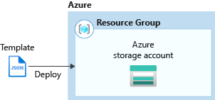
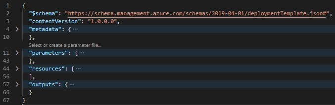
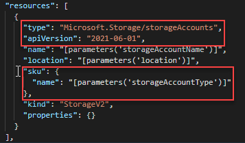
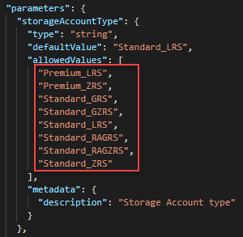
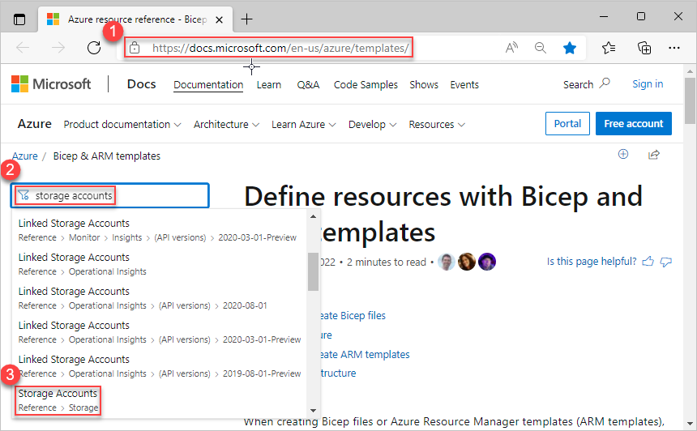
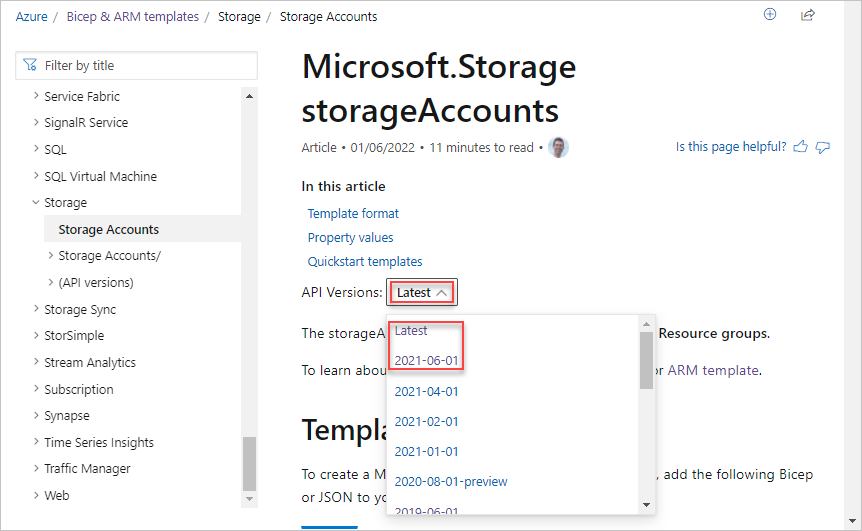
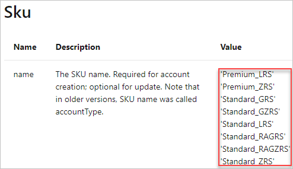

# Tutorial: Utilize the ARM template reference

Learn how to find the template schema information, and use the information to create Azure Resource Manager templates (ARM templates).

In this tutorial, you use a base template from Azure Quickstart Templates. Using template reference documentation, you validate the template.



This tutorial covers the following tasks:

> [!div class="checklist"]
> * Open a Quickstart template
> * Understand the template
> * Find the template reference
> * Edit the template
> * Deploy the template

If you don't have an Azure subscription, [create a free account](https://azure.microsoft.com/free/) before you begin.

## Prerequisites

To complete this article, you need:

* Visual Studio Code with Resource Manager Tools extension. See [Quickstart: Create ARM templates with Visual Studio Code](quickstart-create-templates-use-visual-studio-code.md).

## Open a Quickstart template

[Azure Quickstart Templates](https://azure.microsoft.com/resources/templates/) is a repository for ARM templates. Instead of creating a template from scratch, you can find a sample template and customize it. The template used in this quickstart is called [Create a standard storage account](https://azure.microsoft.com/resources/templates/storage-account-create/). The template defines an Azure Storage account resource.

1. From Visual Studio Code, select **File** > **Open File**.
1. In **File name**, paste the following URL:

    ```url
    https://raw.githubusercontent.com/Azure/azure-quickstart-templates/master/quickstarts/microsoft.storage/storage-account-create/azuredeploy.json
    ```

1. Select **Open** to open the file.
1. Select **File** > **Save As** to save the file as _azuredeploy.json_ to your local computer.

## Understand the schema

1. From Visual Studio Code, collapse the template to the root level. You have the simplest structure with the following elements:

    

    * `$schema`: specify the location of the JSON schema file that describes the version of the template language.
    * `contentVersion`: specify any value for this element to document significant changes in your template.
    * `metadata`: specify the metadata of the template.
    * `parameters`: specify the values that are provided when deployment is executed to customize resource deployment.
    * `variables`: specify the values that are used as JSON fragments in the template to simplify template language expressions. This template doesn't contain this element.
    * `resources`: specify the resource types that are deployed or updated in a resource group.
    * `outputs`: specify the values that are returned after deployment.

1. Expand `resources`. There's a `Microsoft.Storage/storageAccounts` resource defined. The API version shown on the screenshot is **2022-09-01**.  The SKU name uses a parameter value. The parameter is called `storageAccountType`.

    

1. Expand `parameters` to see how `storageAccountType` is defined. The parameter has eight allowed values.
    

Using the template reference, you can find out whether you are using the latest API version, and whether the parameter definition includes all the allowed values.

## Find the template reference

1. Browse to [Azure Template reference](/azure/templates/).
1. In the **Filter by title** box, enter **storage accounts**, and select the first **Storage Accounts** under **Reference > Storage**.

    

1. Select **ARM template**.
1. A resource type usually has several API versions. This page shows the latest template schema version by default. Select the **Latest** dropdown box to see the versions. The latest version shown on the screenshot is **2022-09-01**. Select either **Latest** or the version right beneath **Latest** to see the latest version. Make sure this version matches the version used for the storage account resource in your template. If you update the API version, verify the resource definition matches the template reference.

    

1. This page lists the details of the storageAccount resource type. For example, it lists the allowed values for the **Sku** object. There are eight SKUs, and they match the ones listed in the quickstart template that you opened earlier.

    

## Deploy the template

1. Sign in to the [Azure Cloud Shell](https://shell.azure.com)

1. Choose your preferred environment by selecting either **PowerShell** or **Bash** (for CLI) on the upper left corner.  Restarting the shell is required when you switch.

    

1. Select **Upload/download files**, and then select **Upload**. See the previous screenshot. Select the file you saved in the previous section. After uploading the file, you can use the `ls` command and the `cat` command to verify the file was uploaded successfully.

1. From the Cloud Shell, run the following commands. Select the tab to show the PowerShell code or the CLI code.

   When you deploy the template, specify the `storageAccountType` parameter with a newly added value, for example, **Standard_RAGRS**. The deploy would fail if you used the original quickstart template because **Standard_RAGRS** wasn't an allowed value.

    # [CLI](#tab/CLI)

    ```azurecli
    echo "Enter a project name that is used to generate resource group name:" &&
    read projectName &&
    echo "Enter the location (i.e. centralus):" &&
    read location &&
    resourceGroupName="${projectName}rg" &&
    az group create --name $resourceGroupName --location "$location" &&
    az deployment group create --resource-group $resourceGroupName --template-file "$HOME/azuredeploy.json" --parameters storageAccountType='Standard_RAGRS'
    ```

    # [PowerShell](#tab/PowerShell)

    ```azurepowershell
    $projectName = Read-Host -Prompt "Enter a project name that is used to generate resource group name"
    $location = Read-Host -Prompt "Enter the location (i.e. centralus)"
    $resourceGroupName = "${projectName}rg"

    New-AzResourceGroup -Name $resourceGroupName -Location "$location"
    New-AzResourceGroupDeployment -ResourceGroupName $resourceGroupName -TemplateFile "$HOME/azuredeploy.json" -storageAccountType "Standard_RAGRS"
    ```

    ---

## Clean up resources

When the Azure resources are no longer needed, clean up the resources you deployed by deleting the resource group.

1. From the Azure portal, select **Resource group** from the left menu.
1. Enter the resource group name in the **Filter by name** field.
1. Select the resource group name.  You shall see a total of six resources in the resource group.
1. Select **Delete resource group** from the top menu.

## Next steps

In this tutorial, you learned how to use template reference to customize an existing template. To learn how to create multiple storage account instances, see:

> [!div class="nextstepaction"]
> [Create multiple instances](./template-tutorial-create-multiple-instances.md)
