# Use Visual Studio Code to create Azure Resource Manager templates

Visual Studio Code is a lightweight, multiplatform, open-source editor. The Azure Resource Manager Template Tools extension is a plugin for Resource Manager template development. The extension adds language support for  templates to give you intellisense, syntax highlighting, in-line help, and many other language functions. Together, they provide recommended template development experience.

## Install Visual Studio Code

Visual studio Code supports MacOS, Windows, and Linux.  It can be installed from [Visual Studio Code](https://code.visualstudio.com/).

## Install Resource Manager Tools extension

1. Open Visual Studio Code.
1. Select **Extensions** from the left menu. Or from the **View** menu, select **Extensions** to open the Extensions pane.

    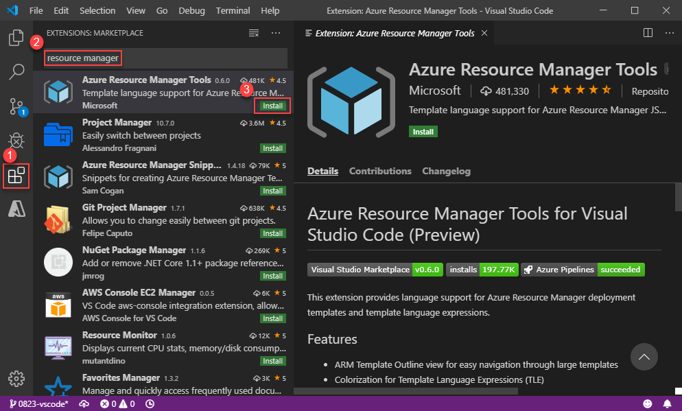
1. Search for **Resource Manager**.
1. Select **Install** under **Azure Resource Manager Tools**.

## The extension features

### Colorization for Template Language Expressions

Parameters, variables, functions, names, and expressions are color-coded as shown in the following screenshot:

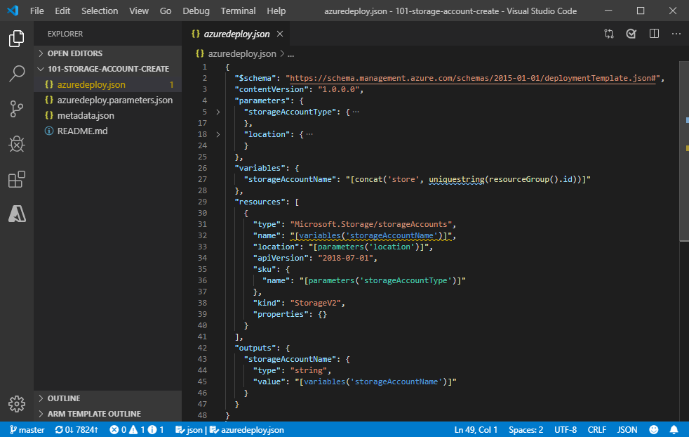

The template outline view makes it easy to navigate through large templates.

### Intellisense

The Resource Manager template extension knows possible completions for function names, parameters, variables and references. The IntelliSense suggestions pop up as you type. If you continue typing characters, the list of members (variables, methods, etc.) is filtered to only include members containing your typed characters. Pressing **Tab** or **Enter** inserts the selected member.

- Built-in function names

    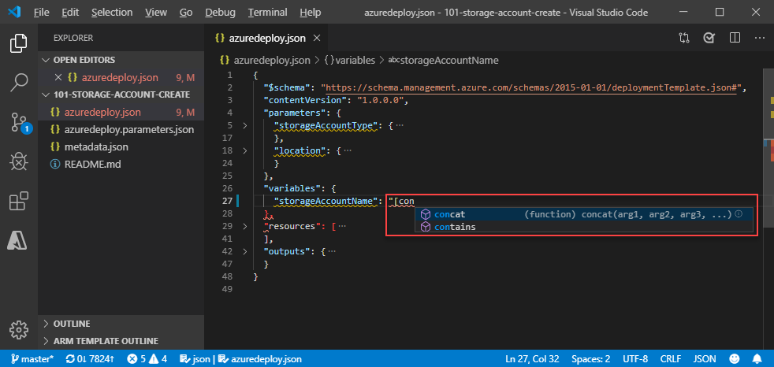

- Parameter references

    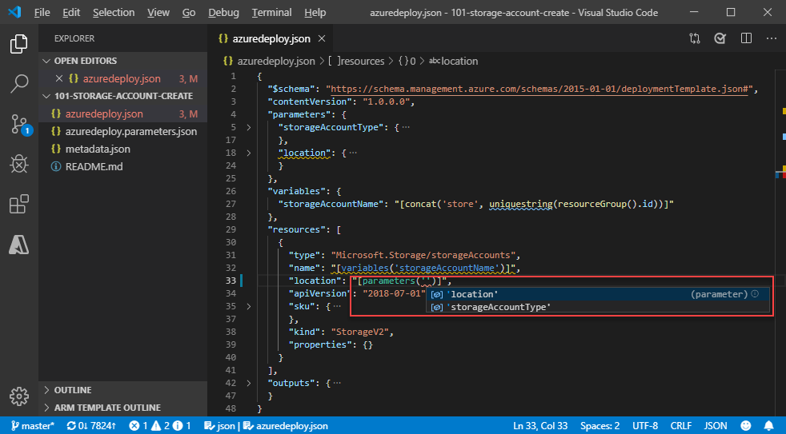

- Variable references

    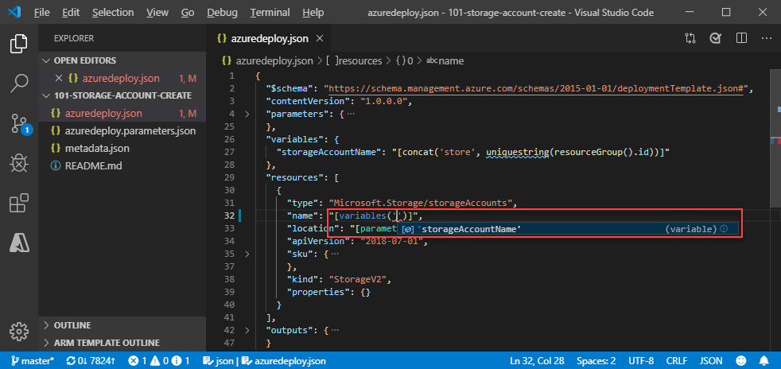

- resourceGroup() properties

    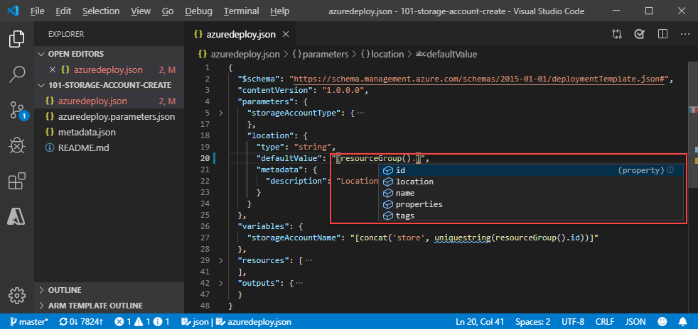

In addition, intellisense also works with subscription() properties and the properties of references to variables that are objects.

### Signature help for function parameters

When hovering over function names, the extension shows the signature help for function parameters.

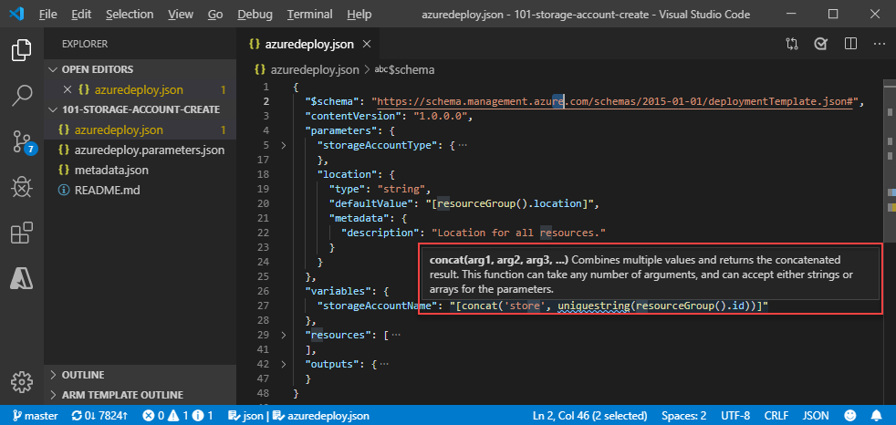

### Go To Definition for variable and parameter references

You can jump to the definition with **Ctrl+Click**, or by using the context menu as shown in the screenshot:
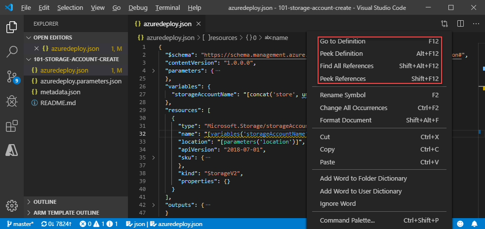

You can open the definition to the side with **Ctrl+Alt+Click**.

### Peek for variable and parameter definitions

To open peeked editor, use the context menu as shown in the previous screenshot.

The following screenshot shows the peek editor:

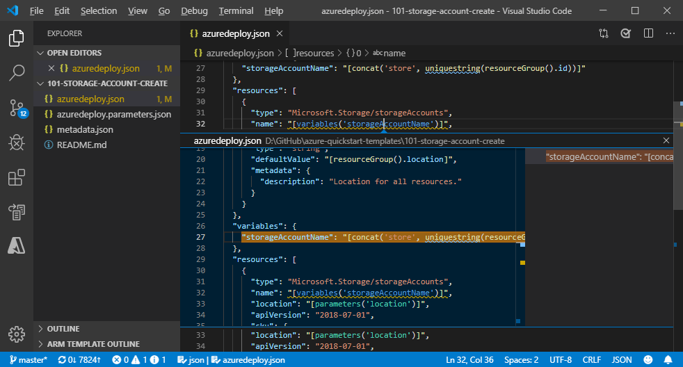

### Find all references for variables and parameters

To find all references, use the context menu as shown in the previous screenshot.

The following screenshot shows how the references are highlighted:

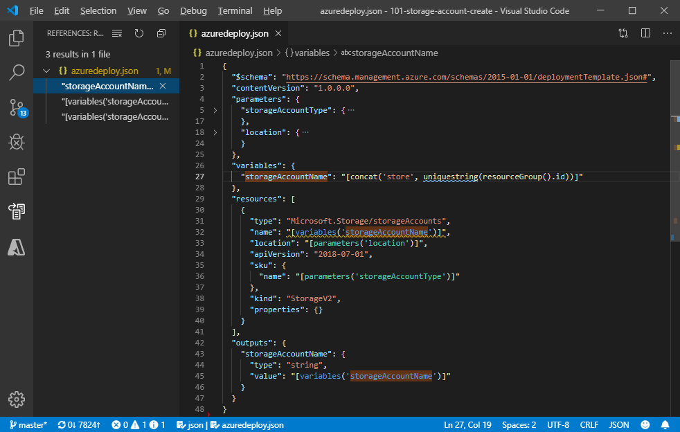

### Rename all references for variables and parameters

To rename all references for variables and parameters, use the context menu as shown in the previous screenshot.

### Hover for parameter description

### Brace matching

Matching brackets is highlighted as soon as the cursor is near one of them. When you click a brace, the matching brace is also highlighted as shown in the following screenshot:

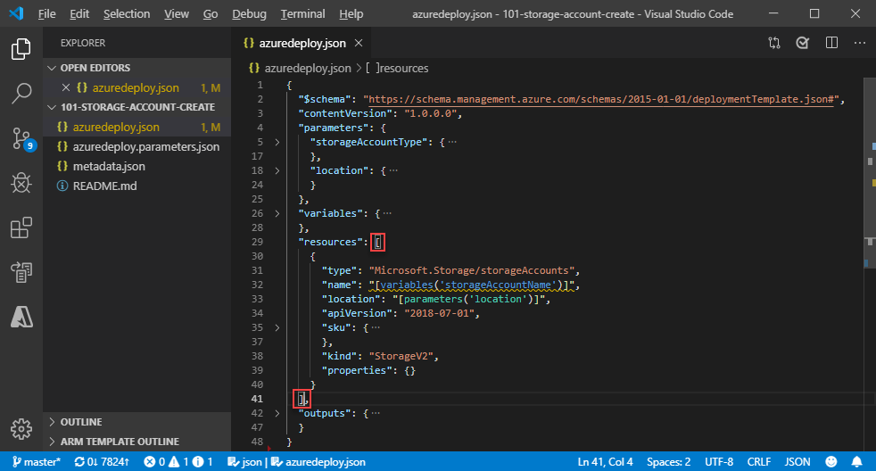

### Show errors and warnings

The errors being identified by the extension include:

- Undefined parameter references
- Undefined variable references
- Unrecognized  function names
- reference() function usage in variable definition
- Incorrect number of arguments in functions

The warnings include:

- Unused parameters
- Unused variables

## Next steps

- To learn about creating Azure Resource Manager templates, see [Tutorial: Create and deploy your first Azure Resource Manager template](template-tutorial-create-first-template.md).
- To go through a quickstart by using Visual Studio Code, see [Quickstart: Create Azure Resource Manager templates by using Visual Studio Code](quickstart-create-templates-use-visual-studio-code.md)
