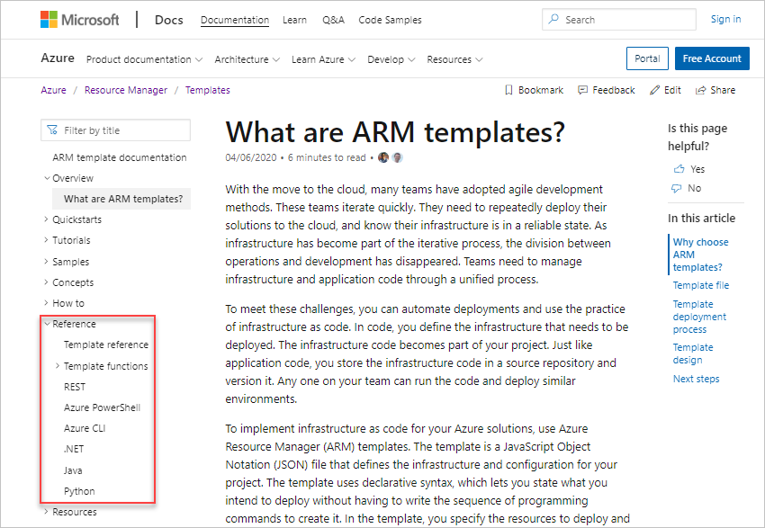
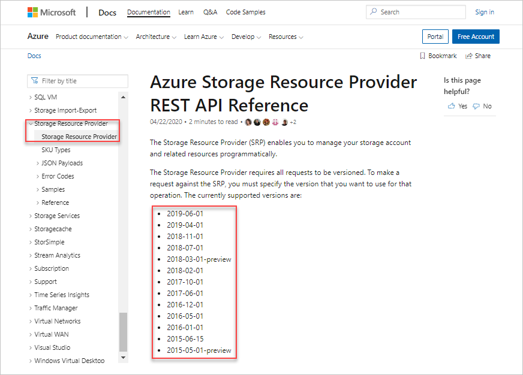
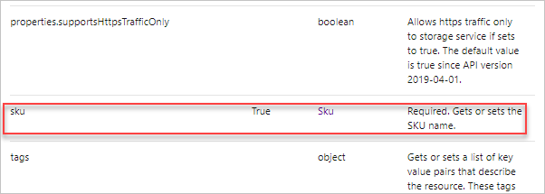
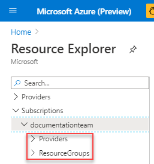
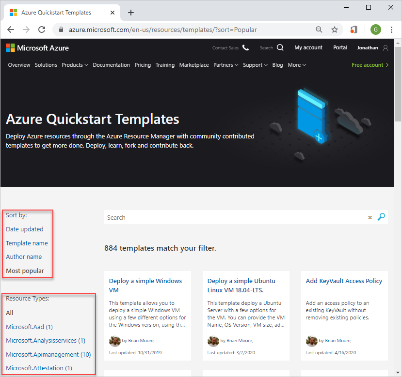
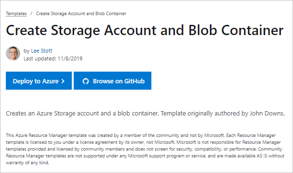
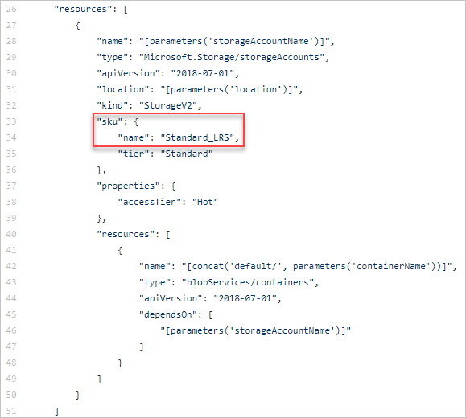

# View resource properties

To implement Azure solutions, you can use Azure Resource Manager (ARM) templates. The template is a JavaScript Object Notation (JSON) file that defines the infrastructure and configuration for your project. In the template, you specify the resources to deploy and the properties for those resources.

To deploy an Azure storage account, you can use a template simliar to:

```json
{
 "$schema": "https://schema.management.azure.com/schemas/2019-04-01/deploymentTemplate.json#",
 "contentVersion": "1.0.0.0",
 "resources": [
   {
     "type": "Microsoft.Storage/storageAccounts",
     "apiVersion": "2019-04-01",
     "name": "{provide-unique-name}",
     "location": "centralus",
     "sku": {
       "name": "Standard_LRS"
     },
     "kind": "StorageV2",
     "properties": {
       "supportsHttpsTrafficOnly": true
     }
   }
 ]
}
```

Before creating Resource Manager templates, you need to understand what resource types are available, and what values to use in your template. For example, what is the syntax for specifying storage account type or SKU; how to specify the value of the SKU.

This article introduces some resources where you can find the information:

- Template reference
- REST API
- Resource Explorer
- Resource.azure.com
- Export
- portal
- quickstart templates

Some of these resources are listed on the [Azure Resource Manager documentation site](./overview.md):



## Find the resource provider namespaces

To find the mapping resource provider name for the Azure service that you want to create, see [Resource providers for Azure services](https://docs.microsoft.com/azure/azure-resource-manager/management/azure-services-resource-providers).

The resource provider namespace for Azure storage account is **Microsoft.Storage**:


## Use template reference

The Azure Resource Manager template reference is the most comprehensive resource for creating templates.

1. Browse to [Azure Resource Manager template reference](/azure/templates/).
1. From the left navigation, select **Storage**, and then select **All resources**. The All resources page summarizes the resource types and the versions. The **storageAccounts** resource type has these versions when the article is written.

    

    If you know the resource type, you can go directly to this page with the following URL format: `https://docs.microsoft.com/azure/templates/{provider-namespace}/{resource-type}`.

1. Select the latest version. It is recommended to use the latest template schema.

    The **Template format** section lists all the properties for storage account. **sku** is in the list:

    

    Scroll down to see **Sku object**. The article shows the allowed values for SKU name:

    

## Use REST API

1. Browse to [Azure REST API Reference](https://docs.microsoft.com/rest/api/azure/).
1. From the left menu, select **Storage Resource Provider** -> **Storage Resource Provider**. This page lists the API versions:

    

1. From the left menu,  select **Reference** -> **Storage Accounts** -> **Create**.

    In the **Request Body** section , it shows **sku**:

    

    In the **Examples** section, **Request Body** shows the structure of SKU:

    

    In the **Definitions** section, you can find the allow values for both SKU name and SKU tier.

    

## Use Resource Explorer

Resource Explorer is embedded in the Azure portal. Before using this method, you need a storage account. If you don't have one, select the following button to create one:

[](https://portal.azure.com/#create/Microsoft.Template/uri/https%3a%2f%2fraw.githubusercontent.com%2fAzure%2fazure-quickstart-templates%2fmaster%2f101-storage-account-create%2fazuredeploy.json)

1. Sign in to the [Azure portal](https://portal.azure.com).
1. In the search box, enter **resource explorer**, and then select **Resource Explorer**.

    

1. From left, expand **Subscriptions**, and then expand your Azure subscription. You can find the storage account under either **Providers** or **ResourceGroups**.

    

    - **Providers**: expand **Providers** -> **Microsoft.Storage** -> **storageAccounts**, and then select your storage account.
    - **ResourceGroups**: select the resource group which contains the storage account, select **Resources**, and then select the storage account.

    On the right, you see the SKU configuration for the existing storage account similar to:

    

## Use Resources.azure.com

Resources.azure.com is a public website can be accessed by anyone with an Azure subscription. This tool provides these functionalities:

- Discover the Azure Resource Management APIs.
- Get API documentation and schema information.
- Make API calls directly in your own subscriptions.

To demonstrate how to retrieve schema information by using this tool, you need a storage account. If you don't have one, select the following button to create one:

[](https://portal.azure.com/#create/Microsoft.Template/uri/https%3a%2f%2fraw.githubusercontent.com%2fAzure%2fazure-quickstart-templates%2fmaster%2f101-storage-account-create%2fazuredeploy.json)

1. Browse to [resources.azure.com](resources.azure.com). It takes a few moments for the tool to popular the left pane.
1. Select **subscriptions**.

    

    The node on the left matches the API call on the right.
1. From left, expand **Subscriptions**, and then expand your Azure subscription. You can find the storage account under either **Providers** or **ResourceGroups**.

    - **Providers**: expand **Providers** -> **Microsoft.Storage** -> **storageAccounts**, and then select your storage account.
    - **ResourceGroups**: select the resource group which contains the storage account, select **Resources**, and then select the storage account.

    On the right, you see the sku configuration for the existing storage account similar to:

    

## Export templates

The Azure portal has a function to export templates from existing resources. You can even export template before deployment. For more information, see [Single and multi-resource export to a template in the Azure portal](./export-template-portal).  The article covers these options:

- [Export template from a resource group](./export-template-portal.md#export-template-from-a-resource-group)
- [Export template from a resource](./export-template-portal.md#export-template-from-a-resource)
- [Export template before deployment](./export-template-portal.md#export-template-before-deployment)
- [Export template after deployment](./export-template-portal.md#export-template-after-deployment)

## Use Quickstart templates

Azure Quickstart Templates is a repository of community contributed templates. The templates are stored in [GitHub](https://github.com/Azure/azure-quickstart-templates/tree/master). There is a [web interface](https://azure.microsoft.com/resources/templates/) of the repository, which supports search capability.

1. Browse to [Azure Quickstart Templates](https://azure.microsoft.com/resources/templates/).
1. Select **See All**.

    

    You can filter the templates by selecting a resource type.  You can also sort the results.

1. From the left, select **Microsoft.Storage**, and then select **Most popular**.  All of the templates contains the **Microsoft.Storage** resource type.
1. Select the tile with the title **Create Storage Account and Blob Container** or any of the template.

    

    To deploy the template, select **Deploy to Azure**. To view the template, select **Browse on GitHub**.

1. Select **Browse on GitHub**. Now you are redirected to github.com.
1. Select **azuredeploy.json**.  **azuredeploy.json** is the default name for the main template.

    You see an example of the storage account resource definition, and how to define SKU.

    

1. Select **Raw** to see the raw json file. You can deploy this template by using this URL from [Azure PowerShell](./deploy-powershell.md), [Azure CLI](./deploy-cli.md), and the [Azure portal](./deploy-to-azure-button.md).

## Next steps

In this article, you learned how to find template schema information. To learn more about creating Resource Manager templates, see [Understand the structure and syntax of ARM templates](./template-syntax.md).
