# Discover resource properties

Before creating Resource Manager templates, you need to understand what resource types are available, and what values to use in your template. This article shows some ways you can find the properties to include in your template.

## Find resource provider namespaces

Resources in an ARM template are defined with a resource provider namespace and resource type. For example, Microsoft.Storage/storageAccounts is the full name of the storage account resource type. Microsoft.Storage is the namespace. If you don't already know the namespaces for the resource types you want to use, see [Resource providers for Azure services](https://docs.microsoft.com/azure/azure-resource-manager/management/azure-services-resource-providers).

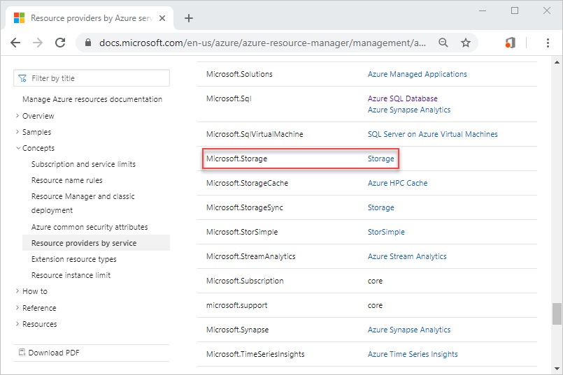

## Export templates

The easiest way to get the template properties for your existing resources is to export the template. For more information, see [Single and multi-resource export to a template in the Azure portal](./export-template-portal.md).

## Use Resource Manager tools extension

Visual Studio Code and the Azure Resource Manager tools extension help you see exactly which properties are needed for each resource type. They provide intellisense and snippets that simplify how you define a resource in your template. For more information, see [Quickstart: Create Azure Resource Manager templates with Visual Studio Code](./quickstart-create-templates-use-visual-studio-code.md#add-an-azure-resource).

The following screenshot shows a storage account resource is added to a template:

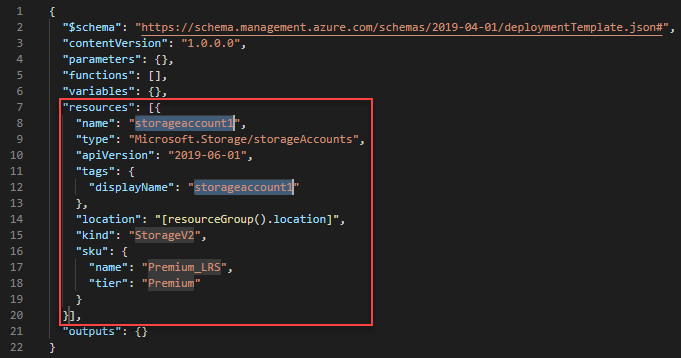

The extension also provides a list of options for the configuration properties.

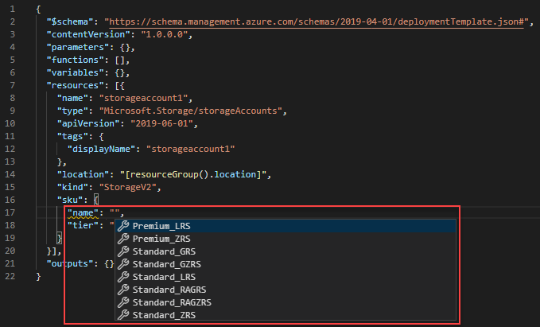

## Use template reference

The Azure Resource Manager template reference is the most comprehensive resource for template schema. You can find API versions, template format, and property information.

1. Browse to [Azure Resource Manager template reference](/azure/templates/).
1. From the left navigation, select **Storage**, and then select **All resources**. The All resources page summarizes the resource types and the versions.

    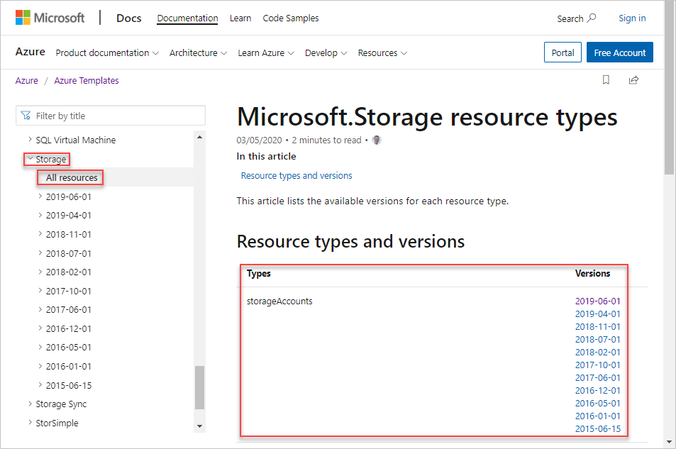

    If you know the resource type, you can go directly to this page with the following URL format: `https://docs.microsoft.com/azure/templates/{provider-namespace}/{resource-type}`.

1. Select the latest version. It is recommended to use the latest API version.

    The **Template format** section lists all the properties for storage account. **sku** is in the list:

    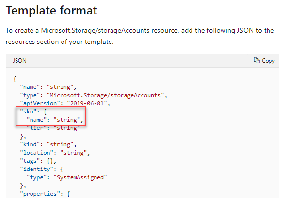

    Scroll down to see **Sku object** in the **Property values** section. The article shows the allowed values for SKU name:

    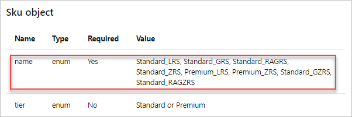

    At the end of the page, the **Quickstart templates** section lists some Azure Quickstart Templates that contain the resource type:

    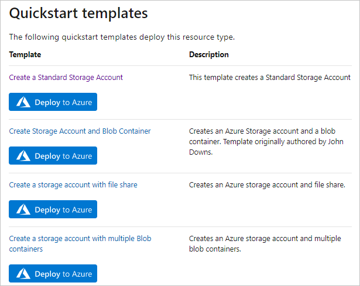

The template reference is linked from each of the Azure service documentation sites.  For example, the [Key Vault documentation site](../../key-vault/general/overview.md):

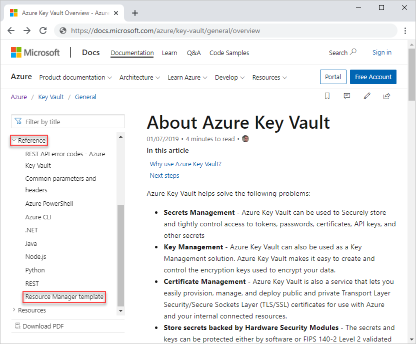

## Use Resource Explorer

Resource Explorer is embedded in the Azure portal. Before using this method, you need a storage account. If you don't have one, select the following button to create one:

1. Sign in to the [Azure portal](https://portal.azure.com).
1. In the search box, enter **resource explorer**, and then select **Resource Explorer**.

    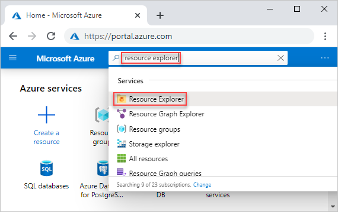

1. From left, expand **Subscriptions**, and then expand your Azure subscription. You can find the storage account under either **Providers** or **ResourceGroups**.

    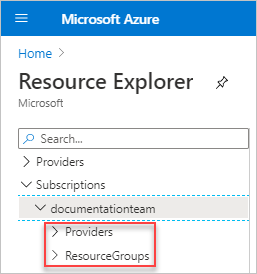

    - **Providers**: expand **Providers** -> **Microsoft.Storage** -> **storageAccounts**, and then select your storage account.
    - **ResourceGroups**: select the resource group, which contains the storage account, select **Resources**, and then select the storage account.

    On the right, you see the SKU configuration for the existing storage account similar to:

    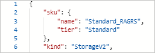

## Use Resources.azure.com

Resources.azure.com is a public website can be accessed by anyone with an Azure subscription. It is in preview.  Consider using [Resource Explorer](#use-resource-explorer) instead. This tool provides these functionalities:

- Discover the Azure Resource Management APIs.
- Get API documentation and schema information.
- Make API calls directly in your own subscriptions.

To demonstrate how to retrieve schema information by using this tool, you need a storage account. If you don't have one, select the following button to create one:

1. Browse to [resources.azure.com](https://resources.azure.com/). It takes a few moments for the tool to popular the left pane.
1. Select **subscriptions**.

    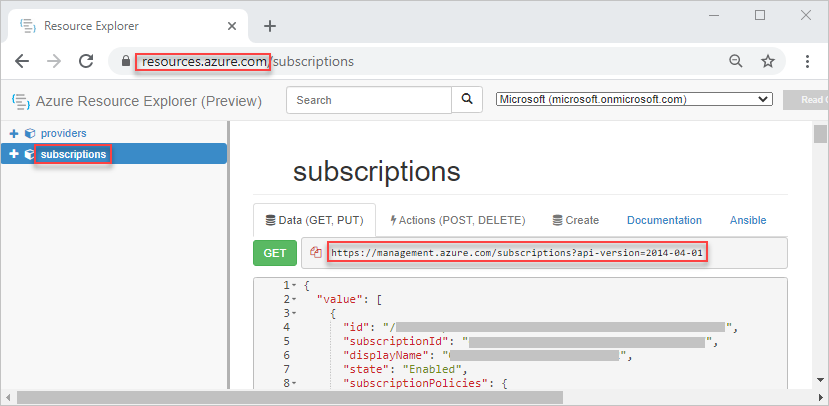

    The node on the left matches the API call on the right. You can make the API call by selecting the **GET** button.
1. From left, expand **Subscriptions**, and then expand your Azure subscription. You can find the storage account under either **Providers** or **ResourceGroups**.

    - **Providers**: expand **Providers** -> **Microsoft.Storage** -> **storageAccounts**, and then browse to the storage account.
    - **ResourceGroups**: select the resource group, which contains the storage account, and then select **Resources**.

    On the right, you see the sku configuration for the existing storage account similar to:

    

## Next steps

In this article, you learned how to find template schema information. To learn more about creating Resource Manager templates, see [Understand the structure and syntax of ARM templates](./template-syntax.md).
