# Creating and deploying Azure resource groups through Visual Studio
With Visual Studio, you can create a project that deploys your infrastructure and code to Azure. For example, you can define the web host, web site, and database for your app, and deploy that infrastructure along with the code. Visual Studio provides many different starter templates for deploying common scenarios. In this article, you deploy a web app and SQL Database.  

This article shows how to use [Visual Studio 2017 with the Azure development and ASP.NET workloads installed](/dotnet/azure/dotnet-tools). If you use Visual Studio 2015 Update 2 and Microsoft Azure SDK for .NET 2.9, or Visual Studio 2013 with Azure SDK 2.9, your experience is largely the same.

## Create Azure Resource Group project
In this section, you create an Azure Resource Group project with a **Web app + SQL** template.

1. In Visual Studio, choose **File**, **New Project**, choose either **C#** or **Visual Basic** (which language you choose has no impact on the later stages as these projects have only JSON and PowerShell content). Then choose **Cloud**, and **Azure Resource Group** project.
   
    
2. Choose the template that you want to deploy to Azure Resource Manager. Notice there are many different options based on the type of project you wish to deploy. For this article, choose the **Web app + SQL** template.
   
    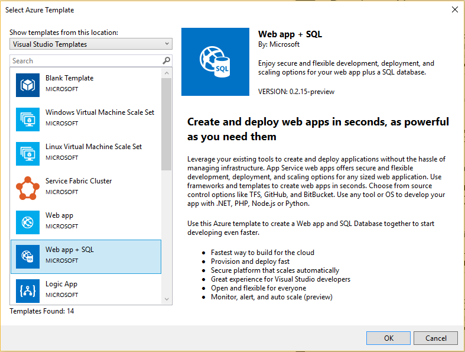
   
    The template you pick is just a starting point; you can add and remove resources to fulfill your scenario.
   
   > [!NOTE]
   > Visual Studio retrieves a list of available templates online. The list may change.
   > 
   > 
   
    Visual Studio creates a resource group deployment project for the web app and SQL database.
3. To see what you created, look at the node in the deployment project.
   
    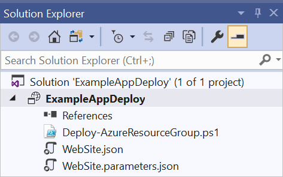
   
    Since you chose the Web app + SQL template for this example, you see the following files: 
   
   | File name | Description |
   | --- | --- |
   | Deploy-AzureResourceGroup.ps1 |A PowerShell script that runs PowerShell commands to deploy to Azure Resource Manager.<br />**Note** Visual Studio uses this PowerShell script to deploy your template. Any changes you make to this script affect deployment in Visual Studio, so be careful. |
   | WebSiteSQLDatabase.json |The Resource Manager template that defines the infrastructure you want deploy to Azure, and the parameters you can provide during deployment. It also defines the dependencies between the resources so Resource Manager deploys the resources in the correct order. |
   | WebSiteSQLDatabase.parameters.json |A parameters file that has values needed by the template. You pass in parameter values to customize each deployment. |
   
    All resource group deployment projects have these basic files. Other projects may have additional files to support other functionality.

## Customize the Resource Manager template
You can customize a deployment project by modifying the JSON templates that describe the resources you want to deploy. JSON stands for JavaScript Object Notation, and is a serialized data format that is easy to work with. The JSON files use a schema that you reference at the top of each file. If you want to understand the schema, you can download and analyze it. The schema defines what elements are valid, the types and formats of fields, and the possible values for a property. To learn about the elements of the Resource Manager template, see [Authoring Azure Resource Manager templates](resource-group-authoring-templates.md).

To work on your template, open **WebSiteSQLDatabase.json**.

The Visual Studio editor provides tools to assist you with editing the Resource Manager template. The **JSON Outline** window makes it easy to see the elements defined in your template.

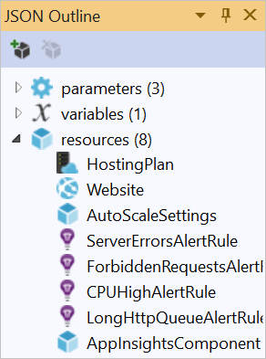

Selecting any of the elements in the outline takes you to that part of the template and highlights the corresponding JSON.

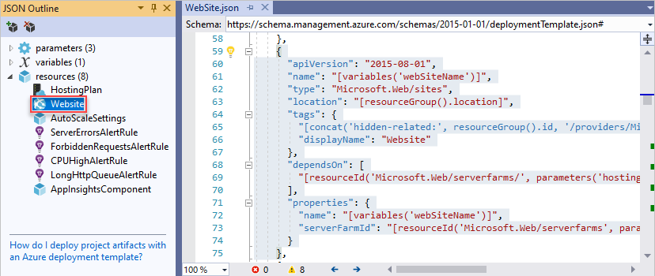

You can add a resource by either selecting the **Add Resource** button at the top of the JSON Outline window, or by right-clicking **resources** and selecting **Add New Resource**.

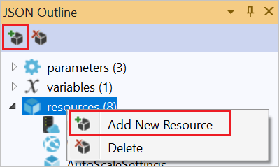

For this tutorial, select **Storage Account** and give it a name. Provide a name that is no more than 11 characters, and only contains numbers and lower-case letters.

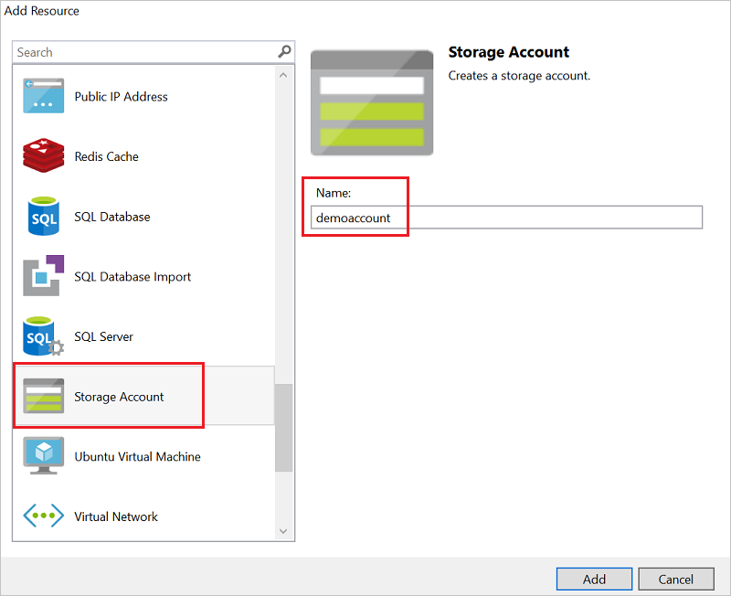

Notice that not only was the resource added, but also a parameter for the type storage account, and a variable for the name of the storage account.

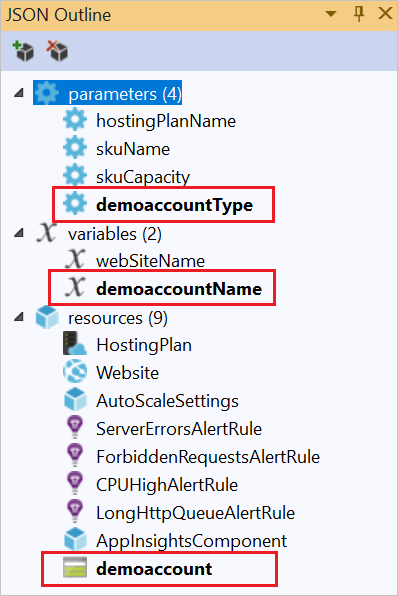

The **storageType** parameter is pre-defined with allowed types and a default type. You can leave these values or edit them for your scenario. If you don't want anyone to deploy a **Premium_LRS** storage account through this template, remove it from the allowed types. 

```json
"storageType": {
  "type": "string",
  "defaultValue": "Standard_LRS",
  "allowedValues": [
    "Standard_LRS",
    "Standard_ZRS",
    "Standard_GRS",
    "Standard_RAGRS"
  ]
}
```

Visual Studio also provides intellisense to help you understand what properties are available when editing the template. For example, to edit the properties for your App Service plan, navigate to the **HostingPlan** resource, and add a value for the **properties**. Notice that intellisense shows the available values and provides a description of that value.

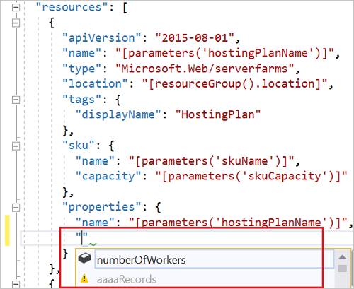

You can set **numberOfWorkers** to 1.

```json
"properties": {
  "name": "[parameters('hostingPlanName')]",
  "numberOfWorkers": 1
}
```

## Deploy the Resource Group project to Azure
You're now ready to deploy your project. When you deploy an Azure Resource Group project, you deploy it to an Azure resource group. The resource group is a logical grouping of resources that share a common lifecycle.

1. On the shortcut menu of the deployment project node, choose **Deploy** > **New**.
   
    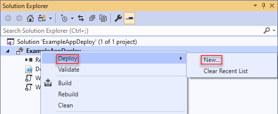
   
    The **Deploy to Resource Group** dialog box appears.
   
    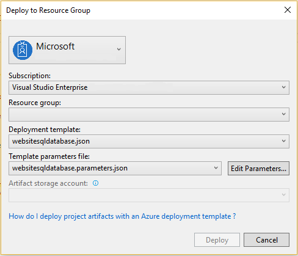
2. In the **Resource group** dropdown box, choose an existing resource group or create a new one. To create a resource group, open the **Resource Group** dropdown box and choose **Create New**.
   
    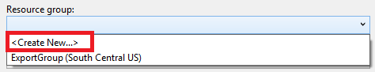
   
    The **Create Resource Group** dialog box appears. Give your group a name and location, and select the **Create** button.
   
    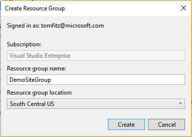
3. Edit the parameters for the deployment by selecting the **Edit Parameters** button.
   
    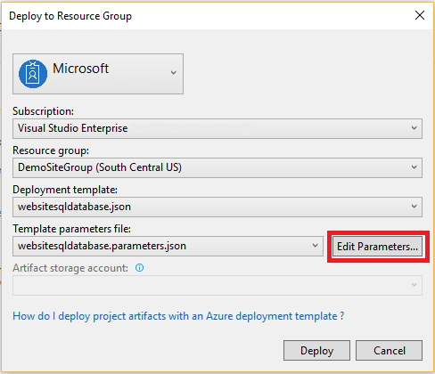
4. Provide values for the empty parameters and select the **Save** button. The empty parameters are **hostingPlanName**, **administratorLogin**, **administratorLoginPassword**, and **databaseName**.
   
    **hostingPlanName** specifies a name for the [App Service plan](../app-service/azure-web-sites-web-hosting-plans-in-depth-overview.md) to create. 
   
    **administratorLogin** specifies the user name for the SQL Server administrator. Don't use common admin names like **sa** or **admin**. 
   
    The **administratorLoginPassword** specifies a password for SQL Server administrator. The **Save passwords as plain text in the parameters file** option isn't secure; therefore, don't select this option. Since the password isn't saved as plain text, you need to provide this password again during deployment. 
   
    **databaseName** specifies a name for the database to create. 
   
    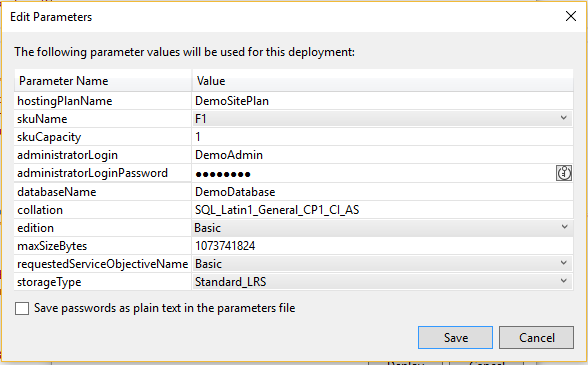
5. Choose the **Deploy** button to deploy the project to Azure. A PowerShell console opens outside of the Visual Studio instance. Enter the SQL Server administrator password in the PowerShell console when prompted. **Your PowerShell console may be hidden behind other items or minimized in the task bar.** Look for this console and select it to provide the password.
   
   > [!NOTE]
   > Visual Studio may ask you to install the Azure PowerShell cmdlets. You need the Azure PowerShell cmdlets to successfully deploy resource groups. If prompted, install them. For more information, see [Install and configure Azure PowerShell](/powershell/azure/install-azurerm-ps).
   > 
   > 
6. The deployment may take a few minutes. In the **Output** windows, you see the status of the deployment. When the deployment has finished, the last message indicates a successful deployment with something similar to:
   
        ... 
        18:00:58 - Successfully deployed template 'websitesqldatabase.json' to resource group 'DemoSiteGroup'.
7. In a browser, open the [Azure portal](https://portal.azure.com/) and sign in to your account. To see the resource group, select **Resource groups** and the resource group you deployed to.
   
    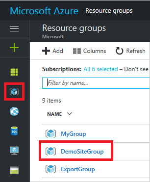
8. You see all the deployed resources. Notice that the name of the storage account isn't exactly what you specified when adding that resource. The storage account must be unique. The template automatically adds a string of characters to the name you provided to provide a unique name. 
   
    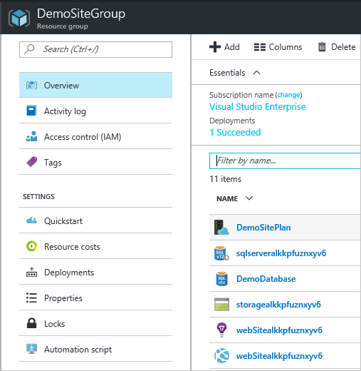
9. If you make changes and want to redeploy your project, choose the existing resource group from the shortcut menu of Azure resource group project. On the shortcut menu, choose **Deploy**, and then choose the resource group you deployed.
   
    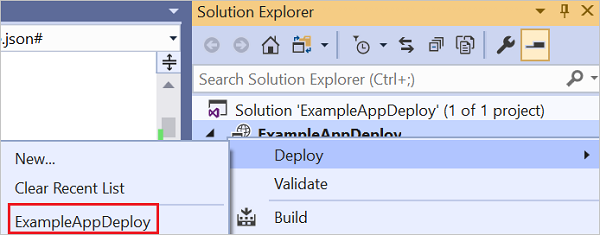

## Deploy code with your infrastructure
At this point, you've deployed the infrastructure for your app, but there's no actual code deployed with the project. This article shows how to deploy a 
web app and SQL Database tables during deployment. If you're deploying a Virtual Machine instead of a web app, you want to run some code on the machine as part of deployment. The process for deploying code for a web app or for setting up a Virtual Machine is almost the same.

1. Add a project to your Visual Studio solution. Right-click the solution, and select **Add** > **New Project**.
   
    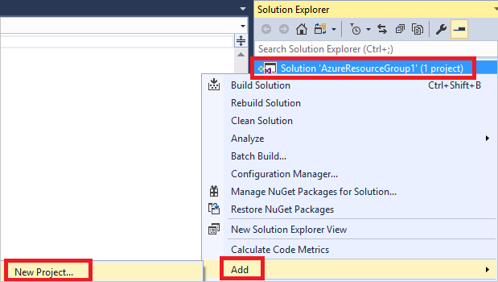
2. Add an **ASP.NET Web Application**. 
   
    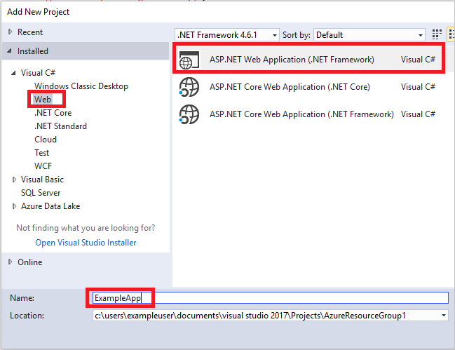
3. Select **MVC**.
   
    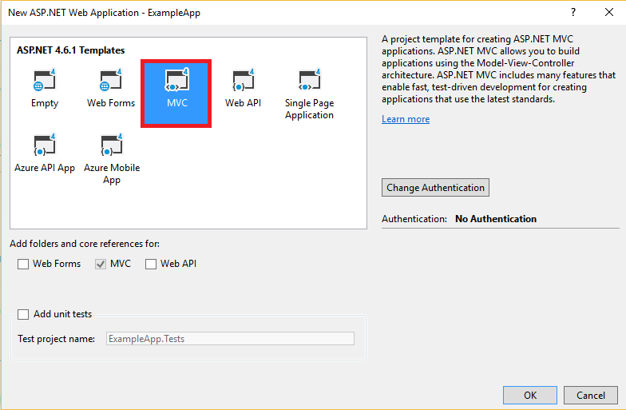
4. After Visual Studio creates your web app, you see both projects in the solution.
   
    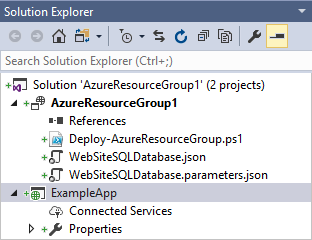
5. Now, you need to make sure your resource group project is aware of the new project. Go back to your resource group project (AzureResourceGroup1). Right-click **References** and select **Add Reference**.
   
    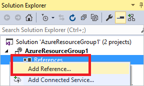
6. Select the web app project that you created.
   
    
   
    By adding a reference, you link the web app project to the resource group project, and automatically set three key properties. You see these properties in the **Properties** window for the reference.
   
      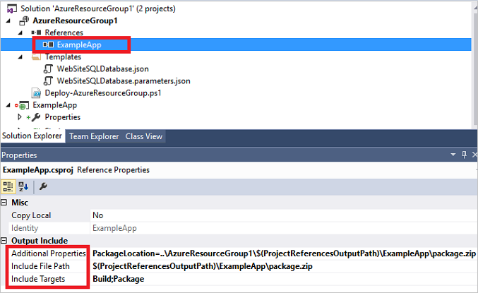
   
    The properties are:
   
   * The **Additional Properties** has the web deployment package staging location that is pushed to the Azure Storage. Note the folder (ExampleApp) and file (package.zip). You need to know these values because you provide them as parameters when deploying the app. 
   * The **Include File Path** has the path where the package is created. The **Include Targets** has the command that deployment executes. 
   * The default value of **Build;Package** enables the deployment to build and create a web deployment package (package.zip).  
     
     You don't need a publish profile as the deployment gets the necessary information from the properties to create the package.
7. Go back to WebSiteSQLDatabase.json and add a resource to the template.
   
    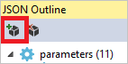
8. This time select **Web Deploy for Web Apps**. 
   
    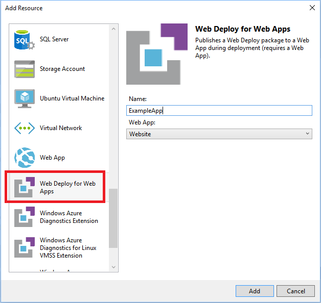
9. Redeploy your resource group project to the resource group. This time there are some new parameters. You don't need to provide values for **_artifactsLocation** or **_artifactsLocationSasToken** because Visual Studio automatically generates those values. However, you have to set the folder and file name to the path that contains the deployment package (shown as **ExampleAppPackageFolder** and **ExampleAppPackageFileName** in the following image). Provide the values you saw earlier in the reference properties (**ExampleApp** and **package.zip**).
   
    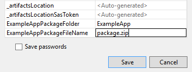
   
    For the **Artifact storage account**, select the one deployed with this resource group.
10. After the deployment has finished, select your web app in the portal. Select the URL to browse to the site.
    
     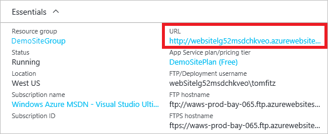
11. Notice that you've successfully deployed the default ASP.NET app.
    
     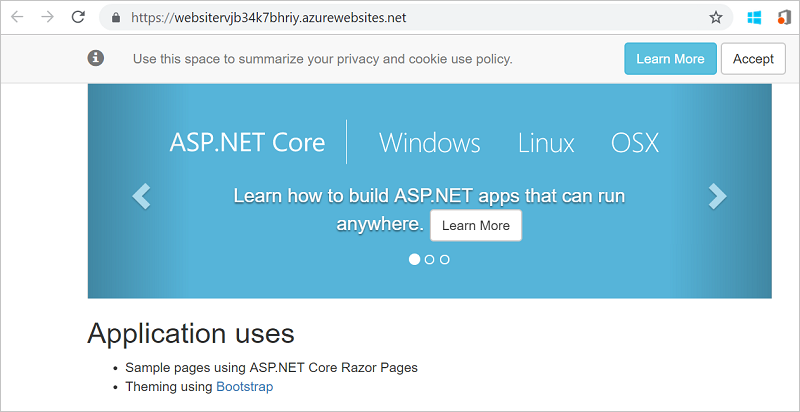

## Add an operations dashboard to your deployment
You aren't limited to only the resources that are available through the Visual Studio interface. You can customize your deployment by adding a custom resource to your template. To show adding a resource, you add an operational dashboard to manage the resource you deployed.

1. Open the WebsiteSqlDeploy.json file and add the following JSON after the storage account resource but before the closing `]` of the resources section.

  ```json
    ,{
      "properties": {
        "lenses": {
          "0": {
            "order": 0,
            "parts": {
              "0": {
                "position": {
                  "x": 0,
                  "y": 0,
                  "colSpan": 4,
                  "rowSpan": 6
                },
                "metadata": {
                  "inputs": [
                    {
                      "name": "resourceGroup",
                      "isOptional": true
                    },
                    {
                      "name": "id",
                      "value": "[resourceGroup().id]",
                      "isOptional": true
                    }
                  ],
                  "type": "Extension/HubsExtension/PartType/ResourceGroupMapPinnedPart"
                }
              },
              "1": {
                "position": {
                  "x": 4,
                  "y": 0,
                  "rowSpan": 3,
                  "colSpan": 4
                },
                "metadata": {
                  "inputs": [],
                  "type": "Extension[azure]/HubsExtension/PartType/MarkdownPart",
                  "settings": {
                    "content": {
                      "settings": {
                        "content": "__Customizations__\n\nUse this dashboard to create and share the operational views of services critical to the application performing. To customize simply pin components to the dashboard and then publish when you're done. Others will see your changes when you publish and share the dashboard.\n\nYou can customize this text too. It supports plain text, __Markdown__, and even limited HTML like images  and <a href='https://azure.microsoft.com' target='_blank'>links</a> that open in a new tab.\n",
                        "title": "Operations",
                        "subtitle": "[resourceGroup().name]"
                      }
                    }
                  }
                }
              }
            }
          }
        },
        "metadata": {
          "model": {
            "timeRange": {
              "value": {
                "relative": {
                  "duration": 24,
                  "timeUnit": 1
                }
              },
              "type": "MsPortalFx.Composition.Configuration.ValueTypes.TimeRange"
            }
          }
        }
      },
      "apiVersion": "2015-08-01-preview",
      "name": "[concat('ARM-',resourceGroup().name)]",
      "type": "Microsoft.Portal/dashboards",
      "location": "[resourceGroup().location]",
      "tags": {
        "hidden-title": "[concat('OPS-',resourceGroup().name)]"
      }
    }
  ```

2. Redeploy your resource group. Look at your dashboard on the Azure portal, and notice the shared dashboard has been added to your list of choices.

   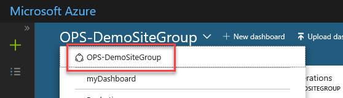

3. Select the dashboard.

   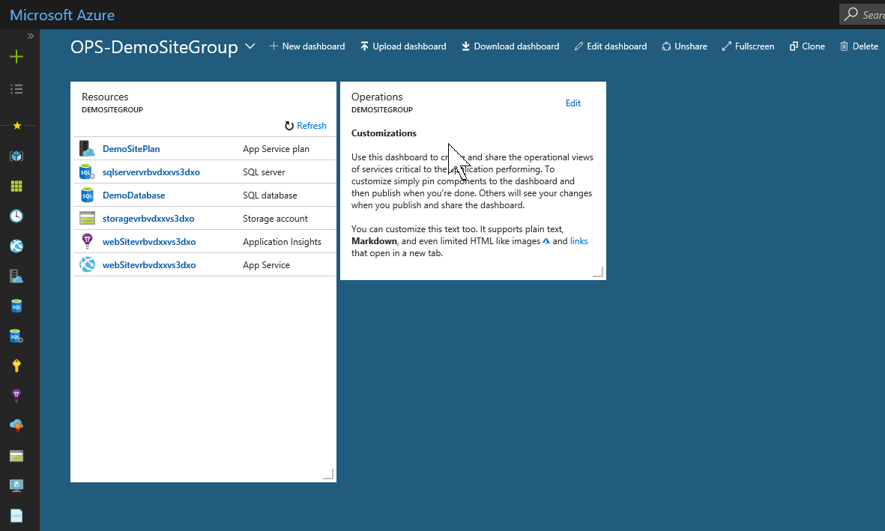

You can manage access to the dashboard by using RBAC groups. You can also customize the dashboard's appearance after it's deployed. However, if you redeploy the resource group, the dashboard is reset to its default state in your template. For more information about creating dashboards, see [Programmatically create Azure Dashboards](../azure-portal/azure-portal-dashboards-create-programmatically.md).

## Next steps

In this quickstart, you learned how to create and deploy templates using Visual Studio. The next tutorial shows you how to find the information from template reference so you can create an encrypted Azure Storage account.

> [!div class="nextstepaction"]
> [Create an encrypted storage account](./resource-manager-tutorial-create-encrypted-storage-accounts.md)
