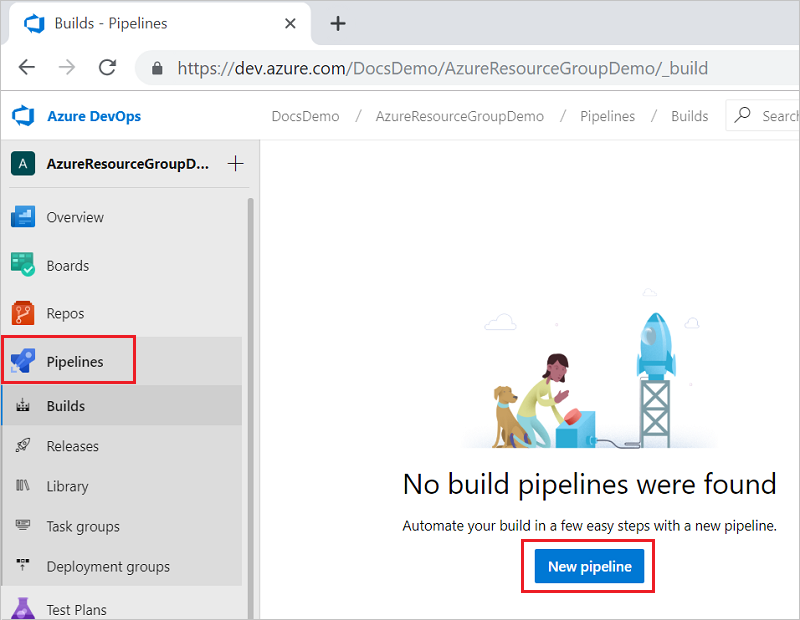
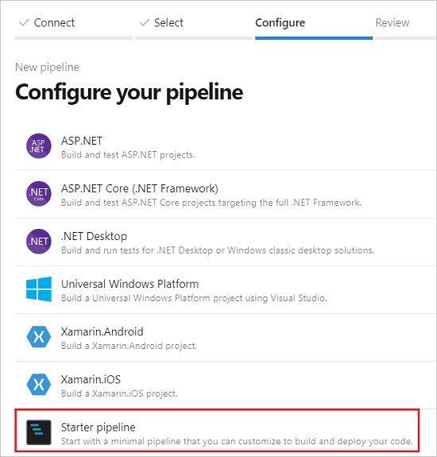
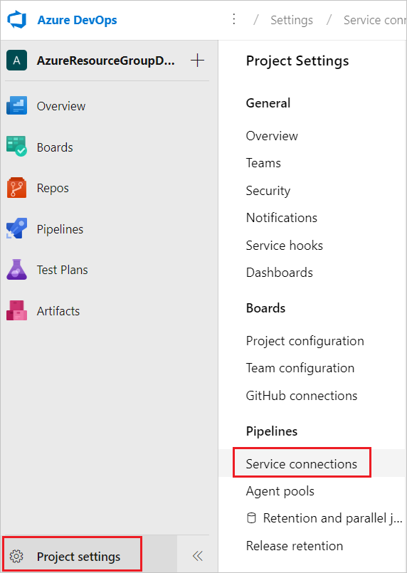

# Integrate Visual Studio project with Azure Pipelines - PowerShell task

Visual Studio provides the Azure Resource Group project for creating templates and deploying them to your Azure subscription. You can integrate this project with Azure Pipelines for continuous integration and continuous deployment (CI/CD).

There are two ways to deploy templates with Azure Pipelines:

* **Add task that runs an Azure PowerShell script**. This option has the advantage of providing consistency throughout the development life cycle because you use the same script that is included in the Visual Studio project (Deploy-AzureResourceGroup.ps1). The script stages artifacts from your project to a storage account that Resource Manager can access. Artifacts are items in your project such as linked templates, scripts, and application binaries. Then, the script deploys the template.

* **Add tasks to copy and deploy tasks**. This option offers a convenient alternative to the project script. You configure two tasks in the pipeline. One task stages the artifacts and the other task deploys the template.

This article shows how to use the Azure PowerShell task. To learn how to use the copy and deploy tasks, see [Integrate Visual Studio project with Azure Pipelines - copy and deploy tasks](vs-resource-groups-project-pipelines-copy-deploy.md).

## Prepare your project

This article assumes your Visual Studio project and Azure DevOps organization are ready for creating the pipeline. The following steps show how to make sure you're ready:

* You have an Azure DevOps organization. If you don't have one, [create one for free](/azure/devops/pipelines/get-started/pipelines-sign-up?view=azure-devops). If your team already has an Azure DevOps organization, make sure you're an administrator of the Azure DevOps project that you want to use.

* You have a Visual Studio project that was created from the **Azure Resource Group** starter template. For information about creating that type of project, see [Creating and deploying Azure resource groups through Visual Studio](vs-azure-tools-resource-groups-deployment-projects-create-deploy.md).

* Your Visual Studio project is [shared to an Azure DevOps project](/azure/devops/repos/git/share-your-code-in-git-vs-2017?view=azure-devops).

## Create pipeline

The following steps configure continuous deployment by using a single task that runs the PowerShell script in your project.

1. If you haven't added a pipeline previously, you need to create a new pipeline. From your Azure DevOps organization, select **Pipelines** and **New pipeline**.

   

1. Specify where your code is stored. The following image shows selecting **Azure Repos Git**.

   

1. From that source, select the repository that has the code for your project.

   

1. Select the type of pipeline to create. You can select **Starter pipeline**. Later in this article, you'll replace the contents of the pipeline.

   

## Add connection

You've set up a build pipeline for your project. Now, you need to add a service principal that is authorized to contribute to your Azure subscription. The tasks in the pipeline execute under the identity of the service principal.

1. In the lower left corner, select **Project settings**. Select **Service connections**.

   

1. Now, specify the type of service connection you want to create. Select **New service connection** and **Azure Resource Manager**.

   

1. Give your connection a name. For scope, select either **Subscription** or **ManagementGroup**. Select the particular subscription or management group you want to use for the new connection.

   

## Edit pipeline

You're ready to add the task that runs your script. When creating the task, there are several conditions to consider:

* Which version of Visual Studio are you using?

* Does your PowerShell script use the AzureRM module or the [Az module](/powershell/azure/new-azureps-module-az)? By default, Visual Studio creates a script that uses the AzureRM module, but you may have updated the script to use the Az module.

* Do you need to stage artifacts?

* Do you have an existing storage account for staging?

Based on your answers to these questions, your pipeline will be a little different. The following YAML file works for Visual Studio 2019 with the AzureRM module for the PowerShell script. It doesn't stage any artifacts as part of deployment.

```yaml
pool:
  name: Hosted Windows 2019 with VS2019
  demands: azureps

steps:
- task: AzurePowerShell@3
  inputs:
    azureSubscription: 'demo-deploy-sp'
    ScriptPath: 'AzureResourceGroupDemo/Deploy-AzureResourceGroup.ps1'
    ScriptArguments: -ResourceGroupName 'demogroup' -ResourceGroupLocation 'centralus' 
    azurePowerShellVersion: LatestVersion
```

If you're using Visual Studio 2017, set the pool name to `Hosted VS2017`.

```yaml
pool:
  name: Hosted VS2017
  demands: azureps
```

When you set the task to `AzurePowerShell@3`, the pipeline uses commands from the AzureRM module to authenticate the connection. If your script uses the Az module, that authentication won't work. Instead, if your script uses the Az module, set the task to `AzurePowerShell@4`.

```yaml
steps:
- task: AzurePowerShell@4
```

For `azureSubscription`, provide the name of the service connection you created.

```yaml
inputs:
    azureSubscription: '<your-connection-name>'
```

For `scriptPath`, provide the relative path from the pipeline file to your script. You can look in your repository to see the path.

```yaml
ScriptPath: '<your-relative-path>/<script-file-name>.ps1'
```

If you don't need to stage artifacts, just pass the name and location of a resource group to use for deployment. The Visual Studio script creates the resource group if it doesn't already exist.

```yaml
ScriptArguments: -ResourceGroupName '<resource-group-name>' -ResourceGroupLocation '<location>'
```

If you need to stage artifacts and want the script to create a storage account for staging, use:

```yaml
ScriptArguments: -ResourceGroupName '<resource-group-name>' -ResourceGroupLocation '<location>' -UploadArtifacts -ArtifactStagingDirectory '$(Build.StagingDirectory)'
```

If you need to stage artifacts and have an existing storage account for staging, use:

```yaml
ScriptArguments: -ResourceGroupName '<resource-group-name>' -ResourceGroupLocation '<location>' -UploadArtifacts -ArtifactStagingDirectory '$(Build.StagingDirectory)' -StorageAccountName '<your-storage-account>'
```

Now, that you understand how to create the task, let's go through the steps to edit the pipeline.

1. Open your pipeline, and replace the contents with your YAML:

   ```yaml
   pool:
     name: Hosted Windows 2019 with VS2019
     demands: azureps

   steps:
   - task: AzurePowerShell@3
     inputs:
       azureSubscription: 'demo-deploy-sp'
       ScriptPath: 'AzureResourceGroupDemo/Deploy-AzureResourceGroup.ps1'
       ScriptArguments: -ResourceGroupName 'demogroup' -ResourceGroupLocation 'centralus' 
       azurePowerShellVersion: LatestVersion
   ```

1. Select **Save**.

   

1. Provide a message for the commit, and commit directly to **master**.

## View results

When you select **Save**, the build pipeline is automatically run.

Go back to the summary for your build pipeline, and watch the status.


You can select the currently running pipeline to see details about the tasks. When it finishes, you can see the results for each step.

## Next steps
Read [Azure Resource Manager overview](resource-group-overview.md) to learn more about Azure Resource Manager and Azure resource groups.
