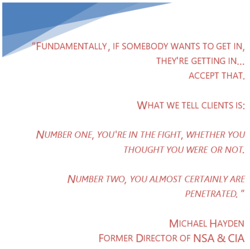
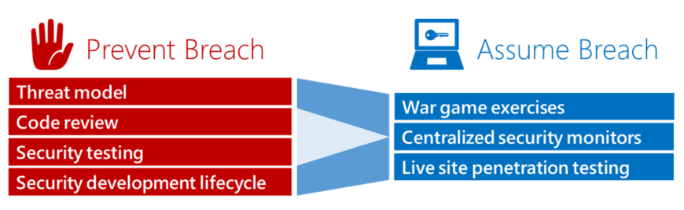
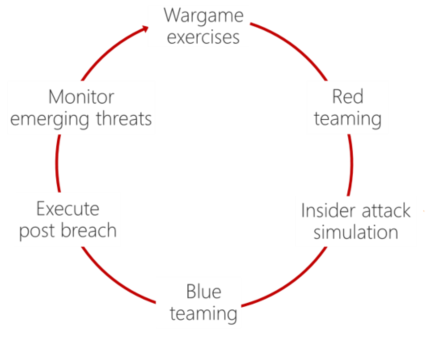
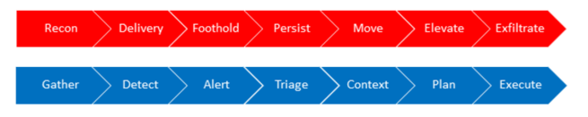

<properties
   pageTitle="Microsoft Enterprise Cloud Red Teaming"
   description="This article discusses Microsoft’s strategy and execution of Red Teaming and live site penetration testing against Microsoft managed cloud infrastructure, services and applications.You will learn how Microsoft simulates real-world breaches, conducts continuous security monitoring and practices security incident response to validate and improve the security of Microsoft Azure and Office 365."
   services="virtual-machines, cloud-services, storage"
   documentationCenter="na"
   authors="YuriDio"
   manager="swadhwa"
   editor=""/>

<tags
   ms.service="azure-security"
   ms.devlang="na"
   ms.topic="get-started-article"
   ms.tgt_pltfrm="na"
   ms.workload="na"
   ms.date="02/22/2016"
   ms.author="yuridio"/>

#Microsoft Enterprise Cloud Red Teaming

Red Teaming is above and beyond compliance accreditations or other industry requirements and provides Microsoft, and our customers, with the additional assurance that Microsoft cloud services are continuously performing security monitoring, testing, and updates to reflect the constantly changing threats that both customers and Microsoft face.

> [AZURE.NOTE] You can also download this article from the [TechNet Gallery](https://gallery.technet.microsoft.com/Cloud-Red-Teaming-b837392e). 

##Introduction

Organizations can better prepare for the impact of current and future threats by simulating real-world attacks and exercising Tactics, Techniques and Procedures (TTPs) that determined and persistent adversaries use during breaches. Rather than simply seeking to keep security incidents from occurring, it is critical to assume that a security incident can and will occur. The information gained from Red Teaming and live site penetration testing exercises helps to significantly strengthen defenses, improve response strategies, train defenders, and drive greater effectiveness of the entire security program.

Organizations cannot comprehensively identify gaps in security detection and response by solely focusing on breach prevention strategies. Understanding how to not only protect but also to detect and respond to breaches is just as important—if not more so—than taking action to prevent a breach from occurring in the first place. By planning for the worst-case scenarios, through wargames (tabletop exercise and penetration) and Red Teaming (real-world attack and penetration), organizations can develop the necessary capabilities to detect penetration attempts and significantly improve responses associated with security breaches.

###Microsoft Enterprise Cloud Red Teaming 

This article will outline how Microsoft utilizes Red Teaming, a form of live site penetration testing, against Microsoft managed infrastructure, services and applications. You will also learn how Microsoft simulates real-world breaches, continuously monitors security and practices security incident response to test and improve the security of Microsoft Azure and Office 365 (O365). Note, however, that no end customer data is deliberately targeted during Red Teaming and live site penetration testing. The tests are against Microsoft Azure and O365 infrastructure and platforms as well as Microsoft’s own tenants, applications and data. Customer tenants, applications and data hosted in Microsoft Azure or O365 are never targeted.

###Beyond Prevention 

Security prevention strategies and technologies cannot guarantee safety from every attack. Given today’s threat landscape, it is vital to acknowledge that a breach has either already occurred or that it’s only a matter of time until it will. It is more likely that an organization has already been compromised, but just hasn’t discovered it yet. Operating with this assumption will reshape detection and response strategies in a way that pushes the limits of any organization’s infrastructure, people, processes, and technologies.

According to Verizon's 2014 Data Breach Investigation Report, in roughly 80% of the cases the breached organization did not detect the compromise (pg. 12, <http://www.verizonenterprise.com/DBIR/2014/>[)](http://www.verizonenterprise.com/DBIR/2014/). Instead, they were notified of the breach by an external party such as a customer, law enforcement, third party service, or external fraud detection agency. On top of that, these metrics are only taken from incidents where the attacker was eventually detected! They do not include the cases where the attacker has so far gone undetected.

In the sections that follow, we will discuss the move to a new security strategy that is being used across Microsoft’s cloud services, including Microsoft Azure and Office 365. This security strategy, called Assume Breach, is both a methodology and cultural shift that alters the basic premise of design, engineering and operations by assuming that attackers have already exploited vulnerabilities, gained privileged access, and are actively persistent on live production services.

##Traditional Security Methodology 

Traditional security methodologies have largely been focused on prevention. Prevention is a defensive strategy aimed at eliminating vulnerabilities and thereby mitigating security breaches before they happen. In Microsoft’s Online Services portfolio (which includes Microsoft Azure, Office 365, CRM Online, and others), this involves continuous improvements to security processes with our [*Security Development*](http://www.microsoft.com/security/sdl/default.aspx) [*Operational Security Assurance*](http://www.microsoft.com/download/details.aspx?id=40872) (OSA) programs. Threat Modeling, static code analysis and security testing are useful in enumerating, reducing, and managing attack surfaces—but they do not eliminate all security risks.

An example of a prevention strategy is how Microsoft limits operator/administrator access to employees who have a demonstrated need for access and who meet eligibility requirements (for example, passed a background check, met all compliance and security requirements, in a job function/role that requires access, etc.). Furthermore, administrators maintain zero standing permissions and instead they are given Just-In-Time (JIT) access[1] and Just Enough Administration (JEA)[2]. Other examples include segregating the employee email environment from the production environment and the use of specialized, highly secure hardened workstations for performing sensitive operations.

Wherever possible, human intervention is replaced by automated, heavily audited, tool-based processes. Some examples of routine functions include deployment, debugging, diagnostic data collection and service administration. Microsoft Online Services continue to invest in systems security and operations automation in order to reduce exposure to potential security risks.

From an operations technology perspective, breach prevention investments limit exposure, but can never completely eliminate it. Therefore, while adoption and continued maturation of Microsoft’s security programs (e.g. SDL and OSA) and technologies remains an important means to help prevent security breaches, everyone must accept that it is inevitable that security breaches will impact their organization, services and users.

###New and Emerging Threats 

During the past five or more years, one specific threat category has become much more widely discussed. Advanced Persistent Threat (APT) was a term coined to refer to nation-state sponsored attempts to infiltrate military, defense industrial base, and government networks with the specific goal of exfiltrating sensitive data. Today, the term APT is used widely in media and security circles to describe any attack that seems to specifically target an individual organization, or is thought to be notably technical in nature regardless of whether the attack was actually advanced or persistent. Common characteristics of an APT include:

- Sophisticated planning

- Specific/sequential targeting

- Effective reconnaissance

- Practiced tool usage

- Social engineering

Today’s adversaries have substantial resources and orchestration at their disposal. Regardless of the adversary’s sophistication, the security incident trends of late 2009 until today are a clear indication that the increased probability of an event and risks are on the rise. The increased sophistication and targeted nature of security threats, coupled with their increasing frequency suggests that—sooner or later— security breaches will affect all users and organizations.

In the current threat landscape, a prevention-only focus is not enough to address determined and persistent adversaries. Additionally, with common security tools, such as antivirus and Intrusion Detection Systems (IDS), it is difficult to capture or mitigate the full breadth of today’s breaches. Network edge controls may keep amateurs out, but talented and motivated attackers will always find the means to get inside these virtual perimeters. As a result, organizations are all too often ill prepared when faced with the need to respond to the depth and breadth of a breach.

With the evolution of IT and adoption of the cloud, no longer can the boundaries of the enterprise be defined by a network perimeter managed physically or virtually through firewalls. Corporate data, including sensitive data and applications, can be found nearly everywhere: on-premises, in private datacenters, in the cloud, with partners and on a variety of user devices. All of which require a fundamentally different security strategy as well as a shift in the security methodologies utilized by most organizations.

Breach response has always presented many challenges including identifying the scope of breach, timely notification to stakeholders and customers, investigating data loss and recovering compromised assets. Through a combination of today’s adversaries and the evolution of IT, breach response has never been more challenging than now. Therefore, rather than the traditional focus on just preventing breaches, an effective security strategy assumes that determined and persistent adversaries will successfully breach any defenses.

##Assume Breach Methodology 

The current threat landscape requires that effective security strategies balance investments in prevention with detection and response. Through a detailed analysis of security trends, Microsoft began advocating and highlighting the need for additional investments in reactive security processes and technologies that focus on detection and response to emerging threats, rather than solely the prevention of those threats. In addition, as a result of the changes in threat landscape and an in-depth analysis, Microsoft decided to refine its security strategy beyond just preventing security breaches to one better equipped to deal with breaches when they do occur – a strategy which considered the prediction of major security events not as a matter of “if”, but “when”.

While Microsoft’s Assume Breach practices have been in place for many years, most customers are unaware of the work being done behind the scenes to harden the Microsoft cloud. Assume Breach is a mindset that guides security investments, design decisions and operational security practices. Assume Breach limits the trust placed in applications, services, identities and networks by treating them all—both internal and external—as not secure and probably already compromised. Although the Assume Breach strategy was not born from a breach of any of Microsoft enterprise or cloud services, it was a recognition that many organizations, across the industry, were being breached despite all attempts to prevent it.

While preventing breaches is a critical part of any organization’s operations, those practices must be continuously tested and augmented to effectively address modern adversaries such as APTs. In order for organizations to prepare for a breach, they must first build and maintain robust, repeatable and thoroughly tested security response procedures.

While Prevent Breach security processes, such as threat modeling, code reviews and security testing may be common in secure development lifecycles, Assume Breach provides numerous advantages that help account for overall security by exercising and measuring reactive capabilities in the event of a breach. At Microsoft, we set out to accomplish this through ongoing wargame exercises and live-site penetration testing of our security response plans with the intent to improve detection and response capability.

*Figure 1: Prevent and Assume Breach models*

With Assume Breach, security focus changes to identifying and addressing gaps in:

- Detection of attack and penetration

- Response to attack and penetration

- Recovery from data leakage, tampering or compromise

- Prevention of future attacks and penetration

Assume Breach verifies that protection, detection and response mechanisms are implemented properly - even reducing potential threats from “knowledgeable attackers” (using legitimate assets, such as compromised accounts and machines).

The nature of cloud and hybrid computing models adds significance to the role penetration testing plays in maintaining a secure operating environment, including preparedness for dealing with breaches. Since many aspects of the Microsoft cloud are not under a customer’s direct control, Microsoft works to not only protect against, but also detect and respond to attacks against the infrastructure, platform and services. 

Microsoft therefore conducts wargame exercises and regular Red Teaming to evaluate and improve Microsoft’s Assume Breach readiness. Through the modeling of real-world attacks as well as penetration tests, Microsoft can test its ability to handle attacks, identify gaps in detection and response and focus resources to address those gaps. By practicing security incident response, performing continuous monitoring, forensics and recovery, Microsoft strives to develop the critical capabilities needed to deal with breaches.

###Assume Breach Execution 

Assume Breach in Microsoft cloud services was initially carried out via wargames and then actual breach exercises, called Red Team breaches, intended to simulate real-world attacks. Red Team breaches test Microsoft’s abilities to respond to targeted and persistent attacks with the goal of significantly reducing the Mean-Time to Detect (MTTD)[3] and Mean-Time to Recovery (MTTR)[4].

*Figure 2. Assume Breach execution cycle*

Wargames are a tabletop exercise which serve as a fire drill versus a real fire. Red Team exercises deliver end-to-end breach simulations that provide, as realistically as possible, security incidents that prepare those involved with dealing with actual breaches.

Wargames and Red Team breaches provide opportunities for security incident response to be practiced ahead of an actual event – the more practice the better equipped one will be for a genuine incident or breach.

###Wargames 

Prior to dedicating resources to all out Red Team breaches, at Microsoft, we started with tabletop exercises called wargames. Wargame exercises are akin to [SDL Threat Modeling](http://msdn.microsoft.com/magazine/dd148644.aspx)[,](http://msdn.microsoft.com/magazine/dd148644.aspx)though geared to the security response process and personnel of an organization or service dealing with an attack. The intent of wargaming is improving security incident response procedures by engaging personnel from different groups inside Microsoft – from Security to Engineering and Operations. As we initiated and continued wargames in more and more depth, it became clear which groups or representatives we were missing and needed to be engaged. 

Any individual or group that was likely to be needed and involved in an actual breach was added as a stakeholder in our wargame exercises. The list of representatives grew to not only include Security, Engineering and Operations, but representatives from nearly every group within the company such as Legal, Human Resources, Marketing and even Executives. Involving a broad set of groups and individuals helped build the necessary relationships across disciplines and business units that ensured the development of comprehensive breach response plans. In many instances, these exercises also served to educate and provide awareness throughout Microsoft on risks and needs associated with breach response.

The primary goal of wargame exercises is to ensure completeness of Standard Operating Procedures (SOPs) and to improve detection and response. There are three (3) main phases of wargame exercises:

-   Attack scenario identification

-   Mock attack and response process

-   Post-mortem

Attack scenario identification started by formulating a list of potential attacks to model. These attack scenarios, took many different forms and often combined various attack scenarios such as:

-   Denial of service

-   Malware outbreak

-   Remote code execution

-   Customer data compromise

-   Inside attacker

-   Service compromise

Scenarios were often chosen and prioritized from those known to be common, or by reviewing previously reported security incidents (known to affect Microsoft, our competitors, or observed occurring across the industry).

Once an attack scenario had been chosen, one or more of the group members, usually a member of the security team, would play the role of the adversary (offense) and describe the execution of the attack scenario. This is the beginning of the mock attack and response process. 

The other members participating in the wargame would play the role of defense and describe how they might detect or respond to the attack scenario - referring to any Standard Operating Procedures that already existed (or identifying those that were missing or incomplete). As defense responded with steps to detect, investigate, mitigate or recover from the mock attack, offense would respond with counter-attack methods that would often invalidate defense assumptions and force the defenders to think deeper about detection and response. 

For example, if defense suggested identifying and blocking the attackers IP address used in the attack, offense would note the ease of changing source IP addresses or leveraging commonly available attack infrastructure, such as botnets, to source their attack from numerous IP addresses. This constant back and forth, during the tabletop exercises, leads to a significant increase in SOPs and identification of numerous security investment needs, as well as many valuable discussions.

While very useful, wargames do have their limitations on what can be measured – especially as it relates to dealing with ongoing targeted attacks and persistent adversaries. Therefore, Microsoft set out to truly assess and measure readiness against sophisticated attacks from determined and persistent adversaries. Apart from dealing with actual security breaches we could think of no better way than to do just that – produce actual security breaches - using a concept called Red Teaming. Red Teaming refers to the use of real-world breach tactics for attack and penetration. Red Teaming takes the theoretical aspect of wargaming and makes it real.

### Red Teaming 

The Assume Breach security strategy is executed by two (2) core groups: the Red Team (attackers) and the Blue Team (defenders)[5]. Referred to as Red Teaming, the approach is to test Microsoft Azure and Office 365 systems and operations using the same Tactics, Techniques and Procedures (TTPs) as real adversaries, against live production infrastructure, without the foreknowledge of the infrastructure and platform Engineering or Operations teams. 

This tests security detection and response capabilities, and helps identify production vulnerabilities, configuration errors, invalid assumptions or other security issues in a controlled manner. Every Red Team breach is followed by full disclosure between the Red Team and Blue Team to identify gaps, address findings and significantly improve breach response.

#### The Red Team 

The Red Team is a group of full-time staff within Microsoft that focuses on breaching Microsoft’s infrastructure, platform and Microsoft’s own tenants and applications. They are the dedicated adversary (a group of ethical hackers) performing targeted and persistent attacks against Online Services (Microsoft infrastructure, platforms and applications but not end-customers’ applications and data).

The role of a Red Team is to attack and penetrate environments using the same steps as an adversary’s kill chain[6] shown in Figure 3:

*Figure 3. Breach stages*

Therefore, researching and understanding industry incidents and threat landscape trends in order to stay on top of the latest attack techniques and tools used by adversaries is a critical part of any Red Team’s approach. As one of the most attacked Internet properties in the world, Microsoft Online Services generate a wealth of data on emerging threats. The Red Team uses this research and intelligence to not only model but also execute real-world tactics associated with an adversary kill chain.

In addition to research and modeling known adversaries, the Red Team develops and derives its own novel techniques for compromising Microsoft Azure and Office 365 using custom-developed penetration tools and attack methods. Just like determined adversaries, the Red Team utilizes emerging and blended threats in order to perform compromises and will change tactics when presented with new roadblocks or defenses. 

Since talented and motivated attackers breach perimeter defenses, so must the Red Team. Edge controls may keep amateurs out, but persistent adversaries always get inside. Once inside, it is common for the Red Team to acquire insider privileges which they use to pivot laterally to penetrate the infrastructure even deeper. Additionally, like most skilled adversaries, the Red Team establishes a beachhead from which to maintain persistence and may continuously modify their approach to evade detection. 

For example, the Red Team may install custom tools (bots, remote control, etc.) allowing them continual access to a compromised resource and retrieval of information whenever they please. The mechanics of such an attack allow the Red Team to not just exfiltrate sensitive data, but leverage that compromised data (again, only Microsoft’s data—not customers’ data).

Due to the sensitive and critical nature of the work, the employees who work on Red Teams at Microsoft are held to very high standards of security and compliance. They go through extra validation, background screening, and training before they are allowed to engage in any attack scenarios. Although no customer data is deliberately targeted by the Red Team, they maintain the same Access To Customer Data

(ATCD) requirements as service Operations personnel that deploy, maintain and administer Microsoft Azure and Office 365. In addition, the Red Teams only attack Microsoft managed infrastructure and platforms. As opposed to attacking end-customer data or applications, the Red Teams attacks tenants, applications and data in the cloud that Microsoft owns and operates.

Nevertheless, the Red Teams abides by a strict code of conduct. Five (5) primary guiding principles of the red team’s code of conduct include:

1.  Do not intentionally cause customer Service Level Agreement (SLA) impact or downtime.

2.  Do not intentionally access or modify customer data.

3.  Do not intentionally perform destructive actions.

4.  Do not weaken in-place security protections.

5.  Safeguard vulnerability and other critical information within the Red Team and only share those with a need-to-know.

In addition, the Azure and O365 Red Teams must follow a documented set of Rules of Engagement (ROE), which have been developed to assure that the code of conduct is met. These Rules of Engagement are signed-off by Microsoft’s leadership.

A number of security metrics are critical to track as each Red Team performs their breaches:

-   Mean Time to Compromise (MTTC)

-   Mean Time to Privilege Escalation or “Pwnage” (MTTP)

Mean Time to Compromise measures the start of the exercises to the point in time when the Red Team has successfully compromised an asset. At this stage, the Red Team is usually establishing their initial foothold in the target environment. Mean Time to Privilege Escalation, or what some adversaries prefer to call “Pwnage”, is the time from the start of the exercise to full compromise. For example, in Active Directory-based environments this is the point in time when the Red Team acquires Domain Administrator privileges and/or compromises the Domain Controller. 

One can think of MTTP as “Game Over” since most organizations are not well prepared to deal this this level of breach. However, it is also worth noting that “Game Over” scenarios are not the only objectives or scenarios demonstrated by Red Teaming. Red Team breach objectives may include data theft, tenant-level compromises or Denial of Service, among others. Additionally, MTTC and MTTP metrics can be calculated per exercise or can also be tracked and calculated per target asset or asset type for additional granularity.

The role of Microsoft Red Teams is to identify gaps in the target’s security controls. Tracking MTTC and MTTP allows Microsoft to determine a baseline from which to continuously improve upon. By exploiting security weaknesses while highlighting security monitoring and recovery gaps, Red Teaming improves incident response tools and process (more on this later). Most importantly, Red Teaming produces demonstrable impact, through compromises, which proves the need for Assume Breach. As a result, Red Teaming enumerates business risks and justifies defense resources, priorities and investment needs.

#### The Blue Team 

The Blue Team is comprised of either a dedicated set of security responders or members from across the security incident response, Engineering, and Operations organizations. Regardless of their make-up, they are independent and operate separately from the Red Team. The Blue Team follows established security processes and uses the latest tools and technologies to detect and respond to attacks and penetration. 

Just like real-world attacks, the Blue Team does not know when or how the Red Team’s attacks will occur or what methods may be used. Their job, whether it is a Red Team attack or a bona fide assault, is to detect and respond to all security incidents. For this reason, the Blue Team is on-call 24x7, 365 days a year and must react to Red Team breaches the same way they would for any other adversary.

When an adversary, such as a Red Team, has breached an environment, the Blue Team must:

-   Gather evidence left by the adversary

-   Detect the evidence as an Indication of Compromise

-   Alert the appropriate Engineering and Operation team(s)

-   Triage the alerts to determine whether they warrant further investigation

-   Gather context from the environment to scope the breach

-   Form a remediation plan to contain or evict the adversary

-   Execute the remediation plan and recover from breach

These steps form the security incident response kill chain that runs parallel to the adversary’s kill chain, as shown in Figure 4:

*Figure 4. Breach response stages*

In a nutshell, Red Team breaches allow for exercising the Blue Team’s ability to detect and respond to real-world attacks end-to-end. Most importantly, it allows for practiced security incident response prior to a genuine breach (from a much less cooperative adversary). Additionally, as a result of Red Team breaches, the Blue Team enhances their situational awareness which can be valuable when dealing with future breaches (whether from the Red Team or another adversary). 

Throughout the detection and response process, the Blue Team produces actionable intelligence and gains visibility into the actual conditions of the environment(s) they are trying to defend. Frequently this is accomplished via data analysis and forensics, performed by the Blue Team, when responding to Red Team attacks and by establishing threat indicators, such as Indicators of Compromise.

Much like how the Red Team identifies gaps in the security story, Blue Teams identify gaps in their ability to detect and respond. Furthermore, since the Red Team’s models real-world attacks, the Blue Team can be accurately assessed on their ability, or inability, to deal with determined and persistent adversaries.

Finally, Red Team breaches measure both readiness and impact of the organization’s breach response.

Metrics that are commonly evaluated by the Blue Team include:

- Estimated Time to Detection (ETTD)

- Estimated Time to Recovery (ETTR)

The reason these are “estimated times” is that during a breach, regardless of if/when detection occurred, the Blue Team cannot be 100% certain when the Red Team performed a successful compromise. Likewise, the Blue Team cannot be entirely certain whether they successfully evicted the Red Team and fully recovered from a breach. A lack of evidence of Red Team presence is not evidence of adversary eviction and breach recovery. This is what makes security incident response so challenging – it is similar to putting together a puzzle, one piece at a time, without knowing what the final puzzle picture should look like and what puzzle pieces may be missing for a complete picture.

With increased awareness of the overall threat landscape and increased visibility into actual conditions within the environment they are operating in, the Blue Team can augment security incident response practices and procedures to enhance their preparedness to deal with a breach.

#### Red vs. Blue 

As opposed to traditional penetration testing, Red Team breaches strive to simulate real-world threats including the inherent “fog of war”[7]. That is to say, the Blue Team does not know what the Red Team is doing and vice-a-versa. When the Red Team compromises an asset, they may trigger a security alert or incident without realizing they have done so.

Conversely, the Red Team may intentionally trigger alerts to verify and validate monitoring assumptions or as a diversionary tactic. Similarly, during an exercise the Red Team may observe response activity such as password resets, compromised assets being recovered, persistence mechanisms removed, or even experience full eviction (although this last one can be rare). 

In these regards, Red Team breaches can observe the impacts of detection and recovery. However, both detection and recovery cannot be accurately assessed by the Red Team or Blue Team alone. Both the Mean-Time To Detection (MTTD) and Mean-Time To Response (MTTR) can only be calculated at the end of an exercise when full disclosure occurs between both the Red and Blue Teams. To fully impact detection and response, a Red Team must:

- Emulate a broad range of TTPs rooted in intelligence about adversaries an organization faces (or will face)

- Employ TTPs across the kill-chain that will exercise and validate detections and response

- Employ both technical sophistication and operational sophistication

- Utilize repetition to ensure that detection and response improvements are sufficient to combat determined and persistent adversaries

In order to ensure the exercise includes initiation and engagement of the Blue Team, the Red Team may intentionally trigger detection and response. This usually happens once the Red Team has accomplished all their primary objectives and if they have not observed any Blue Team activity. 

One example of triggering detection and response is intentionally causing an anti-malware scan on an asset, such as the domain controller (DC), to alert using an EICAR test file[8]. The presence of an unexpected security alert, especially on a critical asset such as the DC, should activate Blue Team response procedures. Creating a security incident ensures that an end-to-end breach is exercised – from compromise through to response. Unless the Blue Team is engaged, breach response may not be fully exercised.

Ideally the Blue Team does not (initially) know if an incident was triggered from an actual attacker or from the internal Red Team. Whenever possible, the Blue Team should treat security incidents as a real incident; at least until attribution to the Red Team can be established and confirmed. This approach of real-world breach simulations is the best method for building real-world defenses.

#### Red Team Breach Post-Mortem 

At the end of each Red Team breach, both the Red and Blue Teams come together for a post-mortem which evaluates the breach and breach response. It is at this stage that both teams share tactics and lessons learned while providing full disclosure. The Red Team provides all the details on when and how they breached the environment, what assets were compromised and controlled by the Red Team, whether the Blue Team was fully or only partially successful in evicting the Red Team and if recovery from the breach is complete. 

In addition, the Blue Team provides all the details on how and when the Red Team was detected (if at all), what assets were identified as compromised, which Red Team persistence mechanisms were discovered, and what response steps were taken in an attempt to evict the Red Team and recover from the breach. This is one of the most unique and critical elements of Red Teaming – the Red Team is one of the only adversaries that can and will provide details of their breach as well as feedback on the success (or lack thereof) of detection and response. The ability for both the Red Team and Blue Team to compare notes is vital to ensure that all detection and response gaps are identified.

Only during the post-mortem, when full disclosure takes place, can the true Mean-Time To Detection (MTTD) and Mean-Time To Recovery (MTTR) metrics be calculated – for example, comparing the difference between the Red Team MTTC and the Blue Team ETTD in order to calculate the actual MTTD. These detection and response metrics, both during and after the incident, are useful to enumerate business risks associated with security detection and recovery gaps identified as part of the exercise. 

Much of the rest of the post-mortem is spent with the Red and Blue Teams collaborating to identify vulnerabilities and investment needs that would improve protection, detection and response. With each Red Team breach both the Red and Blue Teams identify security investments needed to harden against future attacks, slow down adversaries, and speed up detection and recovery. In other words, increase MTTC and decrease MTTD and MTTR.

The final step during the post-mortem is for both the Red and Blue Teams to provide detailed written reports. These reports include Red and Blue Team breach timelines, summary of the business impact of the exercise, as well as a detailed list of vulnerabilities, findings and investments needed to improve breach detection and response.

### Security Principles 

A key benefit of Red Teaming is the consolidation of expert security and ethical hacking resources. As with any other profession, Engineers and Operations personnel have areas where they specialize, which may not include attack and penetration skills. In Microsoft, Engineers and Operators are well versed in SDL/OSA and Common Engineering Criteria (CEC), but the Red Team takes the responsibility of security testing to the outer limits of a production environment that would otherwise be too cumbersome to tackle. 

By investing in Red Teaming with the sole focus to understand, communicate and leverage the latest threats during live site attacks, Microsoft strives to continuously test and improve its reactive capabilities and follow key security principles:

- Resist anchoring security strategy on **static attack scenarios** or assuming adversaries will only come from **one fixed position**

- Utilize **layers of complementary security controls**; the effect is cumulative, improving defenses

- The **number and distribution** of security controls is more important than individual efficiency

- Seek to **delay and respond** rather than **prevent** an attack

## Summary 

Companies industry-wide are faced with the harsh reality that they may have been living in a constant state of compromise. This is made worse by the fact that a large number of companies remain blissfully unaware that they, too, are breached. Today’s threat landscape requires reducing exposure to attacks including insider threats. The most imperative change requires organizations to significantly decrease the mean time to detection and recovery from a breach.

This whitepaper highlights the need for organizations to become more agile in addressing security gaps. Through an Assume Breach security strategy, Microsoft continues a never-ending pursuit of broader and deeper investments in security. All organizations can benefit from adopting similar security strategies for combatting emerging and evolving threats.

Microsoft develops capabilities to manage security incidents by planning, in advance, for compromises and by simulating attack and penetration with wargames and an active Red Team. Red Teaming makes theoretical scenarios real by exposing gaps in security, by exploiting live vulnerabilities and by providing concrete evidence of the need to Assume Breach. 

The challenging world of Blue Teaming exercises the ability to detect and respond in the face of attacks. By performing Red vs. Blue Team breach exercises, security organizations can focus on key attack vectors, develop countermeasures and mature their critical response mechanisms needed to prepare for determined and persistent adversaries.

Red Teaming has become one of the most essential parts of developing and securing Microsoft’s infrastructure, platform and services. The Microsoft Azure and Office 365 Red Teams impersonate sophisticated adversaries and allows Microsoft to validate and improve security, strengthen defenses and drive greater effectiveness of its enterprise cloud security programs. 

Through regular live site attack and penetration, Red Team breaches provide the critical means to practice security incident response as well as accurately measure readiness and the impacts of real-world attacks. Customers can be confident that Microsoft is continuously improving protection, detection and response in the process of striving to deliver more secure cloud services.

## References and Further Reading 

The following resources are available to provide more general information about Microsoft Azure and Office 365 services, as well as specific items referenced in the main text:

- [Microsoft Azure Home](http://azure.microsoft.com) – general information and links about Microsoft Azure

- [Microsoft Office Home](http://products.office.com) – general information and links about Microsoft Office

- [Microsoft Azure Trust Center](https://www.microsoft.com/TrustCenter/CloudServices/Azure)

- [Microsoft Office 365 Trust Center](https://www.microsoft.com/TrustCenter/CloudServices/Office-365)

- [Microsoft Security Response Center](http://www.microsoft.com/security/msrc/default.aspx)

- Microsoft Azure or Office 365, can be reported\] o [*http://www.microsoft.com/security/msrc/default.aspx*](http://www.microsoft.com/security/msrc/default.aspx) or via email to *secure@microsoft.com*

- [Interview with Mark Russinovich on Microsoft Azure & Security - Update on Penetration Testing](http://blogs.technet.com/b/matthewms/archive/2013/07/02/an-interview-with-mark-russinovich-on-windows-azure-amp-security-update-on-penetration-testing.aspx)

- [Red vs. Blue - Internal security penetration testing of Microsoft Azure and O365](http://azure.microsoft.com/documentation/videos/red-vs-blue-internal-security-penetration-testing-of-microsoft-azure/)

## APPENDIX 

### Difference between Red Teaming and Penetration Testing 

Standard penetration test techniques use common tools to attempt exploits, but rarely leverage the full capabilities of a knowledgeable adversary.

Traditional penetration testing only represents a point in time, and then it ends without further stressing the environment and incident response the way a real adversary does. Red Teaming is ongoing, and does not stop when the test is complete. Red Teaming will find things that other penetration test methodologies often miss (summarized in Table 1 below):

**TRADITIONAL PENETRATION TESTING RED TEAMING**

|                           | Traditional Penetration Testing                                                                                                                                                              | Red Teaming                                                                                                                                                                                                       |
|---------------------------|----------------------------------------------------------------------------------------------------------------------------------------------------------------------------------------------|-------------------------------------------------------------------------------------------------------------------------------------------------------------------------------------------------------------------|
| **Persistence**               | Stops when successfully compromised the environment                                                                                                                                          | Establish persistence mechanism to maintain access and evaluate breach recovery completeness                                                                                                                      |
| **Tools**                     | Only uses what’s available at that time, and then must wait until you engage in the next test cycle                                                                                          | Constantly researching new exploits and vulnerabilities, and implements an attack with new tools as soon as they are discovered                                                                                   |
| **Post-breach activity**      | Are “white hat” (they only try to get in, and if they do, they usually don’t do anything further)                                                                                            | Leverages the breach to exfiltrate and exploit critical data for launching further attacks                                                                                                                        |
| **Escape and evade**          | Static tests may not attempt to evade detection and stop if it is found out                                                                                                                  | Dynamic tests that attempt to avoid detection                                                                                                                                                                     |
| **Knowledgeable adversaries** | Tends to favor stressing the security systems that are known to be in place (since may have full knowledge of the IT systems), test whether they are deployed properly or use known exploits | Probes to see what has *and* hasn’t been deployed to find vulnerabilities; uses internal knowledge and custom tools to attack systems including development of custom and previously unknown exploits             |
| **Live-Site**                 | Almost never attacks full production systems; used most often for testing pre-deployment systems                                                                                             | Attacks production systems; attacks all layers of the stack                                                                                                                                                       |
| **Motivation**                | Makes assumptions about the environment, may not test where it isn’t told to go                                                                                                              | Makes no assumptions; attempts to compromise everywhere; pivots and changes tactics if/when needed                                                                                                                |
| **Results**                   | Shows what tests were conducted and the results (success / failure)                                                                                                                          | Measures and accurately assesses MTTC, MTTP, MTTD and MTTR. Provide detailed evidence on when and how to breach the environment, what assets were compromised and whether detection and response were successful. |

**Table 1: Summarizing the differences between traditional penetration testing and Red Teaming**

##Why Attack Production? 

Test and pre-production invariably never match production. Changes made during deployment, ongoing service operations and differences in production customers’ use all contribute to a variance in state. This variation exists for good reason as production faces different needs with respect to expected load, acceptable downtime, as well as security, compliance, regulatory and contractual requirements.

Red Teaming targets real systems via live site penetration testing rather than just attacking a development/test environment in a lab with hypothetical workloads, or even real components with mock data. It is one of the main ways that Red Teaming differs from more traditional security strategies: real servers, real tenants, and real data. Live site penetration testing of production provides a much more trustworthy and accurate measurement of the customer and business impacts associated with a breach.

Live site penetration of production offers additional benefits. It puts defensive capabilities of detection and response on trial. Real-world attacks test the strength of production-deployed protections, detection and response capabilities (or lack thereof). It forces these investments to accept the fact that production is under attack, may currently be in a compromised state, and represents a forcing function for security incident response to regularly practice methods for dealing with targeted attacks and persistent adversaries.

##Running a Red Team 

Adopting Assume Breach does not absolutely require investing in your own Red Team resources. Many of the benefits can be realized simply by altering your approach to infrastructure and application security testing and deployment. For example, understanding that a data breach can live on, far past the initial compromise, can help you design safeguards to protect information and critical assets even in the event of a breach.

However, Red Teaming is an effective way to test the veracity of your security measures and processes, raise awareness of the current landscape, and keep engineers, operations, security-responders and management aware of emerging threats. To determine what your investment priorities should be, consider the following:

-   **Prevent Breach vs. Assume Breach** one is not a replacement for the other. Prevent Breach is the critical implementation of security capabilities to defend against attacks. Assume Breach goes far beyond those protections to account for detection and response before, during and after a breach.

-   **Identify the crown jewels** prioritize investments using the Assume Breach approach. What is the most critical data to the business? Where is that data stored? What are the most critical assets to running the business?

-   **Identify relevant exercises** prioritize security exercises based on breach trends and attacker TTP applicable to your environment.

-   **Get buy-in** in particular at the Executive-level and ensure Legal sign-off. Additionally, the various working groups / divisions in your company should be aware of and accepting of the work you are doing; launching attacks against operations that have never been attacked before could cause unintended service disruptions and customer-satisfaction issues.

Once you have built a plan to do Red Teaming, you will need to protect your operations:

-   **Staff** — ensure you have adequate expert resources on both sides of Assume Breach (Red and Blue Teams). The Blue Team should treat all security incidents, including Red Team breaches, as a real incident. Consider the trade-off of full-time resources vs. outsourcing including the security of the intellectual property produced and compromised during Red Teaming. If you will be engaging a third-party vendor, *check their scope*, liability, and reputation.

-   **Screen** — in addition to team members having the necessary technical skills, they need to be trustworthy; thoroughly research potential employees, including in-depth background checks.

-   **Train** — if you are hiring for full-time employees, they should be trained in standard ethical, security, privacy, and compliance practices, plus any unique requirements of your business or industry (external agencies should be certified to guarantee regular training activities).

-   **Audit** — it is imperative that the Red Team’s activity be properly monitored, logged, and audited prior to and during Red Team exercises. This serves as out of ‘get out of jail free card’ should the Red Team be blamed for damages that are not the result of the exercise; can help ensure the Red Team follows a strict code of conduct and abides by the Rules of Engagement. In addition, these log and audit records are often instrumental in calculating MTTC, MTTD and MTTR as well as providing a detailed report post-exercise.

-   **Operational Security** — it is absolutely critical that Red Team members exercise strict operational security regarding its TTPs, tools, security findings, reports, exploits, backdoors and other assets. Should an attacker gain access to a Red Team's assets they would be able to quickly reconstruct and replay attacks against known vulnerabilities with devastating impacts.

##Additional Information

Enterprise-scale penetration testing requires the involvement of multiple parties within an organization. Since this document covers procedural guidance, it is intended for those responsible for evaluating environments, systems and processes for security risks. Note, that the details provided herein are an overview of how security teams for Microsoft Azure and Office 365 conduct Red Teaming and live site penetration testing, not instructions on how customers should attack Microsoft’s cloud infrastructure, platforms or services.

While Microsoft conducts regular penetration testing to improve cloud security controls and processes, we understand that security assessments are also an important part of our customers' application development and deployment activities. Therefore, we have established a policy enabling customers to conduct authorized penetration testing on their applications such as those hosted in Microsoft Azure. 

Since such testing can be indistinguishable from a real attack, it is critical that customers conduct penetration testing only after obtaining approval in advance from Microsoft Azure Customer Support. Customer penetration testing must be conducted in accordance with Microsoft’s terms and conditions. Requests for penetration testing must be submitted with a minimum of 7-day advanced notice. For more information, please refer to the [Microsoft Trust Center]https://www.microsoft.com/TrustCenter/CloudServices/Azure).

## References

[1] Just-in-Time (JIT) access and elevation – Elevation that is granted on an as-needed and only-at-the-time-of need basis. Often implemented by requiring one or more approvals before access is granted.

[2] Just Enough Administration (JEA) – A solution designed to help protect systems by allowing specific users to perform administrative tasks without giving them administrator rights, and then auditing all actions that these users perform. For more information see  [Just Enough Administration article at TechNet Gallery](https://gallery.technet.microsoft.com/Just-Enough-Administration-6b5ad370)

[3] In the context of a security breach, MTTD refers to the amount of time it takes to detect a breach.

[4] MTTR refers to how long it takes to recover from a breach once detected.

[5] Both Microsoft Azure and Office 365 staff separate full-time red and blue teams.

[6] See Lockheed Martin’s [“Intelligence-Driven Computer Network Defense Informed by Analysis of Adversary Campaigns and Intrusion Kill Chains”](http://www.lockheedmartin.com/content/dam/lockheed/data/corporate/documents/LM-White-Paper-Intel-Driven-Defense.pdf) for more information.

[7] Fog of war – Used to describe the uncertainty in situational awareness experienced by participants regarding one's own capability, adversary capability, and adversary intent.

[8] EICAR test file – also known as EICAR Standard Anti-Virus Test File - is a computer file that was developed by the European Institute for Computer Antivirus Research (EICAR) and Computer Antivirus Research Organization (CARO), to test the response of antimalware programs. Instead of using real malware, which could do real damage, this test file allows one to test antimalware software without using a real computer virus.

*(c) 2014 Microsoft Corporation. All rights reserved. This document is provided "as-is." Information and views expressed in this document, including URL and other Internet Web site references, may change without notice. You bear the risk of using it. Some examples are for illustration only and are fictitious. No real association is intended or inferred. This document does not provide you with any legal rights to any intellectual property in any Microsoft product. You may copy and use this document for your internal, reference purposes.*

