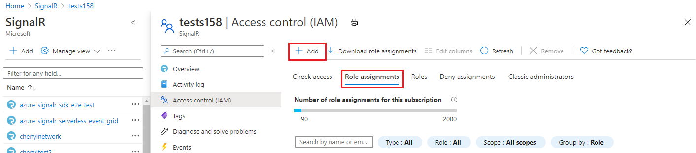
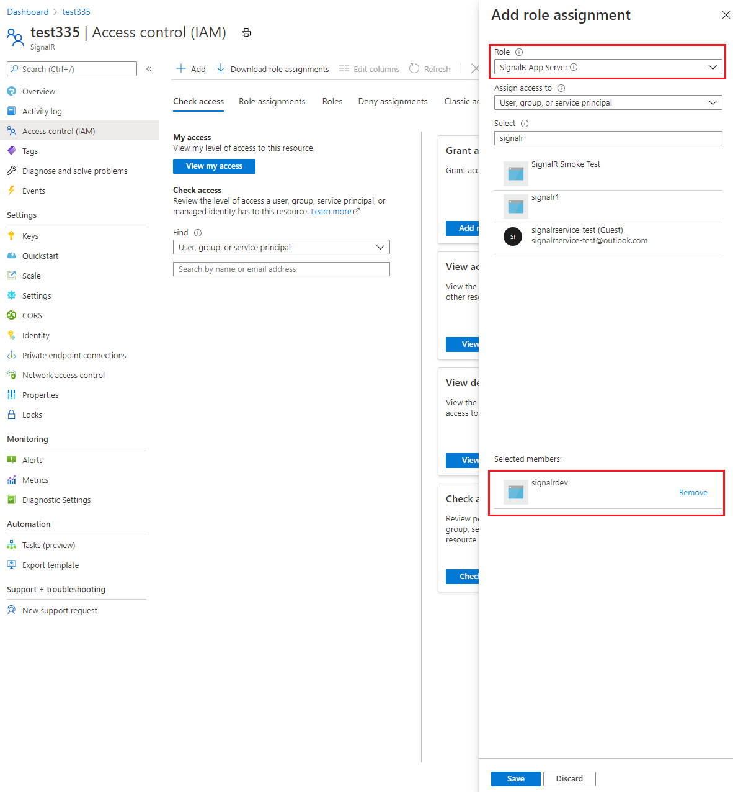
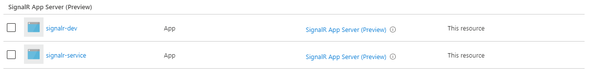

# Authenticate a managed identity with Azure Active Directory to access Azure SignalR Resources
Azure SignalR Service supports Azure Active Directory (Azure AD) authentication with [managed identities for Azure resources](../active-directory/managed-identities-azure-resources/overview.md). Managed identities for Azure resources can authorize access to Azure SignalR Service resources using Azure AD credentials from applications running in Azure Virtual Machines (VMs), Function apps, Virtual Machine Scale Sets, and other services. By using managed identities for Azure resources together with Azure AD authentication, you can avoid storing credentials with your applications that run in the cloud.

This article shows how to authorize access to an Azure SignalR Service by using a managed identity from an Azure VM.

## Enable managed identities on a VM
Before you can use managed identities for Azure Resources to authorize Azure SIgnalR Service resources from your VM, you must first enable managed identities for Azure Resources on the VM. To learn how to enable managed identities for Azure Resources, see one of these articles:

- [Azure portal](../active-directory/managed-identities-azure-resources/qs-configure-portal-windows-vm.md)
- [Azure PowerShell](../active-directory/managed-identities-azure-resources/qs-configure-powershell-windows-vm.md)
- [Azure CLI](../active-directory/managed-identities-azure-resources/qs-configure-cli-windows-vm.md)
- [Azure Resource Manager template](../active-directory/managed-identities-azure-resources/qs-configure-template-windows-vm.md)
- [Azure Resource Manager client libraries](../active-directory/managed-identities-azure-resources/qs-configure-sdk-windows-vm.md)

## Grant permissions to a managed identity in Azure AD
To authorize a request to Azure SignalR Service from a managed identity in your application, first configure role-based access control (RBAC) settings for that managed identity. Azure SignalR Service defines RBAC roles that encompass permissions for acquiring `AccessKey` or `ClientToken`. When the RBAC role is assigned to a managed identity, the managed identity is granted access to Azure SignalR Service at the appropriate scope.

For more information about assigning RBAC roles, see [Authenticate with Azure Active Directory for access to Azure SignalR Service resources](authorize-access-azure-active-directory.md).

## Connect to Azure SignalR Service with managed identities
To connect to Azure SignalR Service with managed identities, you need to assign the identity the role and the appropriate scope. The procedure in this section uses a simple application that runs under a managed identity and accesses Azure SignalR Service resources.

Here we're using a sample Azure virtual machine resource.

1. Go to **Settings** and select **Identity**. 
1. Select the **Status** to be **On**. 
1. Select **Save** to save the setting. 

    

Once you've enabled this setting, a new service identity is created in your Azure Active Directory (Azure AD) and configured into the App Service host.

Now, assign this service identity to a role in the required scope in your Azure SignalR Service resources.

## Assign Azure roles using the Azure portal  
To learn more on managing access to Azure resources using Azure RBAC and the Azure portal, see [this article](..//role-based-access-control/role-assignments-portal.md). 

After you've determined the appropriate scope for a role assignment, navigate to that resource in the Azure portal. Display the access control (IAM) settings for the resource, and follow these instructions to manage role assignments:

1. In the [Azure portal](https://portal.azure.com/), navigate to your SignalR resource.
1. Select **Access Control (IAM)** to display access control settings for the Azure SignalR. 
1. Select the **Role assignments** tab to see the list of role assignments. Select the **Add** button on the toolbar and then select **Add role assignment**. 

    

1. On the **Add role assignment** page, do the following steps:
    1. Select the **Azure SignalR role** that you want to assign. 
    1. Search to locate the **security principal** (user, group, service principal) to which you want to assign the role.
    1. Select **Save** to save the role assignment. 

        

    1. The identity to whom you assigned the role appears listed under that role. For example, the following image shows that application `signalr-dev` and `signalr-service` are in the SignalR App Server role. 
        
        

You can follow similar steps to assign a role scoped to resource group, or subscription. Once you define the role and its scope, you can test this behavior with samples [in this GitHub location](https://github.com/Azure/azure-event-hubs/tree/master/samples/DotNet/Microsoft.Azure.EventHubs/Rbac).

## Samples code while configuring your app server

Add following options when `AddAzureSignalR`:

```C#
services.AddSignalR().AddAzureSignalR(option =>
{
    option.ConnectionString = "Endpoint=https://<name>.signalr.net;AuthType=aad;";
});
```

## Next steps
- To learn more about RBAC, see [What is Azure role-based access control (Azure RBAC)](../role-based-access-control/overview.md)?
- To learn how to assign and manage Azure role assignments with Azure PowerShell, Azure CLI, or the REST API, see these articles:
    - [Manage role-based access control (RBAC) with Azure PowerShell](../role-based-access-control/role-assignments-powershell.md)  
    - [Manage role-based access control (RBAC) with Azure CLI](../role-based-access-control/role-assignments-cli.md)
    - [Manage role-based access control (RBAC) with the REST API](../role-based-access-control/role-assignments-rest.md)
    - [Manage role-based access control (RBAC) with Azure Resource Manager Templates](../role-based-access-control/role-assignments-template.md)

See the following related articles:
- [Authenticate an application with Azure Active Directory to access Azure SignalR Service](authenticate-application.md)
- [Authorize access to Azure SignalR Service using Azure Active Directory](authorize-access-azure-active-directory.md)