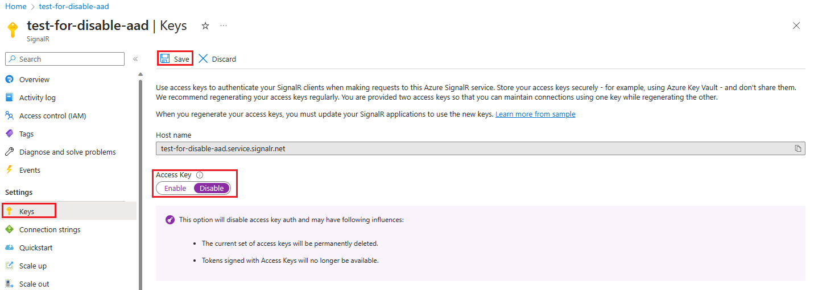
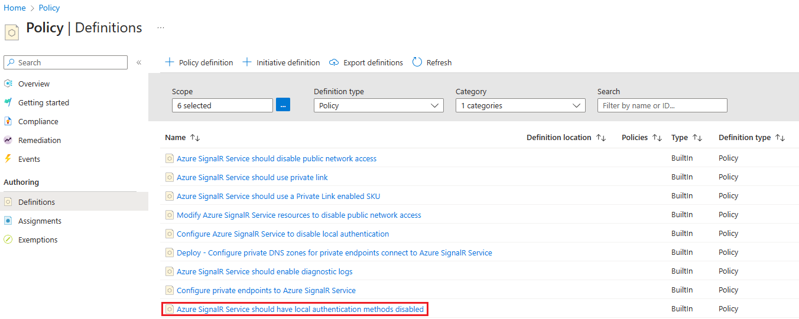

# Disable local (access key) authentication with Azure SignalR Service

There are two ways to authenticate to Azure SignalR Service resources: Microsoft Entra ID and Access Key. Microsoft Entra ID offers superior security and ease of use compared to the access key method. 
With Microsoft Entra ID, you do not need to store tokens in your code, reducing the risk of potential security vulnerabilities.
We highly recommend using Microsoft Entra ID for your Azure SignalR Service resources whenever possible.

> [!IMPORTANT]
> Disabling local authentication can have following consequences.
>
> - The current set of access keys will be permanently deleted.
> - Tokens signed with the current set of access keys will become unavailable.

## Use Azure portal

In this section, you will learn how to use the Azure portal to disable local authentication.

1. Navigate to your SignalR Service resource in the [Azure portal](https://portal.azure.com).

2. in the **Settings** section of the menu sidebar, select **Keys** tab.

3. Select **Disabled** for local authentication.

4. Click **Save** button.



## Use Azure Resource Manager template

You can disable local authentication by setting `disableLocalAuth` property to true as shown in the following Azure Resource Manager template.

```json
{
  "$schema": "https://schema.management.azure.com/schemas/2019-04-01/deploymentTemplate.json#",
  "contentVersion": "1.0.0.0",
  "parameters": {
    "resource_name": {
      "defaultValue": "test-for-disable-aad",
      "type": "String"
    }
  },
  "variables": {},
  "resources": [
    {
      "type": "Microsoft.SignalRService/SignalR",
      "apiVersion": "2022-08-01-preview",
      "name": "[parameters('resource_name')]",
      "location": "eastus",
      "sku": {
        "name": "Premium_P1",
        "tier": "Premium",
        "size": "P1",
        "capacity": 1
      },
      "kind": "SignalR",
      "properties": {
        "tls": {
          "clientCertEnabled": false
        },
        "features": [
          {
            "flag": "ServiceMode",
            "value": "Default",
            "properties": {}
          },
          {
            "flag": "EnableConnectivityLogs",
            "value": "True",
            "properties": {}
          }
        ],
        "cors": {
          "allowedOrigins": ["*"]
        },
        "serverless": {
          "connectionTimeoutInSeconds": 30
        },
        "upstream": {},
        "networkACLs": {
          "defaultAction": "Deny",
          "publicNetwork": {
            "allow": [
              "ServerConnection",
              "ClientConnection",
              "RESTAPI",
              "Trace"
            ]
          },
          "privateEndpoints": []
        },
        "publicNetworkAccess": "Enabled",
        "disableLocalAuth": true,
        "disableAadAuth": false
      }
    }
  ]
}
```

## Use Azure Policy

You can assign the [Azure SignalR Service should have local authentication methods disabled](https://ms.portal.azure.com/#view/Microsoft_Azure_Policy/PolicyDetailBlade/definitionId/%2Fproviders%2FMicrosoft.Authorization%2FpolicyDefinitions%2Ff70eecba-335d-4bbc-81d5-5b17b03d498f) Azure policy to an Azure subscription or a resource group to enforce disabling of local authentication for all SignalR resources in the subscription or the resource group.



## Next steps

See the following docs to learn about authentication methods.

- [Overview of Microsoft Entra ID for SignalR](signalr-concept-authorize-azure-active-directory.md)
- [Authenticate with Azure applications](./signalr-howto-authorize-application.md)
- [Authenticate with managed identities](./signalr-howto-authorize-managed-identity.md)
