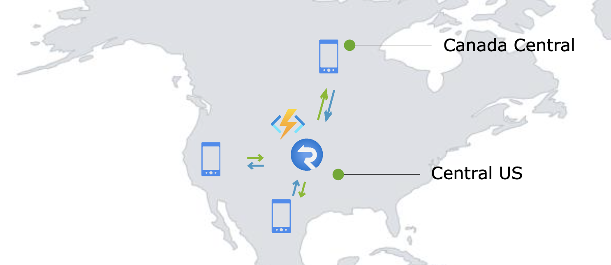
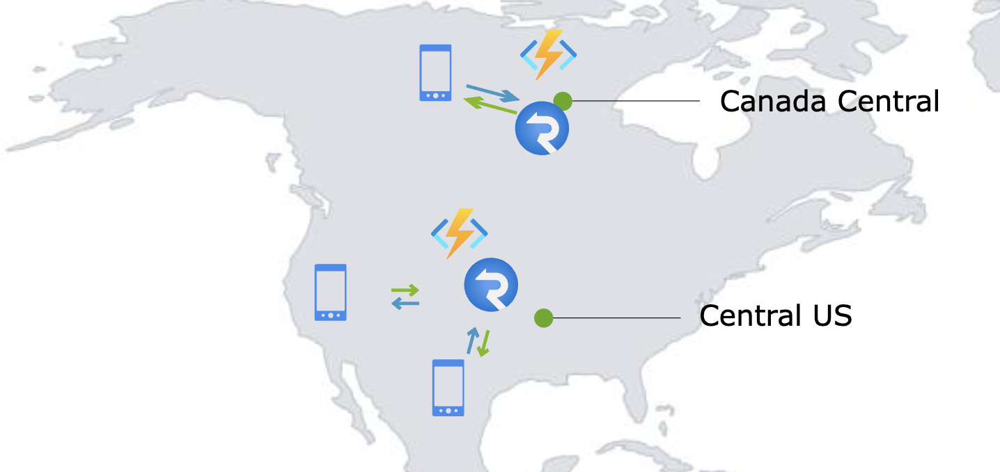
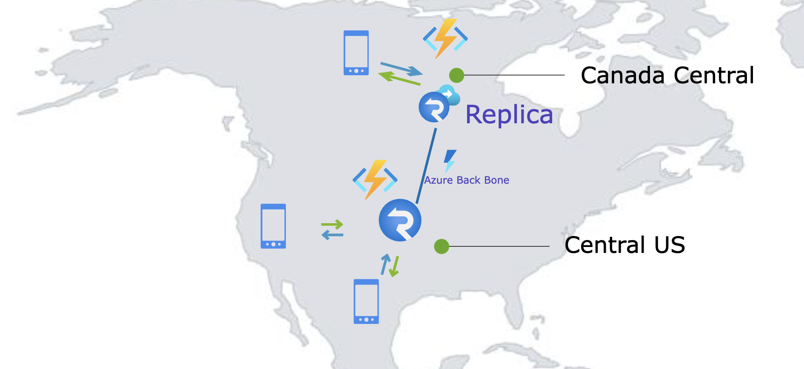
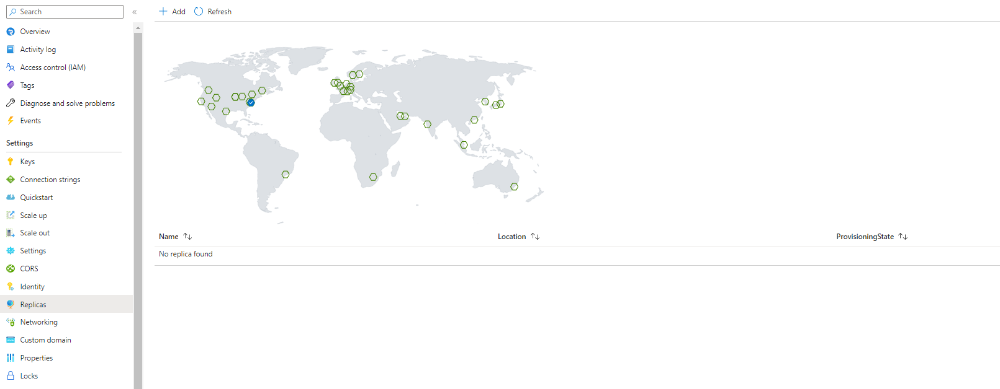
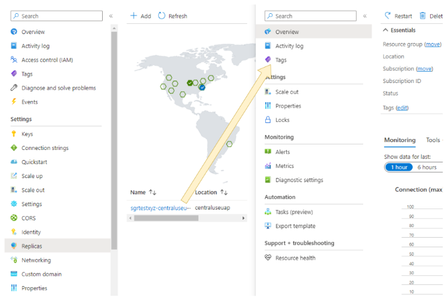
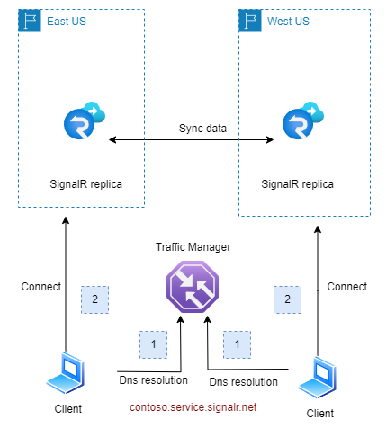
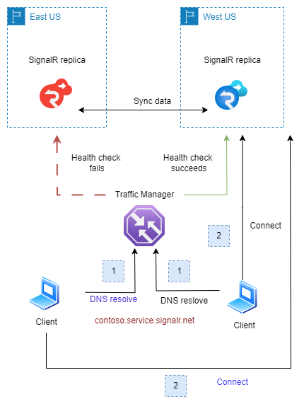
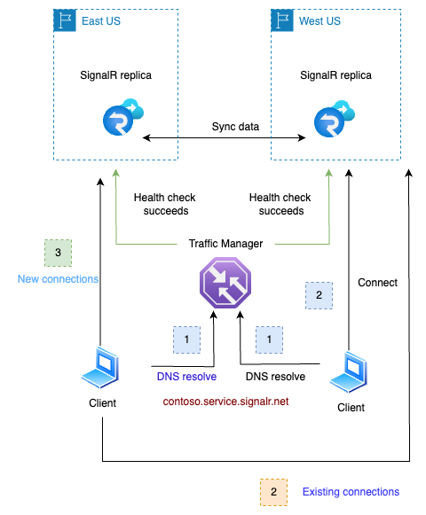
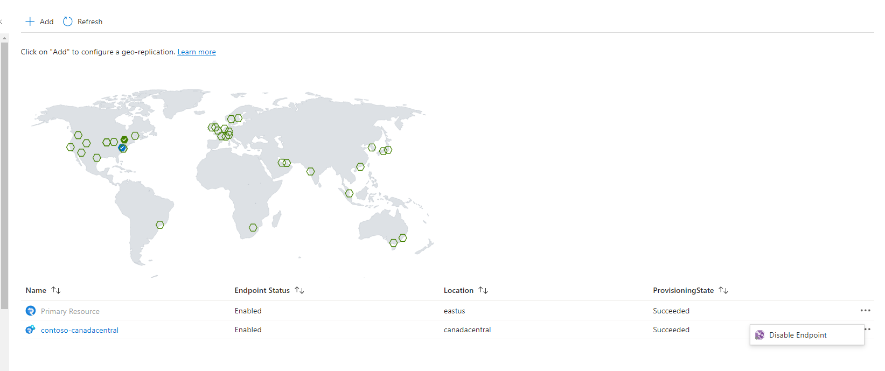

#  Geo-replication (Preview) in Azure SignalR

Companies seeking local presence or requiring a robust failover system often choose to deploy services across multiple Azure regions. With the integration of geo-replication in Azure SignalR, managing multi-region scenarios has become significantly easier.

## Benefits of using geo-replication
* **More resilient to regional outage:** If a regional outage happens, the Azure SignalR DNS will be resolved to healthy replicas in other regions.
* **Cross Region Communication**. Different replicas could communicate with each other as if they are the same instance.
* **Enhanced network speed:** Geographically dispersed clients will connect to the nearest replica. These replicas communicate through [Azure global network backbone](https://azure.microsoft.com/explore/global-infrastructure/global-network), ensuring fast and stable networking.
* **Shared configurations**. All replicas retain the primary Azure SignalR Service resource's configuration. 

## Prerequisites

* An Azure SignalR Service in [Premium tier](https://azure.microsoft.com/pricing/details/signalr-service/).
* The user needs following permissions to operate on replicas:

    | Permission                                        | Description                                       |
    |---------------------------------------------------|---------------------------------------------------|
    | Microsoft.SignalRService/signalr/replicas/write   | create, update or delete a replica. |
    | Microsoft.SignalRService/signalr/replicas/read    | get meta data of a replica.|
    | Microsoft.SignalRService/signalr/replicas/action  | perform actions on a replica, such as restarting. |


## Example use case
Contoso is a social media company with its customer base spread across the US and Canada. To serve those customers and let them communicate with each other, Contoso runs its services in Central US. Azure SignalR Service is used to handle user connections and facilitate communication among users. Contoso's end users are mostly phone users. Due to the long geographical distances, end-users in Canada might experience high latency and poor network quality.



Before the advent of the geo-replication feature, Contoso could set up another Azure SignalR Service in Canada Central to serve its Canadian users. By setting up a geographically closer Azure SignalR Service, end users now have better network quality and lower latency. 

However, managing multiple Azure SignalR Services brings some challenges:
1. A cross-region communication mechanism would be required to enable conversation between Canada and US users.
2. The development team would need to manage two separate Azure SignalR Services, each with distinct domain and connection string.
3. If a regional outage happens, the traffic needs to be switched to another region.



## Harnessing geo-replication
With the new geo-replication feature, Contoso can now establish a replica in Canada Central, effectively overcoming the above-mentioned hurdles.



## Create a SignalR replica
# [Portal](#tab/Portal)
To create a replica, Navigate to the SignalR **Replicas** blade on the Azure portal and click **Add** to create a replica. It will be automatically enabled upon creation.



After creation, you would be able to view/edit your replica on the portal by clicking the replica name.


# [Bicep](#tab/Bicep)

Use Visual Studio Code or your favorite editor to create a file with the following content and name it main.bicep:

```bicep
@description('The name for your SignalR service')
param primaryName string = 'contoso'

@description('The region in which to create your SignalR service')
param primaryLocation string = 'eastus'

@description('Unit count of your SignalR service')
param primaryCapacity int = 1

resource primary 'Microsoft.SignalRService/signalr@2023-08-01-preview' = {
  name: primaryName
  location: primaryLocation
  sku: {
    capacity: primaryCapacity
    name: 'Premium_P1'
  }
  properties: {
  }
}

@description('The name for your SignalR replica')
param replicaName string = 'contoso-westus'

@description('The region in which to create the SignalR replica')
param replicaLocation string = 'westus'

@description('Unit count of the SignalR replica')
param replicaCapacity int = 1

@description('Whether to enable region endpoint for the replica')
param regionEndpointEnabled string = 'Enabled'

resource replica 'Microsoft.SignalRService/signalr/replicas@2023-08-01-preview' = {
  parent: primary
  name: replicaName
  location: replicaLocation
  sku: {
    capacity: replicaCapacity
    name: 'Premium_P1'
  }
  properties: {
    regionEndpointEnabled: regionEndpointEnabled
  }
}
```

Deploy the Bicep file using Azure CLI 
   ```azurecli
   az group create --name MyResourceGroup --location eastus
   az deployment group create --resource-group MyResourceGroup --template-file main.bicep
   ```

----

## Pricing and resource unit
Each replica has its **own** `unit` and `autoscale settings`.

Replica is a feature of [Premium tier](https://azure.microsoft.com/pricing/details/signalr-service/) of Azure SignalR Service. Each replica is billed **separately** according to its own unit and outbound traffic. Free message quota is also calculated separately.

In the preceding example, Contoso added one replica in Canada Central. Contoso would pay for the replica in Canada Central according to its unit and message in Premium Price.

There will be egress fees for cross region outbound traffic. If a message is transferred across replicas **and** successfully sent to a client or server after the transfer, it will be billed as an outbound message.

## Delete a replica
After you've created a replica for your Azure SignalR Service, you can delete it at any time if it's no longer needed. 

To delete a replica in the Azure portal:

1. Navigate to your Azure SignalR Service, and select **Replicas** blade. Click the replica you want to delete.
2. Click Delete button on the replica overview blade.

## Understand how the SignalR replica works

The diagram below provides a brief illustration of the SignalR Replicas' functionality:



1. The client negotiates with the app server and receives a redirection to the Azure SignalR service. It then resolves the SignalR service's Fully Qualified Domain Name (FQDN) — `contoso.service.signalr.net`. This FQDN points to a Traffic Manager, which returns the Canonical Name (CNAME) of the nearest regional SignalR instance.
2. With this CNAME, the client establishes a connection to the regional instance (Replica).
3. The two replicas will synchronize data with each other. Messages sent to one replica would be transferred to other replicas if necessary.
4. In case a replica fails the health check conducted by the Traffic Manager (TM), the TM will exclude the failed instance's endpoint from its domain resolution process. For details, refer to below [Resiliency and Disaster Recovery](#resiliency-and-disaster-recovery)

> [!NOTE]
> * In the data plane, a primary Azure SignalR resource functions identically to its replicas

## Resiliency and disaster recovery

Azure SignalR Service utilizes a traffic manager for health checks and DNS resolution towards its replicas. Under normal circumstances, when all replicas are functioning properly, clients will be directed to the closest replica. For instance:

- Clients close to `eastus` will be directed to the replica located in `eastus`.
- Similarly, clients close to `westus` will be directed to the replica in `westus`.

In the event of a **regional outage** in eastus (illustrated below), the traffic manager will detect the health check failure for that region. Then, this faulty replica's DNS will be excluded from the traffic manager's DNS resolution results. After a DNS Time-to-Live (TTL) duration, which is set to 90 seconds, clients in `eastus` will be redirected to connect with the replica in `westus`.



Once the issue in `eastus` is resolved and the region is back online, the health check will succeed. Clients in `eastus` will then, once again, be directed to the replica in their region. This transition is smooth as the connected clients will not be impacted until those existing connections are closed. 




This failover and recovery process is **automatic** and requires no manual intervention.

For **server connections**, the failover and recovery work the same way as it does for client connections. 
> [!NOTE]
> *  This failover mechanism is for Azure SignalR service. Regional outages of app server are beyond the scope of this document.

## Disable or enable the replica endpoint
When setting up a replica, you have the option to enable or disable its endpoint. If it's disabled, the primary FQDN's DNS resolution won't include the replica, and therefore, traffic won't be directed to it.


You can also enable of disable the endpoint after it's been created. On the primary resource's replicas blade, click the ellipsis button on the right side of the replica and choose **Enable Endpoint** or **Disable Endpoint**:



Before deleting a replication, consider disabling its endpoint first. Over time, existing connections will disconnect. As no new connections are coming, the replication becomes idle finally. This ensures a seamless deletion process.
 
This feature is also useful for troubleshooting regional issues.

> [!NOTE]
> * Due to the DNS cache, it may take several minutes for the DNS update to take effect. 
> * Existing connections remain unaffected until they disconnect.

## Impact on performance after adding replicas

After replicas are enabled, clients will naturally distribute based on their geographical locations. While SignalR takes on the responsibility to synchronize data across these replicas, you'll be pleased to know that the associated overhead on [Server Load](signalr-concept-performance.md#quick-evaluation-using-metrics) is minimal for most common use cases. 

Specifically, if your application typically broadcasts to larger groups (size >10) or a single connection, the performance impact of synchronization is barely noticeable. If you're messaging small groups (size < 10) or individual users, you might notice a bit more synchronization overhead.

To ensure effective failover management, it is recommended to set each replica's unit size to handle all traffic. Alternatively, you could enable [autoscaling](signalr-howto-scale-autoscale.md) to manage this.

For more performance evaluation, refer to [Performance](signalr-concept-performance.md).
