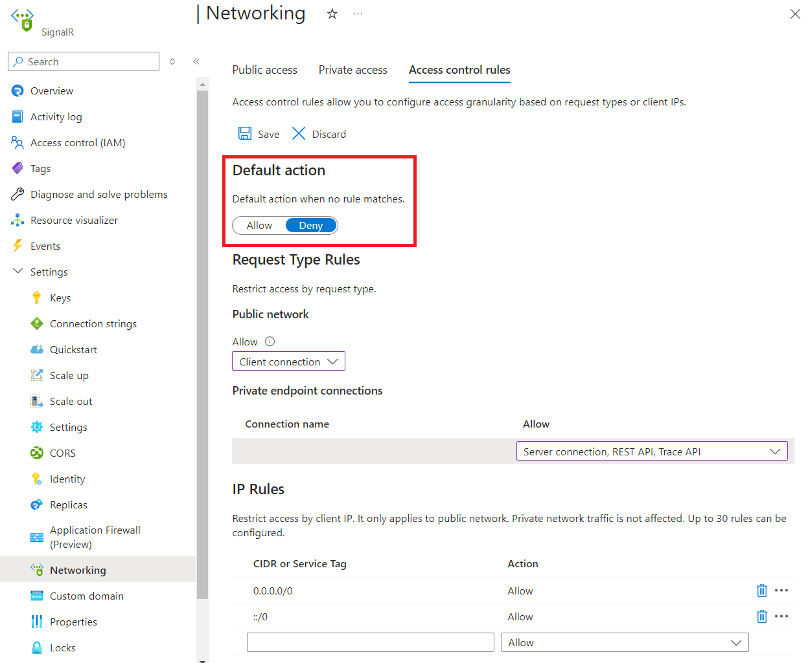
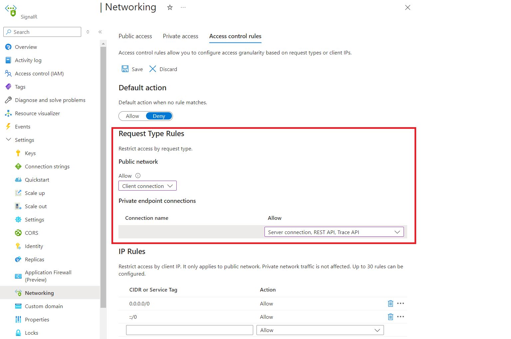
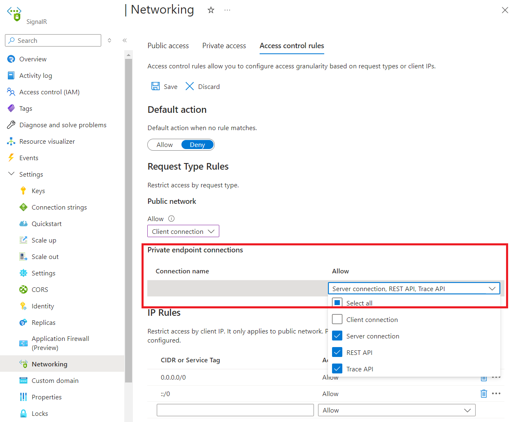

# Configure network access control

Azure SignalR Service allows you to secure and manage access to your service endpoint based on request types and network subsets. When you configure network access control rules, only applications making requests from the specified networks can access your SignalR Service.

   :::image type="content" alt-text="Screenshot showing network access control decision flow chart." source="media\howto-network-access-control\network-acl-decision-flow-chart.png" :::

> [!IMPORTANT]
> An application that accesses a SignalR Service when network access control rules are in effect still requires proper authorization for the request.


## Public Network Access

We offer a single, unified switch to simplify the configuration of public network access. The switch has following options:

* Disabled: Completely blocks public network access. All other network access control rules are ignored for public networks.
* Enabled: Allows public network access, which is further regulated by additional network access control rules.

### [Configure Public Network Access via Portal](#tab/azure-portal)

1. Go to the SignalR Service instance you want to secure.
1. Select **Networking** from the left side menu. Select **Public access** tab:

   :::image type="content" alt-text="Screenshot showing how to configure public network access." source="media\howto-network-access-control\portal-public-network-access.png" :::

1. Select **Disabled** or **Enabled**.

1. Select **Save** to apply your changes.

### [Configure Public Network Access via Bicep](#tab/bicep)

The following template disables public network access:

```bicep
resource signalr 'Microsoft.SignalRService/SignalR@2024-08-01-preview' = {
  name: 'foobar'
  location: 'eastus'
  properties: {
    publicNetworkAccess: 'Disabled'
  }
}
```

-----


## Default Action

The default action is applied when no other rule matches.

### [Configure Default Action via Portal](#tab/azure-portal)

1. Go to the SignalR Service instance you want to secure.
1. Select **Network access control** from the left side menu.

    

1. To edit the default action, toggle the **Allow/Deny** button.
1. Select **Save** to apply your changes.

### [Configure Default Action via Bicep](#tab/bicep)

The following template sets the default action to `Deny`.

```bicep
resource signalr 'Microsoft.SignalRService/SignalR@2024-08-01-preview' = {
  name: 'foobar'
  location: 'eastus'
  properties: {
    networkACLs: {
        defaultAction: 'Deny'
    }
}
```

-----


## Request Type Rules

You can configure rules to allow or deny specified request types for both the public network and each [private endpoint](howto-private-endpoints.md).

For example, [Server Connections](signalr-concept-internals.md#application-server-connections) are typically high-privileged. To enhance security, you may want to restrict their origin. You can configure rules to block all Server Connections from public network, and only allow they originate from a specific virtual network.

If no rule matches, the default action is applied.

### [Configure Request Type Rules via Portal](#tab/azure-portal)

1. Go to the SignalR Service instance you want to secure.
1. Select **Network access control** from the left side menu.

    

1. To edit public network rule, select allowed types of requests under **Public network**.

    

1. To edit private endpoint network rules, select allowed types of requests in each row under **Private endpoint connections**.

    

1. Select **Save** to apply your changes.

### [Configure Request Type Rules via Bicep](#tab/bicep)

The following template denies all requests from the public network except Client Connections. Additionally, it allows only Server Connections, REST API calls, and Trace calls from a specific private endpoint.

The name of the private endpoint connection can be inspected in the `privateEndpointConnections` sub-resource. It's automatically generated by the system.

```bicep
resource signalr 'Microsoft.SignalRService/SignalR@2024-08-01-preview' = {
  name: 'foobar'
  location: 'eastus'
  properties: {
    networkACLs: {
        defaultAction: 'Deny'
        publicNetwork: {
            allow: ['ClientConnection']
        }
        privateEndpoints: [
            {
                name: 'foo.0000aaaa-11bb-cccc-dd22-eeeeee333333'
                allow: ['ServerConnection', 'RESTAPI', 'Trace']
            }
        ]
    }
}
```

-----


## IP Rules

IP rules allow you to grant or deny access to specific public internet IP address ranges. These rules can be used to permit access for certain internet-based services and on-premises networks or to block general internet traffic.

The following restrictions apply:

* You can configure up to 30 rules.
* Address ranges must be specified using [CIDR notation](https://tools.ietf.org/html/rfc4632), such as `16.17.18.0/24`. Both IPv4 and IPv6 addresses are supported.
* IP rules are evaluated in the order they are defined. If no rule matches, the default action is applied.
* IP rules apply only to public traffic and cannot block traffic from private endpoints.

### [Configure IP Rules via Portal](#tab/azure-portal)

1. Go to the SignalR Service instance you want to secure.
1. Select **Networking** from the left side menu. Select **Access control rules** tab:

   :::image type="content" alt-text="Screenshot showing how to configure IP rules." source="media\howto-network-access-control\portal-ip-rules.png" :::

1. Edit the list under **IP rules** section.

1. Select **Save** to apply your changes.

### [Configure IP Rules via Bicep](#tab/bicep)

The following template has these effects:

* Requests from `123.0.0.0/8` and `2603::/8` are allowed.
* Requests from all other IP ranges are denied.

```bicep
resource signalr 'Microsoft.SignalRService/SignalR@2024-08-01-preview' = {
  name: 'foobar'
  location: 'eastus'
  properties: {
    networkACLs: {
      defaultAction: 'Deny'
      ipRules: [
        {
          value: '123.0.0.0/8'
          action: 'Allow'
        }
        {
          value: '2603::/8'
          action: 'Allow'
        }
        {
          value: '0.0.0.0/0'
          action: 'Deny'
        }
        {
          value: '::/0'
          action: 'Deny'
        }
      ]
    }
  }
}
```

-----


## Next steps

Learn more about [Azure Private Link](../private-link/private-link-overview.md).
