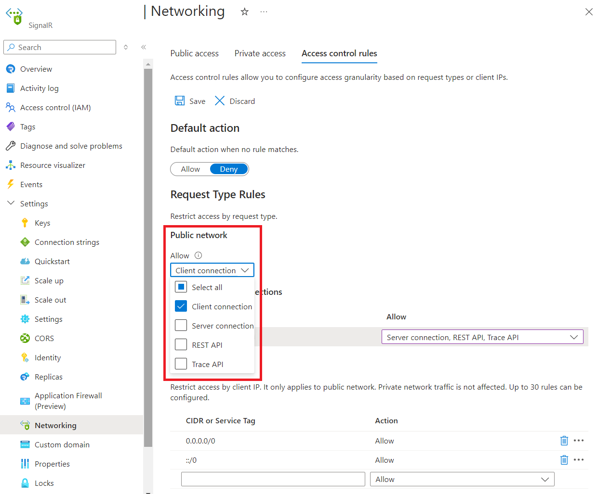

# Configure network access control

Azure SignalR Service enables you to secure and control the level of access to your service endpoint, based on the request type and subset of networks used. When network rules are configured, only applications requesting data over the specified set of networks can access your Azure SignalR Service.

Azure SignalR Service has a public endpoint that is accessible through the internet. You can also create [Private Endpoints for your Azure SignalR Service](howto-private-endpoints.md). Private Endpoint assigns a private IP address from your VNet to the Azure SignalR Service, and secures all traffic between your VNet and the Azure SignalR Service over a private link. The Azure SignalR Service network access control provides access control for both public endpoint and private endpoints.

Optionally, you can choose to allow or deny certain types of requests for public endpoint and each private endpoint. For example, you can block all [Server Connections](signalr-concept-internals.md#server-connections) from public endpoint and make sure they only originate from a specific VNet.

An application that accesses an Azure SignalR Service when network access control rules are in effect still requires proper authorization for the request.

## Scenario A - No public traffic

To completely deny all public traffic, you should first configure the public network rule to allow no request type. Then, you should configure rules that grant access to traffic from specific VNets. This configuration enables you to build a secure network boundary for your applications.

## Scenario B - Only client connections from public network

In this scenario, you can configure the public network rule to only allow [Client Connections](signalr-concept-internals.md#client-connections) from public network. You can then configure private network rules to allow other types of requests originating from a specific VNet. This configuration hides your app servers from public network and establishes secure connections between your app servers and Azure SignalR Service.

## Managing network access control

You can manage network access control for Azure SignalR Service through the Azure portal.

### Azure portal

1. Go to the Azure SignalR Service you want to secure.

1. Click on the settings menu called **Network access control**.

    

1. To edit default action, toggle the **Allow/Deny** button.

    > [!TIP]
    > Default action is the action we take when there is no ACL rule matches. For example, if the default action is **Deny**, then request types that are not explicitly whitelisted below will be denied.

1. To edit public network rule, select allowed types of requests under **Public network**.

    

1. To edit private endpoint network rules, select allowed types of requests in each row under **Private endpoint connections**.

    

1. Click **Save** to apply your changes.

## Next steps

Learn more about [Azure Private Link](/azure/private-link/private-link-overview).
