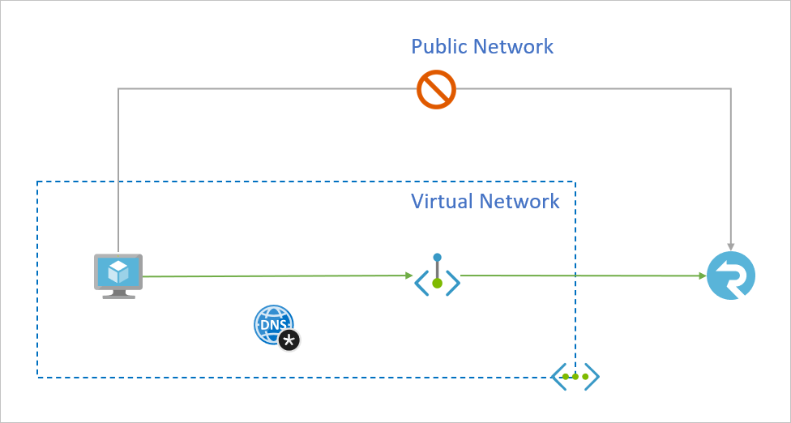

# Use private endpoints for Azure SignalR Service

You can use [private endpoints](../private-link/private-endpoint-overview.md) for your Azure SignalR Service to allow clients on a virtual network (VNet) to securely access data over a [Private Link](../private-link/private-link-overview.md). The private endpoint uses an IP address from the VNet address space for your Azure SignalR Service. Network traffic between the clients on the VNet and Azure SignalR Service traverses over a private link on the Microsoft backbone network, eliminating exposure from the public internet.

Using private endpoints for your Azure SignalR Service enables you to:

- Secure your Azure SignalR Service using the network access control to block all connections on the public endpoint for Azure SignalR Service.
- Increase security for the virtual network (VNet), by enabling you to block exfiltration of data from the VNet.
- Securely connect to Azure SignalR Services from on-premises networks that connect to the VNet using [VPN](../vpn-gateway/vpn-gateway-about-vpngateways.md) or [ExpressRoutes](../expressroute/expressroute-locations.md) with private-peering.

## Conceptual overview



A private endpoint is a special network interface for an Azure service in your [Virtual Network](../virtual-network/virtual-networks-overview.md) (VNet). When you create a private endpoint for your Azure SignalR Service, it provides secure connectivity between clients on your VNet and your service. The private endpoint is assigned an IP address from the IP address range of your VNet. The connection between the private endpoint and Azure SignalR Service uses a secure private link.

Applications in the VNet can connect to Azure SignalR Service over the private endpoint seamlessly, **using the same connection strings and authorization mechanisms that they would use otherwise**. Private endpoints can be used with all protocols supported by the Azure SignalR Service, including REST API.

When you create a private endpoint for an Azure SignalR Service in your VNet, a consent request is sent for approval to the Azure SignalR Service owner. If the user requesting the creation of the private endpoint is also an owner of the Azure SignalR Service, this consent request is automatically approved.

Azure SignalR Service owners can manage consent requests and the private endpoints, through the '*Private endpoints*' tab for the Azure SignalR Service in the [Azure portal](https://portal.azure.com).

> [!TIP]
> If you want to restrict access to your Azure SignalR Service through the private endpoint only, [configure the Network Access Control](howto-network-access-control.md#managing-network-access-control) to deny or control access through the public endpoint.

### Connecting to private endpoints

Clients on a VNet using the private endpoint should use the same connection string for the Azure SignalR Service, as clients connecting to the public endpoint. We rely upon DNS resolution to automatically route the connections from the VNet to Azure SignalR Service over a private link.

> [!IMPORTANT]
> Use the same connection string to connect to Azure SignalR Service using private endpoints, as you'd use otherwise. Please don't connect to Azure SignalR Service using its `privatelink` subdomain URL.

We create a [private DNS zone](../dns/private-dns-overview.md) attached to the VNet with the necessary updates for the private endpoints, by default. However, if you're using your own DNS server, you may need to make additional changes to your DNS configuration. The section on [DNS changes](#dns-changes-for-private-endpoints) below describes the updates required for private endpoints.

## DNS changes for private endpoints

When you create a private endpoint, the DNS CNAME resource record for your Azure SignalR Service is updated to an alias in a subdomain with the prefix `privatelink`. By default, we also create a [private DNS zone](../dns/private-dns-overview.md), corresponding to the `privatelink` subdomain, with the DNS A resource records for the private endpoints.

When you resolve your Azure SignalR Service domain name from outside the VNet with the private endpoint, it resolves to the public endpoint of the Azure SignalR Service. When resolved from the VNet hosting the private endpoint, the domain name resolves to the private endpoint's IP address.

For the illustrated example above, the DNS resource records for the Azure SignalR Service 'foobar', when resolved from outside the VNet hosting the private endpoint, will be:

| Name                                                  | Type  | Value                                                 |
| :---------------------------------------------------- | :---: | :---------------------------------------------------- |
| ``foobar.service.signalr.net``                        | CNAME | ``foobar.privatelink.service.signalr.net``            |
| ``foobar.privatelink.service.signalr.net``            | A     | \<Azure SignalR Service public IP address\>           |

As previously mentioned, you can deny or control access for clients outside the VNet through the public endpoint using the network access control.

The DNS resource records for 'foobar', when resolved by a client in the VNet hosting the private endpoint, will be:

| Name                                                  | Type  | Value                                                 |
| :---------------------------------------------------- | :---: | :---------------------------------------------------- |
| ``foobar.service.signalr.net``                        | CNAME | ``foobar.privatelink.service.signalr.net``            |
| ``foobar.privatelink.service.signalr.net``            | A     | 10.1.1.5                                              |

This approach enables access to Azure SignalR Service **using the same connection string** for clients on the VNet hosting the private endpoints, as well as clients outside the VNet.

If you are using a custom DNS server on your network, clients must be able to resolve the FQDN for the Azure SignalR Service endpoint to the private endpoint IP address. You should configure your DNS server to delegate your private link subdomain to the private DNS zone for the VNet, or configure the A records for `foobar.privatelink.service.signalr.net` with the private endpoint IP address.

> [!TIP]
> When using a custom or on-premises DNS server, you should configure your DNS server to resolve the Azure SignalR Service name in the `privatelink` subdomain to the private endpoint IP address. You can do this by delegating the `privatelink` subdomain to the private DNS zone of the VNet, or configuring the DNS zone on your DNS server and adding the DNS A records.

The recommended DNS zone name for private endpoints for Azure SignalR Service is: `privatelink.service.signalr.net`.

For more information on configuring your own DNS server to support private endpoints, refer to the following articles:

- [Name resolution for resources in Azure virtual networks](/azure/virtual-network/virtual-networks-name-resolution-for-vms-and-role-instances#name-resolution-that-uses-your-own-dns-server)
- [DNS configuration for private endpoints](/azure/private-link/private-endpoint-overview#dns-configuration)

## Create a private endpoint

### Create a private endpoint along with a new Azure SignalR Service in the Azure portal

1. When creating a new Azure SignalR Service, select **Networking** tab. Choose **Private endpoint** as connectivity method.

    

1. Click **Add**. Fill in subscription, resource group, location, name for the new private endpoint. Choose a virtual network and subnet.

    

1. Click **Review + create**.

### Create a private endpoint for an existing Azure SignalR Service in the Azure portal

1. Go to the Azure SignalR Service.

1. Click on the settings menu called **Private endpoint connections**.

1. Click the button **+ Private endpoint** on the top.

    

1. Fill in subscription, resource group, resource name and region for the new private endpoint.
    
    

1. Choose target Azure SignalR Service resource.

    

1. Choose target virtual network

    

1. Click **Review + create**.

### Create a private endpoint using Azure CLI

1. Login to Azure CLI
    ```console
    az login
    ```
1. Select your Azure Subscription
    ```console
    az account set --subscription {AZURE SUBSCRIPTION ID}
    ```
1. Create a new Resource Group
    ```console
    az group create -n {RG} -l {AZURE REGION}
    ```
1. Register Microsoft.SignalRService as a provider
    ```console
    az provider register -n Microsoft.SignalRService
    ```
1. Create a new Azure SignalR Service
    ```console
    az signalr create --name {NAME} --resource-group {RG} --location {AZURE REGION} --sku Standard_S1
    ```
1. Create a Virtual Network
    ```console
    az network vnet create --resource-group {RG} --name {vNet NAME} --location {AZURE REGION}
    ```
1. Add a subnet
    ```console
    az network vnet subnet create --resource-group {RG} --vnet-name {vNet NAME} --name {subnet NAME} --address-prefixes {addressPrefix}
    ```
1. Disable Virtual Network Policies
    ```console
    az network vnet subnet update --name {subnet NAME} --resource-group {RG} --vnet-name {vNet NAME} --disable-private-endpoint-network-policies true
    ```
1. Add a Private DNS Zone
    ```console
    az network private-dns zone create --resource-group {RG} --name privatelink.service.signalr.net
    ```
1. Link Private DNS Zone to Virtual Network
    ```console
    az network private-dns link vnet create --resource-group {RG} --virtual-network {vNet NAME} --zone-name privatelink.service.signalr.net --name {dnsZoneLinkName} --registration-enabled true
    ```
1. Create a Private Endpoint (Automatically Approve)
    ```console
    az network private-endpoint create --resource-group {RG} --vnet-name {vNet NAME} --subnet {subnet NAME} --name {Private Endpoint Name}  --private-connection-resource-id "/subscriptions/{AZURE SUBSCRIPTION ID}/resourceGroups/{RG}/providers/Microsoft.SignalRService/SignalR/{NAME}" --group-ids signalr --connection-name {Private Link Connection Name} --location {AZURE REGION}
    ```
1. Create a Private Endpoint (Manually Request Approval)
    ```console
    az network private-endpoint create --resource-group {RG} --vnet-name {vNet NAME} --subnet {subnet NAME} --name {Private Endpoint Name}  --private-connection-resource-id "/subscriptions/{AZURE SUBSCRIPTION ID}/resourceGroups/{RG}/providers/Microsoft.SignalRService/SignalR/{NAME}" --group-ids signalr --connection-name {Private Link Connection Name} --location {AZURE REGION} --manual-request
    ```
1. Show Connection Status
    ```console
    az network private-endpoint show --resource-group {RG} --name {Private Endpoint Name}
    ```

## Pricing

For pricing details, see [Azure Private Link pricing](https://azure.microsoft.com/pricing/details/private-link).

## Known Issues

Keep in mind the following known issues about private endpoints for Azure SignalR Service

### Free tier

You cannot create any private endpoint for free tier Azure SignalR Service.

### Access constraints for clients in VNets with private endpoints

Clients in VNets with existing private endpoints face constraints when accessing other Azure SignalR Service instances that have private endpoints. For instance, suppose a VNet N1 has a private endpoint for an Azure SignalR Service instance S1. If Azure SignalR Service S2 has a private endpoint in a VNet N2, then clients in VNet N1 must also access Azure SignalR Service S2 using a private endpoint. If Azure SignalR Service S2 does not have any private endpoints, then clients in VNet N1 can access Azure SignalR Service in that account without a private endpoint.

This constraint is a result of the DNS changes made when Azure SignalR Service S2 creates a private endpoint.

### Network Security Group rules for subnets with private endpoints

Currently, you can't configure [Network Security Group](../virtual-network/security-overview.md) (NSG) rules and user-defined routes for private endpoints. NSG rules applied to the subnet hosting the private endpoint are applied to the private endpoint. A limited workaround for this issue is to implement your access rules for private endpoints on the source subnets, though this approach may require a higher management overhead.

## Next steps

- [Configure Network Access Control](howto-network-access-control.md)
