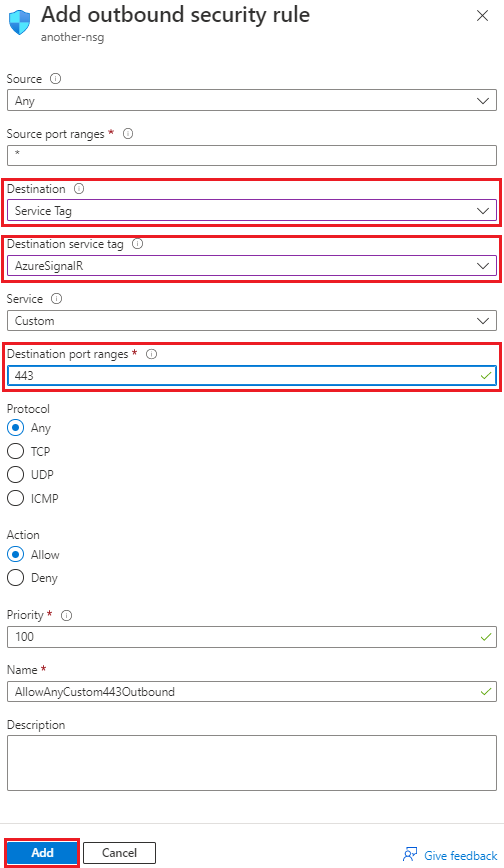

# Use service tags for Azure SignalR Service

You can use [Service Tags](../virtual-network/security-overview.md#service-tags) for Azure SignalR Service when configuring [Network Security Group](../virtual-network/security-overview.md#network-security-groups). It allows you to define outbound network security rule to Azure SignalR Service endpoints without need to hardcode IP addresses.

Azure SignalR Service manages these service tags. You can't create your own service tag or modify an existing one. Microsoft manages these address prefixes that match to the service tag and automatically updates the service tag as addresses change.

## Use service tag on portal

You can allow outbound traffic to Azure SignalR Service by adding a new outbound network security rule:

1. Go to the network security group.

1. Click on the settings menu called **Outbound security rules**.

1. Click the button **+ Add** on the top.

1. Choose **Service Tag** under **Destination**.

1. Choose **AzureSignalR** under **Destination service tag**.

1. Fill in **443** in **Destination port ranges**.

    

1. Adjust other fields according to your needs.

1. Click **Add**.

## Next steps

- [Network security groups: service tags](../virtual-network/security-overview.md#security-rules)
