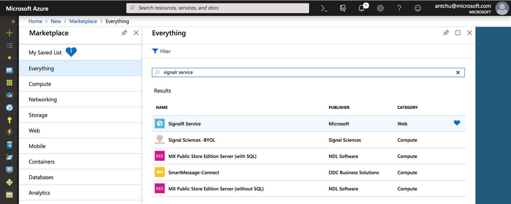
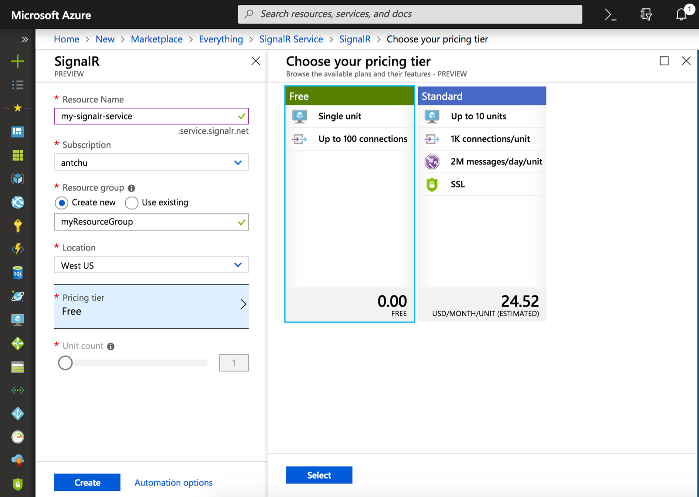

## Create an Azure SignalR Service instance

Your application will connect to a SignalR Service instance in Azure.

1. Select the New button found on the upper left-hand corner of the Azure portal. In the New screen, type *SignalR Service* in the search box and press enter.

    

1. Select **SignalR Service** from the search results, then select **Create**.

1. Enter the following settings.

    | Setting      | Suggested value  | Description                                        |
    | ------------ |  ------- | -------------------------------------------------- |
    | **Resource name** | Globally unique name | Name that identifies your new SignalR Service instance. Valid characters are `a-z`, `0-9`, and `-`.  | 
    | **Subscription** | Your subscription | The subscription under which this new SignalR Service instance is created. | 
    | **[Resource Group](../../azure-resource-manager/management/overview.md)** |  myResourceGroup | Name for the new resource group in which to create your SignalR Service instance. | 
    | **Location** | West US | Choose a [region](https://azure.microsoft.com/regions/) near you. |
    | **Pricing tier** | Free | Try Azure SignalR Service for free. |
    | **Unit count** |  Not applicable | Unit count specifies how many connections your SignalR Service instance can accept. It is only configurable in the Standard tier. |
    | **Service mode** |  Serverless | For use with Azure Functions or REST API. |

    

1. Select **Create** to start deploying the SignalR Service instance.

1. After the instance is deployed, open it in the portal and locate its Settings page. Change the Service Mode setting to *Serverless* only if you are using Azure SignalR Service through Azure Functions binding or REST API. Leave it in *Classic* or *Default* otherwise.