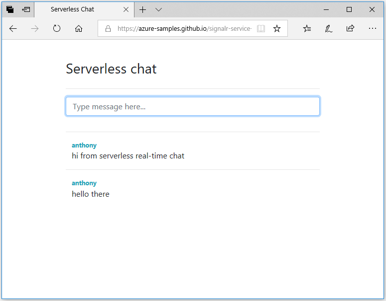

## Run the web application

1. There is a sample single page web application hosted in GitHub for your convenience. Open your browser to [https://azure-samples.github.io/signalr-service-quickstart-serverless-chat/demo/chat/](https://azure-samples.github.io/signalr-service-quickstart-serverless-chat/demo/chat/).

    > [!NOTE]
    > The source of the HTML file is located at [/docs/demo/chat/index.html](https://github.com/Azure-Samples/signalr-service-quickstart-serverless-chat/blob/master/docs/demo/chat/index.html).

1. When prompted for the function app base URL, enter *http://localhost:7071*.

1. Enter a username when prompted.

1. The web application calls the *GetSignalRInfo* function in the function app to retrieve the connection information to connect to Azure SignalR Service. When the connection is complete, the chat message input box appears.

1. Type a message and press enter. The application sends the message to the *SendMessage* function in the Azure Function app, which then uses the SignalR output binding to broadcast the message to all connected clients. If everything is working correctly, the message should appear in the application.

    

1. Open another instance of the web application in a different browser window. You will see that any messages sent will appear in all instances of the application.