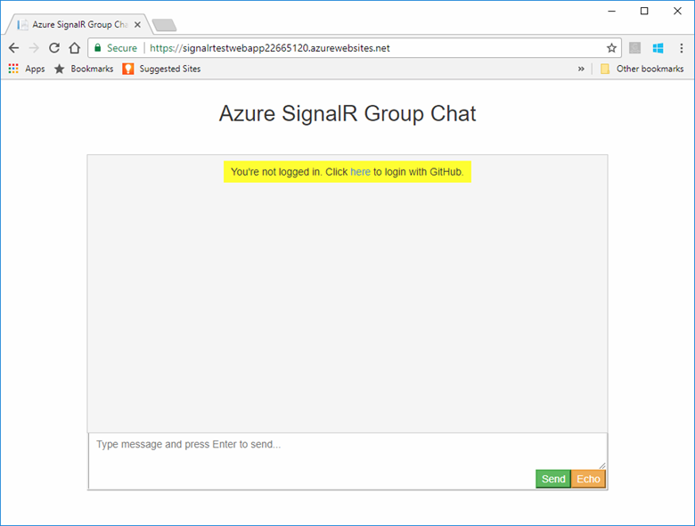
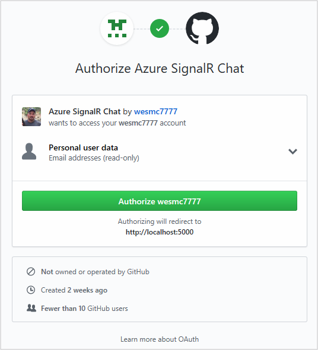

# Azure SignalR Service authentication

This tutorial builds on the chat room application introduced in the quickstart. If you have not completed [Create a chat room with SignalR Service](signalr-quickstart-dotnet-core.md), complete that exercise first.

In this tutorial, you'll learn how to implement your own authentication and integrate it with the Microsoft Azure SignalR Service.

The authentication initially used in the quickstart's chat room application is too simple for real-world scenarios. The application allows each client to claim who they are, and the server simply accepts that. This approach is not very useful in real-world applications where a rogue user would impersonate others to access sensitive data.

[GitHub](https://github.com/) provides authentication APIs based on a popular industry-standard protocol called [OAuth](https://oauth.net/). These APIs allow third-party applications to authenticate GitHub accounts. In this tutorial, you will use these APIs to implement authentication through a GitHub account before allowing client logins to the chat room application. After authenticating a GitHub account, the account information will be added as a cookie to be used by the web client to authenticate.

For more information on the OAuth authentication APIs provided through GitHub, see [Basics of Authentication](https://developer.github.com/v3/guides/basics-of-authentication/).

You can use any code editor to complete the steps in this quickstart. However, [Visual Studio Code](https://code.visualstudio.com/) is an excellent option available on the Windows, macOS, and Linux platforms.

The code for this tutorial is available for download in the [AzureSignalR-samples GitHub repository](https://github.com/aspnet/AzureSignalR-samples/tree/master/samples/GitHubChat).



In this tutorial, you learn how to:

> [!div class="checklist"]
> * Register a new OAuth app with your GitHub account
> * Add an authentication controller to support GitHub authentication
> * Deploy your ASP.NET Core web app to Azure

[!INCLUDE [quickstarts-free-trial-note](../../includes/quickstarts-free-trial-note.md)]

## Prerequisites

To complete this tutorial, you must have the following prerequisites:

- An account created on [GitHub](https://github.com/)
- [Git](https://git-scm.com/)
- [.NET Core SDK](https://dotnet.microsoft.com/download)
- [Azure Cloud Shell](../cloud-shell/quickstart.md) configured for the bash environment.
- Download or clone the [AzureSignalR-sample](https://github.com/aspnet/AzureSignalR-samples) GitHub repository.

## Create an OAuth app

1. Open a web browser and navigate to `https://github.com` and sign into your account.

2. For your account, navigate to **Settings** > **Developer settings** and click **Register a new application**, or **New OAuth App** under *OAuth Apps*.

3. Use the following settings for the new OAuth App, then click **Register application**:

    | Setting Name | Suggested Value | Description |
    | ------------ | --------------- | ----------- |
    | Application name | *Azure SignalR Chat* | The GitHub user should be able to recognize and trust the app they are authenticating with.   |
    | Homepage URL | `http://localhost:5000/home` | |
    | Application description | *A chat room sample using the Azure SignalR Service with GitHub authentication* | A useful description of the application that will help your application users understand the context of the authentication being used. |
    | Authorization callback URL | `http://localhost:5000/signin-github` | This setting is the most important setting for your OAuth application. It's the callback URL that GitHub returns the user to after successful authentication. In this tutorial, you must use the default callback URL for the *AspNet.Security.OAuth.GitHub* package, */signin-github*.  |

4. Once the new OAuth app registration is complete, add the *Client ID* and *Client Secret* to Secret Manager using the following commands. Replace *Your_GitHub_Client_Id* and *Your_GitHub_Client_Secret* with the values for your OAuth app.

    ```dotnetcli
    dotnet user-secrets set GitHubClientId Your_GitHub_Client_Id
    dotnet user-secrets set GitHubClientSecret Your_GitHub_Client_Secret
    ```

## Implement the OAuth flow

### Update the Startup class to support GitHub authentication

1. Add a reference to the latest *Microsoft.AspNetCore.Authentication.Cookies* and *AspNet.Security.OAuth.GitHub* packages and restore all packages.

    ```dotnetcli
    dotnet add package Microsoft.AspNetCore.Authentication.Cookies -v 2.1.0-rc1-30656
    dotnet add package AspNet.Security.OAuth.GitHub -v 2.0.0-rc2-final
    dotnet restore
    ```

1. Open *Startup.cs*, and add `using` statements for the following namespaces:

    ```csharp
    using System.Net.Http;
    using System.Net.Http.Headers;
    using System.Security.Claims;
    using Microsoft.AspNetCore.Authentication.Cookies;
    using Microsoft.AspNetCore.Authentication.OAuth;
    using Newtonsoft.Json.Linq;
    ```

2. At the top of the `Startup` class, add constants for the Secret Manager keys that hold the GitHub OAuth app secrets.

    ```csharp
    private const string GitHubClientId = "GitHubClientId";
    private const string GitHubClientSecret = "GitHubClientSecret";
    ```

3. Add the following code to the `ConfigureServices` method to support authentication with the GitHub OAuth app:

    ```csharp
    services.AddAuthentication(CookieAuthenticationDefaults.AuthenticationScheme)
        .AddCookie()
        .AddGitHub(options =>
        {
            options.ClientId = Configuration[GitHubClientId];
            options.ClientSecret = Configuration[GitHubClientSecret];
            options.Scope.Add("user:email");
            options.Events = new OAuthEvents
            {
                OnCreatingTicket = GetUserCompanyInfoAsync
            };
        });
    ```

4. Add the `GetUserCompanyInfoAsync` helper method to the `Startup` class.

    ```csharp
    private static async Task GetUserCompanyInfoAsync(OAuthCreatingTicketContext context)
    {
        var request = new HttpRequestMessage(HttpMethod.Get, context.Options.UserInformationEndpoint);
        request.Headers.Accept.Add(new MediaTypeWithQualityHeaderValue("application/json"));
        request.Headers.Authorization = new AuthenticationHeaderValue("Bearer", context.AccessToken);

        var response = await context.Backchannel.SendAsync(request,
            HttpCompletionOption.ResponseHeadersRead, context.HttpContext.RequestAborted);

        var user = JObject.Parse(await response.Content.ReadAsStringAsync());
        if (user.ContainsKey("company"))
        {
            var company = user["company"].ToString();
            var companyIdentity = new ClaimsIdentity(new[]
            {
                new Claim("Company", company)
            });
            context.Principal.AddIdentity(companyIdentity);
        }
    }
    ```

5. Update the `Configure` method of the Startup class with the following line of code, and save the file.

    ```csharp
    app.UseAuthentication();
    ```

### Add an authentication controller

In this section, you will implement a `Login` API that authenticates clients using the GitHub OAuth app. Once authenticated, the API will add a cookie to the web client response before redirecting the client back to the chat app. That cookie will then be used to identify the client.

1. Add a new controller code file to the *chattest\Controllers* directory. Name the file *AuthController.cs*.

2. Add the following code for the authentication controller. Make sure to update the namespace, if your project directory was not *chattest*:

    ```csharp
    using AspNet.Security.OAuth.GitHub;
    using Microsoft.AspNetCore.Authentication;
    using Microsoft.AspNetCore.Mvc;

    namespace chattest.Controllers
    {
        [Route("/")]
        public class AuthController : Controller
        {
            [HttpGet("login")]
            public IActionResult Login()
            {
                if (!User.Identity.IsAuthenticated)
                {
                    return Challenge(GitHubAuthenticationDefaults.AuthenticationScheme);
                }

                HttpContext.Response.Cookies.Append("githubchat_username", User.Identity.Name);
                HttpContext.SignInAsync(User);
                return Redirect("/");
            }
        }
    }
    ```

3. Save your changes.

### Update the Hub class

By default when a web client attempts to connect to SignalR Service, the connection is granted based on an access token that is provided internally. This access token is not associated with an authenticated identity. This access is actually anonymous access.

In this section, you will turn on real authentication by adding the `Authorize` attribute to the hub class, and updating the hub methods to read the username from the authenticated user's claim.

1. Open *Hub\Chat.cs* and add references to these namespaces:

    ```csharp
    using System.Threading.Tasks;
    using Microsoft.AspNetCore.Authorization;
    ```

2. Update the hub code as shown below. This code adds the `Authorize` attribute to the `Chat` class, and uses the user's authenticated identity in the hub methods. Also, the `OnConnectedAsync` method is added, which will log a system message to the chat room each time a new client connects.

    ```csharp
    [Authorize]
    public class Chat : Hub
    {
        public override Task OnConnectedAsync()
        {
            return Clients.All.SendAsync("broadcastMessage", "_SYSTEM_", $"{Context.User.Identity.Name} JOINED");
        }

        // Uncomment this line to only allow user in Microsoft to send message
        //[Authorize(Policy = "Microsoft_Only")]
        public void BroadcastMessage(string message)
        {
            Clients.All.SendAsync("broadcastMessage", Context.User.Identity.Name, message);
        }

        public void Echo(string message)
        {
            var echoMessage = $"{message} (echo from server)";
            Clients.Client(Context.ConnectionId).SendAsync("echo", Context.User.Identity.Name, echoMessage);
        }
    }
    ```

3. Save your changes.

### Update the web client code

1. Open *wwwroot\index.html* and replace the code that prompts for the username with code to use the cookie returned by the authentication controller.

    Remove the following code from *index.html*:

    ```javascript
    // Get the user name and store it to prepend to messages.
    var username = generateRandomName();
    var promptMessage = 'Enter your name:';
    do {
        username = prompt(promptMessage, username);
        if (!username || username.startsWith('_') || username.indexOf('<') > -1 || username.indexOf('>') > -1) {
            username = '';
            promptMessage = 'Invalid input. Enter your name:';
        }
    } while(!username)
    ```

    Add the following code in place of the code above to use the cookie:

    ```javascript
    // Get the user name cookie.
    function getCookie(key) {
        var cookies = document.cookie.split(';').map(c => c.trim());
        for (var i = 0; i < cookies.length; i++) {
            if (cookies[i].startsWith(key + '=')) return unescape(cookies[i].slice(key.length + 1));
        }
        return '';
    }
    var username = getCookie('githubchat_username');
    ```

2. Just beneath the line of code you added to use the cookie, add the following definition for the `appendMessage` function:

    ```javascript
    function appendMessage(encodedName, encodedMsg) {
        var messageEntry = createMessageEntry(encodedName, encodedMsg);
        var messageBox = document.getElementById('messages');
        messageBox.appendChild(messageEntry);
        messageBox.scrollTop = messageBox.scrollHeight;
    }
    ```

3. Update the `bindConnectionMessage` and `onConnected` functions with the following code to use `appendMessage`.

    ```javascript
    function bindConnectionMessage(connection) {
        var messageCallback = function(name, message) {
            if (!message) return;
            // Html encode display name and message.
            var encodedName = name;
            var encodedMsg = message.replace(/&/g, "&amp;").replace(/</g, "&lt;").replace(/>/g, "&gt;");
            appendMessage(encodedName, encodedMsg);
        };
        // Create a function that the hub can call to broadcast messages.
        connection.on('broadcastMessage', messageCallback);
        connection.on('echo', messageCallback);
        connection.onclose(onConnectionError);
    }

    function onConnected(connection) {
        console.log('connection started');
        document.getElementById('sendmessage').addEventListener('click', function (event) {
            // Call the broadcastMessage method on the hub.
            if (messageInput.value) {
                connection
                    .invoke('broadcastMessage', messageInput.value)
                    .catch(e => appendMessage('_BROADCAST_', e.message));
            }

            // Clear text box and reset focus for next comment.
            messageInput.value = '';
            messageInput.focus();
            event.preventDefault();
        });
        document.getElementById('message').addEventListener('keypress', function (event) {
            if (event.keyCode === 13) {
                event.preventDefault();
                document.getElementById('sendmessage').click();
                return false;
            }
        });
        document.getElementById('echo').addEventListener('click', function (event) {
            // Call the echo method on the hub.
            connection.send('echo', messageInput.value);

            // Clear text box and reset focus for next comment.
            messageInput.value = '';
            messageInput.focus();
            event.preventDefault();
        });
    }
    ```

4. At the bottom of *index.html*, update the error handler for `connection.start()` as shown below to prompt the user to log in.

    ```javascript
    connection.start()
        .then(function () {
            onConnected(connection);
        })
        .catch(function (error) {
            if (error) {
                if (error.message) {
                    console.error(error.message);
                }
                if (error.statusCode && error.statusCode === 401) {
                    appendMessage('_BROADCAST_', 'You\'re not logged in. Click <a href="/login">here</a> to login with GitHub.');
                }
            }
        });
    ```

5. Save your changes.

## Build and Run the app locally

1. Save changes to all files.

2. Build the app using the .NET Core CLI, execute the following command in the command shell:

    ```dotnetcli
    dotnet build
    ```

3. Once the build successfully completes, execute the following command to run the web app locally:

    ```dotnetcli
    dotnet run
    ```

    By default, the app will be hosted locally on port 5000:

    ```output
    E:\Testing\chattest>dotnet run
    Hosting environment: Production
    Content root path: E:\Testing\chattest
    Now listening on: http://localhost:5000
                    Application started. Press Ctrl+C to shut down.
    ```

4. Launch a browser window and navigate to `http://localhost:5000`. Click the **here** link at the top to log in with GitHub.

    

    You will be prompted to authorize the chat app's access to your GitHub account. Click the **Authorize** button.

    

    You will be redirected back to the chat application and logged in with your GitHub account name. The web application determined you account name by authenticating you using the new authentication you added.

    

    Now that the chat app performs authentication with GitHub and stores the authentication information as cookies, you should deploy it to Azure so other users can authenticate with their accounts and communicate from other workstations.

## Deploy the app to Azure

Prepare your environment for the Azure CLI:

[!INCLUDE [azure-cli-prepare-your-environment-no-header.md](../../includes/azure-cli-prepare-your-environment-no-header.md)]

In this section, you will use the Azure command-line interface (CLI) to create a new web app in [Azure App Service](../app-service/index.yml) to host your ASP.NET application in Azure. The web app will be configured to use local Git deployment. The web app will also be configured with your SignalR connection string, GitHub OAuth app secrets, and a deployment user.

When creating the following resources, make sure to use the same resource group that your SignalR Service resource resides in. This approach will make clean up a lot easier later when you want to remove all the resources. The examples given assume you used the group name recommended in previous tutorials, *SignalRTestResources*.

### Create the web app and plan

Copy the text for the commands below and update the parameters. Paste the updated script into the Azure Cloud Shell, and press **Enter** to create a new App Service plan and web app.

```azurecli-interactive
#========================================================================
#=== Update these variable for your resource group name.              ===
#========================================================================
ResourceGroupName=SignalRTestResources

#========================================================================
#=== Update these variable for your web app.                          ===
#========================================================================
WebAppName=myWebAppName
WebAppPlan=myAppServicePlanName

# Create an App Service plan.
az appservice plan create --name $WebAppPlan --resource-group $ResourceGroupName \
    --sku FREE

# Create the new Web App
az webapp create --name $WebAppName --resource-group $ResourceGroupName \
    --plan $WebAppPlan
```

| Parameter | Description |
| -------------------- | --------------- |
| ResourceGroupName | This resource group name was suggested in previous tutorials. It is a good idea to keep all tutorial resources grouped together. Use the same resource group you used in the previous tutorials. |
| WebAppPlan | Enter a new, unique, App Service Plan name. |
| WebAppName | This will be the name of the new web app and part of the URL. Use a unique name. For example, signalrtestwebapp22665120.   |

### Add app settings to the web app

In this section, you will add app settings for the following components:

* SignalR Service resource connection string
* GitHub OAuth app client ID
* GitHub OAuth app client secret

Copy the text for the commands below and update the parameters. Paste the updated script into the Azure Cloud Shell, and press **Enter** to add the app settings:

```azurecli-interactive
#========================================================================
#=== Update these variables for your GitHub OAuth App.                ===
#========================================================================
GitHubClientId=1234567890
GitHubClientSecret=1234567890

#========================================================================
#=== Update these variables for your resources.                       ===
#========================================================================
ResourceGroupName=SignalRTestResources
SignalRServiceResource=mySignalRresourcename
WebAppName=myWebAppName

# Get the SignalR primary connection string 
primaryConnectionString=$(az signalr key list --name $SignalRServiceResource \
  --resource-group $ResourceGroupName --query primaryConnectionString -o tsv)

#Add an app setting to the web app for the SignalR connection
az webapp config appsettings set --name $WebAppName \
    --resource-group $ResourceGroupName \
    --settings "Azure__SignalR__ConnectionString=$primaryConnectionString"

#Add the app settings to use with GitHub authentication
az webapp config appsettings set --name $WebAppName \
    --resource-group $ResourceGroupName \
    --settings "GitHubClientId=$GitHubClientId"
az webapp config appsettings set --name $WebAppName \
    --resource-group $ResourceGroupName \
    --settings "GitHubClientSecret=$GitHubClientSecret"
```

| Parameter | Description |
| -------------------- | --------------- |
| GitHubClientId | Assign this variable the secret Client Id for your GitHub OAuth App. |
| GitHubClientSecret | Assign this variable the secret password for your GitHub OAuth App. |
| ResourceGroupName | Update this variable to be the same resource group name you used in the previous section. |
| SignalRServiceResource | Update this variable with the name of the SignalR Service resource you created in the quickstart. For example, signalrtestsvc48778624. |
| WebAppName | Update this variable with the name of the new web app you created in the previous section. |

### Configure the web app for local Git deployment

In the Azure Cloud Shell, paste the following script. This script creates a new deployment user name and password that you will use when deploying your code to the web app with Git. The script also configures the web app for deployment with a local Git repository, and returns the Git deployment URL.

```azurecli-interactive
#========================================================================
#=== Update these variables for your resources.                       ===
#========================================================================
ResourceGroupName=SignalRTestResources
WebAppName=myWebAppName

#========================================================================
#=== Update these variables for your deployment user.                 ===
#========================================================================
DeploymentUserName=myUserName
DeploymentUserPassword=myPassword

# Add the desired deployment user name and password
az webapp deployment user set --user-name $DeploymentUserName \
    --password $DeploymentUserPassword

# Configure Git deployment and note the deployment URL in the output
az webapp deployment source config-local-git --name $WebAppName \
    --resource-group $ResourceGroupName \
    --query [url] -o tsv
```

| Parameter | Description |
| -------------------- | --------------- |
| DeploymentUserName | Choose a new deployment user name. |
| DeploymentUserPassword | Choose a password for the new deployment user. |
| ResourceGroupName | Use the same resource group name you used in the previous section. |
| WebAppName | This will be the name of the new web app you created previously. |

Make a note the Git deployment URL returned from this command. You will use this URL later.

### Deploy your code to the Azure web app

To deploy your code, execute the following commands in a Git shell.

1. Navigate to the root of your project directory. If you don't have the project initialized with a Git repository, execute following command:

    ```bash
    git init
    ```

2. Add a remote for the Git deployment URL you noted earlier:

    ```bash
    git remote add Azure <your git deployment url>
    ```

3. Stage all files in the initialized repository and add a commit.

    ```bash
    git add -A
    git commit -m "init commit"
    ```

4. Deploy your code to the web app in Azure.

    ```bash
    git push Azure main
    ```

    You will be prompted to authenticate in order to deploy the code to Azure. Enter the user name and password of the deployment user you created above.

### Update the GitHub OAuth app

The last thing you need to do is update the **Homepage URL** and **Authorization callback URL** of the GitHub OAuth app to point to the new hosted app.

1. Open [https://github.com](https://github.com) in a browser and navigate to your account's **Settings** > **Developer settings** > **Oauth Apps**.

2. Click on your authentication app and update the **Homepage URL** and **Authorization callback URL** as shown below:

    | Setting | Example |
    | ------- | ------- |
    | Homepage URL | `https://signalrtestwebapp22665120.azurewebsites.net/home` |
    | Authorization callback URL | `https://signalrtestwebapp22665120.azurewebsites.net/signin-github` |

3. Navigate to your web app URL and test the application.

    

## Clean up resources

If you will be continuing to the next tutorial, you can keep the resources created in this quickstart and reuse them with the next tutorial.

Otherwise, if you are finished with the quickstart sample application, you can delete the Azure resources created in this quickstart to avoid charges.

> [!IMPORTANT]
> Deleting a resource group is irreversible and that the resource group and all the resources in it are permanently deleted. Make sure that you do not accidentally delete the wrong resource group or resources. If you created the resources for hosting this sample inside an existing resource group that contains resources you want to keep, you can delete each resource individually from their respective blades instead of deleting the resource group.

Sign in to the [Azure portal](https://portal.azure.com) and click **Resource groups**.

In the **Filter by name...** textbox, type the name of your resource group. The instructions for this article used a resource group named *SignalRTestResources*. On your resource group in the result list, click **...** then **Delete resource group**.


You will be asked to confirm the deletion of the resource group. Type the name of your resource group to confirm, and click **Delete**.

After a few moments, the resource group and all of its contained resources are deleted.

## Next steps

In this tutorial, you added authentication with OAuth to provide a better approach to authentication with Azure SignalR Service. To learn more about using Azure SignalR Server, continue to the Azure CLI samples for SignalR Service.

> [!div class="nextstepaction"]
> [Azure SignalR CLI Samples](./signalr-reference-cli.md)