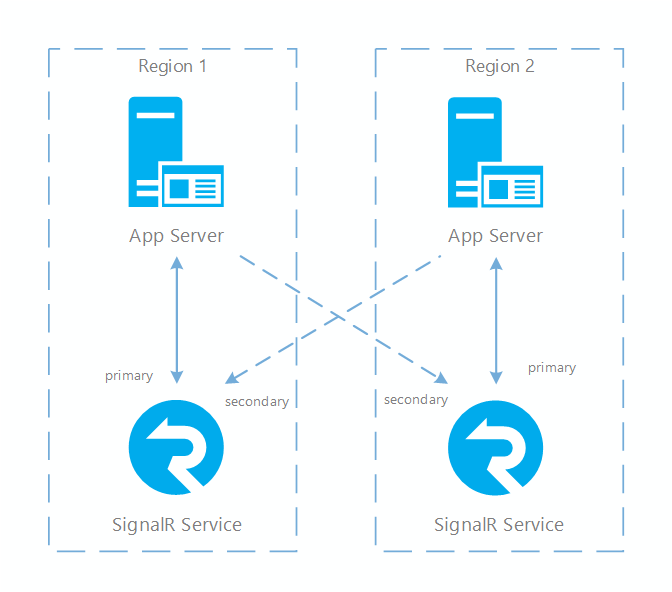
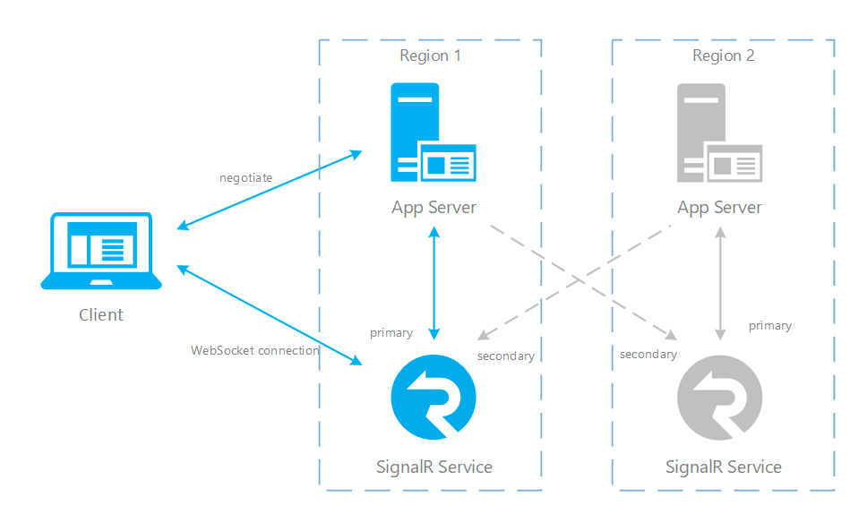
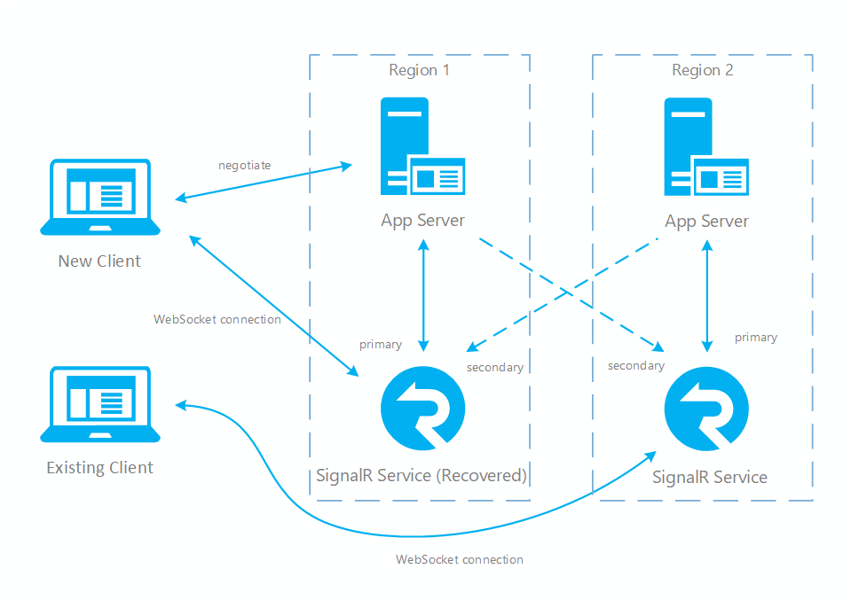

# Resiliency and disaster recovery

Resiliency and disaster recovery is a common need for online systems. Azure SignalR Service already guarantees 99.9% availability, but it's still a regional service.
Your service instance is always running in one region and won't fail-over to another region when there is a region-wide outage.

Instead, our service SDK provides a functionality to support multiple SignalR service instances and automatically switch to other instances when some of them are not available.
With this feature, you'll be able to recover when a disaster takes place, but you will need to set up the right system topology by yourself. You'll learn how to do so in this document.

## High available architecture for SignalR service

In order to have cross region resiliency for SignalR service, you need to set up multiple service instances in different regions. So when one region is down, the others can be used as backup.
When connecting multiple service instances to app server, there are two roles, primary and secondary.
Primary is an instance who is taking online traffic and secondary is a fully functional but backup instance for primary.
In our SDK implementation, negotiate will only return primary endpoints so in normal case clients only connect to primary endpoints.
But when primary instance is down, negotiate will return secondary endpoints so client can still make connections.
Primary instance and app server are connected through normal server connections but secondary instance and app server are connected through a special type of connection called weak connection.
The main difference of a weak connection is that it doesn't accept client connection routing, because secondary instance is located in another region. Routing a client to another region is not an optimal choice (increases latency).

One service instance can have different roles when connecting to multiple app servers.
One typical setup for cross region scenario is to have two (or more) pairs of SignalR service instances and app servers.
Inside each pair app server and SignalR service are located in the same region, and SignalR service is connected to the app server as a primary role.
Between each pairs app server and SignalR service are also connected, but SignalR becomes a secondary when connecting to server in another region.

With this topology, message from one server can still be delivered to all clients as all app servers and SignalR service instances are interconnected.
But when a client is connected, it's always routed to the app server in the same region to achieve optimal network latency.

Below is a diagram that illustrates such topology:



## Configure app servers with multiple SignalR service instances

Once you have SignalR service and app servers created in each region, you can configure your app servers to connect to all SignalR service instances.

There are two ways you can do it:

### Through config

You should already know how to set SignalR service connection string through environment variables/app settings/web.cofig, in a config entry named `Azure:SignalR:ConnectionString`.
If you have multiple endpoints, you can set them in multiple config entries, each in the following format:

```
Azure:SignalR:ConnectionString:<name>:<role>
```

Here `<name>` is the name of the endpoint and `<role>` is its role (primary or secondary).
Name is optional but it will be useful if you want to further customize the routing behavior among multiple endpoints.

### Through code

If you prefer to store the connection strings somewhere else, you can also read them in your code and use them as parameters when calling `AddAzureSignalR()` (in ASP.NET Core) or `MapAzureSignalR()` (in ASP.NET).

Here is the sample code:

ASP.NET Core:

```cs
services.AddSignalR()
        .AddAzureSignalR(options => options.Endpoints = new ServiceEndpoint[]
        {
            new ServiceEndpoint("<connection_string1>", EndpointType.Primary, "region1"),
            new ServiceEndpoint("<connection_string2>", EndpointType.Secondary, "region2"),
        });
```

ASP.NET:

```cs
app.MapAzureSignalR(GetType().FullName, hub,  options => options.Endpoints = new ServiceEndpoint[]
    {
        new ServiceEndpoint("<connection_string1>", EndpointType.Primary, "region1"),
        new ServiceEndpoint("<connection_string2>", EndpointType.Secondary, "region2"),
    };
```

You can configure multiple primary or secondary instances. If there're multiple primary and/or secondary instances, negotiate will return an endpoint in the following order:

1. If there is at least one primary instance online, return a random primary online instance.
2. If all primary instances are down, return a random secondary online instance.

## Failover sequence and best practice

Now you have the right system topology setup. Whenever one SignalR service instance is down, online traffic will be routed to other instances.
Here is what happens when a primary instance is down (and recovers after some time):

1. Primary service instance is down, all server connections on this instance will be dropped.
2. All servers connected to this instance will mark it as offline, and negotiate will stop returning this endpoint and start returning secondary endpoint.
3. All client connections on this instance will also be closed, clients will reconnect. Since app servers now return secondary endpoint, clients will connect to secondary instance.
4. Now secondary instance takes all online traffic. All messages from server to clients can still be delivered as secondary is connected to all app servers. But client to server messages are only routed to the app server in the same region.
5. After primary instance is recovered and back online, app server will reestablish connections to it and mark it as online. Negotiate will now return primary endpoint again so new clients are connected back to primary. But existing clients won't be dropped and will continue being routed to secondary until they disconnect themselves.

Below diagrams illustrate how failover is done in SignalR service:

Fig.1 Before failover


Fig.2 After failover


Fig.3 Short time after primary recovers


You can see in normal case only primary app server and SignalR service have online traffic (in blue).
After failover, secondary app server and SignalR service also become active.
After primary SignalR service is back online, new clients will connect to primary SignalR. But existing clients still connect to secondary so both instances have traffic.
After all existing clients disconnect, your system will be back to normal (Fig.1).

There are two main patterns for implementing a cross region high available architecture:

1. The first one is to have a pair of app server and SignalR service instance taking all online traffic, and have another pair as a backup (called active/passive, illustrated in Fig.1). 
2. The other one is to have two (or more) pairs of app servers and SignalR service instances, each one taking part of the online traffic and serves as backup for other pairs (called active/active, similar to Fig.3).

SignalR service can support both patterns, the main difference is how you implement app servers.
If app servers are active/passive, SignalR service will also be active/passive (as the primary app server only returns its primary SignalR service instance).
If app servers are active/active, SignalR service will also be active/active (as all app servers will return their own primary SignalR instances, so all of them can get traffic).

Be noted no matter which patterns you choose to use, you'll need to connect each SignalR service instance to an app server as primary.

Also due to the nature of SignalR connection (it's a long connection), clients will experience connection drops when there is a disaster and failover take place.
You'll need to handle such cases at client side to make it transparent to your end customers. For example, do reconnect after a connection is closed.

## Next steps

In this article, you have learned how to configure your application to achieve resiliency for SignalR service. To understand more details about server/client connection and connection routing in SignalR service, you can read [this article](signalr-concept-internals.md) for SignalR service internals.

For scaling scenarios such as sharding, that use multiple instances together to handle large number of connections, read [how to scale multiple instances](signalr-howto-scale-multi-instances.md).
