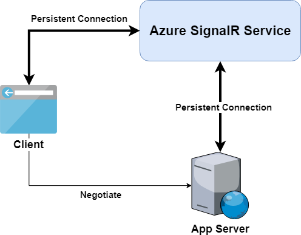

# Azure SignalR Service internals

Azure SignalR Service is built on top of ASP.NET Core SignalR framework. It also supports ASP.NET SignalR by reimplementing ASP.NET SignalR's data protocol on top of the ASP.NET Core framework.

You can easily migrate a local ASP.NET Core SignalR or an ASP.NET SignalR application to work with SignalR Service, with by changing few lines of code.

The diagram describes the typical architecture when you use the SignalR Service with your application server.

The differences from self-hosted ASP.NET Core SignalR application are discussed as well.



## Application server connections

A self-hosted ASP.NET Core SignalR application server listens to and connects clients directly.

With SignalR Service, the application server no longer accepts persistent client connections, instead:

1. A `negotiate` endpoint is exposed by Azure SignalR Service SDK for each hub.
1. The endpoint responds to client negotiation requests and redirect clients to SignalR Service.
1. The clients connect to SignalR Service.

For more information, see [Client connections](#client-connections).

Once the application server is started:

- For ASP.NET Core SignalR: Azure SignalR Service SDK opens five WebSocket connections per hub to SignalR Service. 
- For ASP.NET SignalR: Azure SignalR Service SDK opens five WebSocket connections per hub to SignalR Service, and one per application WebSocket connection.


The initial number of connections defaults to 5 and is configurable using the `InitialHubServerConnectionCount` option in the SignalR Service SDK.  For more information, see  [configuration](https://github.com/Azure/azure-signalr/blob/dev/docs/run-asp-net-core.md#maxhubserverconnectioncount). 

While the application server is connected to the SignalR service, the Azure SignalR service may send load-balancing messages to the server.  Then, the SDK starts new server connections to the service for better performance. Messages to and from clients are multiplexed into these connections.

Server connections are persistently connected to the SignalR Service. If a server connection is disconnected due to a network issue:

- All clients served by this server connection disconnect. For more information, see [Data transmission between client and server](#data-transmission-between-client-and-server).
- The server automatically reconnects the clients.

## Client connections

When you use the SignalR Service, clients connect to the service instead of the application server.
There are three steps to establish persistent connections between the client and the SignalR Service.

1. A client sends a negotiate request to the application server. 
1. The application server uses Azure SignalR Service SDK to return a redirect response containing the SignalR Service URL and access token.

    - For ASP.NET Core SignalR, a typical redirect response looks like:
        ```
        {
            "url":"https://test.service.signalr.net/client/?hub=chat&...",
            "accessToken":"<a typical JWT token>"
        }
        ```
    - For ASP.NET SignalR, a typical redirect response looks like:
        ```
        {
            "ProtocolVersion":"2.0",
            "RedirectUrl":"https://test.service.signalr.net/aspnetclient",
            "AccessToken":"<a typical JWT token>"
        }
        ```

1. After the client receives the redirect response, it uses the URL and access token to connect to SignalR Service.

To learn more about ASP.NET Core SignalR's, see [Transport Protocols](https://github.com/aspnet/SignalR/blob/release/2.2/specs/TransportProtocols.md).

## Data transmission between client and server

When a client is connected to the SignalR Service, the service runtime finds a server connection to serve this client.

- This step happens only once, and is a one-to-one mapping between the client and server connection.
- The mapping is maintained in SignalR Service until the client or server disconnects.

At this point, the application server receives an event with information from the new client. A logical connection to the client is created in the application server. The data channel is established from client to application server, via SignalR Service.

SignalR Service transmits data from the client to the pairing application server. Data from the application server is sent to the mapped clients.

SignalR Service doesn't save or store customer data, all customer data received is transmitted to the target server or clients in real-time.

The Azure SignalR Service acts as a logical transport layer between  application server and clients. All persistent connections are offloaded to SignalR Service.  As a result, the application server only needs to handle the business logic in the hub class, without worrying about client connections.

## Next steps

To learn more about Azure SignalR SDKs, see:

- [ASP.NET Core SignalR](/aspnet/core/signalr/introduction)
- [ASP.NET SignalR](/aspnet/signalr/overview/getting-started/introduction-to-signalr)
- [ASP.NET code samples](https://github.com/aspnet/AzureSignalR-samples)
