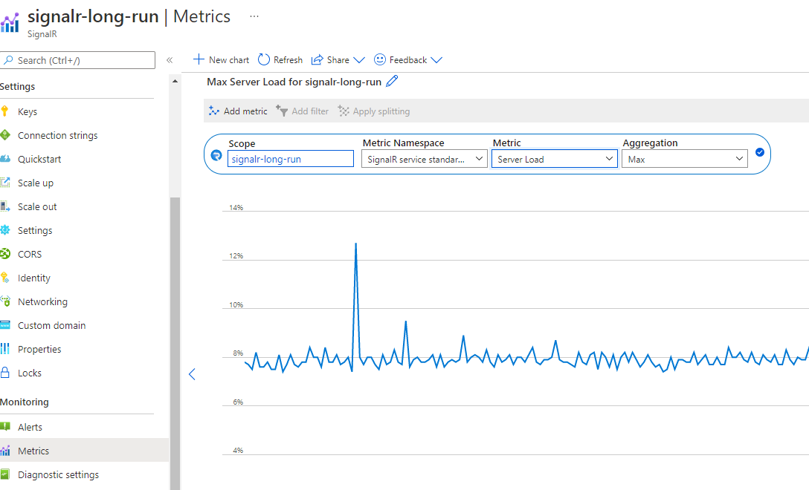
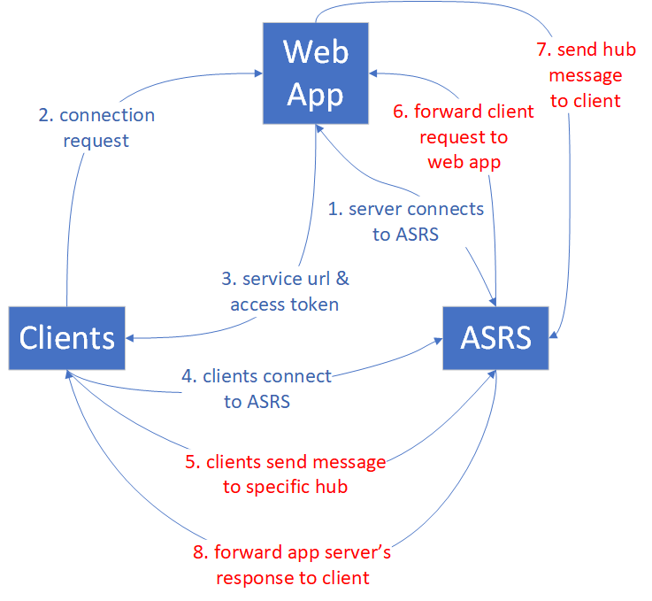
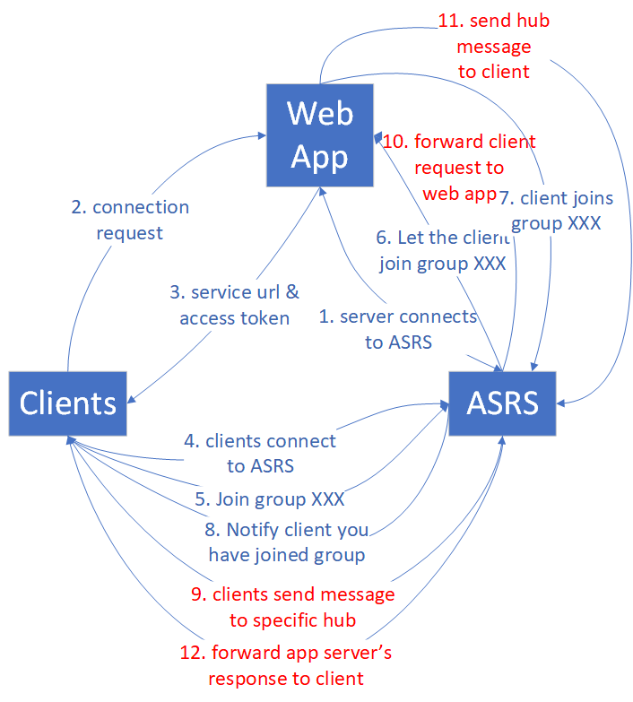
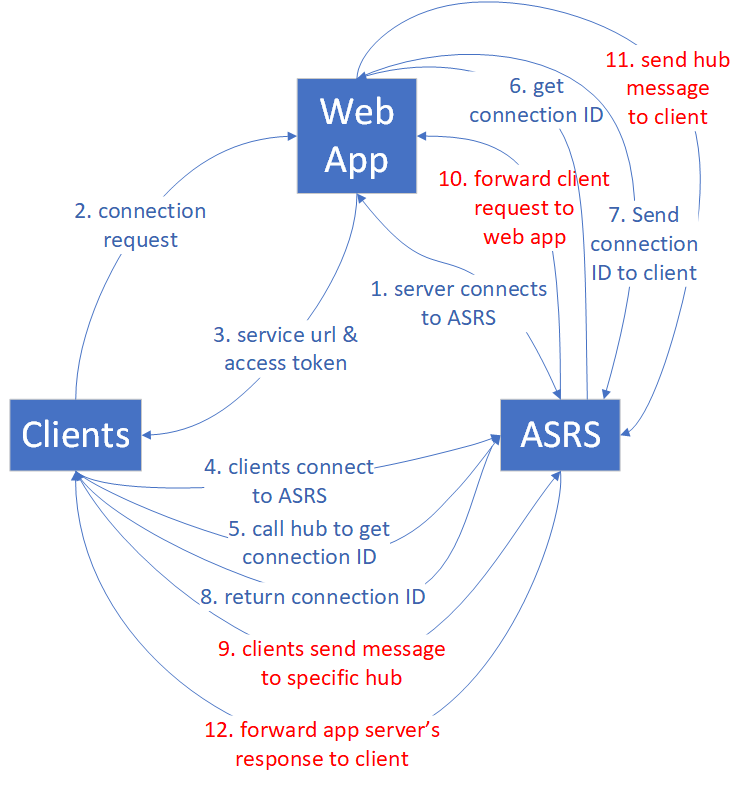

# Performance guide for Azure SignalR Service

One of the key benefits of using Azure SignalR Service is the ease of scaling SignalR applications. In a large-scale scenario, performance is an important factor. 

This article describes:

* The factors that affect SignalR application performance. 
* The typical performance in different use-case scenarios.
* The environment and tools that you can use to generate a performance report.

## Quick evaluation using metrics

You can easily monitor your service in the Azure portal. From the **Metrics** page of your SignalR instance, you can select the **Server Load** metrics to see the "pressure" of your service.
   
<kbd></kbd>

The chart shows the computing pressure of your SignalR service. You can test your scenario and check this metric to decide whether to scale up. The latency inside SignalR service remains low if the Server Load is below 70%. 
   
> [!NOTE]
> If you are using unit 50 or unit 100 **and** your scenario is mainly sending to small groups (group size <20) or single connection, you need to check [sending to small group](#small-group) or [sending to connection](#send-to-connection) for reference. In those scenarios there is large routing cost which is not included in the Server Load.

## Term definitions

*Inbound*: The incoming message to Azure SignalR Service.

*Outbound*: The outgoing message from Azure SignalR Service.

*Bandwidth*: The total size of all messages in 1 second.

*Default mode*: The default working mode when an Azure SignalR Service instance is created. Azure SignalR Service expects the app server to establish a connection with it before it accepts any client connections.

*Serverless mode*: A mode in which Azure SignalR Service accepts only client connections. No server connection is allowed.

## Overview

Azure SignalR Service defines seven Standard tiers for different performance capacities. This
guide answers the following questions:

* What is the typical Azure SignalR Service performance for each tier?

* Does Azure SignalR Service meet my requirements for message throughput (for example, sending 100,000 messages per second)?

* For my specific scenario, which tier is suitable for me? Or how can I select the proper tier?

* What kind of app server (VM size) is suitable for me? How many of them should I deploy?

To answer these questions, this guide first gives a high-level explanation of the factors that affect performance. It then illustrates the maximum inbound and outbound messages for every tier for typical use cases: **echo**, **broadcast**, **send to group**, and **send to connection** (peer-to-peer chatting).

This guide can't cover all scenarios (and different use cases, message sizes, message sending patterns, and so on). But it provides some methods to help you:

* Evaluate your approximate requirement for the inbound or outbound messages.
* Find the proper tiers by checking the performance table.

## Performance insight

This section describes the performance evaluation methodologies, and then lists all factors that affect performance. In the end, it provides methods to help you evaluate performance requirements.

### Methodology

*Throughput* and *latency* are two typical aspects of performance checking. For Azure SignalR Service, each SKU tier has its own throughput throttling policy. The policy defines *the maximum allowed throughput (inbound and outbound bandwidth)* as the maximum achieved throughput when 99 percent of messages have latency that's less than 1 second.

Latency is the time span from the connection sending the message to receiving the response message from Azure SignalR Service. Take **echo** as an example. Every client connection adds a time stamp in the message. The app server's hub sends the original message back to the client. So the propagation delay is easily calculated by every client connection. The time stamp is attached for every message in **broadcast**, **send to group**, and **send to connection**.

To simulate thousands of concurrent client connections, multiple VMs are created in a virtual private network in Azure. All of these VMs connect to the same Azure SignalR Service instance.

In the default mode of Azure SignalR Service, app server VMs are deployed in the same virtual private network as client VMs. All client VMs and app server VMs are deployed in the same network of the same region to avoid cross-region latency.

### Performance factors

The following factors affect SignalR performance.

* SKU tier (CPU/memory)
* Number of connections
* Message size
* Message send rate
* Transport type (WebSocket, Server-Sent-Event, or Long-Polling)
* Use-case scenario (routing cost)
* App server and service connections (in server mode)

#### Computer resources

Theoretically, Azure SignalR Service capacity is limited by compute resources: CPU, memory, and network. For example, more connections to Azure SignalR Service cause the service to use more memory. For larger message traffic (for example, every message is larger than 2,048 bytes), Azure SignalR Service needs to spend more CPU cycles to process traffic. Meanwhile, Azure network bandwidth also imposes a limit for maximum traffic.

#### Transport type

The transport type is another factor that affects performance. The three types are:

* [WebSocket](https://en.wikipedia.org/wiki/WebSocket): WebSocket is a bidirectional and full-duplex communication protocol over a single TCP connection. 
* [Server-Sent-Event](https://en.wikipedia.org/wiki/Server-sent_events): Server-Sent-Event is a unidirectional protocol to push messages from server to client. 
* [Long-Polling](https://en.wikipedia.org/wiki/Push_technology): Long-Polling requires the clients to periodically poll information from the server through an HTTP request.

For the same API under the same conditions, WebSocket has the best performance, Server-Sent-Event is slower, and Long-Polling is the slowest. Azure SignalR Service recommends WebSocket by default.

#### Message routing cost

The message routing cost also limits performance. Azure SignalR Service plays a role as a message router, which routes the message from a set of clients or servers to other clients or servers. A different scenario or API requires a different routing policy. 

For **echo**, the client sends a message to itself, and the routing destination is also itself. This pattern has the lowest routing cost. But for **broadcast**, **send to group**, and **send to connection**, Azure SignalR Service needs to look up the target connections through the internal distributed data structure. This extra processing uses more CPU, memory, and network bandwidth. As a result, performance is slower.

In the default mode, the app server might also become a bottleneck for certain scenarios. The Azure SignalR SDK has to invoke the hub, while it maintains a live connection with every client through heartbeat signals.

In serverless mode, the client sends a message by HTTP post, which isn't as efficient as WebSocket.

#### Protocol

Another factor is protocol: JSON and [MessagePack](https://msgpack.org/index.html). MessagePack is smaller in size and delivered faster than JSON. MessagePack might not improve performance, though. The performance of Azure SignalR Service isn't sensitive to protocols because it doesn't decode the message payload during message forwarding from clients to servers or vice versa.

### Finding a proper SKU

How can you evaluate the inbound/outbound capacity or find which tier is suitable for a specific use case?

Assume that the app server is powerful enough and isn't the performance bottleneck. Then, check the maximum inbound and outbound bandwidth for every tier.

#### Quick evaluation

For a quick evaluation, assume the following default settings: 

* The transport type is WebSocket.
* The message size is 2,048 bytes.
* A message is sent every 1 second.
* Azure SignalR Service is in the default mode.

Every tier has its own maximum inbound bandwidth and outbound bandwidth. A smooth user experience isn't guaranteed after the inbound or outbound connection exceeds the limit.

**Echo** gives the maximum inbound bandwidth because it has the lowest routing cost. **Broadcast** defines the maximum outbound message bandwidth.

Do *not* exceed the highlighted values in the following two tables.

|       Echo                        | Unit1 | Unit2 | Unit5 | Unit10 | Unit20 | Unit50 | Unit100 |
|-----------------------------------|-------|-------|-------|--------|--------|--------|---------|
| Connections                       | 1,000 | 2,000 | 5,000 | 10,000 | 20,000 | 50,000 | 100,000 |
| **Inbound bandwidth** | **2 MBps**    | **4 MBps**    | **10 MBps**   | **20 MBps**    | **40 MBps**    | **100 MBps**   | **200 MBps**    |
| Outbound bandwidth | 2 MBps   | 4 MBps   | 10 MBps  | 20 MBps   | 40 MBps   | 100 MBps  | 200 MBps   |


|     Broadcast             | Unit1 | Unit2 | Unit5  | Unit10 | Unit20 | Unit50  | Unit100 |
|---------------------------|-------|-------|--------|--------|--------|---------|---------|
| Connections               | 1,000 | 2,000 | 5,000  | 10,000 | 20,000 | 50,000  | 100,000 |
| Inbound bandwidth  | 4 KBps   | 4 KBps   | 4 KBps    | 4 KBps    | 4 KBps    | 4 KBps     | 4 KBps    |
| **Outbound bandwidth** | **4 MBps**    | **8 MBps**    | **20 MBps**    | **40 MBps**    | **80 MBps**    | **200 MBps**    | **400 MBps**   |

*Inbound bandwidth* and *outbound bandwidth* are the total message size per second.  Here are the formulas for them:
```
  inboundBandwidth = inboundConnections * messageSize / sendInterval
  outboundBandwidth = outboundConnections * messageSize / sendInterval
```

* *inboundConnections*: The number of connections sending the message.

* *outboundConnections*: The number of connections receiving the message.

* *messageSize*: The size of a single message (average value). A small message that's less than 1,024 bytes has a performance impact that's similar to a 1,024-byte message.

* *sendInterval*: The time of sending one message. Typically it's 1 second per message, which means sending one message every second. A smaller interval means sending more message in a time period. For example, 0.5 second per message means sending two messages every second.

* *Connections*: The committed maximum threshold for Azure SignalR Service for every tier. If the connection number is increased further, it suffers from connection throttling.

#### Evaluation for complex use cases

##### Bigger message size or different sending rate

The real use case is more complicated. It might send a message larger than 2,048 bytes, or the sending message rate isn't one message per second. Let's take Unit100's broadcast as an example to find how to evaluate its performance.

The following table shows a real use case of **broadcast**. But the message size, connection count, and message sending rate are different from what we assumed in the previous section. The question is how we can deduce any of those items (message size, connection count, or message sending rate) if we know only two of them.

| Broadcast  | Message size | Inbound messages per second | Connections | Send intervals |
|---|---------------------|--------------------------|-------------|-------------------------|
| 1 | 20 KB                | 1                        | 100,000     | 5 sec                      |
| 2 | 256 KB               | 1                        | 8,000       | 5 sec                      |

The following formula is easy to infer based on the previous formula:

```
outboundConnections = outboundBandwidth * sendInterval / messageSize
```

For Unit100, the maximum outbound bandwidth is 400 MB from the previous table. For a 20-KB message size, the maximum outbound connections should be 400 MB \* 5 / 20 KB =
100,000, which matches the real value.

##### Mixed use cases

The real use case typically mixes the four basic use cases together: **echo**, **broadcast**, **send to group**, and **send to connection**. The methodology that you use to evaluate the capacity is to:

1. Divide the mixed use cases into four basic use cases.
1. Calculate the maximum inbound and outbound message bandwidth by using the preceding formulas separately.
1. Sum the bandwidth calculations to get the total maximum inbound/outbound bandwidth. 

Then pick up the proper tier from the maximum inbound/outbound bandwidth tables.

> [!NOTE]
> For sending a message to hundreds or thousands of small groups, or for thousands of clients sending a message to each other, the routing cost will become dominant. Take this impact into account.

For the use case of sending a message to clients, make sure that the app server isn't* the bottleneck. The following "Case study" section gives guidelines about how many app servers you need and how many server connections you should configure.

## Case study

The following sections go through four typical use cases for WebSocket transport: **echo**, **broadcast**, **send to group**, and **send to connection**. For each scenario, the section lists the current inbound and outbound capacity for Azure SignalR Service. It also explains the main factors that affect performance.

In the default mode, the app server creates five server connections with Azure SignalR Service. The app server uses the Azure SignalR Service SDK by default. In the following performance test results, server connections are increased to 15 (or more for broadcasting and sending a message to a big group).

Different use cases have different requirements for app servers. **Broadcast** needs small number of app servers. **Echo** or **send to connection** needs many app servers.

In all use cases, the default message size is 2,048 bytes, and the message send interval is 1 second.

### Default mode

Clients, web app servers, and Azure SignalR Service are involved in the default mode. Every client stands for a single connection.

#### Echo

First, a web app connects to Azure SignalR Service. Second, many clients connect to the web app, which redirects the clients to Azure SignalR Service with the access token and endpoint. Then, the clients establish WebSocket connections with Azure SignalR Service.

After all clients establish connections, they start sending a message that contains a time stamp to the specific hub every second. The hub echoes the message back to its original client. Every client calculates the latency when it receives the echo message back.

In the following diagram, 5 through 8 (red highlighted traffic) are in a loop. The loop runs for a default duration (5 minutes) and gets the statistic of all message latency.



The behavior of **echo** determines that the maximum inbound bandwidth is equal to the maximum outbound bandwidth. For details, see the following table.

|       Echo                        | Unit1 | Unit2 | Unit5 | Unit10 | Unit20 | Unit50 | Unit100 |
|-----------------------------------|-------|-------|-------|--------|--------|--------|---------|
| Connections                       | 1,000 | 2,000 | 5,000 | 10,000 | 20,000 | 50,000 | 100,000 |
| Inbound/outbound messages per second | 1,000 | 2,000 | 5,000 | 10,000 | 20,000 | 50,000 | 100,000 |
| Inbound/outbound bandwidth | 2 MBps   | 4 MBps   | 10 MBps  | 20 MBps   | 40 MBps   | 100 MBps  | 200 MBps   |

In this use case, every client invokes the hub defined in the app server. The hub just calls the method defined in the original client side. This hub is the most lightweight hub for **echo**.

```
        public void Echo(IDictionary<string, object> data)
        {
            Clients.Client(Context.ConnectionId).SendAsync("RecordLatency", data);
        }
```

Even for this simple hub, the traffic pressure on the app server is prominent as the **echo** inbound message load increases. This traffic pressure requires many app servers for large SKU tiers. The following table lists the app server count for every tier.


|    Echo          | Unit1 | Unit2 | Unit5 | Unit10 | Unit20 | Unit50 | Unit100 |
|------------------|-------|-------|-------|--------|--------|--------|---------|
| Connections      | 1,000 | 2,000 | 5,000 | 10,000 | 20,000 | 50,000 | 100,000 |
| App server count | 2     | 2     | 2     | 3      | 3      | 10     | 20      |

> [!NOTE]
> The client connection number, message size, message sending rate, SKU tier, and CPU/memory of the app server affect the overall performance of **echo**.

#### Broadcast

For **broadcast**, when the web app receives the message, it broadcasts to all clients. The more clients there are to broadcast, the more message traffic there's to all clients. See the following diagram.


A small number of clients are broadcasting. The inbound message bandwidth is small, but the outbound bandwidth is huge. The outbound message bandwidth increases as the client connection or broadcast rate increases.

The following table summarizes maximum client connections, inbound/outbound message count, and bandwidth.

|     Broadcast             | Unit1 | Unit2 | Unit5  | Unit10 | Unit20 | Unit50  | Unit100 |
|---------------------------|-------|-------|--------|--------|--------|---------|---------|
| Connections               | 1,000 | 2,000 | 5,000  | 10,000 | 20,000 | 50,000  | 100,000 |
| Inbound messages per second  | 2     | 2     | 2      | 2      | 2      | 2       | 2       |
| Outbound messages per second | 2,000 | 4,000 | 10,000 | 20,000 | 40,000 | 100,000 | 200,000 |
| Inbound bandwidth  | 4 KBps   | 4 KBps   | 4 KBps    | 4 KBps    | 4 KBps    | 4 KBps     | 4 KBps     |
| Outbound bandwidth | 4 MBps   | 8 MBps   | 20 MBps   | 40 MBps   | 80 MBps   | 200 MBps   | 400 MBps   |

The broadcasting clients that post messages are no more than four. They need fewer app servers compared with **echo** because the inbound message amount is small. Two app servers are enough for both SLA and performance considerations. But you should increase the default server connections to avoid imbalance, especially for Unit50 and Unit100.

|   Broadcast      | Unit1 | Unit2 | Unit5 | Unit10 | Unit20 | Unit50 | Unit100 |
|------------------|-------|-------|-------|--------|--------|--------|---------|
| Connections      | 1,000 | 2,000 | 5,000 | 10,000 | 20,000 | 50,000 | 100,000 |
| App server count | 2     | 2     | 2     | 2      | 2      | 2      | 2       |

> [!NOTE]
> Increase the default server connections from 5 to 40 on every app server to avoid possible unbalanced server connections to Azure SignalR Service.
>
> The client connection number, message size, message sending rate, and SKU tier affect the overall performance for **broadcast**.

#### Send to group

The **send to group** use case has a similar traffic pattern to **broadcast**. The difference is that after clients establish WebSocket connections with Azure SignalR Service, they must join groups before they can send a message to a specific group. The following diagram illustrates the traffic flow.



Group member and group count are two factors that affect performance. To
simplify the analysis, we define two kinds of groups:

* **Small group**: Every group has 10 connections. The group number is equal to (max
connection count) / 10. For example, for Unit1, if there are 1,000 connection counts, then we have 1000 / 10 = 100 groups.

* **Big group**: The group number is always 10. The group member count is equal to (max
connection count) / 10. For example, for Unit1, if there are 1,000 connection counts, then every group has 1000 / 10 = 100 members.

**Send to group** brings a routing cost to Azure SignalR Service because it has to find the target connections through a distributed data structure. As the sending connections increase, the cost increases.

##### Small group

The routing cost is significant for sending message to many small groups. Currently, the Azure SignalR Service implementation hits the routing cost limit at Unit50. Adding more CPU and memory doesn't help, so Unit100 can't improve further by design. If you need more inbound bandwidth, contact customer support.

|   Send to small group     | Unit1 | Unit2 | Unit5  | Unit10 | Unit20 | Unit50 | Unit100 |
|---------------------------|-------|-------|--------|--------|--------|--------|---------|
| Connections               | 1,000 | 2,000 | 5,000  | 10,000 | 20,000 | 50,000 | 100,000
| Group member count        | 10    | 10    | 10     | 10     | 10     | 10     | 10 
| Group count               | 100   | 200   | 500    | 1,000  | 2,000  | 5,000  | 10,000 
| Inbound messages per second  | 200   | 400   | 1,000  | 2,500  | 4,000  | 7,000  | 7,000   |
| Inbound bandwidth  | 400 KBps  | 800 KBps  | 2 MBps     | 5 MBps     | 8 MBps     | 14 MBps    | 14 MBps     |
| Outbound messages per second | 2,000 | 4,000 | 10,000 | 25,000 | 40,000 | 70,000 | 70,000  |
| Outbound bandwidth | 4 MBps    | 8 MBps    | 20 MBps    | 50 MBps     | 80 MBps    | 140 MBps   | 140 MBps    |

Many client connections are calling the hub, so the app server number is also critical for performance. The following table lists the suggested app server counts.

|  Send to small group   | Unit1 | Unit2 | Unit5 | Unit10 | Unit20 | Unit50 | Unit100 |
|------------------|-------|-------|-------|--------|--------|--------|---------|
| Connections      | 1,000 | 2,000 | 5,000 | 10,000 | 20,000 | 50,000 | 100,000 |
| App server count | 2     | 2     | 2     | 3      | 3      | 10     | 20      |

> [!NOTE]
> The client connection number, message size, message sending rate, routing cost, SKU tier, and CPU/memory of the app server affect the overall performance of **send to small group**.
>
> The group count, group member count listed in the table are **not hard limits**. Those parameters are chosen to set a stable benchmark scenario. For example, it is OK to assign each conneciton to a distinct group. In this scenario, the performance is close to [send to connection](#send-to-connection).

##### Big group

For **send to big group**, the outbound bandwidth becomes the bottleneck before hitting the routing cost limit. The following table lists the maximum outbound bandwidth, which is almost the same as that for **broadcast**.

|    Send to big group      | Unit1 | Unit2 | Unit5  | Unit10 | Unit20 | Unit50  | Unit100 |
|---------------------------|-------|-------|--------|--------|--------|---------|---------|
| Connections               | 1,000 | 2,000 | 5,000  | 10,000 | 20,000 | 50,000  | 100,000
| Group member count        | 100   | 200   | 500    | 1,000  | 2,000  | 5,000   | 10,000 
| Group count               | 10    | 10    | 10     | 10     | 10     | 10      | 10
| Inbound messages per second  | 20    | 20    | 20     | 20     | 20     | 20      | 20      |
| Inbound bandwidth  | 80 KBps   | 40 KBps   | 40 KBps    | 20 KBps    | 40 KBps    | 40 KBps     | 40 KBps     |
| Outbound messages per second | 2,000 | 4,000 | 10,000 | 20,000 | 40,000 | 100,000 | 200,000 |
| Outbound bandwidth | 8 MBps    | 8 MBps    | 20 MBps    | 40 MBps    | 80 MBps    | 200 MBps    | 400 MBps    |

The sending connection count is no more than 40. The burden on the app server is small, so the suggested number of web apps is small.

|  Send to big group  | Unit1 | Unit2 | Unit5 | Unit10 | Unit20 | Unit50 | Unit100 |
|------------------|-------|-------|-------|--------|--------|--------|---------|
| Connections      | 1,000 | 2,000 | 5,000 | 10,000 | 20,000 | 50,000 | 100,000 |
| App server count | 2     | 2     | 2     | 2      | 2      | 2      | 2       |

> [!NOTE]
> Increase the default server connections from 5 to 40 on every app server to avoid possible unbalanced server connections to Azure SignalR Service.
> 
> The client connection number, message size, message sending rate, routing cost, and SKU tier affect the overall performance of **send to big group**.

#### Send to connection

In the **send to connection** use case, when clients establish the connections to Azure SignalR Service, every client calls a special hub to get their own connection ID. The performance benchmark collects all connection IDs, shuffles them, and reassigns them to all clients as a sending target. The clients keep sending the message to the target connection until the performance test finishes.



The routing cost for **send to connection** is similar to the cost for **send to small group**.

As the connection count increases, the routing cost limits overall performance. Unit50 has reached the limit. As a result, Unit100 can't improve further.

The following table is a statistical summary after many rounds of running the **send to connection** benchmark.

|   Send to connection   | Unit1 | Unit2 | Unit5 | Unit10 | Unit20 | Unit50          | Unit100         |
|------------------------------------|-------|-------|-------|--------|--------|-----------------|-----------------|
| Connections                        | 1,000 | 2,000 | 5,000 | 10,000 | 20,000 | 50,000          | 100,000         |
| Inbound/outbound messages per second | 1,000 | 2,000 | 5,000 | 8,000  | 9,000  | 20,000 | 20,000 |
| Inbound/outbound bandwidth | 2 MBps    | 4 MBps    | 10 MBps   | 16 MBps    | 18 MBps    | 40 MBps       | 40 MBps       |

This use case requires high load on the app server side. See the suggested app server count in the following table.

|  Send to connection  | Unit1 | Unit2 | Unit5 | Unit10 | Unit20 | Unit50 | Unit100 |
|------------------|-------|-------|-------|--------|--------|--------|---------|
| Connections      | 1,000 | 2,000 | 5,000 | 10,000 | 20,000 | 50,000 | 100,000 |
| App server count | 2     | 2     | 2     | 3      | 3      | 10     | 20      |

> [!NOTE]
> The client connection number, message size, message sending rate, routing cost, SKU tier, and CPU/memory for the app server affect the overall performance of **send to connection**.

#### ASP.NET SignalR echo, broadcast, and send to small group

Azure SignalR Service provides the same performance capacity for ASP.NET SignalR. 

The performance test uses Azure Web Apps from [Standard Service Plan S3](https://azure.microsoft.com/pricing/details/app-service/windows/) for ASP.NET SignalR.

The following table gives the suggested web app count for ASP.NET SignalR **echo**.

|   Echo           | Unit1 | Unit2 | Unit5 | Unit10 | Unit20 | Unit50 | Unit100 |
|------------------|-------|-------|-------|--------|--------|--------|---------|
| Connections      | 1,000 | 2,000 | 5,000 | 10,000 | 20,000 | 50,000 | 100,000 |
| App server count | 2     | 2     | 4     | 4      | 8      | 32      | 40       |

The following table gives the suggested web app count for ASP.NET SignalR **broadcast**.

|  Broadcast       | Unit1 | Unit2 | Unit5 | Unit10 | Unit20 | Unit50 | Unit100 |
|------------------|-------|-------|-------|--------|--------|--------|---------|
| Connections      | 1,000 | 2,000 | 5,000 | 10,000 | 20,000 | 50,000 | 100,000 |
| App server count | 2     | 2     | 2     | 2      | 2      | 2      | 2       |

The following table gives the suggested web app count for ASP.NET SignalR **send to small group**.

|  Send to small group     | Unit1 | Unit2 | Unit5 | Unit10 | Unit20 | Unit50 | Unit100 |
|------------------|-------|-------|-------|--------|--------|--------|---------|
| Connections      | 1,000 | 2,000 | 5,000 | 10,000 | 20,000 | 50,000 | 100,000 |
| App server count | 2     | 2     | 4     | 4      | 8      | 32      | 40       |

### Serverless mode

Clients and Azure SignalR Service are involved in serverless mode. Every client stands for a single connection. The client sends messages through the REST API to another client or broadcast messages to all.

Sending high-density messages through the REST API isn't as efficient as using WebSocket. It requires you to build a new HTTP connection every time, and that's an extra cost in serverless mode.

#### Broadcast through REST API
All clients establish WebSocket connections with Azure SignalR Service. Then some clients start broadcasting through the REST API. The message sending (inbound) is all through HTTP Post, which isn't efficient compared with WebSocket.

|   Broadcast through REST API     | Unit1 | Unit2 | Unit5  | Unit10 | Unit20 | Unit50  | Unit100 |
|---------------------------|-------|-------|--------|--------|--------|---------|---------|
| Connections               | 1,000 | 2,000 | 5,000  | 10,000 | 20,000 | 50,000  | 100,000 |
| Inbound messages per second  | 2     | 2     | 2      | 2      | 2      | 2       | 2       |
| Outbound messages per second | 2,000 | 4,000 | 10,000 | 20,000 | 40,000 | 100,000 | 200,000 |
| Inbound bandwidth  | 4 KBps    | 4 KBps    | 4 KBps     | 4 KBps     | 4 KBps     | 4 KBps      | 4 KBps      |
| Outbound bandwidth | 4 MBps    | 8 MBps    | 20 MBps    | 40 MBps    | 80 MBps    | 200 MBps    | 400 MBps    |

#### Send to user through REST API
The benchmark assigns usernames to all of the clients before they start connecting to Azure SignalR Service. After the clients establish WebSocket connections with Azure SignalR Service, they start sending messages to others through HTTP Post.

|   Send to user through REST API | Unit1 | Unit2 | Unit5  | Unit10 | Unit20 | Unit50  | Unit100 |
|---------------------------|-------|-------|--------|--------|--------|---------|---------|
| Connections               | 1,000 | 2,000 | 5,000  | 10,000 | 20,000 | 50,000  | 100,000 |
| Inbound messages per second  | 300   | 600   | 900    | 1,300  | 2,000  | 10,000  | 18,000  |
| Outbound messages per second | 300   | 600   | 900    | 1,300  | 2,000  | 10,000  | 18,000 |
| Inbound bandwidth  | 600 KBps  | 1.2 MBps  | 1.8 MBps   | 2.6 MBps   | 4 MBps     | 10 MBps     | 36 MBps    |
| Outbound bandwidth | 600 KBps  | 1.2 MBps  | 1.8 MBps   | 2.6 MBps   | 4 MBps     | 10 MBps     | 36 MBps    |

## Performance test environments

For all use cases listed earlier, we conducted the performance tests in an Azure environment. At most, we used 50 client VMs and 20 app server VMs. Here are some details:

- Client VM size: StandardDS2V2 (2 vCPU, 7G memory)

- App server VM size: StandardF4sV2 (4 vCPU, 8G memory)

- Azure SignalR SDK server connections: 15

## Performance tools

You can find performance tools for Azure SignalR Service on [GitHub](https://github.com/Azure/azure-signalr-bench/).

## Next steps

In this article, you got an overview of Azure SignalR Service performance in typical use-case scenarios.

To get details on the internals of the service and scaling for it, read the following guides:

* [Azure SignalR Service internals](signalr-concept-internals.md)
* [Azure SignalR Service scaling](signalr-howto-scale-multi-instances.md)
