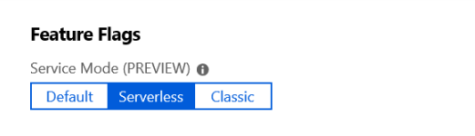
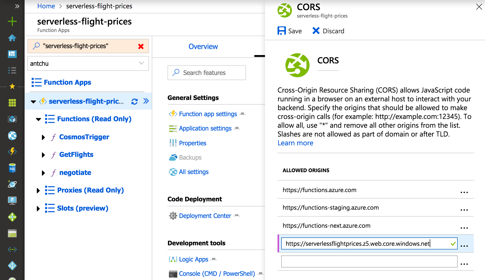

# Azure Functions development and configuration with Azure SignalR Service

Azure Functions applications can use the [Azure SignalR Service bindings](../azure-functions/functions-bindings-signalr-service.md) to add real-time capabilities. Client applications use client SDKs available in several languages to connect to Azure SignalR Service and receive real-time messages.

This article describes the concepts for developing and configuring an Azure Function app that is integrated with SignalR Service.

## SignalR Service configuration

Azure SignalR Service can be configured in [different modes](concept-service-mode.md). When used with Azure Functions, the service must be configured in **Serverless** mode.

In the Azure portal, locate the **Settings** page of your SignalR Service resource. Set the **Service mode** to **Serverless**.



## Azure Functions development

A serverless real-time application built with Azure Functions and Azure SignalR Service requires at least two Azure Functions:

- A `negotiate` function that the client calls to obtain a valid SignalR Service access token and endpoint URL.
- One or more functions that handle messages sent from SignalR Service to clients.

### negotiate function

A client application requires a valid access token to connect to Azure SignalR Service. An access token can be anonymous or authenticated to a user ID. Serverless SignalR Service applications require an HTTP endpoint named `negotiate` to obtain a token and other connection information, such as the SignalR Service endpoint URL.

Use an HTTP-triggered Azure Function and the `SignalRConnectionInfo` input binding to generate the connection information object. The function must have an HTTP route that ends in `/negotiate`.

With [class-based model](#class-based-model) in C#, you don't need the `SignalRConnectionInfo` input binding and can add custom claims much more easily. For more information, see [Negotiate experience in class-based model](#negotiate-experience-in-class-based-model).

For more information about the `negotiate` function, see [Azure Functions development](#negotiate-function).

To learn how to create an authenticated token, refer to [Using App Service Authentication](#using-app-service-authentication).

### Handle messages sent from SignalR Service

Use the `SignalRTrigger` binding to handle messages sent from SignalR Service. You can get notified when clients send messages or clients get connected or disconnected.

For more information, see the [SignalR Service trigger binding reference](../azure-functions/functions-bindings-signalr-service-trigger.md).

You also need to configure your function endpoint as an upstream endpoint so that service will trigger the function when there's message from a client. For more information about how to configure upstream endpoints, see [Upstream endpoints](concept-upstream.md).

> [!NOTE]
> SignalR Service doesn't support the `StreamInvocation` message from a client in Serverless Mode.

### Sending messages and managing group membership

Use the `SignalR` output binding to send messages to clients connected to Azure SignalR Service. You can broadcast messages to all clients, or you can send them to a subset of clients. For example, only send messages to clients authenticated with a specific user ID, or only to a specific group.

Users can be added to one or more groups. You can also use the `SignalR` output binding to add or remove users to/from groups.

For more information, see the [`SignalR` output binding reference](../azure-functions/functions-bindings-signalr-service-output.md).

### SignalR Hubs

SignalR has a concept of _hubs_. Each client connection and each message sent from Azure Functions is scoped to a specific hub. You can use hubs as a way to separate your connections and messages into logical namespaces.

## Class-based model

The class-based model is dedicated for C#. The class-based model provides a consistent SignalR server-side programming experience, with the following features:

- Less configuration work: The class name is used as `HubName`, the method name is used as `Event` and the `Category` is decided automatically according to method name.
- Auto parameter binding: `ParameterNames` and attribute `[SignalRParameter]` aren't needed. Parameters are automatically bound to arguments of Azure Function methods in order.
- Convenient output and negotiate experience.

The following code demonstrates these features:

```cs
public class HubName1 : ServerlessHub
{
    [FunctionName("negotiate")]
    public SignalRConnectionInfo Negotiate([HttpTrigger(AuthorizationLevel.Anonymous)]HttpRequest req)
    {
        return Negotiate(req.Headers["x-ms-signalr-user-id"], GetClaims(req.Headers["Authorization"]));
    }

    [FunctionName(nameof(OnConnected))]
    public async Task OnConnected([SignalRTrigger]InvocationContext invocationContext, ILogger logger)
    {
        await Clients.All.SendAsync(NewConnectionTarget, new NewConnection(invocationContext.ConnectionId));
        logger.LogInformation($"{invocationContext.ConnectionId} has connected");
    }

    [FunctionName(nameof(Broadcast))]
    public async Task Broadcast([SignalRTrigger]InvocationContext invocationContext, string message, ILogger logger)
    {
        await Clients.All.SendAsync(NewMessageTarget, new NewMessage(invocationContext, message));
        logger.LogInformation($"{invocationContext.ConnectionId} broadcast {message}");
    }

    [FunctionName(nameof(OnDisconnected))]
    public void OnDisconnected([SignalRTrigger]InvocationContext invocationContext)
    {
    }
}
```

All functions that want to use the class-based model need to be a method of the class that inherits from **ServerlessHub**. The class name `SignalRTestHub` in the sample is the hub name.

### Define hub method

All the hub methods **must** have an argument of `InvocationContext` decorated by `[SignalRTrigger]` attribute and use a parameterless constructor. Then the **method name** is treated as a parameter **event**.

By default, `category=messages` except the method name is one of the following names:

- `OnConnected`: Treated as `category=connections, event=connected`
- `OnDisconnected`: Treated as `category=connections, event=disconnected`

### Parameter binding experience

In class based model, `[SignalRParameter]` is unnecessary because all the arguments are marked as `[SignalRParameter]` by default except in one of the following situations:

- The argument is decorated by a binding attribute
- The argument's type is `ILogger` or `CancellationToken`
- The argument is decorated by attribute `[SignalRIgnore]`

### Negotiate experience in class-based model

Instead of using SignalR input binding `[SignalR]`, negotiation in class-based model can be more flexible. Base class `ServerlessHub` has a method

```cs
SignalRConnectionInfo Negotiate(string userId = null, IList<Claim> claims = null, TimeSpan? lifeTime = null)
```

This features user customizes `userId` or `claims` during the function execution.

## Use `SignalRFilterAttribute`

User can inherit and implement the abstract class `SignalRFilterAttribute`. If exceptions are thrown in `FilterAsync`, `403 Forbidden` will be sent back to clients.

The following sample demonstrates how to implement a customer filter that only allows the `admin` to invoke `broadcast`.

```cs
[AttributeUsage(AttributeTargets.Method, AllowMultiple = true, Inherited = true)]
internal class FunctionAuthorizeAttribute: SignalRFilterAttribute
{
    private const string AdminKey = "admin";

    public override Task FilterAsync(InvocationContext invocationContext, CancellationToken cancellationToken)
    {
        if (invocationContext.Claims.TryGetValue(AdminKey, out var value) &&
            bool.TryParse(value, out var isAdmin) &&
            isAdmin)
        {
            return Task.CompletedTask;
        }

        throw new Exception($"{invocationContext.ConnectionId} doesn't have admin role");
    }
}
```

Use the attribute to authorize the function.

```cs
[FunctionAuthorize]
[FunctionName(nameof(Broadcast))]
public async Task Broadcast([SignalRTrigger]InvocationContext invocationContext, string message, ILogger logger)
{
}
```

## Client development

SignalR client applications can use the SignalR client SDK in one of several languages to easily connect to and receive messages from Azure SignalR Service.

### Configuring a client connection

To connect to SignalR Service, a client must complete a successful connection negotiation that consists of these steps:

1. Make a request to the `negotiate` HTTP endpoint discussed above to obtain valid connection information
1. Connect to SignalR Service using the service endpoint URL and access token obtained from the `negotiate` endpoint

SignalR client SDKs already contain the logic required to perform the negotiation handshake. Pass the negotiate endpoint's URL, minus the `negotiate` segment, to the SDK's `HubConnectionBuilder`. Here's an example in JavaScript:

```javascript
const connection = new signalR.HubConnectionBuilder()
  .withUrl("https://my-signalr-function-app.azurewebsites.net/api")
  .build();
```

By convention, the SDK automatically appends `/negotiate` to the URL and uses it to begin the negotiation.

> [!NOTE]
> If you are using the JavaScript/TypeScript SDK in a browser, you need to [enable cross-origin resource sharing (CORS)](#enabling-cors) on your Function App.

For more information on how to use the SignalR client SDK, see the documentation for your language:

- [.NET Standard](/aspnet/core/signalr/dotnet-client)
- [JavaScript](/aspnet/core/signalr/javascript-client)
- [Java](/aspnet/core/signalr/java-client)

### Sending messages from a client to the service

If you've [upstream](concept-upstream.md) configured for your SignalR resource, you can send messages from a client to your Azure Functions using any SignalR client. Here's an example in JavaScript:

```javascript
connection.send("method1", "arg1", "arg2");
```

## Azure Functions configuration

Azure Function apps that integrate with Azure SignalR Service can be deployed like any typical Azure Function app, using techniques such as [continuously deployment](../azure-functions/functions-continuous-deployment.md), [zip deployment](../azure-functions/deployment-zip-push.md), and [run from package](../azure-functions/run-functions-from-deployment-package.md).

However, there are a couple of special considerations for apps that use the SignalR Service bindings. If the client runs in a browser, CORS must be enabled. And if the app requires authentication, you can integrate the negotiate endpoint with App Service Authentication.

### Enabling CORS

The JavaScript/TypeScript client makes HTTP request to the negotiate function to initiate the connection negotiation. When the client application is hosted on a different domain than the Azure Function app, cross-origin resource sharing (CORS) must be enabled on the function app or the browser will block the requests.

#### Localhost

When running the Function app on your local computer, you can add a `Host` section to _local.settings.json_ to enable CORS. In the `Host` section, add two properties:

- `CORS` - enter the base URL that is the origin the client application
- `CORSCredentials` - set it to `true` to allow "withCredentials" requests

Example:

```json
{
  "IsEncrypted": false,
  "Values": {
    // values
  },
  "Host": {
    "CORS": "http://localhost:8080",
    "CORSCredentials": true
  }
}
```

#### Cloud - Azure Functions CORS

To enable CORS on an Azure Function app, go to the CORS configuration screen under the **Platform features** tab of your Function app in the Azure portal.

> [!NOTE]
> CORS configuration is not yet available in Azure Functions Linux Consumption plan. Use [Azure API Management](#cloud---azure-api-management) to enable CORS.

CORS with Access-Control-Allow-Credentials must be enabled for the SignalR client to call the negotiate function. Select the checkbox to enable it.

In the **Allowed origins** section, add an entry with the origin base URL of your web application.



#### Cloud - Azure API Management

Azure API Management provides an API gateway that adds capabilities to existing back-end services. You can use it to add CORS to your function app. It offers a consumption tier with pay-per-action pricing and a monthly free grant.

Refer to the API Management documentation for information on how to [import an Azure Function app](../api-management/import-function-app-as-api.md). Once imported, you can add an inbound policy to enable CORS with Access-Control-Allow-Credentials support.

```xml
<cors allow-credentials="true">
  <allowed-origins>
    <origin>https://azure-samples.github.io</origin>
  </allowed-origins>
  <allowed-methods>
    <method>GET</method>
    <method>POST</method>
  </allowed-methods>
  <allowed-headers>
    <header>*</header>
  </allowed-headers>
  <expose-headers>
    <header>*</header>
  </expose-headers>
</cors>
```

Configure your SignalR clients to use the API Management URL.

### Using App Service Authentication

Azure Functions has built-in authentication, supporting popular providers such as Facebook, Twitter, Microsoft Account, Google, and Microsoft Entra ID. This feature can be integrated with the `SignalRConnectionInfo` binding to create connections to Azure SignalR Service that have been authenticated to a user ID. Your application can send messages using the `SignalR` output binding that are targeted to that user ID.

In the Azure portal, in your Function app's _Platform features_ tab, open the _Authentication/authorization_ settings window. Follow the documentation for [App Service Authentication](../app-service/overview-authentication-authorization.md) to configure authentication using an identity provider of your choice.

Once configured, authenticated HTTP requests will include `x-ms-client-principal-name` and `x-ms-client-principal-id` headers containing the authenticated identity's username and user ID, respectively.

You can use these headers in your `SignalRConnectionInfo` binding configuration to create authenticated connections. Here's an example C# negotiate function that uses the `x-ms-client-principal-id` header.

```csharp
[FunctionName("negotiate")]
public static SignalRConnectionInfo Negotiate(
    [HttpTrigger(AuthorizationLevel.Anonymous)]HttpRequest req,
    [SignalRConnectionInfo
        (HubName = "chat", UserId = "{headers.x-ms-client-principal-id}")]
        SignalRConnectionInfo connectionInfo)
{
    // connectionInfo contains an access key token with a name identifier claim set to the authenticated user
    return connectionInfo;
}
```

You can then send messages to that user by setting the `UserId` property of a SignalR message.

```csharp
[FunctionName("SendMessage")]
public static Task SendMessage(
    [HttpTrigger(AuthorizationLevel.Anonymous, "post")]object message,
    [SignalR(HubName = "chat")]IAsyncCollector<SignalRMessage> signalRMessages)
{
    return signalRMessages.AddAsync(
        new SignalRMessage
        {
            // the message will only be sent to these user IDs
            UserId = "userId1",
            Target = "newMessage",
            Arguments = new [] { message }
        });
}
```

For information on other languages, see the [Azure SignalR Service bindings](../azure-functions/functions-bindings-signalr-service.md) for Azure Functions reference.

## Next steps

In this article, you've learned how to develop and configure serverless SignalR Service applications using Azure Functions. Try creating an application yourself using one of the quick starts or tutorials on the [SignalR Service overview page](index.yml).
