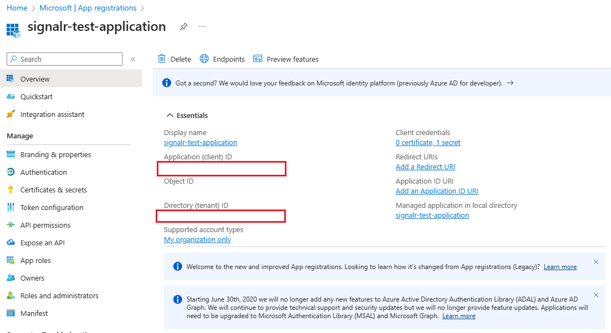
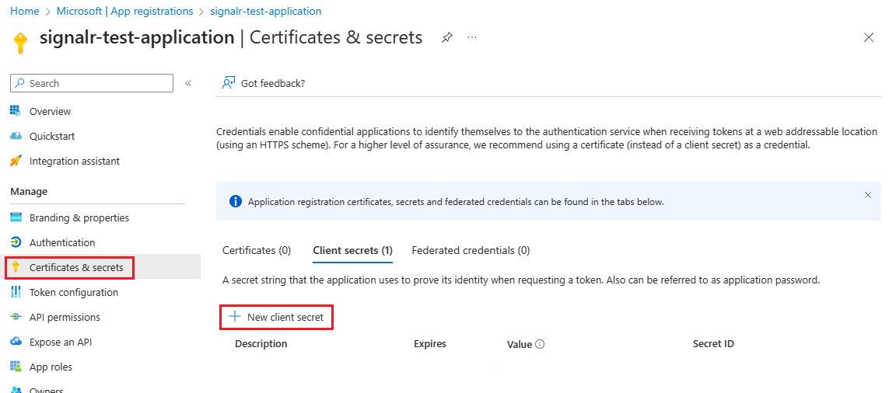
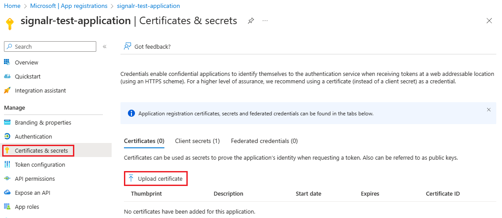

# Authorize requests to Azure SignalR Service resources with Microsoft Entra applications

Azure SignalR Service supports Microsoft Entra ID for authorizing requests from [Microsoft Entra applications](../active-directory/develop/app-objects-and-service-principals.md).

This article shows how to configure your Azure SignalR Service resource and codes to authorize requests to the resource from a Microsoft Entra application.

## Register an application

The first step is to register a Microsoft Entra application:

1. In the [Azure portal](https://portal.azure.com/), search for and select **Microsoft Entra ID**.
2. Under **Manage**, select **App registrations**.
3. Select **New registration**. The **Register an application** pane opens.

   
5. For **Name**, enter a display name for your application.
6. Select **Register** to confirm the registration.

After you register your application, you can find the **Application (client) ID** and **Directory (tenant) ID** values on the application's overview page. These GUIDs can be useful in the following steps.



To learn more about registering an application, see [Quickstart: Register an application with the Microsoft identity platform](../active-directory/develop/quickstart-register-app.md).

## Add credentials

You can add both certificates and client secrets (a string) as credentials to your confidential client app registration.

### Client secret

The application requires a client secret to prove its identity when it's requesting a token. To create a client secret, follow these steps:

1. Under **Manage**, select **Certificates & secrets**.
1. On the **Client secrets** tab, select **New client secret**.

   
1. Enter a description for the client secret, and choose an expiration time.
1. Copy the value of the client secret and then paste it in a secure location.
   > [!NOTE]
   > The secret appears only once.

### Certificate

You can upload a certificate instead of creating a client secret.



To learn more about adding credentials, see [Add credentials](../active-directory/develop/quickstart-register-app.md#add-credentials).

## Add role assignments in the Azure portal

The following steps describe how to assign a SignalR App Server role to a service principal (application) over an Azure SignalR Service resource. For detailed steps, see [Assign Azure roles using the Azure portal](../role-based-access-control/role-assignments-portal.md).

> [!NOTE]
> A role can be assigned to any scope, including management group, subscription, resource group, or single resource. To learn more about scope, see [Understand scope for Azure RBAC](../role-based-access-control/scope-overview.md).

1. In the [Azure portal](https://portal.azure.com/), go to your Azure SignalR Service resource.

1. Select **Access control (IAM)**.

1. Select **Add** > **Add role assignment**.

   :::image type="content" source="../../includes/role-based-access-control/media/add-role-assignment-menu-generic.png" alt-text="Screenshot that shows the page for access control and selections for adding a role assignment.":::

1. On the **Role** tab, select **SignalR App Server**.

1. On the **Members** tab, select **User, group, or service principal**, and then choose **Select members**.

1. Search for and select the application to which you want to assign the role.

1. On the **Review + assign** tab, select **Review + assign** to assign the role.

> [!IMPORTANT]
> Azure role assignments might take up to 30 minutes to propagate.

To learn more about how to assign and manage Azure roles, see these articles:

- [Assign Azure roles using the Azure portal](../role-based-access-control/role-assignments-portal.md)
- [Assign Azure roles using the REST API](../role-based-access-control/role-assignments-rest.md)
- [Assign Azure roles using Azure PowerShell](../role-based-access-control/role-assignments-powershell.md)
- [Assign Azure roles using the Azure CLI](../role-based-access-control/role-assignments-cli.md)
- [Assign Azure roles using Azure Resource Manager templates](../role-based-access-control/role-assignments-template.md)

## Configure your app

### App server

The best practice is to configure identity and credentials in your environment variables:

| Variable                        | Description                                                                                                     |
| ------------------------------- | --------------------------------------------------------------------------------------------------------------- |
| `AZURE_TENANT_ID`               | The Microsoft Entra tenant ID.                                                                                  |
| `AZURE_CLIENT_ID`               | The client (application) ID of an app registration in the tenant.                                                |
| `AZURE_CLIENT_SECRET`           | A client secret that was generated for the app registration.                                                    |
| `AZURE_CLIENT_CERTIFICATE_PATH` | A path to a certificate and private key pair in PEM or PFX format, which can authenticate the app registration. |
| `AZURE_USERNAME`                | The username, also known as User Principal Name (UPN), of a Microsoft Entra user account.                                            |
| `AZURE_PASSWORD`                | The password of the Microsoft Entra user account. A password isn't supported for accounts with multifactor authentication enabled.       |

You can use either [DefaultAzureCredential](/dotnet/api/azure.identity.defaultazurecredential) or [EnvironmentCredential](/dotnet/api/azure.identity.environmentcredential) to configure your Azure SignalR Service endpoints. Here's the code for `DefaultAzureCredential`:

```C#
services.AddSignalR().AddAzureSignalR(option =>
{
    option.Endpoints = new ServiceEndpoint[]
    {
        new ServiceEndpoint(new Uri("https://<resource-name>.service.signalr.net"), new DefaultAzureCredential())
    };
});
```

Here's the code for `EnvironmentCredential`:

```C#
services.AddSignalR().AddAzureSignalR(option =>
{
    option.Endpoints = new ServiceEndpoint[]
    {
        new ServiceEndpoint(new Uri("https://<resource-name>.service.signalr.net"), new EnvironmentCredential())
    };
});
```

To learn how `DefaultAzureCredential` works, see [DefaultAzureCredential class](/dotnet/api/overview/azure/identity-readme#defaultazurecredential).

#### Use endpoint-specific credentials

In your organization, you might want to use different credentials for different endpoints.

In this scenario, you can use [ClientSecretCredential](/dotnet/api/azure.identity.clientsecretcredential) or [ClientCertificateCredential](/dotnet/api/azure.identity.clientcertificatecredential):

```csharp
services.AddSignalR().AddAzureSignalR(option =>
{
    var credential1 = new ClientSecretCredential("tenantId", "clientId", "clientSecret");
    var credential2 = new ClientCertificateCredential("tenantId", "clientId", "pathToCert");

    option.Endpoints = new ServiceEndpoint[]
    {
        new ServiceEndpoint(new Uri("https://<resource1>.service.signalr.net"), credential1),
        new ServiceEndpoint(new Uri("https://<resource2>.service.signalr.net"), credential2),
    };
});
```

### Azure SignalR Service bindings in Azure Functions

Azure SignalR Service bindings in Azure Functions use [application settings](../azure-functions/functions-how-to-use-azure-function-app-settings.md) in the portal or [local.settings.json](../azure-functions/functions-develop-local.md#local-settings-file) locally to configure Microsoft Entra application identities to access your Azure SignalR Service resources.

First, you need to specify the service URI of Azure SignalR Service. The key of the service URI is `serviceUri`. It starts with a connection name prefix (which defaults to `AzureSignalRConnectionString`) and a separator. The separator is an underscore (`__`) in the Azure portal and a colon (`:`) in the *local.settings.json* file. You can customize the connection name by using the binding property [`ConnectionStringSetting`](../azure-functions/functions-bindings-signalr-service.md). Continue reading to find the sample.

Then, you choose whether to configure your Microsoft Entra application identity in [predefined environment variables](#configure-an-identity-in-predefined-environment-variables) or in [SignalR-specified variables](#configure-an-identity-in-signalr-specified-variables).

#### Configure an identity in predefined environment variables

See [Environment variables](/dotnet/api/overview/azure/identity-readme#environment-variables) for the list of predefined environment variables. When you have multiple services, we recommend that you use the same application identity, so that you don't need to configure the identity for each service. Other services might also use these environment variables, based on the settings of those services.

For example, to use client secret credentials, configure the identity as follows in the *local.settings.json* file:

```json
{
  "Values": {
    "<CONNECTION_NAME_PREFIX>:serviceUri": "https://<SIGNALR_RESOURCE_NAME>.service.signalr.net",
    "AZURE_CLIENT_ID": "...",
    "AZURE_CLIENT_SECRET": "...",
    "AZURE_TENANT_ID": "..."
  }
}
```

In the Azure portal, add settings as follows:

```bash
 <CONNECTION_NAME_PREFIX>__serviceUri=https://<SIGNALR_RESOURCE_NAME>.service.signalr.net
AZURE_CLIENT_ID = ...
AZURE_TENANT_ID = ...
AZURE_CLIENT_SECRET = ...
```

#### Configure an identity in SignalR-specified variables

SignalR-specified variables share the same key prefix with the `serviceUri` key. Here's the list of variables that you might use:

- `clientId`
- `clientSecret`
- `tenantId`

Here are the samples to use client secret credentials in the *local.settings.json* file:

```json
{
  "Values": {
    "<CONNECTION_NAME_PREFIX>:serviceUri": "https://<SIGNALR_RESOURCE_NAME>.service.signalr.net",
    "<CONNECTION_NAME_PREFIX>:clientId": "...",
    "<CONNECTION_NAME_PREFIX>:clientSecret": "...",
    "<CONNECTION_NAME_PREFIX>:tenantId": "..."
  }
}
```

In the Azure portal, add settings as follows:

```bash
<CONNECTION_NAME_PREFIX>__serviceUri = https://<SIGNALR_RESOURCE_NAME>.service.signalr.net
<CONNECTION_NAME_PREFIX>__clientId = ...
<CONNECTION_NAME_PREFIX>__clientSecret = ...
<CONNECTION_NAME_PREFIX>__tenantId = ...
```

## Next steps

See the following related articles:

- [Authorize access with Microsoft Entra ID for Azure SignalR Service](signalr-concept-authorize-azure-active-directory.md)
- [Authorize requests to Azure SignalR Service resources with Microsoft Entra managed identities](signalr-howto-authorize-managed-identity.md)
- [Disable local authentication](./howto-disable-local-auth.md)
