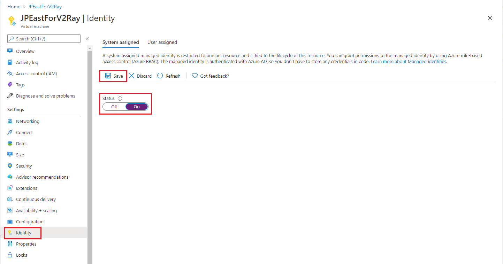

# Authorize managed identity requests to a SignalR resource

Azure SignalR Service supports Azure Active Directory (Azure AD) authorizing requests from Azure resources using [managed identities for Azure resources
](../active-directory/managed-identities-azure-resources/overview.md).

This article shows how to configure your SignalR resource and code to authorize a managed identity request to a SignalR resource.

## Configure managed identities

The first step is to configure managed identities.

This example shows you how to configure `System-assigned managed identity` on a `Virtual Machine` using the Azure portal.

1. Open [Azure portal](https://portal.azure.com/), Search for and select a Virtual Machine.
1. Under **Settings** section, select **Identity**.
1. On the **System assigned** tab, toggle the **Status** to **On**.
   
1. Select the **Save** button to confirm the change.


To learn how to create user-assigned managed identities, see [Create a user-assigned managed identity](../active-directory/managed-identities-azure-resources/how-manage-user-assigned-managed-identities.md#create-a-user-assigned-managed-identity)

To learn more about configuring managed identities, see one of these articles:

- [Configure managed identities for Azure resources on a VM using the Azure portal](../active-directory/managed-identities-azure-resources/qs-configure-portal-windows-vm.md)
- [Configure managed identities for Azure resources on an Azure VM using PowerShell](../active-directory/managed-identities-azure-resources/qs-configure-powershell-windows-vm.md)
- [Configure managed identities for Azure resources on an Azure VM using Azure CLI](../active-directory/managed-identities-azure-resources/qs-configure-cli-windows-vm.md)
- [Configure managed identities for Azure resources on an Azure VM using templates](../active-directory/managed-identities-azure-resources/qs-configure-template-windows-vm.md)
- [Configure a VM with managed identities for Azure resources using an Azure SDK](../active-directory/managed-identities-azure-resources/qs-configure-sdk-windows-vm.md)

### For App service and Azure Functions

See [How to use managed identities for App Service and Azure Functions](../app-service/overview-managed-identity.md).

## Add role assignments on Azure portal

The following steps describe how to assign a `SignalR App Server` role to a system-assigned identity over a SignalR resource. For detailed steps, see [Assign Azure roles using the Azure portal](../role-based-access-control/role-assignments-portal.md).

> [!Note]
> A role can be assigned to any scope, including management group, subscription, resource group or a single resource. To learn more about scope, see [Understand scope for Azure RBAC](../role-based-access-control/scope-overview.md)

1. From the [Azure portal](https://portal.azure.com/), navigate to your SignalR resource.

1. Select **Access control (IAM)**.

1. Select **Add > Add role assignment**.

   :::image type="content" source="../../includes/role-based-access-control/media/add-role-assignment-menu-generic.png" alt-text="Screenshot that shows Access control (IAM) page with Add role assignment menu open.":::

1. On the **Role** tab, select **SignalR App Server**.

1. On the **Members** tab, select **Managed identity**, and then select **Select members**.

1. Select your Azure subscription.

1. Select **System-assigned managed identity**, search for a virtual machine to which you'd like to assign the role, and then select it.

1. On the **Review + assign** tab, select **Review + assign** to assign the role.

> [!IMPORTANT]
> Azure role assignments may take up to 30 minutes to propagate.

To learn more about how to assign and manage Azure role assignments, see these articles:
- [Assign Azure roles using the Azure portal](../role-based-access-control/role-assignments-portal.md)
- [Assign Azure roles using the REST API](../role-based-access-control/role-assignments-rest.md)
- [Assign Azure roles using Azure PowerShell](../role-based-access-control/role-assignments-powershell.md)
- [Assign Azure roles using Azure CLI](../role-based-access-control/role-assignments-cli.md)
- [Assign Azure roles using Azure Resource Manager templates](../role-based-access-control/role-assignments-template.md)

## Configure your app

### App Server

#### Using system-assigned identity

You can use either [DefaultAzureCredential](/dotnet/api/overview/azure/identity-readme#defaultazurecredential) or [ManagedIdentityCredential](/dotnet/api/azure.identity.managedidentitycredential) to configure your SignalR endpoints. However, the best practice is to use `ManagedIdentityCredential` directly.

The system-assigned managed identity is used by default, but **make sure that you don't configure any environment variables** that the [EnvironmentCredential](/dotnet/api/azure.identity.environmentcredential) preserved if you were using `DefaultAzureCredential`. Otherwise it falls back to use `EnvironmentCredential` to make the request and it results to a `Unauthorized` response in most cases.

```C#
services.AddSignalR().AddAzureSignalR(option =>
{
    option.Endpoints = new ServiceEndpoint[]
    {
        new ServiceEndpoint(new Uri("https://<resource1>.service.signalr.net"), new ManagedIdentityCredential()),
    };
});
```

#### Using user-assigned identity

Provide `ClientId` while creating the  `ManagedIdentityCredential` object.

> [!IMPORTANT]
> Use **Client Id**, not the Object (principal) ID even if they are both GUID!

```C#
services.AddSignalR().AddAzureSignalR(option =>
{
    option.Endpoints = new ServiceEndpoint[]
    {
        var clientId = "<your identity client id>";
        new ServiceEndpoint(new Uri("https://<resource1>.service.signalr.net"), new ManagedIdentityCredential(clientId)),
    };
```

### Azure Functions SignalR bindings

Azure Functions SignalR bindings use [application settings](../azure-functions/functions-how-to-use-azure-function-app-settings.md) on portal or [`local.settings.json`](../azure-functions/functions-develop-local.md#local-settings-file) at local to configure managed identity to access your SignalR resources.

You might need a group of key-value pairs to configure an identity. The keys of all the key-value pairs must start with a **connection name prefix** (defaults to `AzureSignalRConnectionString`) and a separator (`__` on portal and `:` at local). The prefix can be customized with binding property [`ConnectionStringSetting`](../azure-functions/functions-bindings-signalr-service.md).

#### Using system-assigned identity

If you only configure the service URI, then the `DefaultAzureCredential` is used. This class is useful when you want to share the same configuration on Azure and local development environments. To learn how `DefaultAzureCredential` works, see [DefaultAzureCredential](/dotnet/api/overview/azure/identity-readme#defaultazurecredential).

In the Azure portal, use the following example to configure a `DefaultAzureCredential`. If you don't configure any [environment variables listed here](/dotnet/api/overview/azure/identity-readme#environment-variables), then the system-assigned identity is used to authenticate.
```
<CONNECTION_NAME_PREFIX>__serviceUri=https://<SIGNALR_RESOURCE_NAME>.service.signalr.net
```

Here's a config sample of `DefaultAzureCredential` in the `local.settings.json` file. At the local scope there's no managed identity, and the authentication via Visual Studio, Azure CLI, and Azure PowerShell accounts are attempted in order.
```json
{
  "Values": {
    "<CONNECTION_NAME_PREFIX>:serviceUri": "https://<SIGNALR_RESOURCE_NAME>.service.signalr.net"
  }
}
```

If you want to use system-assigned identity independently and without the influence of [other environment variables](/dotnet/api/overview/azure/identity-readme#environment-variables), you should set the `credential` key with the connection name prefix to `managedidentity`. Here's an application settings sample:

```
<CONNECTION_NAME_PREFIX>__serviceUri = https://<SIGNALR_RESOURCE_NAME>.service.signalr.net
<CONNECTION_NAME_PREFIX>__credential = managedidentity
```

#### Using user-assigned identity

If you want to use user-assigned identity, you need to assign `clientId`in addition to the `serviceUri` and `credential` keys with the connection name prefix. Here's the application settings sample:

```
<CONNECTION_NAME_PREFIX>__serviceUri = https://<SIGNALR_RESOURCE_NAME>.service.signalr.net
<CONNECTION_NAME_PREFIX>__credential = managedidentity
<CONNECTION_NAME_PREFIX>__clientId = <CLIENT_ID>
```

## Next steps

See the following related articles:
- [Overview of Azure AD for SignalR](signalr-concept-authorize-azure-active-directory.md)
- [Authorize request to SignalR resources with Azure AD from Azure applications](signalr-howto-authorize-application.md)
