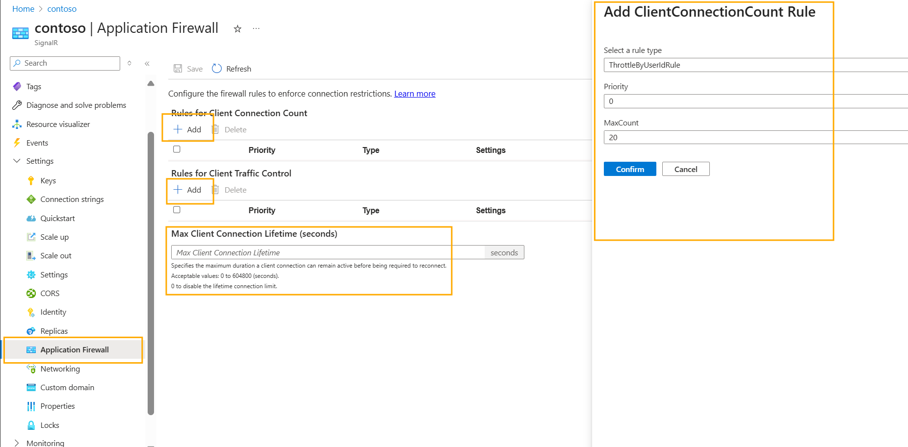

# Application Firewall for Azure SignalR Service

Application Firewall brings more sophisticated control over client connections over a distributed system. Before going through the functionality and setup, let's first clarify what Application Firewall don't do:

1. It's not intended to replace Authentication. The firewall works behind the client conenction authentication layer.
2. It's not related to the network layer access control. 

What does the application firewall do? The application firewall contains rule list of different categories. For now, there is a rule list called Client Connection Count Rules. More rule list will be supported in the future to control things like connection lifetime, connection message sending throughput.

THis guidline is divided into three parts. 
1. Introduce different application firewall rules
2. Show how to configure the rules using Portal or Bicep at SignalR service side
3. Describe how to configure the token at server side

## Prerequisites

* An Azure SignalR Service in [Premium tier](https://azure.microsoft.com/pricing/details/signalr-service/).

## Client Connection Count Rules
Client Connection Count Rules pose restriction on the concurrent client connections. When the client tries to establish new connection, rules will be checked sequencially. If any of the rules is violated, the connection will be rejected with status code 429. 

### Rule introduction

   #### ThrottleByUserIdRule
   Some users might keep requesting tokens to establish connections. For example, one user might open tens of browser tabs or login using different devices, you can use the ThrottleByUserIdRule to limit the concurrent connection of a user.

   UserId must exist in the access token to make this rule work. Refer xxx for details.
   
   #### ThrottleByJwtSignatureRule
   Some malicious user might reuse the token to establish infinite connections. This brings risk of exhausting connection quota. You can use the ThrottleByJwtSignatureRule to limit the concurrent connection of the same token signature.

   Each access token has a signature. Each token generated by SDK contains a timestamp. If vast tokens are generated within seconds, the token might be identical. To avoid this, a random claim could be inserted into the token claim. Refer xxx for details.

   #### ThrottleByJwtCustomClaimRule

   More advancedly, connections could be grouped into different groups according to custom claim. Connections with the same claim will be aggregated to do the check.  For example, you could add a ThrottleByJwtCustomClaimRule to allow 5 concurrent connections for those with custom claim key "FreeUser".

   A key point here is that the rule applies to all connections that have claim "FreeUser":"xxx". The count aggreagation key is "FreeUser" and "xxx" rather than "FreeUser" itself. The ThrottleByUserIdRule could be taken as a special case of ThrottleByJwtCustomClaimRule. The rule applies to all the connections with userIdentity claim. The aggregated count is on each user rather than all users.

 ### Best Practice
  #### Avoid using too aggressive limit

  SignalR service would aggregate the client connections according to the rules. Since the TCP connection might disconnect without completing the 4-way handshake, SignalR service would still count those "orphan" connections until the disconnection is detected by keep alive. So, a very aggresive throttling strategy might throttle the clients unexpectly. A smoother way is doubling the maxCount.


## Setup Application Firewall 

# [Portal](#tab/Portal)
To use Application Firewall, Navigate to the SignalR **Application Firewall** blade on the Azure portal and click **Add** to add a rule. 



# [Bicep](#tab/Bicep)

Use Visual Studio Code or your favorite editor to create a file with the following content and name it main.bicep:

```bicep
@description('The name for your SignalR service')
param resourceName string = 'contoso'

resource signalr 'Microsoft.SignalRService/signalr@2024-04-01-preview' = {
  name: resourceName
  properties: {
    applicationFirewall:{
        clientConnectionCountRules:[
            // Add or remove rules as needed
            {
                type: 'ThrottleByUserIdRule'
                maxCount: 5
            }
            {
                type: 'ThrottleByJwtSignatureRule'
                maxCount: 10
            }
            {
                type: 'ThrottleByJwtCustomClaimRule'
                maxCount: 10
                customClaim: 'freeUser'
            }
            {
                type: 'ThrottleByJwtCustomClaimRule'  
                maxCount: 100
                customClaim: 'paidUser'
          }
        ]
    }
  }
}

```

Deploy the Bicep file using Azure CLI 
   ```azurecli
   az deployment group create --resource-group MyResourceGroup --template-file main.bicep
   ```

----


## Configure access token
The application firewall rules take effectr only when the access token contains the corresponding claim. A rule will apply on connections that have the corresponding claim name.

You could refer to [Client negotiation](signalr-concept-client-negotiation.md#What-can-you-do-during-negotiation) to understand how to add a userIdenity or a custom claim in the access token,


To ensure the uniqunice of the claim signature, you could insert a unique claim for example a guid.


