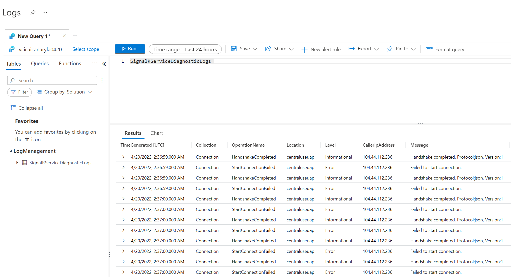

# Resource logs for Azure SignalR Service

This tutorial discusses what resource logs for Azure SignalR Service are, how to set them up, and how to troubleshoot with them. 

## Prerequisites
To enable resource logs, you'll need somewhere to store your log data. This tutorial uses Azure Storage and Log Analytics.

* [Azure storage](../azure-monitor/platform/resource-logs-collect-storage.md) - Retains resource logs for policy audit, static analysis, or backup.
* [Log Analytics](../azure-monitor/platform/resource-logs-collect-workspace.md) - A flexible log search and analytics tool that allows for analysis of raw logs generated by an Azure resource.

## Set up resource logs for an Azure SignalR Service

You can view resource logs for Azure SignalR Service. These logs provide richer view of connectivity to your Azure SignalR Service instance. The resource logs provide detailed information of every connection. For example, basic information (user ID, connection ID and transport type and so on) and event information (connect, disconnect and abort event and so on) of the connection. resource logs can be used for issue identification, connection tracking and analysis.

### Enable resource logs

Resource logs are disabled by default. To enable resource logs, follow these steps:

1. In the [Azure portal](https://portal.azure.com), under **Monitoring**, click **Diagnostic settings**.

    

1. Then click **Add diagnostic setting**.

    

1. Set the archive target that you want. Currently, we support **Archive to a storage account** and **Send to Log Analytics**.

1. Select the logs you want to archive.

    


1. Save the new diagnostics settings.

New settings take effect in about 10 minutes. After that, logs appear in the configured archival target, in the **Diagnostics logs** pane.

For more information about configuring diagnostics, see the [overview of Azure resource logs](../azure-monitor/platform/platform-logs-overview.md).

### Resource logs categories

Azure SignalR Service captures resource logs in one category:

* **All Logs**: Track connections that connect to Azure SignalR Service. The logs provide information about the connect/disconnect, authentication and throttling. For more information, see the next section.

### Archive to a storage account

Logs are stored in the storage account that configured in **Diagnostics logs** pane. A container named `insights-logs-alllogs` is created automatically to store resource logs. Inside the container, logs are stored in the file `resourceId=/SUBSCRIPTIONS/XXXXXXXX-XXXX-XXXX-XXXX-XXXXXXXXXXXX/RESOURCEGROUPS/XXXX/PROVIDERS/MICROSOFT.SIGNALRSERVICE/SIGNALR/XXX/y=YYYY/m=MM/d=DD/h=HH/m=00/PT1H.json`. Basically, the path is combined by `resource ID` and `Date Time`. The log files are split by `hour`. Therefore, the minutes always be `m=00`.

All logs are stored in JavaScript Object Notation (JSON) format. Each entry has string fields that use the format described in the following sections.

Archive log JSON strings include elements listed in the following tables:

**Format**

Name | Description
------- | -------
time | Log event time
level | Log event level
resourceId | Resource ID of your Azure SignalR Service
location | Location of your Azure SignalR Service
category | Category of the log event
operationName | Operation name of the event
callerIpAddress | IP address of your server/client
properties | Detailed properties related to this log event. For more detail, see the properties table below

**Properties Table**

Name | Description
------- | -------
type | Type of the log event. Currently, we provide information about connectivity to the Azure SignalR Service. Only `ConnectivityLogs` type is available
collection | Collection of the log event. Allowed values are: `Connection`, `Authorization` and `Throttling`
connectionId | Identity of the connection
transportType | Transport type of the connection. Allowed values are: `Websockets` \| `ServerSentEvents` \| `LongPolling`
connectionType | Type of the connection. Allowed values are: `Server` \| `Client`. `Server`: connection from server side; `Client`: connection from client side
userId | Identity of the user
message | Detailed message of log event

The following code is an example of an archive log JSON string:

```json
{
    "properties": {
        "message": "Entered Serverless mode.",
        "type": "ConnectivityLogs",
        "collection": "Connection",
        "connectionId": "xxxxxxxxxxxxxxxxxxxxxxxxxxxxxxx",
        "userId": "User",
        "transportType": "WebSockets",
        "connectionType": "Client"
    },
    "operationName": "ServerlessModeEntered",
    "category": "AllLogs",
    "level": "Informational",
    "callerIpAddress": "xxx.xxx.xxx.xxx",
    "time": "2019-01-01T00:00:00Z",
    "resourceId": "/SUBSCRIPTIONS/XXXXXXXX-XXXX-XXXX-XXXX-XXXXXXXXXXXX/RESOURCEGROUPS/XXXX/PROVIDERS/MICROSOFT.SIGNALRSERVICE/SIGNALR/XXX",
    "location": "xxxx"
}
```

### Archive logs schema for Log Analytics

To view resource logs, follow these steps:

1. Click `Logs` in your target Log Analytics.

    

2. Enter `SignalRServiceDiagnosticLogs` and select time range to query resource logs. For advanced query, see [Get started with Log Analytics in Azure Monitor](../azure-monitor/log-query/get-started-portal.md)

    

Archive log columns include elements listed in the following table:

Name | Description
------- | ------- 
TimeGenerated | Log event time
Collection | Collection of the log event. Allowed values are: `Connection`, `Authorization` and `Throttling`
OperationName | Operation name of the event
Location | Location of your Azure SignalR Service
Level | Log event level
CallerIpAddress | IP address of your server/client
Message | Detailed message of log event
UserId | Identity of the user
ConnectionId | Identity of the connection
ConnectionType | Type of the connection. Allowed values are: `Server` \| `Client`. `Server`: connection from server side; `Client`: connection from client side
TransportType | Transport type of the connection. Allowed values are: `Websockets` \| `ServerSentEvents` \| `LongPolling`

### Troubleshooting with resource logs

To troubleshoot for Azure SignalR Service, you can enable server/client side logs to capture failures. At present, Azure SignalR Service exposes resource logs, you can also enable logs for service side.

When encountering connection unexpected growing or dropping situation, you can take advantage of resource logs to troubleshoot.

Typical issues are often about connections' unexpected quantity changes, connections reach connection limits and authorization failure. See the next sections about how to troubleshoot.

#### Unexpected connection number changes

##### Unexpected connection dropping

If you encounter unexpected connections drop, firstly enable logs in service, server and client sides.

If a connection disconnects, the resource logs will record this disconnecting event, you will see `ConnectionAborted` or `ConnectionEnded` in `operationName`.

The difference between `ConnectionAborted` and `ConnectionEnded` is that `ConnectionEnded` is an expected disconnecting which is triggered by client or server side. While the `ConnectionAborted` is usually an unexpected connection dropping event, and aborting reason will be provided in `message`.

The abort reasons are listed in the following table:

Reason | Description
------- | ------- 
Connection count reaches limit | Connection count reaches limit of your current price tier. Consider scale up service unit
Application server closed the connection | App server triggers the abortion. It can be considered as an expected abortion
Connection ping timeout | Usually it is caused by network issue. Consider checking your app server's availability from the internet
Service reloading, reconnect | Azure SignalR Service is reloading. Azure SignalR supports auto-reconnecting, you can wait until reconnected or manually reconnect to Azure SignalR Service
Internal server transient error | Transient error occurs in Azure SignalR Service, should be auto-recovered
Server connection dropped | Server connection drops with unknown error, consider self-troubleshooting with service/server/client side log first. Try to exclude basic issues (e.g Network issue, app server side issue and so on). If the issue isn't resolved, contact us for further help. For more information, see [Get help](#get-help) section. 

##### Unexpected connection growing

To troubleshoot about unexpected connection growing, the first thing you need to do is to filter out the extra connections. You can add unique test user ID to your test client connection. Then verify it in with resource logs, if you see more than one client connections have the same test user ID or IP, then it is likely the client side create and establish more connections than expectation. Check your client side.

#### Authorization failure

If you get 401 Unauthorized returned for client requests, check your resource logs. If you encounter `Failed to validate audience. Expected Audiences: <valid audience>. Actual Audiences: <actual audience>`, it means all audiences in your access token are invalid. Try to use the valid audiences suggested in the log.


#### Throttling

If you find that you cannot establish SignalR client connections to Azure SignalR Service, check your resource logs. If you encounter `Connection count reaches limit` in resource log, you establish too many connections to SignalR Service, which reach the connection count limit. Consider scaling up your SignalR Service. If you encounter `Message count reaches limit` in resource log, it means you use free tier, and you use up the quota of messages. If you want to send more messages, consider changing your SignalR Service to standard tier to send additional messages. For more information, see [Azure SignalR Service Pricing](https://azure.microsoft.com/pricing/details/signalr-service/).

### Get help

We recommend you troubleshoot by yourself first. Most issues are caused by app server or network issues. Follow [troubleshooting guide with resource log](#troubleshooting-with-resource-logs) and [basic trouble shooting guide](https://github.com/Azure/azure-signalr/blob/dev/docs/tsg.md) to find the root cause.
If the issue still can't be resolved, then consider open an issue in GitHub or create ticket in Azure Portal.
Provide:
1. Time range about 30 minutes when the issue occurs
2. Azure SignalR Service's resource ID
3. Issue details, as specific as possible: For example, appserver doesn't send messages, client connection drops and so on
4. Logs collected from server/client side, and other material that might be useful
5. [Optional] Repro code

> [!NOTE]
> If you open issue in GitHub, keep your sensitive information (For example, resource ID, server/client logs) private, only send to members in Microsoft organization privately.