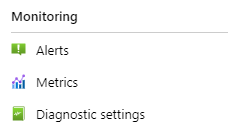
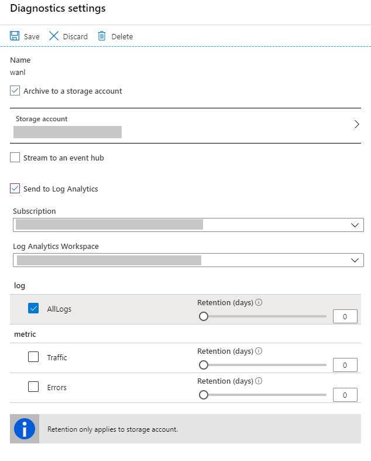
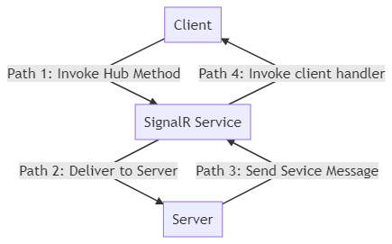

# Monitor Azure SignalR Service

When you have critical applications and business processes that rely on Azure resources, you want to monitor those resources for availability, performance, and operation. This article describes the monitoring data generated by Azure SignalR and how you can use the features of Azure Monitor to analyze and alert on this data.

## Monitor overview

The **Overview** page in the Azure portal for each Azure SignalR includes a brief view of the resource usage, such as concurrent connections and message count. This information is helpful. It's only a small amount of the monitoring data is available from this pane. Some of this data is collected automatically. It's available for analysis as soon as you create the resource. You can enable other types of data collection after some configuration.

## What is Azure Monitor?

Azure SignalR creates monitoring data using [Azure Monitor](../azure-monitor/overview.md). Monitor is a full stack monitoring service in Azure that provides a complete set of features to monitor your Azure resources in addition to resources in other clouds and on-premises.

If you're not already familiar with monitoring Azure services, start with [Monitoring Azure resources with Azure Monitor](../azure-monitor/essentials/monitor-azure-resource.md), which describes the following concepts:

- What is Azure Monitor?
- Costs associated with monitoring
- Monitoring data collected in Azure
- Configuring data collection
- Standard tools in Azure for analyzing and alerting on monitoring data

The following sections build on this article. They describe the specific data gathered from Azure SignalR and provide examples for configuring data collection and analyzing this data with Azure tools.

## Monitoring data

Azure SignalR collects the same kinds of monitoring data as other Azure resources that are described in [Azure Monitor data collection](../azure-monitor/essentials/monitor-azure-resource.md#monitoring-data-from-azure-resources).

See [Monitor Azure SignalR data reference](signalr-howto-monitor-reference.md) for detailed information on the metrics and logs metrics created by Azure SignalR.

## Collection and routing

Platform metrics and the Activity log are collected and stored automatically, but can be routed to other locations by using a diagnostic setting.

Resource Logs aren't collected and stored until you create a diagnostic setting and route them to one or more locations.

Resource Logs are grouped into Category groups. Category groups are a collection of different logs to help you achieve different monitoring goals. These groups are defined dynamically and may change over time as new resource logs become available and are added to the category group. Note that this may incur additionally charges. The audit resource log category group allows you to select the resource logs that are necessary for auditing your resource. For more information, see [Diagnostic settings in Azure Monitor: Resource logs](../azure-monitor/essentials/diagnostic-settings.md?tabs=portal#resource-logs).

For the detailed process for creating a diagnostic setting using the Azure portal, CLI, or PowerShell. When you create a diagnostic setting, you specify which categories of logs to collect, see [Create diagnostic setting to collect platform logs and metrics in Azure](../azure-monitor/essentials/diagnostic-settings.md).

The metrics and logs you can collect are discussed in the following sections.

## Analyzing metrics

You can analyze metrics for Azure SignalR with metrics from other Azure services using metrics explorer by opening **Metrics** from the **Azure Monitor** menu. See [Getting started with Azure Metrics Explorer](../azure-monitor/essentials/metrics-getting-started.md) for details on using this tool.

For a list of the platform metrics collected for Azure SignalR, see [Metrics](concept-metrics.md).

For reference, you can see a list of [all resource metrics supported in Azure Monitor](../azure-monitor/essentials/metrics-supported.md).

## Analyzing logs

You can view resource logs for Azure SignalR Service. These logs provide a richer view of connectivity to your Azure SignalR Service instance. The resource logs provide detailed information for every connection. For example, basic information (user ID, connection ID, and transport type, and so on) and event information (connect, disconnect and abort event, and so on) of the connection. resource logs can be used for issue identification, connection tracking and analysis.

### Prerequisites

To enable resource logs, you'll need somewhere to store your log data. This tutorial uses Azure Storage and Log Analytics.

* [Azure storage](../azure-monitor/essentials/resource-logs.md#send-to-azure-storage) - Retains resource logs for policy audit, static analysis, or backup.
* [Log Analytics](../azure-monitor/essentials/resource-logs.md#send-to-log-analytics-workspace) - A flexible log search and analytics tool that allows for analysis of raw logs generated by an Azure resource.

### Enable resource logs

Resource logs are disabled by default. To enable resource logs, follow these steps:

1. In the [Azure portal](https://portal.azure.com), under **Monitoring**, select **Diagnostic settings**.

    

1. Then you'll get a full view of the diagnostic settings.

    

1. Configure the log source settings.
   1. In **Log Source Settings** section, a table shows collecting behaviors for each log type. 
   2. Check the specific log type you want to collect for all connections. Otherwise the log will be collected only for [diagnostic clients](#diagnostic-client).
2. Configure the log destination settings.
   1. In **Log Destination Settings** section, a table of diagnostic settings displays the existing diagnostic settings. You can select the link in the table to get access to the log destination to view the collected resource logs.
   2. In this section, select the button **Configure Log Destination Settings** to add, update, or delete diagnostic settings.
   3. Select **Add diagnostic setting** to add a new diagnostic setting, or select **Edit** to modify an existing diagnostic setting.
   4. Set the archive target that you want. Currently, SignalR service supports **Archive to a storage account** and **Send to Log Analytics**.
   5. Select the logs you want to archive. Only `AllLogs` is available for resource log. It only controls whether you want to archive the logs. To configure which log types need to be generated in SignalR service, configure in **Log Source Settings** section.

    

   6. Save the new diagnostics setting. The new setting takes effect in about 10 minutes. After that, logs will be sent to configured archival target. For more information about configuring log destination settings, see the [overview of Azure resource logs](../azure-monitor/essentials/platform-logs-overview.md).

### Resource logs categories

Azure SignalR supports three types of logs: connectivity log and messaging log.

#### Connectivity Logs

Connectivity logs provide detailed information for SignalR hub connections. For example, basic information (user ID, connection ID and transport type, etc.) and event information (connect, disconnect and abort event, etc.). Therefore, connectivity log is helpful to troubleshoot connection related issues. For typical connection related troubleshooting guide, see [connection related issue](#connection-related-issues).

#### Messaging Logs

Messaging logs provide tracing information for the SignalR hub messages received and sent via SignalR service. For example, tracing ID and message type of the message. The tracing ID and message type is also logged in app server. Typically the message is recorded when it arrives at or leaves from service or server. Therefore messaging logs are helpful for troubleshooting message related issues. For typical message related troubleshooting guide, see [message related issues](#message-related-issues).

> [!NOTE]
> This type of logs is generated for every message, if the messages are sent frequently, messaging logs might impact the performance of SignalR service. However, you can choose different collecting behaviors to minimize the performance impact. See [resource logs collecting behaviors](#resource-logs-collecting-behaviors) below.

#### Http request logs

Http request logs provide detailed information for the http requests received by Azure SignalR. For example, status code and URL of the request. Http request log is helpful to troubleshoot request-related issues.

### Archive to a storage account

Logs are stored in the storage account that configured in **Diagnostics logs** pane. A container named `insights-logs-alllogs` is created automatically to store resource logs. Inside the container, logs are stored in the file `resourceId=/SUBSCRIPTIONS/XXXXXXXX-XXXX-XXXX-XXXX-XXXXXXXXXXXX/RESOURCEGROUPS/XXXX/PROVIDERS/MICROSOFT.SIGNALRSERVICE/SIGNALR/XXX/y=YYYY/m=MM/d=DD/h=HH/m=00/PT1H.json`. Basically, the path is combined by `resource ID` and `Date Time`. The log files are split by `hour`. Therefore, the minutes always be `m=00`.

All logs are stored in JavaScript Object Notation (JSON) format. Each entry has string fields that use the format described in the following sections.

Archive log JSON strings include elements listed in the following tables:

**Format**

Name | Description
------- | -------
time | Log event time
level | Log event level
resourceId | Resource ID of your Azure SignalR Service
location | Location of your Azure SignalR Service
category | Category of the log event
operationName | Operation name of the event
callerIpAddress | IP address of your server/client
properties | Detailed properties related to this log event. For more detail, see the properties table below

**Properties Table**

Name | Description
------- | -------
type | Type of the log event. Currently, we provide information about connectivity to the Azure SignalR Service. Only `ConnectivityLogs` type is available
collection | Collection of the log event. Allowed values are: `Connection`, `Authorization` and `Throttling`
connectionId | Identity of the connection
transportType | Transport type of the connection. Allowed values are: `Websockets` \| `ServerSentEvents` \| `LongPolling`
connectionType | Type of the connection. Allowed values are: `Server` \| `Client`. `Server`: connection from server side; `Client`: connection from client side
userId | Identity of the user
message | Detailed message of log event

The following code is an example of an archive log JSON string:

```json
{
    "properties": {
        "message": "Entered Serverless mode.",
        "type": "ConnectivityLogs",
        "collection": "Connection",
        "connectionId": "xxxxxxxxxxxxxxxxxxxxxxxxxxxxxxx",
        "userId": "User",
        "transportType": "WebSockets",
        "connectionType": "Client"
    },
    "operationName": "ServerlessModeEntered",
    "category": "AllLogs",
    "level": "Informational",
    "callerIpAddress": "xxx.xxx.xxx.xxx",
    "time": "2019-01-01T00:00:00Z",
    "resourceId": "/SUBSCRIPTIONS/XXXXXXXX-XXXX-XXXX-XXXX-XXXXXXXXXXXX/RESOURCEGROUPS/XXXX/PROVIDERS/MICROSOFT.SIGNALRSERVICE/SIGNALR/XXX",
    "location": "xxxx"
}
```

### Archive logs schema for Log Analytics

To view resource logs, follow these steps:

1. Select `Logs` in your target Log Analytics.

    :::image type="content" alt-text="Log Analytics menu item" source="./media/signalr-tutorial-diagnostic-logs/log-analytics-menu-item.png" lightbox="./media/signalr-tutorial-diagnostic-logs/log-analytics-menu-item.png":::

2. Enter `SignalRServiceDiagnosticLogs` and select time range to query resource logs. For advanced query, see [Get started with Log Analytics in Azure Monitor](../azure-monitor/logs/log-analytics-tutorial.md)

    :::image type="content" alt-text="Query log in Log Analytics" source="./media/signalr-tutorial-diagnostic-logs/query-log-in-log-analytics.png" lightbox="./media/signalr-tutorial-diagnostic-logs/query-log-in-log-analytics.png":::

To use sample query for SignalR service, follow the steps below:
1. Select `Logs` in your target Log Analytics.
2. Select `Queries` to open query explorer.
3. Select `Resource type` to group sample queries in resource type.
4. Select `Run` to run the script.

    :::image type="content" alt-text="Sample query in Log Analytics" source="./media/signalr-tutorial-diagnostic-logs/log-analytics-sample-query.png" lightbox="./media/signalr-tutorial-diagnostic-logs/log-analytics-sample-query.png":::


Archive log columns include elements listed in the following table:

Name | Description
------- | ------- 
TimeGenerated | Log event time
Collection | Collection of the log event. Allowed values are: `Connection`, `Authorization` and `Throttling`
OperationName | Operation name of the event
Location | Location of your Azure SignalR Service
Level | Log event level
CallerIpAddress | IP address of your server/client
Message | Detailed message of log event
UserId | Identity of the user
ConnectionId | Identity of the connection
ConnectionType | Type of the connection. Allowed values are: `Server` \| `Client`. `Server`: connection from server side; `Client`: connection from client side
TransportType | Transport type of the connection. Allowed values are: `Websockets` \| `ServerSentEvents` \| `LongPolling`

## Troubleshooting with resource logs

To troubleshoot for Azure SignalR Service, you can enable server/client side logs to capture failures. Now, Azure SignalR Service exposes resource logs, you can also enable logs for service side.

When encountering connection unexpected growing or dropping situation, you can take advantage of resource logs to troubleshoot.

Typical issues are often about connections' unexpected quantity changes, connections reach connection limits and authorization failure. See the next sections about how to troubleshoot.

#### Connection related issues

When encountering connection unexpected growing or dropping situation, you can take advantage of connectivity logs to troubleshoot.

Typical issues are often about connections' unexpected quantity changes, connections reach connection limits authorization failure and message loss. See the next sections about how to troubleshoot.

##### Unexpected connection number changes

###### Unexpected connection dropping

If you encounter unexpected connections drop, firstly enable logs in service, server and client sides.

If a connection disconnects, the resource logs will record this disconnecting event, you'll see `ConnectionAborted` or `ConnectionEnded` in `operationName`.

The difference between `ConnectionAborted` and `ConnectionEnded` is that `ConnectionEnded` is an expected disconnecting which is triggered by client or server side. While the `ConnectionAborted` is usually an unexpected connection dropping event, and aborting reason will be provided in `message`.

The abort reasons are listed in the following table:

Reason | Description
------- | -------
Connection count reaches limit | Connection count reaches limit of your current price tier. Consider scale up service unit
Application server closed the connection | App server triggers the abortion. It can be considered as an expected abortion
Connection ping timeout | Usually it's caused by network issue. Consider checking your app server's availability from the internet
Service reloading, try reconnecting | Azure SignalR Service is reloading. Azure SignalR support auto-reconnecting, you can wait until reconnected or manually reconnect to Azure SignalR Service
Internal server transient error | Transient error occurs in Azure SignalR Service, should be auto-recovered
Server connection dropped | Server connection drops with unknown error, consider self-troubleshooting with service/server/client side log first. Try to exclude basic issues (e.g Network issue, app server side issue, etc.). If the issue isn't resolved, contact us for further help. For more information, see [Get help](#get-help) section.

###### Unexpected connection growing

To troubleshoot about unexpected connection growing, the first thing you need to do is filter out the extra connections. You can add unique test user ID to your test client connection. Check the resource logs. If you see more than one client connections have the same test user ID or IP, then it's likely the client side is creating more connections than expected. Check your client side.

##### Authorization failure

If you get 401 Unauthorized returned for client requests, check your resource logs. If you encounter `Failed to validate audience. Expected Audiences: <valid audience>. Actual Audiences: <actual audience>`, it means your all audiences in your access token are invalid. Try to use the valid audiences suggested in the log.

##### Throttling

If you find that you can't establish SignalR client connections to Azure SignalR Service, check your resource logs. If you encounter `Connection count reaches limit` in resource log, you establish too many connections to SignalR Service, which reach the connection count limit. Consider scaling up your SignalR Service. If you encounter `Message count reaches limit` in resource log, it means you use free tier, and you use up the quota of messages. If you want to send more messages, consider changing your SignalR Service to standard tier to send more messages. For more information, see [Azure SignalR Service Pricing](https://azure.microsoft.com/pricing/details/signalr-service/).

#### Message related issues

When encountering message related problem, you can take advantage of messaging logs to troubleshoot. Firstly, [enable resource logs](#enable-resource-logs) in service, logs for server and client.

> [!NOTE]
> For ASP.NET Core, see [here](/aspnet/core/signalr/diagnostics) to enable logging in server and client.
>
> For ASP.NET, see [here](/aspnet/signalr/overview/testing-and-debugging/enabling-signalr-tracing) to enable logging in server and client.

If you don't mind potential performance effects and no client-to-server direction message, check the `Messaging` in `Log Source Settings/Types` to enable *collect-all* log collecting behavior. For more information about this behavior, see [collect all section](#collect-all).

Otherwise, uncheck the `Messaging` to enable *collect-partially* log collecting behavior. This behavior requires configuration in client and server to enable it. For more information, see [collect partially section](#collect-partially).

##### Message loss

If you encounter message loss problem, the key is to locate the place where you lose the message. Basically, you have three components when using SignalR service: SignalR service, server and client. Both server and client are connected to SignalR service, they don't connect to each other directly once negotiation is completed. Therefore, we need to consider two directions for messages, for each direction, we need to consider two paths:

* From client to server via SignalR service
  * Path 1: Client to SignalR service
  * Path 2: SignalR service to server
* From server to client via SignalR service
  * Path 3: Server to SignalR service
  * Path 4: SignalR service to client



For **collect all** collecting behavior:

SignalR service only trace messages in direction **from server to client via SignalR service**. The tracing ID will be generated in server, the message will carry the tracing ID to SignalR service.

> [!NOTE]
> If you want to trace message and [send messages from outside a hub](/aspnet/core/signalr/hubcontext) in your app server, you need to enable **collect all** collecting behavior to collect message logs for the messages which are not originated from diagnostic clients.
> Diagnostic clients works for both **collect all** and **collect partially** collecting behaviors. It has higher priority to collect logs. For more information, see [diagnostic client section](#diagnostic-client).

By checking the sign-in server and service side, you can easily find out whether the message is sent from server, arrives at SignalR service, and leaves from SignalR service. Basically, by checking if the *received* and *sent* message are matched or not based on message tracing ID, you can tell whether the message loss issue is in server or SignalR service in this direction. For more information, see the [details](#message-flow-detail-for-path3) below.

For **collect partially** collecting behavior:

Once you mark the client as diagnostic client, SignalR service will trace messages in both directions.

By checking the sign-in server and service side, you can easily find out whether the message is pass the server or SignalR service successfully. Basically, by checking if the *received* and *sent* message are matched or not based on message tracing ID, you can tell whether the message loss issue is in server or SignalR service. For more information, see the details below.

**Details of the message flow**

For the direction **from client to server via SignalR service**, SignalR service will **only** consider the invocation that is originated from diagnostic client, that is, the message generated directly in diagnostic client, or service message generated due to the invocation of diagnostic client indirectly.

The tracing ID will be generated in SignalR service once the message arrives at SignalR service in **Path 1**. SignalR service will generate a log `Received a message <MessageTracingId> from client connection <ConnectionId>.` for each message in diagnostic client. Once the message leaves from the SignalR to server, SignalR service will generate a log message `Sent a message <MessageTracingId> to server connection <ConnectionId> successfully.`. If you see these two logs, you can be sure that the message passes through SignalR service successfully.

> [!NOTE]
> Due to the limitation of ASP.NET Core SignalR, the message comes from client doesn't contains any message level ID. But ASP.NET SignalR generate *invocation ID* for each message, you can use it to map with the tracing ID.

Then the message carries the tracing ID Server in **Path 2**. Server will generate a log `Received message <messagetracingId> from client connection <connectionId>` once the message arrives.

<span id="message-flow-detail-for-path3"></span>
Once the message invokes the hub method in server, a new service message will be generated with a *new tracing ID*. Once the service message is generated, server will generate a sign-in template `Start to broadcast/send message <MessageTracingId> ...`, the actual log will be based on your scenario. Then the message will be delivered to SignalR service in **Path 3**, once the service message leaves from server, a log called `Succeeded to send message <MessageTracingId>` will be generated.

> [!NOTE]
> The tracing ID of the message from client cannot map to the tracing ID of the service message to be sent to SignalR service.

Once the service message arrives at SignalR service, a log called `Received a <MessageType> message <MessageTracingId> from server connection <ConnectionId>.` will be generated. Then SignalR service processes the service message and deliver to the target client(s). Once the message is sent to client(s) in **Path 4**, log `Sent a message <MessageTracingId> to client connection <ConnectionId> successfully.` will be generated.

In summary, the message log will be generated when message goes in and out the SignalR service and server. You can use these logs to validate whether the message is lost in these components or not.

Below is a typical message loss issue.

###### A client fails to receive messages in a group

The typical story in this issue is that the client joins a group **after** sending a group message.

``` C#
Class Chat : Hub
{
    public void JoinAndSendGroup(string name, string groupName)
    {
        Groups.AddToGroupAsync(Context.ConnectionId, groupName); // join group
        Clients.Group(groupName).SendAsync("ReveiceGroupMessage", name, "I'm in group"); // send group message
    }
}
```

For example, someone may make invocations of *join group* and *send group message* in the same hub method. The problem here's the `AddToGroupAsync` is an `async` method. There's no `await` for the `AddToGroupAsync` to wait it finishes, the group message sent before `AddToGroupAsync` completes. Due to network delay, and the delay of the process of joining client to some group, the join group action may complete later than group message delivery. If so, the first group message won't have any client as receiver, since no client has joined the group. So it will become a message lost issue.

Without resource logs, you're unable to find out when the client joins the group and when the group message is sent.
Once you enable messaging logs, you're able to compare the message arriving time in SignalR service. Follow the below steps to troubleshoot:

1. Find the message logs in server to find when the client joined the group and when the group message is sent.
1. Get the message tracing ID A of joining the group and the message tracing ID B of group message from the message logs.
1. Filter these message tracing ID among messaging logs in your log archive target, then compare their arriving timestamps, you'll find which message is arrived first in SignalR service.
1. If message tracing ID A arriving time later than B arriving time, then you must be sending group message **before** the client joining the group.Then you need to make sure the client is in the group before sending group messages.

If a message get lost in SignalR or server, try to get the warning logs based on the message tracing ID to get the reason. If you need further help, see the [get help section](#get-help).

## Advanced

### Resource logs collecting behaviors

There are two typical scenarios on using resource logs, especially for messaging logs.

Someone may care about the quality of each message. For example, they're sensitive on whether the message got sent/received successfully, or they want to record every message that is delivered via SignalR service.

In the meantime, others may care about the performance. They're sensitive on the latency of the message, and sometimes they need to track the message in a few connections instead of all the connections for some reason.

Therefore, SignalR service provides two kinds of collecting behaviors

* **collect all**: collect logs in all connections 
* **collect partially**: collect logs in some specific connections

> [!NOTE]
> To distinguish the connections between those collect logs and those don't collect logs, SignalR service will treat some client as diagnostic client based on the diagnostic client configurations of server and client, in which the resource logs always get collected, while the others don't. For more information, see [collect partially section](#collect-partially).

#### Collect all

Resource logs are collected by all the connections. Take messaging logs for example. When this behavior is enabled, SignalR service will send a notification to server to start generating tracing ID for each message. The tracing ID will be carried in the message to the service, the service will also log the message with tracing ID.

> [!NOTE]
> Note that to ensure the performance of SignalR service, SignalR service doesn't await and parse the whole message sent from client, therefore, the client messages isn't get logged. But if the client is marked as a diagnostic client, then client message will get logged in SignalR service.

##### Configuration guide

To enable this behavior, check the checkbox in the *Types* section in the *Log Source Settings*.

This behavior doesn't require you to update server side configurations. This configuration change will always be sent to server automatically.

#### Collect partially

Resource logs are **only** collected by [diagnostic clients](#diagnostic-client). All messages get logged including client messages and connectivity events in the diagnostic clients.

> [!NOTE]
> The limit of the diagnostic clients' number is 100. If the number of diagnostic clients exceeds 100, the outnumbered diagnostic clients will get throttled by SignalR service. The new but outnumbered clients will be failed to connect to SignalR service, and throw `System.Net.Http.HttpRequestException` which has message `Response status code does not indicate success: 429 (Too Many Requests)`, while the already connected ones work without getting impacted by the throttling policy.

##### Diagnostic client

Diagnostic client is a logical concept, any client can be a diagnostic client. The server controls which client can be a diagnostic client. Once a client is marked as a diagnostic client, all resource logs will be enabled in this client. To set a client be a diagnostic client, see the [configuration guide](#configuration-guide-1) below.

##### Configuration guide

To enable this behavior, you need to configure service, server, client side.

###### Service side

To enable this behavior, uncheck the checkbox for a specific log type in the *Types* section in the *Log Source Settings*.

###### Server side

Also set up `ServiceOptions.DiagnosticClientFilter` to define a filter of diagnostic clients based on the http context comes from clients. For example, make client with hub URL `<HUB_URL>?diag=yes`, then set up `ServiceOptions.DiagnosticClientFilter` to filter the diagnostic client. If it returns `true`, the client will be marked as diagnostic client; otherwise, it keeps as normal client. The `ServiceOptions.DiagnosticClientFilter` can be set in your startup class like this:

``` C#
// sample: mark a client as diagnostic client when it has query string "?diag=yes" in hub URL
public IServiceProvider ConfigureServices(IServiceCollection services)
{
    services.AddMvc();
    services
        .AddSignalR()
        .AddAzureSignalR(o =>
        {
            o.ConnectionString = "<YOUR_ASRS_CONNECTION_STRING>";
            o.DiagnosticClientFilter = context => context.Request.Query["diag"] == "yes";
        });

    return services.BuildServiceProvider();
}
```

###### Client side

Mark the client as diagnostic client by configuring the http context. For example, the client is marked as diagnostic client by adding the query string `diag=yes`.

``` C#
var connection = new HubConnectionBuilder()
    .WithUrl("<HUB_URL>?diag=yes")
    .Build();
```

## Get help

We recommend you troubleshoot by yourself first. Most issues are caused by app server or network issues. Follow [troubleshooting guide with resource log](#troubleshooting-with-resource-logs) and [basic trouble shooting guide](https://github.com/Azure/azure-signalr/blob/dev/docs/tsg.md) to find the root cause.
If the issue still can't be resolved, then consider open an issue in GitHub or create ticket in Azure portal.
Provide:
1. Time range about 30 minutes when the issue occurs
2. Azure SignalR Service's resource ID
3. Issue details, as specific as possible: For example, appserver doesn't send messages, client connection drops, and so on
4. Logs collected from server/client side, and other material that might be useful
5. [Optional] Repro code

> [!NOTE]
> If you open an issue in GitHub, keep your sensitive information (For example, resource ID, server/client logs) private, only send to members in Microsoft organization privately.
