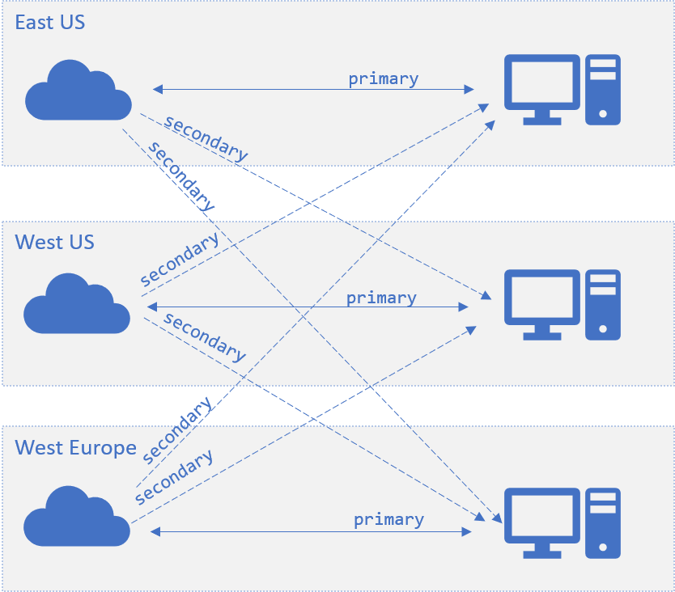
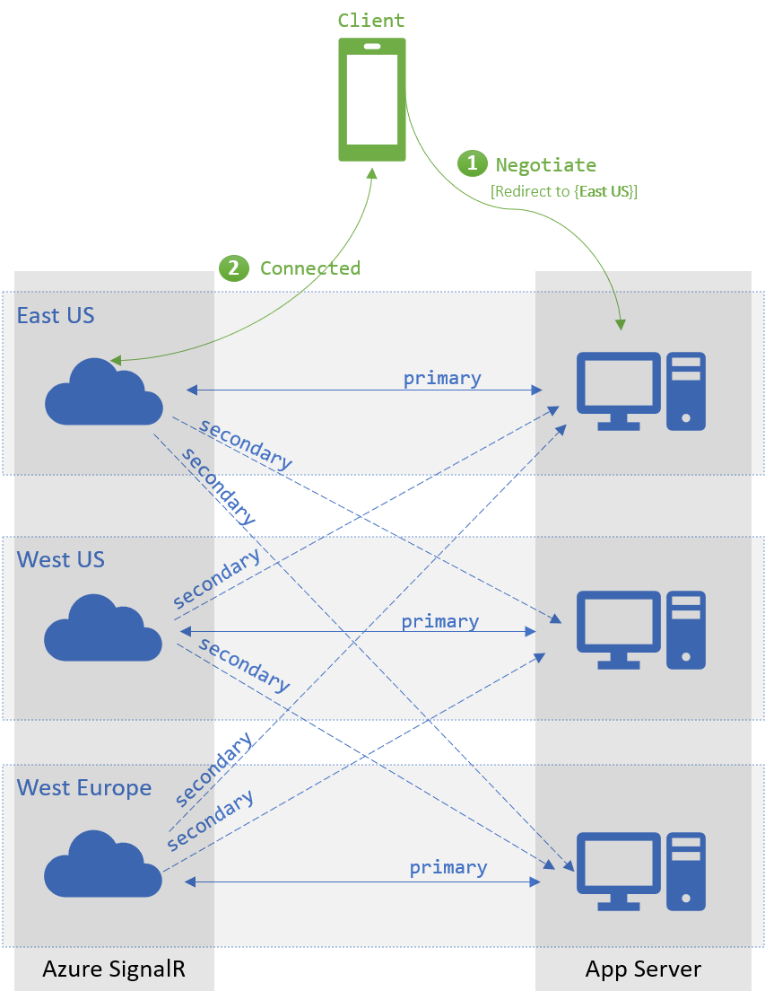
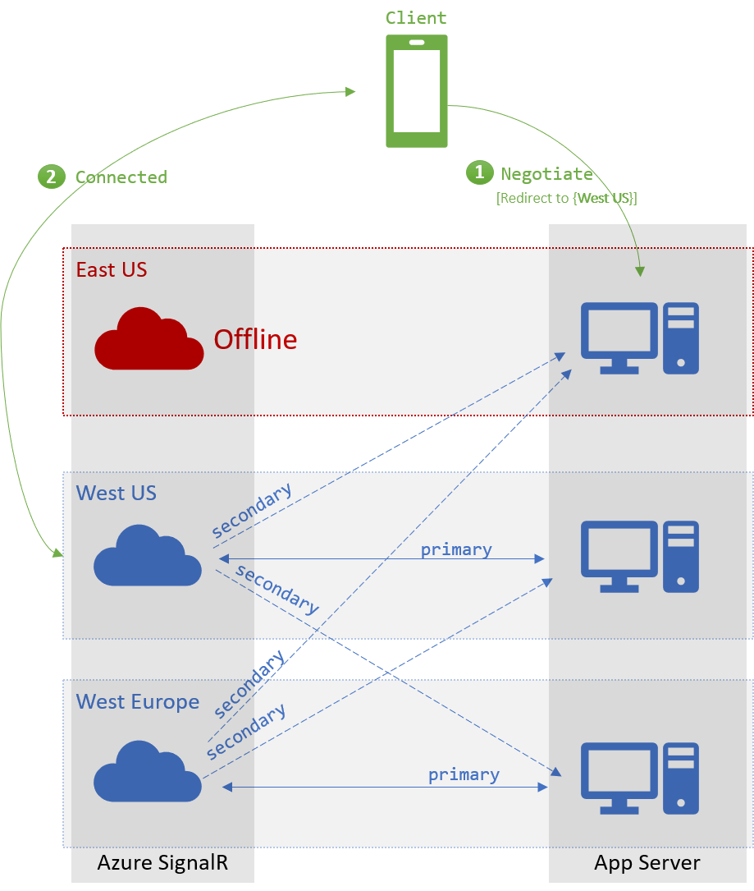

# How to scale SignalR Service with multiple instances?
The latest SignalR Service SDK supports multiple endpoints for SignalR Service instances. You can use this feature to scale the concurrent connections, or use it for cross-region messaging.

## For ASP.NET Core

### How to add multiple endpoints from config?

Config with key `Azure:SignalR:ConnectionString` or `Azure:SignalR:ConnectionString:` for SignalR Service connection string.

If the key starts with `Azure:SignalR:ConnectionString:`, it should be in format `Azure:SignalR:ConnectionString:{Name}:{EndpointType}`, where `Name` and `EndpointType` are properties of the `ServiceEndpoint` object, and are accessible from code.

You can add multiple instance connection strings using the following `dotnet` commands:

```batch
dotnet user-secrets set Azure:SignalR:ConnectionString:east-region-a <ConnectionString1>
dotnet user-secrets set Azure:SignalR:ConnectionString:east-region-b:primary <ConnectionString2>
dotnet user-secrets set Azure:SignalR:ConnectionString:backup:secondary <ConnectionString3>
```

### How to add multiple endpoints from code?

A `ServicEndpoint` class is introduced to describe the properties of an Azure SignalR Service endpoint.
You can configure multiple instance endpoints when using Azure SignalR Service SDK through:
```cs
services.AddSignalR()
        .AddAzureSignalR(options => 
        {
            options.Endpoints = new ServiceEndpoint[]
            {
                // Note: this is just a demonstration of how to set options.Endpoints
                // Having ConnectionStrings explicitly set inside the code is not encouraged
                // You can fetch it from a safe place such as Azure KeyVault
                new ServiceEndpoint("<ConnectionString0>"),
                new ServiceEndpoint("<ConnectionString1>", type: EndpointType.Primary, name: "east-region-a"),
                new ServiceEndpoint("<ConnectionString2>", type: EndpointType.Primary, name: "east-region-b"),
                new ServiceEndpoint("<ConnectionString3>", type: EndpointType.Secondary, name: "backup"),
            };
        });
```

### How to customize endpoint router?

By default, the SDK uses the [DefaultEndpointRouter](https://github.com/Azure/azure-signalr/blob/dev/src/Microsoft.Azure.SignalR/EndpointRouters/DefaultEndpointRouter.cs) to pick up endpoints.

#### Default behavior 
1. Client request routing

    When client `/negotiate` with the app server. By default, SDK **randomly selects** one endpoint from the set of available service endpoints.

2. Server message routing

    When *sending message to a specific **connection***, and the target connection is routed to current server, the message goes directly to that connected endpoint. Otherwise, the messages are broadcasted to every Azure SignalR endpoint.

#### Customize routing algorithm
You can create your own router when you have special knowledge to identify which endpoints the messages should go to.

A custom router is defined below as an example when groups starting with `east-` always go to the endpoint named `east`:

```cs
private class CustomRouter : EndpointRouterDecorator
{
    public override IEnumerable<ServiceEndpoint> GetEndpointsForGroup(string groupName, IEnumerable<ServiceEndpoint> endpoints)
    {
        // Override the group broadcast behavior, if the group name starts with "east-", only send messages to endpoints inside east
        if (groupName.StartsWith("east-"))
        {
            return endpoints.Where(e => e.Name.StartsWith("east-"));
        }

        return base.GetEndpointsForGroup(groupName, endpoints);
    }
}
```

Another example below, that overrides the default negotiate behavior, to select the endpoints depends on where the app server is located.

```cs
private class CustomRouter : EndpointRouterDecorator
{
    public override ServiceEndpoint GetNegotiateEndpoint(HttpContext context, IEnumerable<ServiceEndpoint> endpoints)
    {
        // Override the negotiate behavior to get the endpoint from query string
        var endpointName = context.Request.Query["endpoint"];
        if (endpointName.Count == 0)
        {
            context.Response.StatusCode = 400;
            var response = Encoding.UTF8.GetBytes("Invalid request");
            context.Response.Body.Write(response, 0, response.Length);
            return null;
        }

        return endpoints.FirstOrDefault(s => s.Name == endpointName && s.Online) // Get the endpoint with name matching the incoming request
               ?? base.GetNegotiateEndpoint(context, endpoints); // Or fallback to the default behavior to randomly select one from primary endpoints, or fallback to secondary when no primary ones are online
    }
}
```

Don't forget to register the router to DI container using:

```cs
services.AddSingleton(typeof(IEndpointRouter), typeof(CustomRouter));
services.AddSignalR()
        .AddAzureSignalR(
            options => 
            {
                options.Endpoints = new ServiceEndpoint[]
                {
                    new ServiceEndpoint(name: "east", connectionString: "<connectionString1>"),
                    new ServiceEndpoint(name: "west", connectionString: "<connectionString2>"),
                    new ServiceEndpoint("<connectionString3>")
                };
            });
```

## For ASP.NET

### How to add multiple endpoints from config?

Config with key `Azure:SignalR:ConnectionString` or `Azure:SignalR:ConnectionString:` for SignalR Service connection string.

If the key starts with `Azure:SignalR:ConnectionString:`, it should be in format `Azure:SignalR:ConnectionString:{Name}:{EndpointType}`, where `Name` and `EndpointType` are properties of the `ServiceEndpoint` object, and are accessible from code.

You can add multiple instance connection strings to `web.config`:

```xml
<?xml version="1.0" encoding="utf-8" ?>
<configuration>
  <connectionStrings>
    <add name="Azure:SignalR:ConnectionString" connectionString="<ConnectionString1>"/>
    <add name="Azure:SignalR:ConnectionString:en-us" connectionString="<ConnectionString2>"/>
    <add name="Azure:SignalR:ConnectionString:zh-cn:secondary" connectionString="<ConnectionString3>"/>
    <add name="Azure:SignalR:ConnectionString:Backup:secondary" connectionString="<ConnectionString4>"/>
  </connectionStrings>
  ...
</configuration>
```

### How to add multiple endpoints from code?

A `ServicEndpoint` class is introduced to describe the properties of an Azure SignalR Service endpoint.
You can configure multiple instance endpoints when using Azure SignalR Service SDK through:

```cs
app.MapAzureSignalR(
    this.GetType().FullName, 
    options => {
            options.Endpoints = new ServiceEndpoint[]
            {
                // Note: this is just a demonstration of how to set options.Endpoints
                // Having ConnectionStrings explicitly set inside the code is not encouraged
                // You can fetch it from a safe place such as Azure KeyVault
                new ServiceEndpoint("<ConnectionString1>"),
                new ServiceEndpoint("<ConnectionString2>"),
                new ServiceEndpoint("<ConnectionString3>"),
            }
        });
```

### How to customize router?

The only difference between ASP.NET SignalR and ASP.NET Core SignalR is the http context type for `GetNegotiateEndpoint`. For ASP.NET SignalR, it is of [IOwinContext](https://github.com/Azure/azure-signalr/blob/dev/src/Microsoft.Azure.SignalR.AspNet/EndpointRouters/DefaultEndpointRouter.cs#L19) type.

Below is the custom negotiate example for ASP.NET SignalR:

```cs
private class CustomRouter : EndpointRouterDecorator
{
    public override ServiceEndpoint GetNegotiateEndpoint(IOwinContext context, IEnumerable<ServiceEndpoint> endpoints)
    {
        // Override the negotiate behavior to get the endpoint from query string
        var endpointName = context.Request.Query["endpoint"];
        if (string.IsNullOrEmpty(endpointName))
        {
            context.Response.StatusCode = 400;
            context.Response.Write("Invalid request.");
            return null;
        }

        return endpoints.FirstOrDefault(s => s.Name == endpointName && s.Online) // Get the endpoint with name matching the incoming request
               ?? base.GetNegotiateEndpoint(context, endpoints); // Or fallback to the default behavior to randomly select one from primary endpoints, or fallback to secondary when no primary ones are online
    }
}
```

Don't forget to register the router to DI container using:

```cs
var hub = new HubConfiguration();
var router = new CustomRouter();
hub.Resolver.Register(typeof(IEndpointRouter), () => router);
app.MapAzureSignalR(GetType().FullName, hub, options => {
    options.Endpoints = new ServiceEndpoint[]
                {
                    new ServiceEndpoint(name: "east", connectionString: "<connectionString1>"),
                    new ServiceEndpoint(name: "west", connectionString: "<connectionString2>"),
                    new ServiceEndpoint("<connectionString3>")
                };
});
```

## Configuration in cross-region scenarios

The `ServiceEndpoint` object has an `EndpointType` property with value `primary` or `secondary`.

`primary` endpoints are preferred endpoints to receive client traffic, and are considered to have more reliable network connections; `secondary` endpoints are considered to have less reliable network connections and are used only for taking server to client traffic, for example, broadcasting messages, not for taking client to server traffic.

In cross-region cases, network can be unstable. For one app server located in *East US*, the SignalR Service endpoint located in the same *East US* region can be configured as `primary` and endpoints in other regions marked as `secondary`. In this configuration, service endpoints in other regions can **receive** messages from this *East US* app server, but there will be no **cross-region** clients routed to this app server. The architecture is shown in the diagram below:



When a client tries `/negotiate` with the app server, with the default router, SDK **randomly selects** one endpoint from the set of available `primary` endpoints. When endpoint is available, SDK then **randomly selects** from all available `secondary` endpoints. The endpoint is marked as **available** when the connection between server and the service endpoint is alive.

In cross-region scenario, when a client tries `/negotiate` with the app server hosted in *East US*, by default it always returns the `primary` endpoint located in the same region. When all *East US* endpoints are not available, the client is redirected to endpoints in other regions. Fail-over section below describes the scenario in detail.



## Fail-over

When all `primary` endpoints are not available, client's `/negotiate` picks from the available `secondary` endpoints. This fail-over mechanism requires that each endpoint should serve as `primary` endpoint to at least one app server.



## Next steps

In this guide, you learned about how to configure multiple instances in the same application for scaling, sharding, and cross-region scenarios.

Multiple endpoints supports can also be used in high availability and disaster recovery scenarios.

> [!div class="nextstepaction"]
> [Setup SignalR Service for disaster recovery and high availability](./signalr-concept-disaster-recovery.md)
