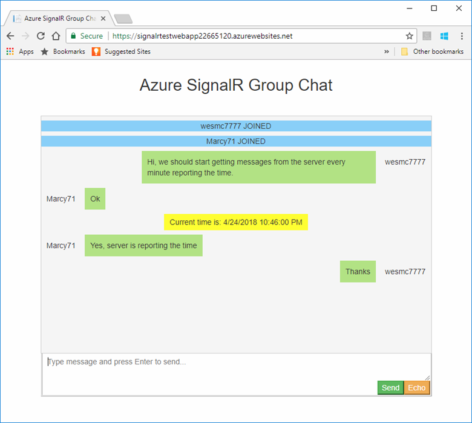

# Tutorial: Integrate Azure Functions with Azure SignalR Service

A common scenario with real-time applications is for content updates to originate from a server to be published to web clients. [Azure Functions](../azure-functions/functions-overview.md) is an excellent candidate for generating these content updates. A key benefit of using Azure functions is that you can run your code on-demand without worrying about the architecture of a whole application, or the infrastructure to run it. You also only pay for the time your code actually runs.  

Normally, this scenario would present a problem when trying to use SignalR. Because SignalR tries to maintain a connection between client and server to allow pushing content updates. Since the code only runs on-demand, a connection cannot be maintained. However, Azure SignalR Service can support this scenario since it manages connections for you at run-time.

In this tutorial, you will use Azure Functions to generate messages using a [timer trigger](../azure-functions/functions-create-scheduled-function.md) and publish them to the chat room created in the previous tutorials. The server will send the messages at the beginning of each minute. 

The code for this tutorial is available for download in the [AzureSignalR-samples GitHub repository](https://github.com/aspnet/AzureSignalR-samples/tree/master/samples/Timer).



In this tutorial, you learn how to:

> [!div class="checklist"]
> * Create a new Timer function with Azure Functions using the Azure CLI.
> * Configure the timer function for local git repository deployment.
> * Connect the timer to your SignalR Service to push updates every minute

[!INCLUDE [quickstarts-free-trial-note](../../includes/quickstarts-free-trial-note.md)]


## Prerequisites

To complete this tutorial, you must have the following prerequisites:

* [Git](https://git-scm.com/)
* [.NET Core SDK](https://www.microsoft.com/net/download/windows) 
* [Azure Cloud Shell configured](https://docs.microsoft.com/azure/cloud-shell/quickstart)
* Download or clone the [AzureSignalR-sample](https://github.com/aspnet/AzureSignalR-samples) github repository.


[!INCLUDE [cloud-shell-try-it.md](../../includes/cloud-shell-try-it.md)]

## Create a function app

You must create a function app to define the execution environment for your functions. The function app also lets you group multiple functions as a logical unit for easier management, deployment, and resource sharing. For more information, see [Create your first function using the Azure CLI](../azure-functions/functions-create-first-azure-function-azure-cli.md).

In this section, you will use the Azure Cloud Shell to create a new Azure Function app configured for deployment from a local git repository. 

When creating the function app resources, creates them in the same resource group you created in the previous tutorials. This makes managing all tutorial resources easier.

Copy the script below and replace the values for `ResourceGroupName`, and `location` with the values for the resource group you used in the previous tutorials. Paste the updated script into your Azure Cloud Shell, to create and configure your function app.

```azurecli-interactive
#====================================================================
#=== Update these variables with your values.                     ===
#====================================================================
ResourceGroupName=SignalRTestResources
location=eastus

# Generate a unique suffix for a unique name
let randomNum=$RANDOM*$RANDOM
functionappName=signalrfunctionapp$randomNum
storageAccountName=functionstorageaccount$randomNum

# Create a storage account to hold function app code and settings
az storage account create --resource-group $ResourceGroupName \
--name $storageAccountName \
--location $location --sku Standard_LRS

# Create the function app
az functionapp create --resource-group $ResourceGroupName \
--name $functionappName \
--consumption-plan-location $location \
--storage-account $storageAccountName

```

## Configure the function app

In this section, you will configure the function app with an app setting containing the connection string for your Azure SignalR Service resource. Your function code will use this to connect to the SignalR Service resource. You will also configure the function app for deployment from a local git repository.

Copy the script below and replace the value for `connstring` with the connection string for your SignalR Service resource. This script uses the variables you initialized in the previous section.

```azurecli-interactive
#========================================================================
#=== Replace this value with the connection string for your           ===
#=== SignalR Service resource.                                        ===
#========================================================================
connstring="Endpoint=<service_endpoint>;AccessKey=<access_key>;"

# Add the SignalR Service connection string app setting
az functionapp config appsettings set --resource-group $ResourceGroupName 
    --name $functionappName \
    --setting "AzureSignalRConnectionString=$connstring"

# configure for deployment from a local git repository
az functionapp deployment source config-local-git --name $functionappName \
    --resource-group $ResourceGroupName

```

Make a note the git deployment URL returned from the last command. You will use this URL for deploying the function code.


## The timer function

The timer function sample is located in the */samples/Timer* directory of your download, or clone of the [AzureSignalR-sample](https://github.com/aspnet/AzureSignalR-samples) github repository. The logic is contained in the following three lines of code in *TimerFunction.cs*:

```csharp
var connectionString = Environment.GetEnvironmentVariable("AzureSignalRConnectionString");
var proxy = CloudSignalR.CreateHubProxyFromConnectionString(connectionString, "chat");
await proxy.Clients.All.SendAsync("broadcastMessage", new object[] { "_BROADCAST_", $"Current time is: {DateTime.Now}" });
```

This code uses the connection string to your SignalR Service resource to create a proxy to the hub. Since the function code is running server-side, we are not requiring it to authenticate as a regular client. This server-side code is trusted to use the key with the connection string. Using this hub proxy, the function code can call any of the methods you have defined on your hub. The code calls the *BroadcastMessage* method to report the time whenever the trigger fires.

The trigger for the function code is a *timerTrigger*, defined in the bindings in *TimerFunction/function.json*. It includes a [CRON expression](https://wikipedia.org/wiki/Cron#CRON_expression) to indicate when it will fire. This timer trigger fires at the beginning of every minute triggering the function code to execute.

```json
{
  "bindings": [
    {
      "type": "timerTrigger",
      "schedule": "0 * * * * *",
      "useMonitor": true,
      "runOnStartup": false,
      "name": "myTimer"
    }
  ],
  "disabled": false,
  "scriptFile": "../Timer.dll",
  "entryPoint": "Timer.TimerFunction.Run"
}
```

For more information on developing a Timer function with Azure Functions, see [Timer](../azure-functions/functions-create-scheduled-function.md). 


## Building the timer function

Use the [.NET Core command-line interface (CLI)](https://docs.microsoft.com/dotnet/core/tools/) in the following steps to build the function and prepare it for deployment:

1. Navigate to the */samples/Timer* directory of your download, or clone of the [AzureSignalR-sample](https://github.com/aspnet/AzureSignalR-samples) github repository.

2. Restore the NuGet packages using the following command:

        dotnet restore

3. Build the *Timer* function app using the following command:

        msbuild /p:Configuration=Release


## Create and deploy the local git repo

1. In a git shell, navigate to the */samples/Timer/bin/Release/net461* directory.

2. Initialize the directory as a new git repository using the following command:
        git init

3. Add a new commit for all files in the build directory.

        git add -A
        git commit -v -a -m "Initial Timer function commit"        

4. Add a remote endpoint for the git deployment URL you made note of during the configuration of your function app:

        git remote add Azure <enter your git deployment URL>

5. Deploy the function app

        git push Azure master

   Once the code is deployed the timer will immediately start firing every minute to execute your code.

## Test the chat app

Navigate to the chat application, the Timer function you just created will now be reporting the time at the beginning of each minute.


## Clean up resources

If you want to continue to test the application, you can keep the resources you have created.

Otherwise, if you are finished with the sample application, you can delete the Azure resources to avoid charges. 

> [!IMPORTANT]
> Deleting a resource group is irreversible and that the resource group and all the resources in it are permanently deleted. Make sure that you do not accidentally delete the wrong resource group or resources. If you created the resources for hosting this sample inside an existing resource group that contains resources you want to keep, you can delete each resource individually from their respective blades instead of deleting the resource group.
> 
> 

Sign in to the [Azure portal](https://portal.azure.com) and click **Resource groups**.

In the **Filter by name...** textbox, type the name of your resource group. The instructions for this article used a resource group named *SignalRTestResources*. On your resource group in the result list, click **...** then **Delete resource group**.

   


You will be asked to confirm the deletion of the resource group. Type the name of your resource group to confirm, and click **Delete**.
   
After a few moments, the resource group and all of its contained resources are deleted.


## Next steps

In this tutorial, you learned how to integrate with Azure Function to push updates to clients based on Azure Function triggers. To learn more about using Azure SignalR Server, continue to the Azure CLI samples for SignalR Service.

> [!div class="nextstepaction"]
> [Azure SignalR CLI Samples](./signalr-cli-samples.md)


