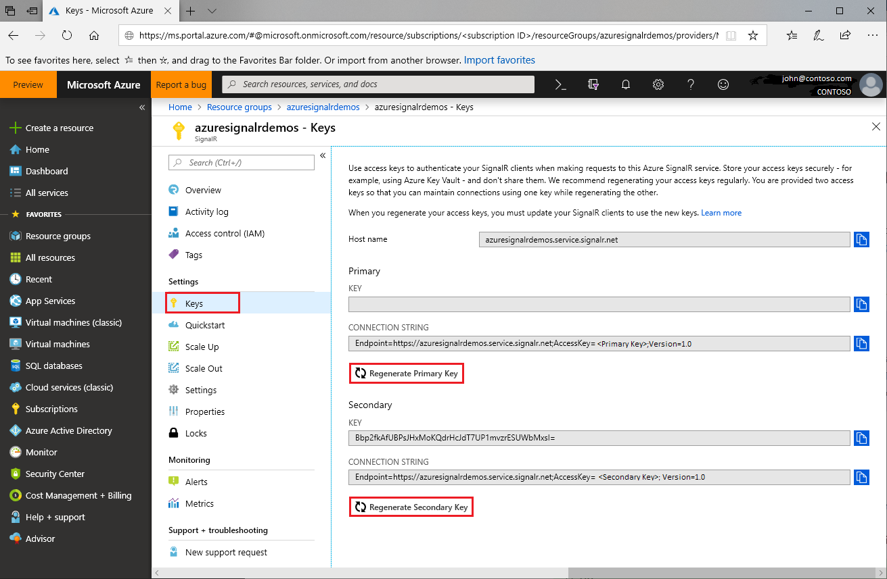

# Access key rotation for Azure SignalR Service

Each Azure SignalR Service instance has a pair of access keys: Primary and Secondary keys. They are used to authenticate SignalR clients when making requests to the service. The keys are associated with the instance endpoint url. Keep your keys secure, and rotate them regularly. You are provided two access keys, so you can maintain connections using one key while regenerating the other.

## Why rotate access keys?

For security reason and compliance requirement, developers are recommended to routinely rotate the access keys.

## How to regenerate access keys?

1. Go to the [Azure portal](https://portal.azure.com/) and sign in with your credentials.

1. Find the **Keys** section from the Azure SignalR Service instance that you want to regenerate the keys.

1. Click **Keys** on the navigation menu.

1. Click **Regenerate Primary Key** or **Regenerate Secondary Key**.

A new key and corresponding connection string will be created and displayed.

 

You can also regenerate keys using [Azure CLI](/cli/azure/ext/signalr/signalr/key?view=azure-cli-latest#ext-signalr-az-signalr-key-renew).

## Update configurations with new connection strings

1. Copy the newly generated connection string.

1. Update all configurations to use the new connection string.

1. Restart the application as needed.

## Forced access key regeneration

Azure SignalR Service may enforce a mandatory access key regeneration under certain situation. The service will notify customers via email and portal notification. If you receive this communication or encounter service failure due to access key, rotate the keys by following this guide.

## Next steps

We recommend rotating the access keys regularly as a good security practice.

In this guide you learned about how to regenerate access keys. Continue to the next tutorials about authentication with OAuth or with Azure Functions.

> [!div class="nextstepaction"]
> [Integrate with ASP.NET Core Identity](./signalr-authenticate-oauth.md)

> [!div class="nextstepaction"]
> [Build a Serverless Real-time App with Authentication](./signalr-authenticate-azure-functions.md)