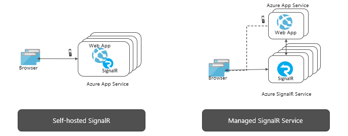

# What is Azure SignalR Service?

Azure SignalR Service simplifies the process of adding real-time web functionality to applications over HTTP. This real-time functionality allows the service to push content updates to connected clients, such as a single page web or mobile application. As a result, clients are updated without the need to poll the server, or submit new HTTP requests for updates.

This article provides an overview of Azure SignalR Service.

## What is Azure SignalR Service used for?

Any scenario that requires pushing data from server to client in real time, can use Azure SignalR Service.

Traditional real-time features that often require polling from a server, can also use Azure SignalR Service.

Azure SignalR Service has been used in a wide variety of industries, for any application type that requires real-time content updates. Here are some examples where you can use Azure SignalR Service:

* **High frequency data updates:** gaming, voting, polling, and auctions.
* **Dashboards and monitoring:** company dashboards, financial market data, instant sales updates, multi-player game leader boards, and IoT monitoring.
* **Chat:** live chat rooms, chat bots, on-line customer support, real-time shopping assistants, messengers, and in-game chats.
* **Real-time location on map:** logistic tracking, delivery status tracking, transportation status updates, and GPS apps.
* **Real time targeted ads:** personalized real time push ads and offers, and interactive ads.
* **Collaborative apps:** coauthoring, whiteboard apps and team meeting software.
* **Push notifications:** social networks, email, games, and travel alert.
* **Real-time broadcasting:** live audio/video broadcasting, live captioning, translating, and events and news broadcasting.
* **IoT and connected devices:** real-time IoT metrics, remote control, real-time status, and location tracking.
* **Automation:** real-time triggers from upstream events.

## What are the benefits using Azure SignalR Service?

**Standard based:**

SignalR provides an abstraction over many techniques used for building real-time web applications. [WebSockets](https://wikipedia.org/wiki/WebSocket) is the optimal transport, but other techniques like [Server-Sent Events (SSE)](https://wikipedia.org/wiki/Server-sent_events) and Long Polling are used when other options aren't available. SignalR automatically detects and initializes the appropriate transport based on the features supported on the server and client.

**Native ASP.NET Core support:**

SignalR Service provides native programming experience with ASP.NET Core and ASP.NET. Developing new SignalR applications with SignalR Service, or migrating from existing SignalR based applications to SignalR Service requires minimal effort.
SignalR Service also supports ASP.NET Core's new feature, Server-side Blazor.

**Broad client support:**

<!-- 
SignalR Service works with a broad range of clients, such as web and mobile browsers, desktop apps, mobile apps, server process, IoT devices, and game consoles. SignalR Service offers SDKs in different languages. In addition to native ASP.NET Core or ASP.NET C# SDKs, SignalR Service also provides the JavaScript client SDK to enable web clients, and many other JavaScript frameworks. The Java client SDK is also supported for Java applications, including Android native apps. SignalR Service supports REST API, and serverless through integrations with Azure Functions and Event Grid.
-->

SignalR Service works with a broad range of clients, such as:

* web and mobile browsers
* desktop apps
* mobile apps
* IoT devices
* game consoles

**Multiple Language Support:**

SignalR Service offers SDKs in different languages:

* Client side: [Any client libraries supporting SignalR protocol](/aspnet/core/signalr/client-features) are compatible with SignalR service.
* Server side: ASP.NET Core or ASP.NET web applications
* Serverless support through REST APIs, Azure Functions triggers and bindings, and Event Grid integrations for **ASP.NET Core SignalR**.

**Handle large-scale client connections:**

SignalR Service is designed for large-scale real-time applications. SignalR Service allows multiple instances to work together to scale to millions of client connections. The service also supports multiple global regions for sharding, high availability, or disaster recovery purposes.

**Remove the burden to self-host SignalR:**

Compared to self-hosted SignalR applications, switching to SignalR Service will remove the need to manage back planes that handle the scaling and client connections. The fully managed service also simplifies web applications and saves hosting cost. SignalR Service offers global reach and world-class data center and network, scales to millions of connections, and provides Azure's standard compliance and security.

SignalR Service supports both server-based configurations and serverless environments through integration with Azure Functions and Event Grid.

<!-- saves hosting cost  How? -->

**Offer rich APIs for different messaging patterns:**

SignalR Service allows the server to send messages to a particular connection, all connections, or a subset of connections that belong to a specific user, or have been placed in an arbitrary group.

## How to use Azure SignalR Service

There are many different ways to program with Azure SignalR Service.  Here are examples:

* **[Scale an ASP.NET Core SignalR App](signalr-concept-scale-aspnet-core.md)** - Integrate Azure SignalR Service with an ASP.NET Core SignalR application to scale out to hundreds of thousands of connections.
* **[Build serverless real-time apps](signalr-concept-azure-functions.md)** - Use Azure Functions integration with Azure SignalR Service to build serverless real-time applications in languages such as JavaScript, C#, and Java.
* **[Send messages from server to clients via REST API](signalr-reference-data-plane-rest-api.md)** * Azure SignalR Service provides a REST API to enable applications to post messages to clients connected with SignalR Service using any REST capable programming language.
