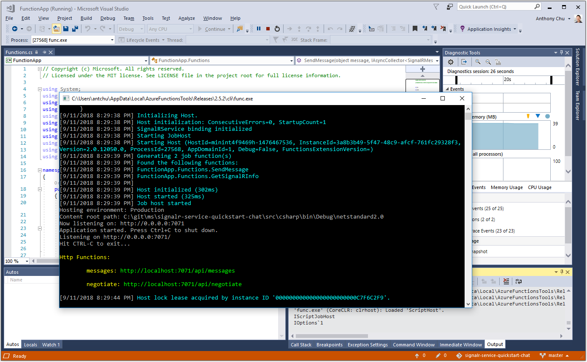

# Quickstart: Create a chat room with Azure Functions and SignalR Service using C\#

Azure SignalR Service lets you easily add real-time functionality to your application. Azure Functions is a serverless platform that lets you run your code without managing any infrastructure. In this quickstart, learn how to use SignalR Service and Functions to build a serverless, real-time chat application.

## Prerequisites

If you don’t already have Visual Studio 2019 installed, you can download and use the **free** [Visual Studio 2019 Community Edition](https://www.visualstudio.com/downloads/). Make sure that you enable **Azure development** during the Visual Studio setup.

You may also run this tutorial on the command line (macOS, Windows, or Linux) using the [Azure Functions Core Tools (v2)](https://github.com/Azure/azure-functions-core-tools#installing), the [.NET Core SDK](https://dotnet.microsoft.com/download), and your favorite code editor.

[!INCLUDE [quickstarts-free-trial-note](../../includes/quickstarts-free-trial-note.md)]

## Log in to Azure

Sign in to the Azure portal at <https://portal.azure.com/> with your Azure account.

[!INCLUDE [Create instance](includes/signalr-quickstart-create-instance.md)]

[!INCLUDE [Clone application](includes/signalr-quickstart-clone-application.md)]

## Configure and run the Azure Function app

1. Start Visual Studio (or another code editor) and open the solution in the *src/chat/csharp* folder of the cloned repository.

1. In the browser where the Azure portal is opened, confirm the SignalR Service instance you deployed earlier was successfully created by searching for its name in the search box at the top of the portal. Select the instance to open it.

    

1. Select **Keys** to view the connection strings for the SignalR Service instance.

1. Select and copy the primary connection string.

1. Back in Visual Studio, in Solution Explorer, rename *local.settings.sample.json* to *local.settings.json*.

1. In **local.settings.json**, paste the connection string into the value of the **AzureSignalRConnectionString** setting. Save the file.

1. Open **Functions.cs**. There are two HTTP triggered functions in this function app:

    - **GetSignalRInfo** - Uses the *SignalRConnectionInfo* input binding to generate and return valid connection information.
    - **SendMessage** - Receives a chat message in the request body and uses the *SignalR* output binding to broadcast the message to all connected client applications.

1. Use one of the following options to start the Azure Function app locally.

    - **Visual Studio**: In the *Debug* menu, select *Start debugging* to run the application.

        

    - **Command line**: Execute the following command to start the function host.

        ```bash
        func start
        ```

[!INCLUDE [Run web application](includes/signalr-quickstart-run-web-application.md)]

[!INCLUDE [Cleanup](includes/signalr-quickstart-cleanup.md)]

## Next steps

In this quickstart, you built and ran a real-time serverless application in Visual Studio. Next, learn more about how to develop and deploy Azure Functions with Visual Studio.

> [!div class="nextstepaction"]
> [Develop Azure Functions using Visual Studio](../azure-functions/functions-develop-vs.md)