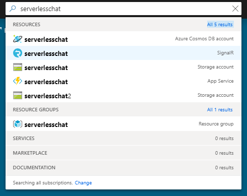

# Quickstart: Use Java to create a chat room with Azure Functions and SignalR Service

Azure SignalR Service lets you easily add real-time functionality to your application and Azure Functions is a serverless platform that lets you run your code without managing any infrastructure. In this quickstart, you use Java to build a serverless, real-time chat application using SignalR Service and Functions.

## Prerequisites

- A code editor, such as [Visual Studio Code](https://code.visualstudio.com/)
- An Azure account with an active subscription. [Create an account for free](https://azure.microsoft.com/free/?ref=microsoft.com&utm_source=microsoft.com&utm_medium=docs&utm_campaign=visualstudio).
- [Azure Functions Core Tools](https://github.com/Azure/azure-functions-core-tools#installing). Used to run Azure Function apps locally.

   > [!NOTE]
   > The required SignalR Service bindings in Java are only supported in Azure Function Core Tools version 2.4.419 (host version 2.0.12332) or above.

   > [!NOTE]
   > To install extensions, Azure Functions Core Tools requires the [.NET Core SDK](https://www.microsoft.com/net/download) installed. However, no knowledge of .NET is required to build JavaScript Azure Function apps.

- [Java Developer Kit](https://www.azul.com/downloads/zulu/), version 8
- [Apache Maven](https://maven.apache.org), version 3.0 or above

> [!NOTE]
> This quickstart can be run on macOS, Windows, or Linux.

## Log in to Azure

Sign in to the Azure portal at <https://portal.azure.com/> with your Azure account.

[!INCLUDE [Create instance](includes/signalr-quickstart-create-instance.md)]

[!INCLUDE [Clone application](includes/signalr-quickstart-clone-application.md)]

## Configure and run the Azure Function app

1. In the browser where the Azure portal is opened, confirm the SignalR Service instance you deployed earlier was successfully created by searching for its name in the search box at the top of the portal. Select the instance to open it.

    

1. Select **Keys** to view the connection strings for the SignalR Service instance.

1. Select and copy the primary connection string.

    

1. In your code editor, open the *src/chat/java* folder in the cloned repository.

1. Rename *local.settings.sample.json* to *local.settings.json*.

1. In **local.settings.json**, paste the connection string into the value of the **AzureSignalRConnectionString** setting. Save the file.

1. The main file that contains the functions are in *src/chat/java/src/main/java/com/function/Functions.java*:

    - **negotiate** - Uses the *SignalRConnectionInfo* input binding to generate and return valid connection information.
    - **sendMessage** - Receives a chat message in the request body and uses the *SignalR* output binding to broadcast the message to all connected client applications.

1. In the terminal, ensure that you are in the *src/chat/java* folder. Build the function app.

    ```bash
    mvn clean package
    ```

1. Run the function app locally.

    ```bash
    mvn azure-functions:run
    ```

[!INCLUDE [Run web application](includes/signalr-quickstart-run-web-application.md)]

[!INCLUDE [Cleanup](includes/signalr-quickstart-cleanup.md)]

## Next steps

In this quickstart, you built and ran a real-time serverless application using Maven. Next, learn about how to create Java Azure Functions from scratch.

> [!div class="nextstepaction"]
> [Create your first function with Java and Maven](../azure-functions/functions-create-first-java-maven.md)