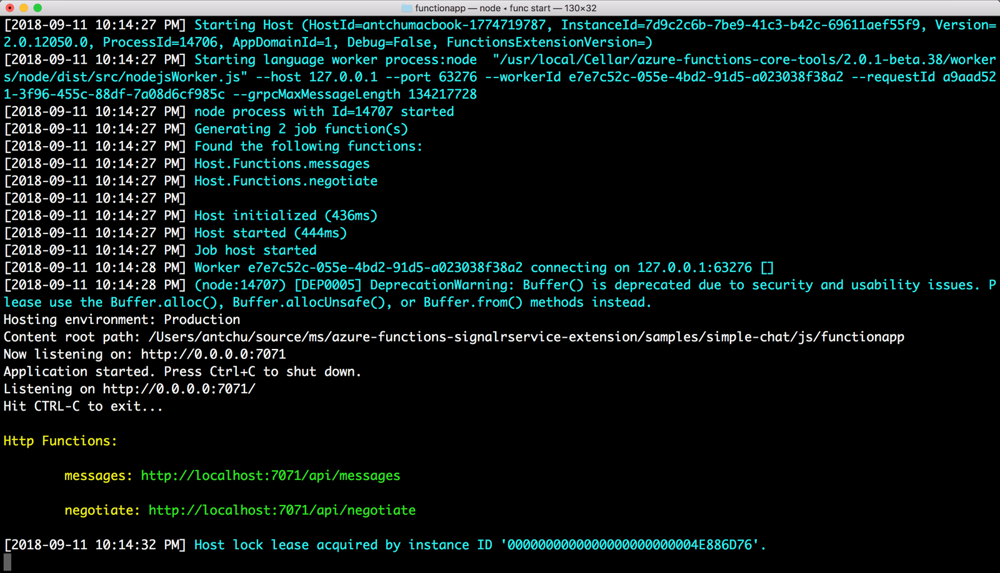

# Quickstart: Create a chat room with Azure Functions and SignalR Service using JavaScript

Azure SignalR Service lets you easily add real-time functionality to your application. Azure Functions is a serverless platform that lets you run your code without managing any infrastructure. In this quickstart, learn how to use SignalR Service and Functions to build a serverless, real-time chat application.


## Prerequisites

This quickstart can be run on macOS, Windows, or Linux.

Make sure you have a code editor such as [Visual Studio Code](https://code.visualstudio.com/) installed.

Install the [Azure Functions Core Tools (v2)](https://github.com/Azure/azure-functions-core-tools#installing) to run Azure Function apps locally.

In order to install extensions, Azure Functions Core Tools currently require the [.NET Core SDK](https://www.microsoft.com/net/download) installed. However, no knowledge of .NET is required to build JavaScript Azure Function apps.

[!INCLUDE [quickstarts-free-trial-note](../../includes/quickstarts-free-trial-note.md)]


## Log in to Azure

Sign in to the Azure portal at <https://portal.azure.com/> with your Azure account.


[!INCLUDE [Create instance](includes/signalr-quickstart-create-instance.md)]

[!INCLUDE [Clone application](includes/signalr-quickstart-clone-application.md)]


## Configure and run the Azure Function app

1. In the browser where the Azure portal is opened, confirm the SignalR Service instance you deployed earlier was successfully created by searching for its name in the search box at the top of the portal. Select the instance to open it.

    

1. Select **Keys** to view the connection strings for the SignalR Service instance.

1. Select and copy the primary connection string.

    

1. In your code editor, open the *chat/src/javascript* folder in the cloned repository.

1. Rename *local.settings.sample.json* to *local.settings.json*.

1. In **local.settings.json**, paste the connection string into the value of the **AzureSignalRConnectionString** setting. Save the file.

1. JavaScript functions are organized into folders. In each folder are two files: *function.json* defines the bindings that are used in the function, and *index.js* is the body of the function. There are two HTTP triggered functions in this function app:

    - **negotiate** - Uses the *SignalRConnectionInfo* input binding to generate and return valid connection information.
    - **messages** - Receives a chat message in the request body and uses the *SignalR* output binding to broadcast the message to all connected client applications.

1. In the terminal, ensure that you are in the *chat/src/javascript* folder. Use the Azure Functions Core Tools to install extensions required to run the app.

    ```bash
    func extensions install
    ```

1. Run the function app.

    ```bash
    func start
    ```

    


[!INCLUDE [Run web application](includes/signalr-quickstart-run-web-application.md)]


[!INCLUDE [Cleanup](includes/signalr-quickstart-cleanup.md)]

## Next steps

In this quickstart, you built and ran an real-time serverless application in Visual Studio. Next, learn more about how to develop and deploy Azure Functions with Visual Studio.

> [!div class="nextstepaction"]
> [Develop Azure Functions using Visual Studio](../azure-functions/functions-develop-vs.md)