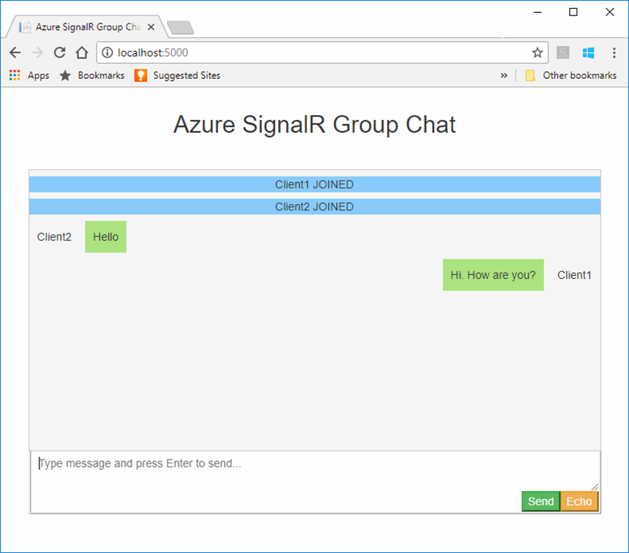

# Quickstart: Create a chat room by using SignalR Service

Azure SignalR Service is an Azure service that helps developers easily build web applications with real-time features.

This article shows you how to get started with the Azure SignalR Service. In this quickstart, you'll create a chat application by using an ASP.NET Core MVC web app. This app will make a connection with your Azure SignalR Service resource to enable real-time content updates. You'll host the web application locally and connect with multiple browser clients. Each client will be able to push content updates to all other clients.

You can use any code editor to complete the steps in this quickstart. One option is [Visual Studio Code](https://code.visualstudio.com/), which is available on the Windows, macOS, and Linux platforms.

The code for this tutorial is available for download in the [AzureSignalR-samples GitHub repository](https://github.com/aspnet/AzureSignalR-samples/tree/master/samples/ChatRoom). You can create the Azure resources used in this quickstart by following [Create a SignalR Service script](scripts/signalr-cli-create-service.md).

[!INCLUDE [quickstarts-free-trial-note](../../includes/quickstarts-free-trial-note-dotnet.md)]

Ready to start?

> [!div class="nextstepaction"]
> [Step by step build](#prerequisites)

> [!div class="nextstepaction"]
> [Try chat demo now](https://asrs-simplechat-live-demo.azurewebsites.net/)

## Prerequisites

* Install the latest [.NET Core SDK](https://dotnet.microsoft.com/download).
* Download or clone the [AzureSignalR-sample](https://github.com/aspnet/AzureSignalR-samples) GitHub repository.

Having issues? Try the [troubleshooting guide](signalr-howto-troubleshoot-guide.md) or [let us know](https://aka.ms/asrs/qsnetcore).

## Create an Azure SignalR resource

[!INCLUDE [azure-signalr-create](./includes/signalr-quickstart-create-instance.md)]

## Create an ASP.NET Core web app

In this section, you use the [.NET Core command-line interface (CLI)](/dotnet/core/tools/) to create an ASP.NET Core MVC web app project. The advantage of using the .NET Core CLI over Visual Studio is that it's available across the Windows, macOS, and Linux platforms.

1. Create a folder for your project. This quickstart uses the *E:\Testing\chattest* folder.

2. In the new folder, run the following command to create the project:

    ```dotnetcli
    dotnet new web
    ```

## Add Secret Manager to the project

In this section, you'll add the [Secret Manager tool](/aspnet/core/security/app-secrets) to your project. The Secret Manager tool stores sensitive data for development work outside your project tree. This approach helps prevent the accidental sharing of app secrets in source code.

1. In the folder, init `UserSecretsId` by running the following command:
   ```dotnetcli
   dotnet user-secrets init
   ```

1. Add a secret named *Azure:SignalR:ConnectionString* to Secret Manager.

    This secret will contain the connection string to access your SignalR Service resource. *Azure:SignalR:ConnectionString* is the default configuration key that SignalR looks for to establish a connection. Replace the value in the following command with the connection string for your SignalR Service resource.

    You must run this command in the same directory as the `csproj` file.

    ```dotnetcli
    dotnet user-secrets set Azure:SignalR:ConnectionString "<Your connection string>"
    ```

    Secret Manager will be used only for testing the web app while it's hosted locally. In a later tutorial, you'll deploy the chat web app to Azure. After the web app is deployed to Azure, you'll use an application setting instead of storing the connection string with Secret Manager.

    This secret is accessed with the Configuration API. A colon (:) works in the configuration name with the Configuration API on all supported platforms. See [Configuration by environment](/dotnet/core/extensions/configuration-providers#environment-variable-configuration-provider).
   
## Add Azure SignalR to the web app

1. Add a reference to the `Microsoft.Azure.SignalR` NuGet package by running the following command:

    ```dotnetcli
    dotnet add package Microsoft.Azure.SignalR
    ```
    
1. Open *Program.cs* and update the code to the following, it calls the `AddSignalR()` and `AddAzureSignalR()` methods to use Azure SignalR Service:

    ```csharp
    var builder = WebApplication.CreateBuilder(args);
    builder.Services.AddSignalR().AddAzureSignalR();
    var app = builder.Build();
    
    app.UseDefaultFiles();
    app.UseRouting();
    app.UseStaticFiles();
    app.MapHub<ChatSampleHub>("/chat");
    app.Run();
    ```

    Not passing a parameter to `AddAzureSignalR()` means it uses the default configuration key for the SignalR Service resource connection string. The default configuration key is *Azure:SignalR:ConnectionString*. It also uses `ChatHub` which we will create in the below section.

### Add a hub class

In SignalR, a *hub* is a core component that exposes a set of methods that can be called by the client. In this section, you define a hub class with two methods:

* `BroadcastMessage`: This method broadcasts a message to all clients.
* `Echo`: This method sends a message back to the caller.

Both methods use the `Clients` interface that the ASP.NET Core SignalR SDK provides. This interface gives you access to all connected clients, so you can push content to your clients.

1. In your project directory, add a new folder named *Hub*. Add a new hub code file named *ChatHub.cs* to the new folder.

2. Add the following code to *ChatSampleHub.cs* to define your hub class and save the file.

    ```csharp
    using Microsoft.AspNetCore.SignalR;

    public class ChatSampleHub : Hub
    {
        public Task BroadcastMessage(string name, string message) =>
            Clients.All.SendAsync("broadcastMessage", name, message);
    
        public Task Echo(string name, string message) =>
            Clients.Client(Context.ConnectionId)
                    .SendAsync("echo", name, $"{message} (echo from server)");
    }
    ```

### Add the client interface for the web app

The client user interface for this chat room app will consist of HTML and JavaScript in a file named *index.html* in the *wwwroot* directory.

Copy the *css/site.css* file from the *wwwroot* folder of the [samples repository](https://github.com/aspnet/AzureSignalR-samples/tree/master/samples/ChatRoom/wwwroot). Replace your project's *css/site.css* with the one you copied.

Create a new file in the *wwwroot* directory named *index.html*, copy and paste the following HTML into the newly created file.

```html
<!DOCTYPE html>
<html>
<head>
    <link href="https://cdn.jsdelivr.net/npm/bootstrap@3.3.7/dist/css/bootstrap.min.css" rel="stylesheet" />
    <link href="css/site.css" rel="stylesheet" />
    <title>Azure SignalR Group Chat</title>
</head>
<body>
    <h2 class="text-center" style="margin-top: 0; padding-top: 30px; padding-bottom: 30px;">Azure SignalR Group Chat</h2>
    <div class="container" style="height: calc(100% - 110px);">
        <div id="messages" style="background-color: whitesmoke; "></div>
        <div style="width: 100%; border-left-style: ridge; border-right-style: ridge;">
            <textarea id="message"
                      style="width: 100%; padding: 5px 10px; border-style: hidden;"
                      placeholder="Type message and press Enter to send..."></textarea>
        </div>
        <div style="overflow: auto; border-style: ridge; border-top-style: hidden;">
            <button class="btn-warning pull-right" id="echo">Echo</button>
            <button class="btn-success pull-right" id="sendmessage">Send</button>
        </div>
    </div>
    <div class="modal alert alert-danger fade" id="myModal" tabindex="-1" role="dialog" aria-labelledby="myModalLabel">
        <div class="modal-dialog" role="document">
            <div class="modal-content">
                <div class="modal-header">
                    <div>Connection Error...</div>
                    <div><strong style="font-size: 1.5em;">Hit Refresh/F5</strong> to rejoin. ;)</div>
                </div>
            </div>
        </div>
    </div>

    <!--Reference the SignalR library. -->
    <script src="https://cdnjs.cloudflare.com/ajax/libs/microsoft-signalr/6.0.1/signalr.js"></script>
    
    <!--Add script to update the page and send messages.-->
    <script type="text/javascript">
        document.addEventListener('DOMContentLoaded', function () {

            const generateRandomName = () =>
                Math.random().toString(36).substring(2, 10);

            let username = generateRandomName();
            const promptMessage = 'Enter your name:';
            do {
                username = prompt(promptMessage, username);
                if (!username || username.startsWith('_') || username.indexOf('<') > -1 || username.indexOf('>') > -1) {
                    username = '';
                    promptMessage = 'Invalid input. Enter your name:';
                }
            } while (!username)

            const messageInput = document.getElementById('message');
            messageInput.focus();

            function createMessageEntry(encodedName, encodedMsg) {
                var entry = document.createElement('div');
                entry.classList.add("message-entry");
                if (encodedName === "_SYSTEM_") {
                    entry.innerHTML = encodedMsg;
                    entry.classList.add("text-center");
                    entry.classList.add("system-message");
                } else if (encodedName === "_BROADCAST_") {
                    entry.classList.add("text-center");
                    entry.innerHTML = `<div class="text-center broadcast-message">${encodedMsg}</div>`;
                } else if (encodedName === username) {
                    entry.innerHTML = `<div class="message-avatar pull-right">${encodedName}</div>` +
                        `<div class="message-content pull-right">${encodedMsg}<div>`;
                } else {
                    entry.innerHTML = `<div class="message-avatar pull-left">${encodedName}</div>` +
                        `<div class="message-content pull-left">${encodedMsg}<div>`;
                }
                return entry;
            }

            function bindConnectionMessage(connection) {
                var messageCallback = function (name, message) {
                    if (!message) return;
                    var encodedName = name;
                    var encodedMsg = message.replace(/&/g, "&amp;").replace(/</g, "&lt;").replace(/>/g, "&gt;");
                    var messageEntry = createMessageEntry(encodedName, encodedMsg);

                    var messageBox = document.getElementById('messages');
                    messageBox.appendChild(messageEntry);
                    messageBox.scrollTop = messageBox.scrollHeight;
                };
                connection.on('broadcastMessage', messageCallback);
                connection.on('echo', messageCallback);
                connection.onclose(onConnectionError);
            }

            function onConnected(connection) {
                console.log('connection started');
                connection.send('broadcastMessage', '_SYSTEM_', username + ' JOINED');
                document.getElementById('sendmessage').addEventListener('click', function (event) {
                    if (messageInput.value) {
                        connection.send('broadcastMessage', username, messageInput.value);
                    }

                    messageInput.value = '';
                    messageInput.focus();
                    event.preventDefault();
                });
                document.getElementById('message').addEventListener('keypress', function (event) {
                    if (event.keyCode === 13) {
                        event.preventDefault();
                        document.getElementById('sendmessage').click();
                        return false;
                    }
                });
                document.getElementById('echo').addEventListener('click', function (event) {
                    connection.send('echo', username, messageInput.value);

                    messageInput.value = '';
                    messageInput.focus();
                    event.preventDefault();
                });
            }

            function onConnectionError(error) {
                if (error && error.message) {
                    console.error(error.message);
                }
                var modal = document.getElementById('myModal');
                modal.classList.add('in');
                modal.style = 'display: block;';
            }

            const connection = new signalR.HubConnectionBuilder()
                .withUrl('/chat')
                .build();
            bindConnectionMessage(connection);
            connection.start()
                .then(() => onConnected(connection))
                .catch(error => console.error(error.message));
        });
    </script>
</body>
</html>
```

The code in *index.html* calls `HubConnectionBuilder.build()` to make an HTTP connection to the Azure SignalR resource.

If the connection is successful, that connection is passed to `bindConnectionMessage`, which adds event handlers for incoming content pushes to the client. 

`HubConnection.start()` starts communication with the hub. Then, `onConnected()` adds the button event handlers. These handlers use the connection to allow this client to push content updates to all connected clients.

## Build and run the app locally
1. Run the following command to run the web app locally:

    ```dotnetcli
    dotnet run
    ```

    The app will be hosted locally with output containing the localhost URL, for example, as the following:
    ```output
    Building...
    info: Microsoft.Hosting.Lifetime[14]
          Now listening on: http://localhost:5000
    info: Microsoft.Hosting.Lifetime[0]
          Application started. Press Ctrl+C to shut down.
    info: Microsoft.Hosting.Lifetime[0]
          Hosting environment: Development
    ```

1. Open two browser windows. In each browser, go to the localhost URL shown in the output window, for example, http://localhost:5000/ as the above output window shows. You're prompted to enter your name. Enter a client name for both clients and test pushing message content between both clients by using the **Send** button.

    

## Clean up resources

If you'll continue to the next tutorial, you can keep the resources created in this quickstart and reuse them.

If you're finished with the quickstart sample application, you can delete the Azure resources created in this quickstart to avoid charges. 

> [!IMPORTANT]
> Deleting a resource group is irreversible and includes all the resources in that group. Make sure that you don't accidentally delete the wrong resource group or resources. If you created the resources in this sample in an existing resource group that contains resources you want to keep, you can delete each resource individually from its blade instead of deleting the resource group.

Sign in to the [Azure portal](https://portal.azure.com) and select **Resource groups**.

In the **Filter by name** text box, type the name of your resource group. The instructions for this quickstart used a resource group named *SignalRTestResources*. On your resource group in the result list, select the ellipsis (**...**) > **Delete resource group**.


You're asked to confirm the deletion of the resource group. Enter the name of your resource group to confirm, and select **Delete**.

After a few moments, the resource group and all of its resources are deleted.

Having issues? Try the [troubleshooting guide](signalr-howto-troubleshoot-guide.md) or [let us know](https://aka.ms/asrs/qsnetcore).

## Next steps

In this quickstart, you created a new Azure SignalR Service resource. You then used it with an ASP.NET Core web app to push content updates in real-time to multiple connected clients. To learn more about using Azure SignalR Service, continue to the tutorial that demonstrates authentication.

> [!div class="nextstepaction"]
> [Azure SignalR Service authentication](./signalr-concept-authenticate-oauth.md)
